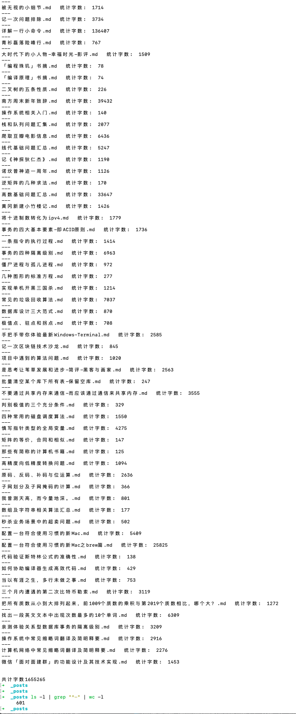

适用于Unix体系

<br>


## 关于wc命令

<br>

**Word Count** 用于统计指定文件中的字节数、字数、行数，并将统计结果显示输出。

wc [-lcw]

- c 统计字节数

- l 统计行数

- m 统计字符数，此标志不能与-c标志一起使用

- w 统计字数。一个字定义为由空白、跳格或换行字符分隔的字符串


<br>


---


### 统计某文件夹下的文件数量

<br>

`ls -l | grep "^-" | wc -l`


<font color="#668B8B" size=1>


**grep "^-"**: 将`ls -l`长列表输出信息过滤一部分,只保留一般文件;

如果只保留目录就是 ^d


**wc -l**: 统计输出信息的行数, 因为已经过滤得只剩一般文件了,又由于一行信息对应一个文件, 所以结果也就是文件的个数

</font>


<br>

---

<br>

### 统计某文件夹下的目录的数量(即文件夹的数量)

<br>

`ls -l | grep "^d" | wc -l`

<br>

---

<br>

### 统计文件夹下文件的个数,包括子文件


<br>

`ls -lR | grep "^-" | wc -l`


<font color="#668B8B" size=1>


-R为 递归子文件夹


**wc -l**: 统计输出信息的行数, 因为已经过滤得只剩一般文件了,又由于一行信息对应一个文件, 所以结果也就是文件的个数

</font>


<br>


---

<br>


### 统计文件夹下目录个数，包括子目录


<br>

`ls -lR | grep "^d" | wc -l`

<br>


---


<br>


### 使用脚本 统计文件夹下所有文件的总字符数

<br>


```sh
#!/bin/bash
files=$(ls)

all=0
for i in $files; do
 #忽略该脚本本身包含的字符
  if [ $i != 'wc.sh' ]; then
    head -n1 $i
    t=$(wc -m $i | cut -d ' ' -f5)
    all=$(($all+$t))
    echo '  统计字数: '$t
  fi
done

echo '共计字数'$all

```

该脚本其实有问题,因为`cut -d ' ' -f5`并不一定恰好能拿到`wc`统计出的字符数量

用wc命令怎么做到只打印统计数字不打印文件名


 可以使用`cat test.txt |wc -l` 替代`wc -l test.txt`,这样就解决了这个问题~


<br>

 修正后的脚本如下:


```sh
#!/bin/bash
files=$(ls)

all=0
for i in $files; do
 #忽略该脚本本身包含的字符
  if [ $i != 'wc.sh' ]; then
    head -n1 $i
    t=$(cat $i | wc -m )
    all=$(($all+$t))
    echo '  统计字数: '$t
  fi
done

echo '共计字数'$all

```


<br>

再为其添加判断,忽略掉当前文件夹下的目录,只统计纯文件


```sh
#!/bin/bash
files=$(ls)

all=0
for i in $files; do
 #忽略该脚本本身包含的字符
  if [[ $i != 'wc.sh' ]] && ! [[ -d $i ]]; then
    head -n1 $i
    t=$(cat $i | wc -m )
    all=$(($all+$t))
    echo $i  '  统计字数: '$t
  fi
done

echo ""
echo ""
echo '共计字数'$all

```


<br>


共601篇博客,字数共计 **1655265**

<br>



