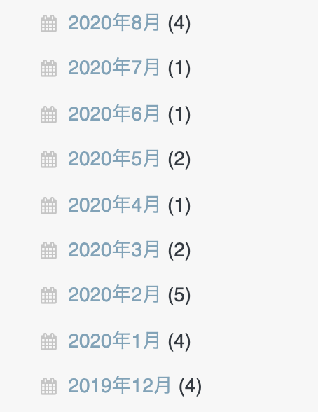
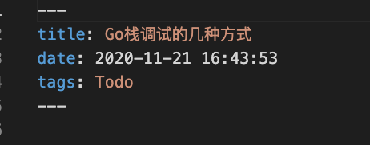

有插件可以将各个月份博文的数量统计并附在其后，不太喜欢这种展示方式(认为展示出的参差数据，破坏和谐一致的感觉)，自己动手，只统计不展示





<br>


```go
package main

import (
	"fmt"
	"io/ioutil"
	"regexp"
	"strings"
	"time"
)

var m = make(map[string]int)

func main() {

	basePath := "/Users/fliter/blog/source/_posts/"
	// 获取某目录下的所有文件; 也可以用 files, _ := filepath.Glob("*")
	files, _ := ioutil.ReadDir(basePath)
	for _, f := range files {
		if strings.Contains(f.Name(), ".md") {
			//fmt.Println(f.Name())
			deal(basePath + f.Name())
		}
	}

	fmt.Println(m)

	fmt.Println()
	fmt.Println("下面迭代时会乱序：")
	fmt.Println()
	for k, v := range m {
		fmt.Printf("%s月有%d篇博文\n", k, v)
	}
}

func deal(filePath string) {

	//fmt.Println(filePath) // /Users/fliter/blog/source/_posts/16777619与FNV哈希算法.md

	// read the whole file at once
	b, err := ioutil.ReadFile(filePath)
	if err != nil {
		panic(err)
	}

	s := string(b)
	//fmt.Println(s)

	// 进行正则匹配

	// go - 如何获得两个已知单词之间的字符串？ https://www.coder.work/article/212986
	// 或者可以预先将换行符及空格等全部清除掉
	re := regexp.MustCompile(`date: (.*?)
tags:`)

	date := re.FindStringSubmatch(s)[1]

	//fmt.Println(date) // 2021-08-09 22:30:47
	t, _ := time.Parse("2006-01-02 15:04:05", date)
	month := time.Unix(t.Unix(), 0).Format("2006-01")
	//fmt.Println(month) // 2021-08

	m[month] = m[month] + 1

	//os.Exit(11)

}

```





执行结果如下：


```go
map[1093-02:23 2010-03:9 2011-04:1 2012-01:2 2012-11:8 2012-12:2 2013-04:5 2014-03:4 2014-04:1 2015-01:2 2015-02:3 2015-03:143 2015-04:3 2015-05:1 2015-06:3 2015-07:2 2015-08:6 2015-09:7 2015-10:7 2015-11:25 2015-12:5 2016-02:3 2016-03:8 2016-04:9 2016-05:4 2016-06:8 2016-07:5 2016-08:4 2016-09:2 2016-10:11 2016-11:6 2016-12:4 2017-01:3 2017-02:9 2017-03:9 2017-04:7 2017-05:10 2017-06:8 2017-07:11 2017-08:6 2017-09:6 2017-10:9 2017-11:4 2017-12:5 2018-01:6 2018-02:7 2018-03:8 2018-04:8 2018-05:8 2018-06:6 2018-07:11 2018-08:10 2018-09:6 2018-10:9 2018-11:6 2018-12:5 2019-01:7 2019-02:10 2019-03:11 2019-04:12 2019-05:8 2019-06:9 2019-07:14 2019-08:9 2019-09:8 2019-10:12 2019-11:9 2019-12:8 2020-01:9 2020-02:9 2020-03:11 2020-04:10 2020-05:13 2020-06:14 2020-07:10 2020-08:7 2020-09:10 2020-10:10 2020-11:11 2020-12:6 2021-01:10 2021-02:8 2021-03:7 2021-04:8 2021-05:8 2021-06:8 2021-07:8 2021-08:4 2021-09:17 2021-10:1 2021-11:3 2021-12:2]

下面迭代时会乱序：

2015-09月有7篇博文
2017-11月有4篇博文
2015-06月有3篇博文
2020-04月有10篇博文
2018-11月有6篇博文
2020-03月有11篇博文
2019-04月有12篇博文
2019-03月有11篇博文
2017-09月有6篇博文
2015-01月有2篇博文
2015-08月有6篇博文
2021-02月有8篇博文
2021-12月有2篇博文
2016-04月有9篇博文
2017-04月有7篇博文
1093-02月有23篇博文
2013-04月有5篇博文
2019-08月有9篇博文
2018-03月有8篇博文
2020-08月有7篇博文
2017-01月有3篇博文
2015-02月有3篇博文
2020-11月有11篇博文
2019-11月有9篇博文
2016-11月有6篇博文
2011-04月有1篇博文
2021-11月有3篇博文
2018-06月有6篇博文
2016-09月有2篇博文
2015-11月有25篇博文
2021-10月有1篇博文
2019-12月有8篇博文
2017-07月有11篇博文
2017-12月有5篇博文
2020-06月有14篇博文
2020-12月有6篇博文
2019-06月有9篇博文
2021-07月有8篇博文
2016-03月有8篇博文
2015-05月有1篇博文
2021-04月有8篇博文
2018-09月有6篇博文
2016-07月有5篇博文
2021-08月有4篇博文
2021-06月有8篇博文
2021-09月有17篇博文
2012-12月有2篇博文
2018-07月有11篇博文
2018-04月有8篇博文
2020-02月有9篇博文
2019-02月有10篇博文
2010-03月有9篇博文
2020-05月有13篇博文
2015-07月有2篇博文
2012-01月有2篇博文
2019-05月有8篇博文
2016-02月有3篇博文
2017-10月有9篇博文
2021-03月有7篇博文
2018-08月有10篇博文
2016-08月有4篇博文
2019-10月有12篇博文
2020-10月有10篇博文
2016-05月有4篇博文
2017-08月有6篇博文
2018-05月有8篇博文
2015-03月有143篇博文
2015-04月有3篇博文
2018-10月有9篇博文
2021-01月有10篇博文
2018-01月有6篇博文
2014-03月有4篇博文
2020-07月有10篇博文
2017-03月有9篇博文
2019-07月有14篇博文
2014-04月有1篇博文
2017-06月有8篇博文
2016-06月有8篇博文
2017-05月有10篇博文
2017-02月有9篇博文
2015-10月有7篇博文
2012-11月有8篇博文
2021-05月有8篇博文
2018-02月有7篇博文
2016-10月有11篇博文
2020-01月有9篇博文
2019-09月有8篇博文
2015-12月有5篇博文
2019-01月有7篇博文
2020-09月有10篇博文
2016-12月有4篇博文
2018-12月有5篇博文
```

<br>

几处可改进点：

- 并发执行deal(),同时需使用sync.map

- 将乱序的map改成按序输出

- 可以将路径及处理的文件类型(此处为*.md),以及匹配的文本(此处为date:和tag:之间的内容), 做成参数形式传递,从而使该方法更通用

