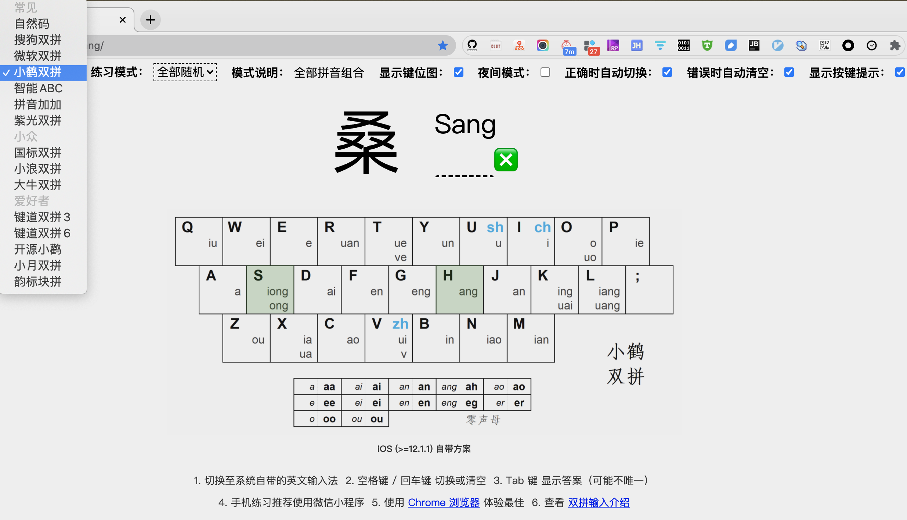
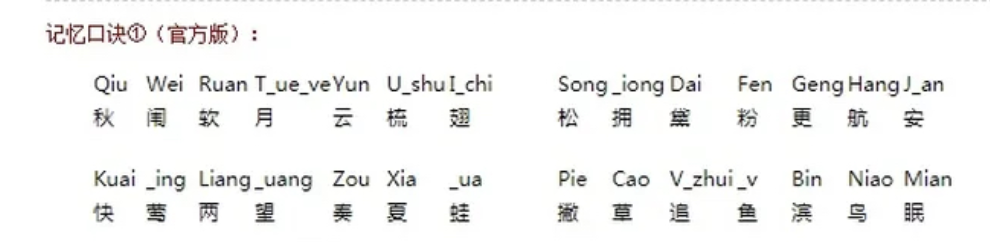
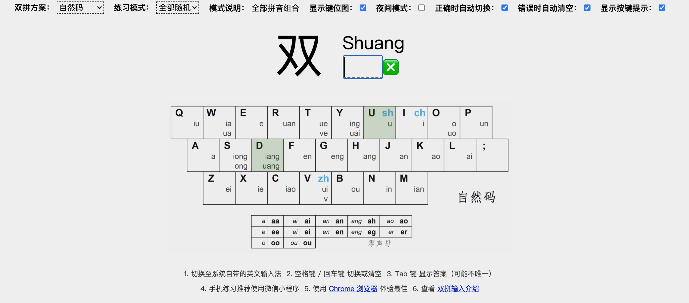
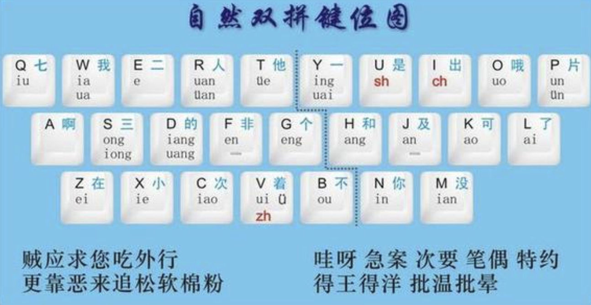

 

### 小鹤双拼

 

[双拼练习](https://api.ihint.me/shuang/)

使用小鹤双拼

秋闱软月云舒翅  松拥黛粉更航安

快鹰两望奏夏蛙  撇草追鱼滨鸟眠

 

---

 

### 自然码

 

中间的F和J是最常用的en和an，左en右an；再往中间去就是他们的扩展eng和ang。

C和M要一起记，因为他C是iao，M是ian。

L和W一起记，L是ai，W是ia。

O和B一起记，O是uo，B是ou。

Q记“球”。

---

 

其实没啥必要,对照图熟能生巧

[怎样记忆双拼输入法？](https://www.zhihu.com/question/20698750)

[记住三句话，就会用双拼](https://blog.csdn.net/ycjnx/article/details/52737258)