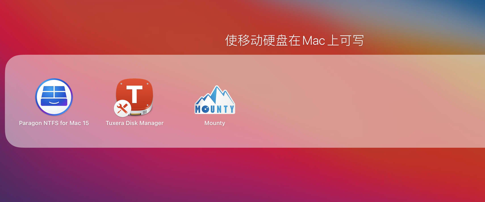
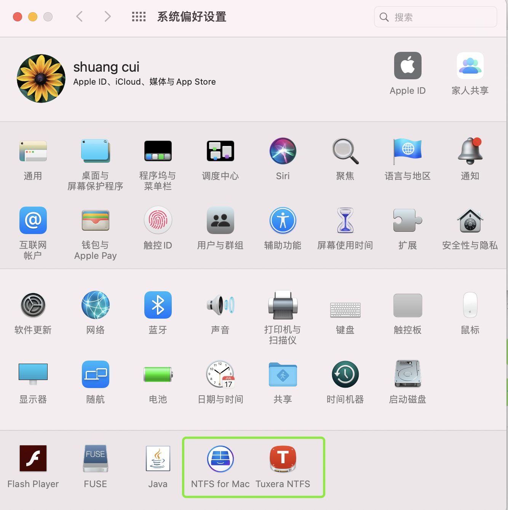
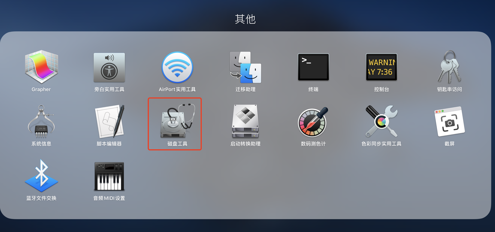
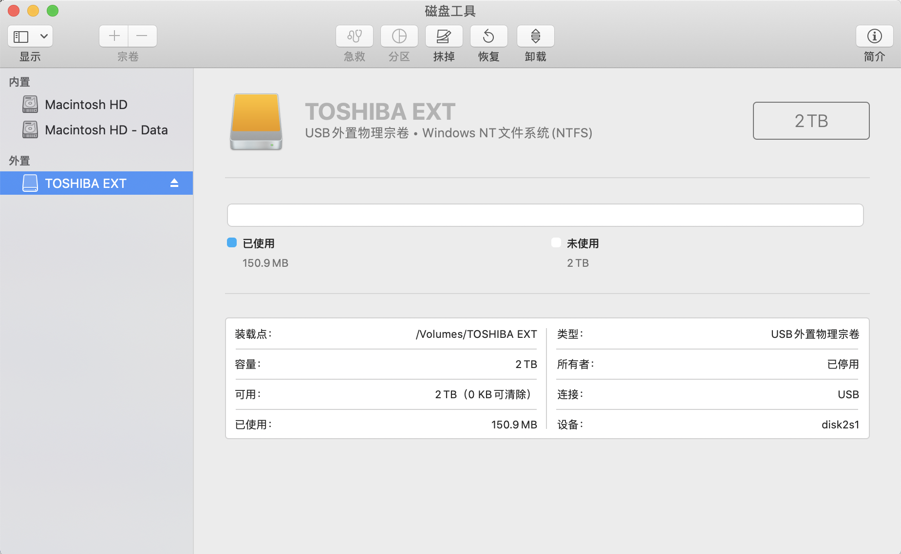
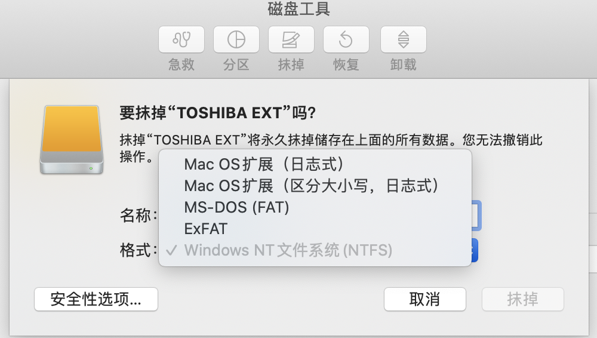
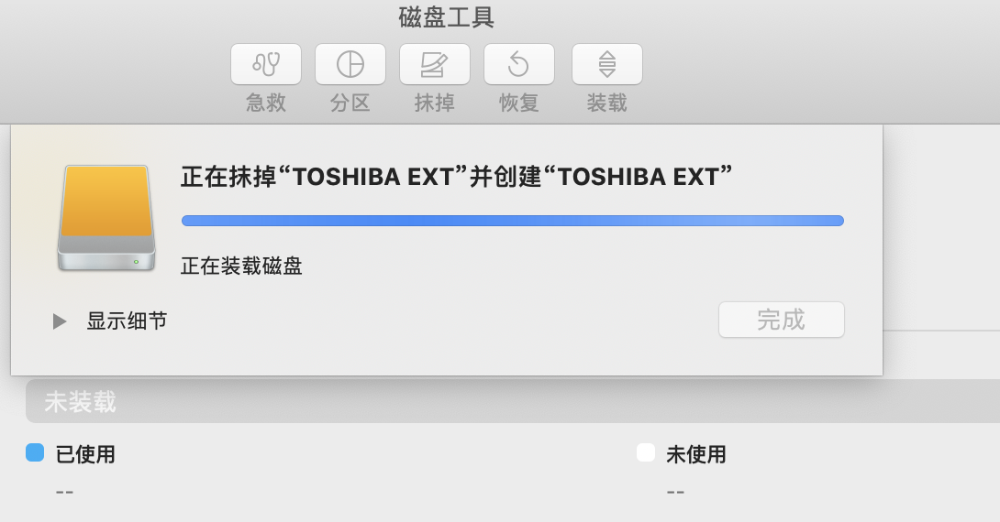
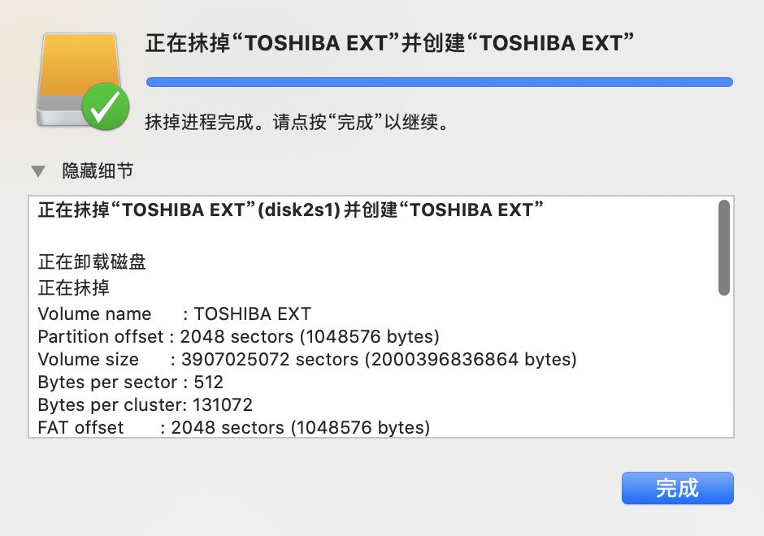
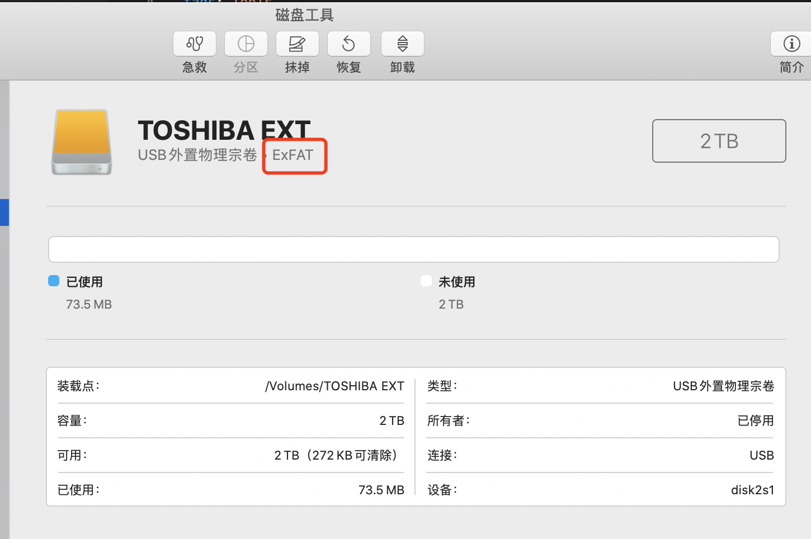

在Mac上使用移动硬盘,只能读不能写,需下载特定软件支持,如

 

 


每次不胜其烦,且可能有各种各样神奇问题,该一直困扰我,直到发现阮老师的这篇博客 [exFAT 文件系统指南](http://www.ruanyifeng.com/blog/2018/10/exfat.html)


 


 


 


 


选择**ExFAT**,点击**抹掉**,


<br>


输出如下:

```sql
Volume name      : TOSHIBA EXT
Partition offset : 2048 sectors (1048576 bytes)
Volume size      : 3907025072 sectors (2000396836864 bytes)
Bytes per sector : 512
Bytes per cluster: 131072
FAT offset       : 2048 sectors (1048576 bytes)
# FAT sectors    : 120832
Number of FATs   : 1
Cluster offset   : 122880 sectors (62914560 bytes)
# Clusters       : 15261336
Volume Serial #  : 5f511941
Bitmap start     : 2
Bitmap file size : 1907667
Upcase start     : 17
Upcase file size : 5836
Root start       : 18
```


 


 


此时,就可以在Mac上对其轻松进行写操作了

<br>

---


<br>


后来看了**文件系统**相关内容,有了更深层次的认识.

[Linux内核分析与应用8-文件系统](http://www.dashen.tech/2020/05/17/Linux%E5%86%85%E6%A0%B8%E5%88%86%E6%9E%90%E4%B8%8E%E5%BA%94%E7%94%A88-%E6%96%87%E4%BB%B6%E7%B3%BB%E7%BB%9F/)

[文件系统的中枢---Inode结构体](http://www.dashen.tech/2020/06/10/%E6%96%87%E4%BB%B6%E7%B3%BB%E7%BB%9F%E7%9A%84%E4%B8%AD%E6%9E%A2-Inode%E7%BB%93%E6%9E%84%E4%BD%93/)