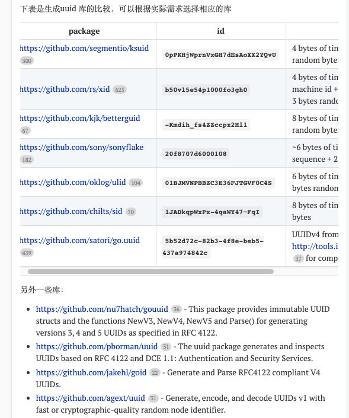
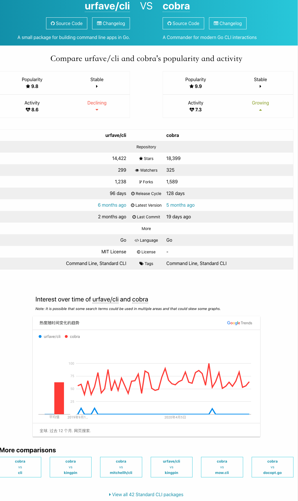
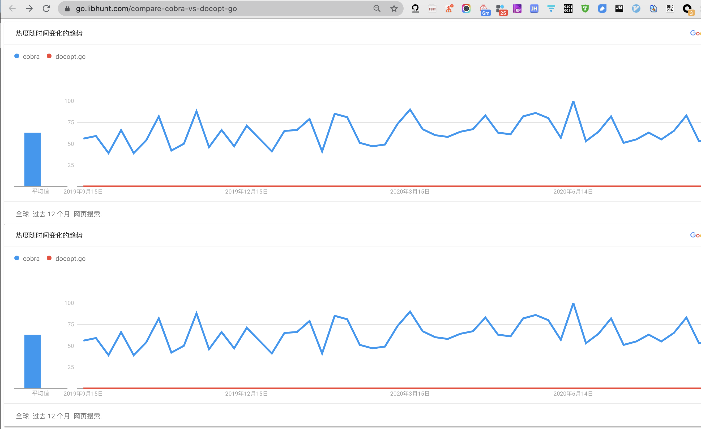

在引入开源库时,选择太多也会面临 `甜蜜烦恼`. 如Golang的日志库,较为流行的就有[glog](github.com/golang/glog),[go-logging](github.com/op/go-logging),[logrus](github.com/sirupsen/logrus). 

而生成uuid的知名库更多,好坏优劣纷至沓来,跋前踕后进退触籓:

 

(图片来自 [golang 生成良好的唯一ID/uuid库比较](https://golangnote.com/topic/177.html))

 

想起了当年热衷"玩机"时,zol的一个产品对比功能,各项参数条分缕析一目了然.

 

如果也有类似比选功能相似package的工具,也可以使得选择困难大为避免. 搜索之下,果不其然.

---

 

[libhunt.com](https://www.libhunt.com/)这个网站,slogan是`Find The Software You Need`,其中有一项功能就是相近包的比较.

以命令行构建功能为例,可以看到**urfave/cli**和**cobra**之间的数据对比.包括流行程度,star数,fork数,上一次提交时间,热度等指标.

---