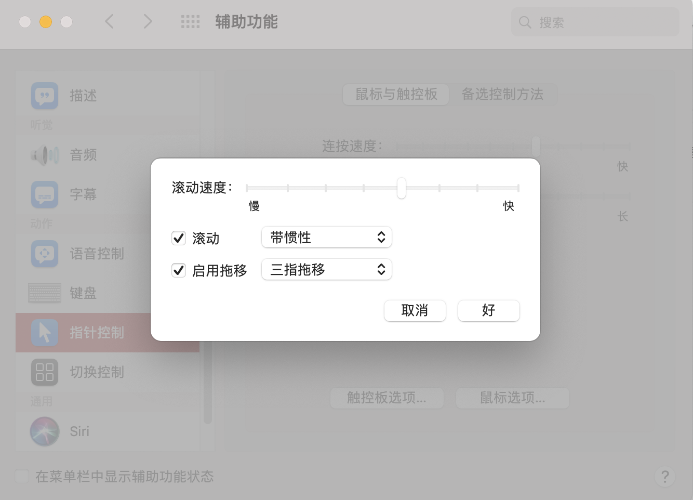
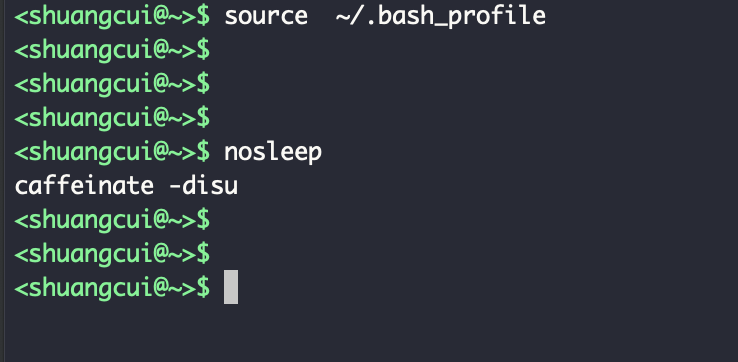
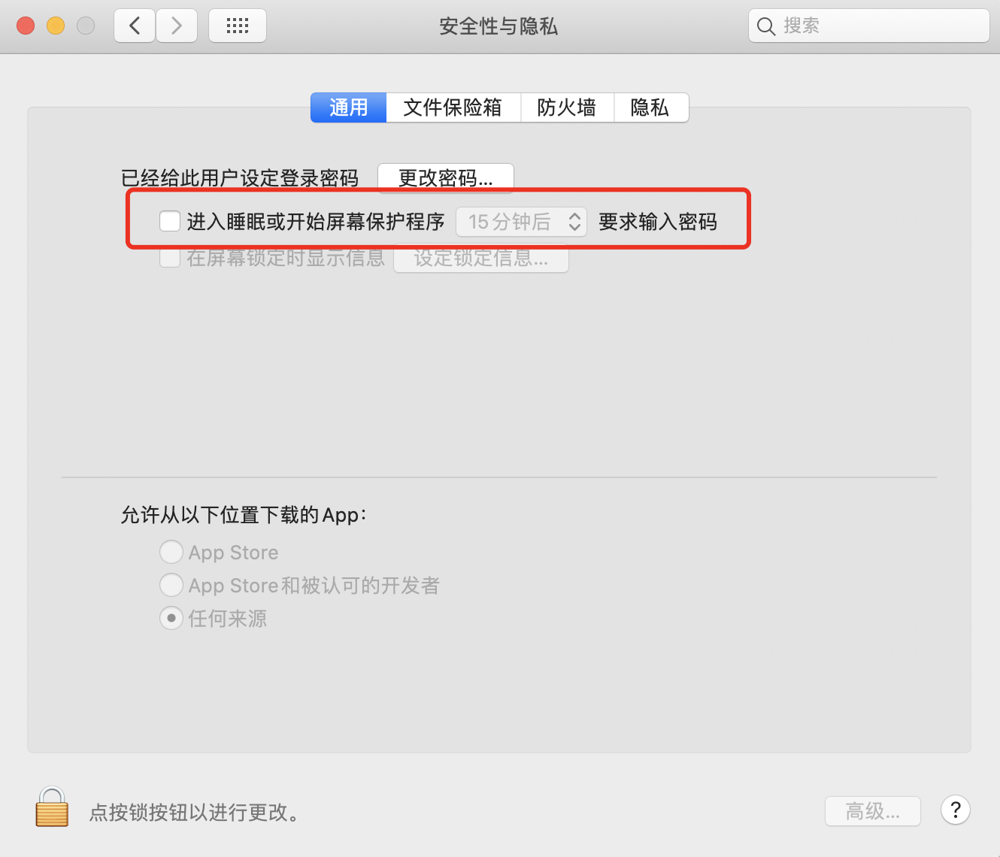
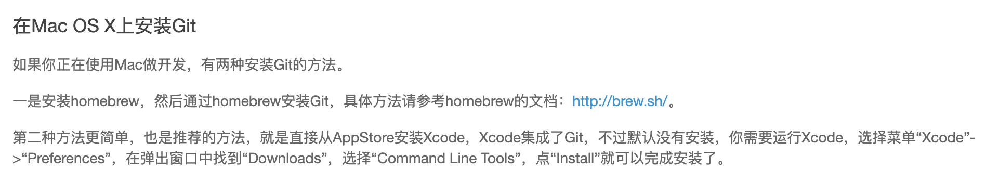

## 手势

### 重置`滚动方向`


### 设置`三指拖拽`

[「Mac技巧」三指拖移窗口功能如何设置](https://jingyan.baidu.com/article/af9f5a2d7fe76443150a454d.html)




<br>


---

## caffeinate -disu

<font color="lightblue">此命令为系统自带,可防止进入睡眠状态;</font>

可为其配置别名`nosleep`如下:




**关闭自动锁屏**

<br>




<br>

---


## 安装xx(略)

<br>

---


## 安装brew


参考[配置一台符合使用习惯的新Mac之brew篇](http://www.dashen.tech/2020/08/27/%E9%85%8D%E7%BD%AE%E4%B8%80%E5%8F%B0%E7%AC%A6%E5%90%88%E4%BD%BF%E7%94%A8%E4%B9%A0%E6%83%AF%E7%9A%84%E6%96%B0Mac%E4%B9%8Bbrew%E7%AF%87/)


---

<br>


## 安装git

Mac上Xcode集成了Git,如有Xcode可无需再安装



<br>

---


## 生成公钥/私钥.配置github/gitlab/gitee等


```shell
cd ~/.ssh
# 如果没有则创建该文件夹
ssh-keygen
# 后面参数可加可不加;一直Enter即可
```

<br>

将公钥复制到cvm/aws等机器的`.ssh/authorized_keys`中,即可免密码登陆


---


## 安装常用软件

<br>


---


### 安装vs code,并配置code命令

<br>

[vs code 在终端下使用`code`命令打开文件](https://www.cnblogs.com/ryanzheng/p/10705892.html)


### 安装Jetbrains全家桶


---

<br>


## 配置.bash_profile或.zshrc


<details>
<summary>如下内容,可供参考</summary>


```sh

export PATH=${PATH}:/usr/local/MongoDB/bin
alias mongostart='mongod --dbpath "/Users/shuangcui/mongo-data/db"'
alias run-rs='run-rs -v 4.0.0 --shell'


export PATH=${PATH}:/usr/local/Cellar/ffmpeg/4.2.1_2/bin

# for mysql by 爽哥

#用alias mysql='/usr/local/Cellar/mysql@5.7/5.7.28/bin/mysql'这种方式,5.7.28/bin目录下的mysql.server还是显示为command not find,把这个路径直接加进PATH,而不是用别名alias方式肯定更好~
PATH="/usr/local/Cellar/mysql@5.7/5.7.28/bin:${PATH}"
export PATH

# 超级实用
alias sn="git shortlog -sn"
alias big="du -d 1 -h"
alias ll='ls -al'
alias c='clear'


alias d='docker'
alias p='python'
alias p3='python3'

#alias aws='ssh -i ~/aws/aws_ec2_cuishuang.pem ubuntu@ec2-3-112-12-235.ap-northeast-1.compute.amazonaws.com'
alias aws='ssh ubuntu@3.112.12.235'

alias cvm='ssh ubuntu@118.126.97.71'


# git快捷键

alias gt="git status"
alias ga="git add -A"
alias gm="git commit -m"
alias gp="git push"
alias gba="git branch -a"
alias gf="git fetch"
alias gc='git clone'


alias etcd="/usr/local/Cellar/etcd/3.4.3/bin/etcd"
alias etcdctl="/usr/local/Cellar/etcd/3.4.3/bin/etcdctl"
alias up="echo go get -insecure -u -v git.xxxxxx.com/xxx_xxx/xxx@develop"


alias k6='sudo fuser -k 80/tcp'


alias hao='open http://man.linuxde.net/'
alias linux='open http://man.linuxde.net/'
alias ss='open http://www.dashen.tech/'
alias ym='open https://dnspod.cloud.tencent.com/'


alias pqstart='pg_ctl -D /usr/local/var/postgres -l /usr/local/var/postgres/server.log start '


# 配置sublime命令行启动
alias subl=\''/Applications/Sublime Text.app/Contents/SharedSupport/bin/subl'\'


alias u='ubuntu@118.126.97.71:/home/ubuntu/public'

alias e='ETCDCTL_API=3 /usr/local/Cellar/etcd/3.3.10/bin/etcdctl'


alias k1='kubectl get namespaces'

alias sed='gsed'

alias nosleep='echo caffeinate -disu'


# 客户端开发
# 打开一个模拟器
alias ios='open -a Simulator'


#下面是爽哥加的为了给终端和ls配色的代码
#enables colorin the terminal bash shell export
export CLICOLOR=1

#setsup thecolor scheme for list export
export LSCOLORS=gxfxcxdxbxegedabagacad

#sets up theprompt color (currently a green similar to linux terminal)
export PS1='\[\033[01;32m\]\u@\h\[\033[00m\]:\[\033[01;36m\]\w\[\033[00m\]\$     '
#enables colorfor iTerm
export TERM=xterm-256color
#上面是爽哥加的为了给终端和ls配色的代码

#export PATH=$PATH:~/.composer/vendor/bin
#export PATH="$(brew --prefix php55)/bin:$PATH"
#export PATH="$(brew --prefix php55)/sbin:$PATH"
#export PATH="/usr/local/bin:/usr/local/sbib:$PATH"

#关闭brew每次执行命令时的自动更新

export HOMEBREW_NO_AUTO_UPDATE=true


# golang相关配置
export GOPATH=/Users/shuangcui/go
export PATH="/Users/shuangcui/go/bin:$PATH"

alias r='go run *.go'
alias gr='go run'
alias gb='go build'

alias goservice="export GOPATH=/Users/shuangcui/shunwang/go_service"
alias micro-old="export GOPATH=/Users/shuangcui/micro-service"
alias go-hp="export GOPATH=/Users/shuangcui/hp"


# flutter 相关配置
export PUB_HOSTED_URL=https://pub.flutter-io.cn #国内用户需要设置
export FLUTTER_STORAGE_BASE_URL=https://storage.flutter-io.cn  #国内用户需要设置
export PATH="/Users/shuangcui/flutter/bin:$PATH"


#命令提示符
PS1="\[\033[0;32m\]<\u@\\w>\$\[\033[0m\] "
export PS1

#java配置
JAVA_HOME=/Library/Java/JavaVirtualMachines/jdk1.8.0_131.jdk/Contents/Home
CLASSPAHT=.:$JAVA_HOME/lib/dt.jar:$JAVA_HOME/lib/tools.jar
PATH=$JAVA_HOME/bin:$PATH:
export JAVA_HOME
export CLASSPATH
export PATH


#node环境变量
export NODE_PATH=/usr/local/Cellar/node/10.1.0/lib/node_modules/

# vue 不知道为啥3.0+的也要配置
export PATH="$PATH:/usr/local/Cellar/node/10.1.0/bin"

#maven配置
export M2_HOME=/Users/shuangcui/maven/apache-maven-3.6.1
export PATH=$PATH:$M2_HOME/bin


# history配置
export HISTTIMEFORMAT="%Y-%M-%D %H:%M:%S  "  
export HISTSIZE=100000  
export HISTFILESIZE=1000000  
export HISTFILE=~/.commandline_warrior  
shopt -s histappend  
PROMPT_COMMAND='history -a'

complete -C /usr/local/bin/vault vault


# macOS catalina默认用zsh,词条设置可以继续使用bash
export BASH_SILENCE_DEPRECATION_WARNING=1
eval $(thefuck --alias)
eval $(thefuck --alias)


# bash-completion,命令行自动补全
[[ -r "/usr/local/etc/profile.d/bash_completion.sh" ]] && . "/usr/local/etc/profile.d/bash_completion.sh"

```
</details>


