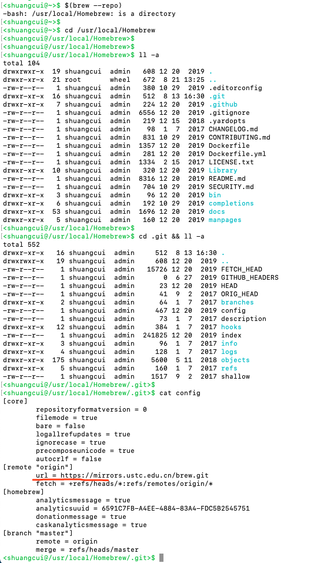
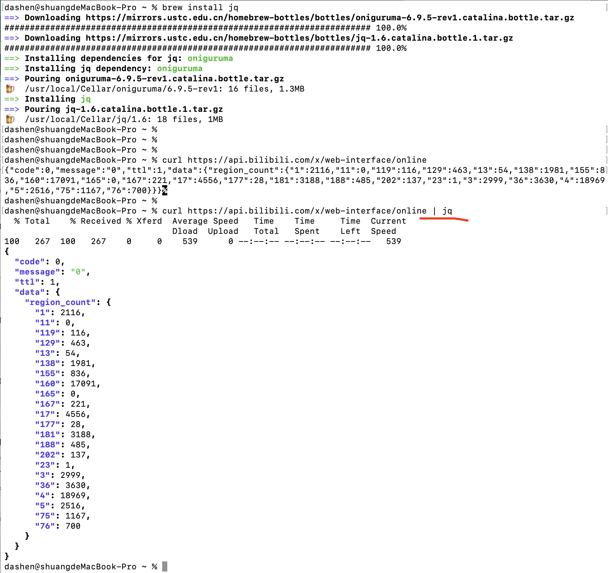
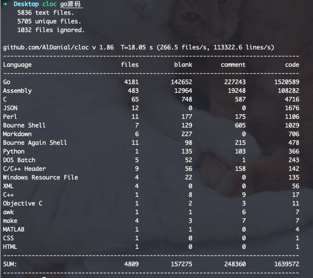

### <font color="#FF8C00">安装brew</font>

从xx类软件中,"复制终端代理命令",在命令行执行.

而后执行

```shell
/usr/bin/ruby -e "$(curl -fsSL https://raw.githubusercontent.com/Homebrew/install/master/install)"
```

(如无代理软件,可能会出现rufused,可[参考](https://zhuanlan.zhihu.com/p/137025155)解决)


---

<br>

### <font color="#FF8C00">更换Homebrew镜像源</font>

<br>


[更换Homebrew镜像源](https://blog.csdn.net/lwplwf/article/details/79097565)

```shell
# 替换brew.git
cd "$(brew --repo)"
git remote set-url origin https://mirrors.ustc.edu.cn/brew.git

# 替换homebrew-core.git
cd "$(brew --repo)/Library/Taps/homebrew/homebrew-core"
git remote set-url origin https://mirrors.ustc.edu.cn/homebrew-core.git
cd && brew update
```



<br>

```shell
# 替换Homebrew Bottles源

# 对于bash用户：
echo 'export HOMEBREW_BOTTLE_DOMAIN=https://mirrors.ustc.edu.cn/homebrew-bottles' >> ~/.bash_profile
source ~/.bash_profile


# 对于zsh用户
echo 'export HOMEBREW_BOTTLE_DOMAIN=https://mirrors.ustc.edu.cn/homebrew-bottles' >> ~/.zshrc
source ~/.zshrc
```

<br>

### <font color="#FF8C00">关闭每次install前的自动更新</font>
```shell

vim  ~/.zshrc或.bash_profile
export HOMEBREW_NO_AUTO_UPDATE=true
```

---

<br>


### 软件安装

<br>

#### <font color="#E9967A">使用brew曾安装过的软件:</font>

<br>


> cd /usr/local/opt/ && ll


<details>
<summary>如下:</summary>

```java
total 0
lrwxr-xr-x  1 shuangcui  admin  24  1 14  2020 aalib -> ../Cellar/aalib/1.4rc5_1
lrwxr-xr-x  1 shuangcui  admin  19 12 20  2019 ack -> ../Cellar/ack/3.2.0
lrwxr-xr-x  1 shuangcui  admin  20 10 30  2019 adns -> ../Cellar/adns/1.5.1
lrwxr-xr-x  1 shuangcui  admin  35  1 13  2020 ag -> ../Cellar/the_silver_searcher/2.2.0
lrwxr-xr-x  1 shuangcui  admin  29 10 30  2019 aircrack-ng -> ../Cellar/aircrack-ng/1.5.2_1
lrwxr-xr-x  1 shuangcui  admin  19  4 28 14:13 aom -> ../Cellar/aom/1.0.0
lrwxr-xr-x  1 shuangcui  admin  19 10 30  2019 apr -> ../Cellar/apr/1.7.0
lrwxr-xr-x  1 shuangcui  admin  26 10 30  2019 apr-util -> ../Cellar/apr-util/1.6.1_3
lrwxr-xr-x  1 shuangcui  admin  27 10 30  2019 argon2 -> ../Cellar/argon2/20190702_1
lrwxr-xr-x  1 shuangcui  admin  28  1 14  2020 asciiquarium -> ../Cellar/asciiquarium/1.1_1
lrwxr-xr-x  1 shuangcui  admin  23 10 30  2019 aspell -> ../Cellar/aspell/0.60.8
lrwxr-xr-x  1 shuangcui  admin  23 10 30  2019 autoconf -> ../Cellar/autoconf/2.69
lrwxr-xr-x  1 shuangcui  admin  23 10 30  2019 autoconf@2.69 -> ../Cellar/autoconf/2.69
lrwxr-xr-x  1 shuangcui  admin  27 10 30  2019 automake -> ../Cellar/automake/1.16.1_1
lrwxr-xr-x  1 shuangcui  admin  21  1 13  2020 axel -> ../Cellar/axel/2.17.6
lrwxr-xr-x  1 shuangcui  admin  31  1 14  2020 bash-completion -> ../Cellar/bash-completion/1.3_3
lrwxr-xr-x  1 shuangcui  admin  31  1 14  2020 bash-completion@1 -> ../Cellar/bash-completion/1.3_3
lrwxr-xr-x  1 shuangcui  admin  20  1 14  2020 bat -> ../Cellar/bat/0.12.1
lrwxr-xr-x  1 shuangcui  admin  22 10 30  2019 boost -> ../Cellar/boost/1.71.0
lrwxr-xr-x  1 shuangcui  admin  22 10 30  2019 boost@1.71 -> ../Cellar/boost/1.71.0
lrwxr-xr-x  1 shuangcui  admin  31 12 20  2019 brew-php-switcher -> ../Cellar/brew-php-switcher/2.2
lrwxr-xr-x  1 shuangcui  admin  22 10 30  2019 brotli -> ../Cellar/brotli/1.0.7
lrwxr-xr-x  1 shuangcui  admin  23 10 30  2019 c-ares -> ../Cellar/c-ares/1.15.0
lrwxr-xr-x  1 shuangcui  admin  24  4 28 14:17 cairo -> ../Cellar/cairo/1.16.0_2
lrwxr-xr-x  1 shuangcui  admin  30 10 30  2019 cookiecutter -> ../Cellar/cookiecutter/1.6.0_1
lrwxr-xr-x  1 shuangcui  admin  20  1 13  2020 ctop -> ../Cellar/ctop/0.7.2
lrwxr-xr-x  1 shuangcui  admin  21 12 20  2019 curl -> ../Cellar/curl/7.67.0
lrwxr-xr-x  1 shuangcui  admin  29 12 20  2019 curl-openssl -> ../Cellar/curl-openssl/7.67.0
lrwxr-xr-x  1 shuangcui  admin  25  1 14  2020 dash -> ../Cellar/dash/0.5.10.2_1
lrwxr-xr-x  1 shuangcui  admin  19 12  3  2019 dep -> ../Cellar/dep/0.5.4
lrwxr-xr-x  1 shuangcui  admin  20 10 30  2019 etcd -> ../Cellar/etcd/3.4.3
lrwxr-xr-x  1 shuangcui  admin  24  4 28 14:50 ffmpeg -> ../Cellar/ffmpeg/4.2.1_2
lrwxr-xr-x  1 shuangcui  admin  24  4 28 14:50 ffmpeg@4 -> ../Cellar/ffmpeg/4.2.1_2
lrwxr-xr-x  1 shuangcui  admin  20  4 28 14:21 flac -> ../Cellar/flac/1.3.3
lrwxr-xr-x  1 shuangcui  admin  27 10 30  2019 fontconfig -> ../Cellar/fontconfig/2.13.1
lrwxr-xr-x  1 shuangcui  admin  22 10 30  2019 fortune -> ../Cellar/fortune/9708
lrwxr-xr-x  1 shuangcui  admin  26 10 30  2019 freetds -> ../Cellar/freetds/1.1.15_1
lrwxr-xr-x  1 shuangcui  admin  25 10 30  2019 freetype -> ../Cellar/freetype/2.10.1
lrwxr-xr-x  1 shuangcui  admin  22  4 28 14:13 frei0r -> ../Cellar/frei0r/1.6.1
lrwxr-xr-x  1 shuangcui  admin  23  4 28 14:14 fribidi -> ../Cellar/fribidi/1.0.8
lrwxr-xr-x  1 shuangcui  admin  20 10 30  2019 gawk -> ../Cellar/gawk/5.0.1
lrwxr-xr-x  1 shuangcui  admin  18 10 30  2019 gd -> ../Cellar/gd/2.2.5
lrwxr-xr-x  1 shuangcui  admin  17 10 30  2019 gdb -> ../Cellar/gdb/8.3
lrwxr-xr-x  1 shuangcui  admin  21 10 30  2019 gdbm -> ../Cellar/gdbm/1.18.1
lrwxr-xr-x  1 shuangcui  admin  26 10 30  2019 gearman -> ../Cellar/gearman/1.1.18_2
lrwxr-xr-x  1 shuangcui  admin  26 10 30  2019 gearmand -> ../Cellar/gearman/1.1.18_2
lrwxr-xr-x  1 shuangcui  admin  22 10 30  2019 geoip -> ../Cellar/geoip/1.6.12
lrwxr-xr-x  1 shuangcui  admin  24 10 30  2019 gettext -> ../Cellar/gettext/0.20.1
lrwxr-xr-x  1 shuangcui  admin  26  3 21 18:25 ghostscript -> ../Cellar/ghostscript/9.50
lrwxr-xr-x  1 shuangcui  admin  22  4 28 14:40 giflib -> ../Cellar/giflib/5.2.1
lrwxr-xr-x  1 shuangcui  admin  23  4 20 10:36 git-lfs -> ../Cellar/git-lfs/2.8.0
lrwxr-xr-x  1 shuangcui  admin  21 12 20  2019 glib -> ../Cellar/glib/2.62.3
lrwxr-xr-x  1 shuangcui  admin  21 10 30  2019 gmp -> ../Cellar/gmp/6.1.2_2
lrwxr-xr-x  1 shuangcui  admin  21 11 21  2019 gnu-sed -> ../Cellar/gnu-sed/4.7
lrwxr-xr-x  1 shuangcui  admin  22 12 20  2019 gnupg -> ../Cellar/gnupg/2.2.19
lrwxr-xr-x  1 shuangcui  admin  22 12 20  2019 gnupg2 -> ../Cellar/gnupg/2.2.19
lrwxr-xr-x  1 shuangcui  admin  25 12 20  2019 gnutls -> ../Cellar/gnutls/3.6.11.1
lrwxr-xr-x  1 shuangcui  admin  19 12 20  2019 go -> ../Cellar/go/1.13.5
lrwxr-xr-x  1 shuangcui  admin  27 10 30  2019 go-swagger -> ../Cellar/go-swagger/0.21.0
lrwxr-xr-x  1 shuangcui  admin  19 12 20  2019 golang -> ../Cellar/go/1.13.5
lrwxr-xr-x  1 shuangcui  admin  19 12 20  2019 google-go -> ../Cellar/go/1.13.5
lrwxr-xr-x  1 shuangcui  admin  22 12 20  2019 gpg -> ../Cellar/gnupg/2.2.19
lrwxr-xr-x  1 shuangcui  admin  22 12 20  2019 gpg2 -> ../Cellar/gnupg/2.2.19
lrwxr-xr-x  1 shuangcui  admin  31 10 30  2019 graphicsmagick -> ../Cellar/graphicsmagick/1.3.33
lrwxr-xr-x  1 shuangcui  admin  26  4 28 14:17 graphite2 -> ../Cellar/graphite2/1.3.13
lrwxr-xr-x  1 shuangcui  admin  25 10 30  2019 graphviz -> ../Cellar/graphviz/2.42.2
lrwxr-xr-x  1 shuangcui  admin  26  3 21 18:25 gs -> ../Cellar/ghostscript/9.50
lrwxr-xr-x  1 shuangcui  admin  21 10 30  2019 gts -> ../Cellar/gts/0.7.6_1
lrwxr-xr-x  1 shuangcui  admin  24  4 28 14:18 harfbuzz -> ../Cellar/harfbuzz/2.6.4
lrwxr-xr-x  1 shuangcui  admin  23 12 20  2019 heroku -> ../Cellar/heroku/7.35.1
lrwxr-xr-x  1 shuangcui  admin  29 12 20  2019 heroku-node -> ../Cellar/heroku-node/12.13.0
lrwxr-xr-x  1 shuangcui  admin  22  1 13  2020 htop -> ../Cellar/htop/2.2.0_1
lrwxr-xr-x  1 shuangcui  admin  22  1 13  2020 htop-osx -> ../Cellar/htop/2.2.0_1
lrwxr-xr-x  1 shuangcui  admin  23 12 20  2019 hudson -> ../Cellar/jenkins/2.209
lrwxr-xr-x  1 shuangcui  admin  20 10 30  2019 icu4c -> ../Cellar/icu4c/64.2
lrwxr-xr-x  1 shuangcui  admin  23 10 30  2019 ilmbase -> ../Cellar/ilmbase/2.3.0
lrwxr-xr-x  1 shuangcui  admin  29 12 20  2019 imagemagick -> ../Cellar/imagemagick/7.0.9-8
lrwxr-xr-x  1 shuangcui  admin  22 10 30  2019 jansson -> ../Cellar/jansson/2.12
lrwxr-xr-x  1 shuangcui  admin  25 10 30  2019 jasper -> ../Cellar/jasper/2.0.16_1
lrwxr-xr-x  1 shuangcui  admin  24 10 30  2019 jemalloc -> ../Cellar/jemalloc/5.2.1
lrwxr-xr-x  1 shuangcui  admin  23 12 20  2019 jenkins -> ../Cellar/jenkins/2.209
lrwxr-xr-x  1 shuangcui  admin  22 12 20  2019 jmeter -> ../Cellar/jmeter/5.2.1
lrwxr-xr-x  1 shuangcui  admin  17 10 30  2019 jpeg -> ../Cellar/jpeg/9c
lrwxr-xr-x  1 shuangcui  admin  16 10 30  2019 jq -> ../Cellar/jq/1.6
lrwxr-xr-x  1 shuangcui  admin  21 10 30  2019 kafka -> ../Cellar/kafka/2.3.1
lrwxr-xr-x  1 shuangcui  admin  20  4 28 14:13 lame -> ../Cellar/lame/3.100
lrwxr-xr-x  1 shuangcui  admin  25 10 30  2019 lcms2 -> ../Cellar/little-cms2/2.9
lrwxr-xr-x  1 shuangcui  admin  28  4 28 14:43 leptonica -> ../Cellar/leptonica/1.78.0_1
lrwxr-xr-x  1 shuangcui  admin  25  4 28 14:18 libass -> ../Cellar/libass/0.14.0_1
lrwxr-xr-x  1 shuangcui  admin  25 10 30  2019 libassuan -> ../Cellar/libassuan/2.5.3
lrwxr-xr-x  1 shuangcui  admin  25  4 28 14:18 libbluray -> ../Cellar/libbluray/1.1.2
lrwxr-xr-x  1 shuangcui  admin  24 10 30  2019 libde265 -> ../Cellar/libde265/1.0.3
lrwxr-xr-x  1 shuangcui  admin  20 10 30  2019 libev -> ../Cellar/libev/4.27
lrwxr-xr-x  1 shuangcui  admin  27 10 30  2019 libevent -> ../Cellar/libevent/2.1.11_1
lrwxr-xr-x  1 shuangcui  admin  22 10 30  2019 libffi -> ../Cellar/libffi/3.2.1
lrwxr-xr-x  1 shuangcui  admin  25 10 30  2019 libgcrypt -> ../Cellar/libgcrypt/1.8.5
lrwxr-xr-x  1 shuangcui  admin  18 10 30  2019 libgd -> ../Cellar/gd/2.2.5
lrwxr-xr-x  1 shuangcui  admin  22 10 30  2019 libgeoip -> ../Cellar/geoip/1.6.12
lrwxr-xr-x  1 shuangcui  admin  27 10 30  2019 libgpg-error -> ../Cellar/libgpg-error/1.36
lrwxr-xr-x  1 shuangcui  admin  23 12 20  2019 libheif -> ../Cellar/libheif/1.6.0
lrwxr-xr-x  1 shuangcui  admin  21 10 30  2019 libidn -> ../Cellar/libidn/1.35
lrwxr-xr-x  1 shuangcui  admin  23 12 20  2019 libidn2 -> ../Cellar/libidn2/2.3.0
lrwxr-xr-x  1 shuangcui  admin  17 10 30  2019 libjpeg -> ../Cellar/jpeg/9c
lrwxr-xr-x  1 shuangcui  admin  17 10 30  2019 libjpg -> ../Cellar/jpeg/9c
lrwxr-xr-x  1 shuangcui  admin  23 10 30  2019 libksba -> ../Cellar/libksba/1.3.5
lrwxr-xr-x  1 shuangcui  admin  22 10 30  2019 libmcrypt -> ../Cellar/mcrypt/2.6.8
lrwxr-xr-x  1 shuangcui  admin  31 10 30  2019 libmemcached -> ../Cellar/libmemcached/1.0.18_2
lrwxr-xr-x  1 shuangcui  admin  27 10 30  2019 libmetalink -> ../Cellar/libmetalink/0.1.3
lrwxr-xr-x  1 shuangcui  admin  22 10 30  2019 libnettle -> ../Cellar/nettle/3.4.1
lrwxr-xr-x  1 shuangcui  admin  22  4 28 14:19 libogg -> ../Cellar/libogg/1.3.4
lrwxr-xr-x  1 shuangcui  admin  22 10 30  2019 libomp -> ../Cellar/libomp/9.0.0
lrwxr-xr-x  1 shuangcui  admin  23 10 30  2019 libpng -> ../Cellar/libpng/1.6.37
lrwxr-xr-x  1 shuangcui  admin  22 12 20  2019 libpq -> ../Cellar/libpq/12.1_1
lrwxr-xr-x  1 shuangcui  admin  31  4 28 14:24 libsamplerate -> ../Cellar/libsamplerate/0.1.9_1
lrwxr-xr-x  1 shuangcui  admin  27  4 28 14:21 libsndfile -> ../Cellar/libsndfile/1.0.28
lrwxr-xr-x  1 shuangcui  admin  28 12 20  2019 libsodium -> ../Cellar/libsodium/1.0.18_1
lrwxr-xr-x  1 shuangcui  admin  23  4 28 14:19 libsoxr -> ../Cellar/libsoxr/0.1.3
lrwxr-xr-x  1 shuangcui  admin  25 10 30  2019 libssh2 -> ../Cellar/libssh2/1.9.0_1
lrwxr-xr-x  1 shuangcui  admin  25 12 20  2019 libtasn -> ../Cellar/libtasn1/4.15.0
lrwxr-xr-x  1 shuangcui  admin  25 12 20  2019 libtasn1 -> ../Cellar/libtasn1/4.15.0
lrwxr-xr-x  1 shuangcui  admin  23 12 20  2019 libtiff -> ../Cellar/libtiff/4.1.0
lrwxr-xr-x  1 shuangcui  admin  25 10 30  2019 libtool -> ../Cellar/libtool/2.4.6_1
lrwxr-xr-x  1 shuangcui  admin  29 10 30  2019 libunistring -> ../Cellar/libunistring/0.9.10
lrwxr-xr-x  1 shuangcui  admin  23 10 30  2019 libusb -> ../Cellar/libusb/1.0.23
lrwxr-xr-x  1 shuangcui  admin  26  4 28 14:19 libvidstab -> ../Cellar/libvidstab/1.1.0
lrwxr-xr-x  1 shuangcui  admin  25  4 28 14:19 libvorbis -> ../Cellar/libvorbis/1.3.6
lrwxr-xr-x  1 shuangcui  admin  22  4 28 14:20 libvpx -> ../Cellar/libvpx/1.8.1
lrwxr-xr-x  1 shuangcui  admin  22 10 30  2019 libzip -> ../Cellar/libzip/1.5.2
lrwxr-xr-x  1 shuangcui  admin  25 10 30  2019 little-cms2 -> ../Cellar/little-cms2/2.9
lrwxr-xr-x  1 shuangcui  admin  24  1 14  2020 lolcat -> ../Cellar/lolcat/100.0.0
lrwxr-xr-x  1 shuangcui  admin  25 10 30  2019 lrzsz -> ../Cellar/lrzsz/0.12.20_1
lrwxr-xr-x  1 shuangcui  admin  21 10 30  2019 lua -> ../Cellar/lua/5.3.5_1
lrwxr-xr-x  1 shuangcui  admin  21 10 30  2019 lua@5.3 -> ../Cellar/lua/5.3.5_1
lrwxr-xr-x  1 shuangcui  admin  18  4 28 14:14 lzo -> ../Cellar/lzo/2.10
lrwxr-xr-x  1 shuangcui  admin  22 10 30  2019 mcrypt -> ../Cellar/mcrypt/2.6.8
lrwxr-xr-x  1 shuangcui  admin  26 12 20  2019 memcached -> ../Cellar/memcached/1.5.20
lrwxr-xr-x  1 shuangcui  admin  23 10 30  2019 mhash -> ../Cellar/mhash/0.9.9.9
lrwxr-xr-x  1 shuangcui  admin  33  1  3  2020 mongodb-community -> ../Cellar/mongodb-community/4.2.2
lrwxr-xr-x  1 shuangcui  admin  33  1  3  2020 mongodb-community@4.2 -> ../Cellar/mongodb-community/4.2.2
lrwxr-xr-x  1 shuangcui  admin  20 10 30  2019 mpfr -> ../Cellar/mpfr/4.0.2
lrwxr-xr-x  1 shuangcui  admin  29 12 20  2019 mysql-client -> ../Cellar/mysql-client/8.0.18
lrwxr-xr-x  1 shuangcui  admin  26 10 30  2019 mysql@5.7 -> ../Cellar/mysql@5.7/5.7.28
lrwxr-xr-x  1 shuangcui  admin  21  1 13  2020 ncdu -> ../Cellar/ncdu/1.14.1
lrwxr-xr-x  1 shuangcui  admin  21 10 30  2019 ncurses -> ../Cellar/ncurses/6.1
lrwxr-xr-x  1 shuangcui  admin  25 10 30  2019 netpbm -> ../Cellar/netpbm/10.73.27
lrwxr-xr-x  1 shuangcui  admin  22 10 30  2019 nettle -> ../Cellar/nettle/3.4.1
lrwxr-xr-x  1 shuangcui  admin  24 12 20  2019 nghttp2 -> ../Cellar/nghttp2/1.40.0
lrwxr-xr-x  1 shuangcui  admin  21 12 20  2019 node -> ../Cellar/node/13.5.0
lrwxr-xr-x  1 shuangcui  admin  21 12 20  2019 node.js -> ../Cellar/node/13.5.0
lrwxr-xr-x  1 shuangcui  admin  21 12 20  2019 nodejs -> ../Cellar/node/13.5.0
lrwxr-xr-x  1 shuangcui  admin  21 12 20  2019 npm -> ../Cellar/node/13.5.0
lrwxr-xr-x  1 shuangcui  admin  18 10 30  2019 npth -> ../Cellar/npth/1.6
lrwxr-xr-x  1 shuangcui  admin  25 12 20  2019 oniguruma -> ../Cellar/oniguruma/6.9.4
lrwxr-xr-x  1 shuangcui  admin  28  4 28 14:20 opencore-amr -> ../Cellar/opencore-amr/0.1.5
lrwxr-xr-x  1 shuangcui  admin  23 10 30  2019 openexr -> ../Cellar/openexr/2.3.0
lrwxr-xr-x  1 shuangcui  admin  24 10 30  2019 openjpeg -> ../Cellar/openjpeg/2.3.1
lrwxr-xr-x  1 shuangcui  admin  27 10 30  2019 openldap -> ../Cellar/openldap/2.4.48_1
lrwxr-xr-x  1 shuangcui  admin  28 10 30  2019 openssl@1.1 -> ../Cellar/openssl@1.1/1.1.1d
lrwxr-xr-x  1 shuangcui  admin  20  4 28 14:21 opus -> ../Cellar/opus/1.3.1
lrwxr-xr-x  1 shuangcui  admin  27 10 30  2019 p11-kit -> ../Cellar/p11-kit/0.23.18.1
lrwxr-xr-x  1 shuangcui  admin  19 10 30  2019 pcre -> ../Cellar/pcre/8.43
lrwxr-xr-x  1 shuangcui  admin  19 10 30  2019 pcre1 -> ../Cellar/pcre/8.43
lrwxr-xr-x  1 shuangcui  admin  21 12 20  2019 pcre2 -> ../Cellar/pcre2/10.34
lrwxr-xr-x  1 shuangcui  admin  20  1 14  2020 peco -> ../Cellar/peco/0.5.3
lrwxr-xr-x  1 shuangcui  admin  19 12 20  2019 php -> ../Cellar/php/7.4.1
lrwxr-xr-x  1 shuangcui  admin  26 10 30  2019 pinentry -> ../Cellar/pinentry/1.1.0_1
lrwxr-xr-x  1 shuangcui  admin  23  4 28 14:15 pixman -> ../Cellar/pixman/0.38.4
lrwxr-xr-x  1 shuangcui  admin  27 10 30  2019 pkg-config -> ../Cellar/pkg-config/0.29.2
lrwxr-xr-x  1 shuangcui  admin  27 10 30  2019 pkgconfig -> ../Cellar/pkg-config/0.29.2
lrwxr-xr-x  1 shuangcui  admin  22 10 30  2019 polipo -> ../Cellar/polipo/1.1.1
lrwxr-xr-x  1 shuangcui  admin  25  5 25 17:15 postgres -> ../Cellar/postgresql/12.1
lrwxr-xr-x  1 shuangcui  admin  25  5 25 17:15 postgresql -> ../Cellar/postgresql/12.1
lrwxr-xr-x  1 shuangcui  admin  25  5 25 17:15 postgresql@12 -> ../Cellar/postgresql/12.1
lrwxr-xr-x  1 shuangcui  admin  25 12 20  2019 protobuf -> ../Cellar/protobuf/3.11.2
lrwxr-xr-x  1 shuangcui  admin  21  1 14  2020 pstree -> ../Cellar/pstree/2.39
lrwxr-xr-x  1 shuangcui  admin  22 12 20  2019 python -> ../Cellar/python/3.7.5
lrwxr-xr-x  1 shuangcui  admin  22 12 20  2019 python3 -> ../Cellar/python/3.7.5
lrwxr-xr-x  1 shuangcui  admin  24 10 30  2019 readline -> ../Cellar/readline/8.0.1
lrwxr-xr-x  1 shuangcui  admin  21 12 20  2019 redis -> ../Cellar/redis/5.0.7
lrwxr-xr-x  1 shuangcui  admin  33 10 30  2019 rtmpdump -> ../Cellar/rtmpdump/2.4+20151223_1
lrwxr-xr-x  1 shuangcui  admin  28  4 28 14:24 rubberband -> ../Cellar/rubberband/1.8.2_1
lrwxr-xr-x  1 shuangcui  admin  27  1 13  2020 screenfetch -> ../Cellar/screenfetch/3.9.1
lrwxr-xr-x  1 shuangcui  admin  21  4 28 14:25 sdl2 -> ../Cellar/sdl2/2.0.10
lrwxr-xr-x  1 shuangcui  admin  31 12 20  2019 shared-mime-info -> ../Cellar/shared-mime-info/1.15
lrwxr-xr-x  1 shuangcui  admin  23 11 13  2019 siege -> ../Cellar/siege/4.0.4_2
lrwxr-xr-x  1 shuangcui  admin  24  4 28 14:25 snappy -> ../Cellar/snappy/1.1.7_1
lrwxr-xr-x  1 shuangcui  admin  21  4 28 14:39 speex -> ../Cellar/speex/1.2.0
lrwxr-xr-x  1 shuangcui  admin  23 12 20  2019 sqlite -> ../Cellar/sqlite/3.30.1
lrwxr-xr-x  1 shuangcui  admin  23 12 20  2019 sqlite3 -> ../Cellar/sqlite/3.30.1
lrwxr-xr-x  1 shuangcui  admin  26 10 30  2019 supervisor -> ../Cellar/supervisor/4.1.0
lrwxr-xr-x  1 shuangcui  admin  26 10 30  2019 supervisord -> ../Cellar/supervisor/4.1.0
lrwxr-xr-x  1 shuangcui  admin  25 12 20  2019 sysbench -> ../Cellar/sysbench/1.0.19
lrwxr-xr-x  1 shuangcui  admin  19 10 30  2019 telnet -> ../Cellar/telnet/60
lrwxr-xr-x  1 shuangcui  admin  25  4 28 14:44 tesseract -> ../Cellar/tesseract/4.1.0
lrwxr-xr-x  1 shuangcui  admin  35  1 13  2020 the_silver_searcher -> ../Cellar/the_silver_searcher/2.2.0
lrwxr-xr-x  1 shuangcui  admin  22  1 13  2020 thefuck -> ../Cellar/thefuck/3.29
lrwxr-xr-x  1 shuangcui  admin  22  4 28 14:44 theora -> ../Cellar/theora/1.1.1
lrwxr-xr-x  1 shuangcui  admin  23 12 20  2019 thrift -> ../Cellar/thrift/0.13.0
lrwxr-xr-x  1 shuangcui  admin  26 10 30  2019 tidy-html5 -> ../Cellar/tidy-html5/5.6.0
lrwxr-xr-x  1 shuangcui  admin  22 10 30  2019 tldr -> ../Cellar/tldr/1.3.0_2
lrwxr-xr-x  1 shuangcui  admin  19 12 20  2019 tmux -> ../Cellar/tmux/3.0a
lrwxr-xr-x  1 shuangcui  admin  20 10 30  2019 tree -> ../Cellar/tree/1.8.0
lrwxr-xr-x  1 shuangcui  admin  23 12 20  2019 unbound -> ../Cellar/unbound/1.9.6
lrwxr-xr-x  1 shuangcui  admin  24 10 30  2019 unixodbc -> ../Cellar/unixodbc/2.3.7
lrwxr-xr-x  1 shuangcui  admin  21 12 20  2019 unrar -> ../Cellar/unrar/5.8.5
lrwxr-xr-x  1 shuangcui  admin  26  4 28 14:19 vid.stab -> ../Cellar/libvidstab/1.1.0
lrwxr-xr-x  1 shuangcui  admin  20 10 30  2019 webp -> ../Cellar/webp/1.0.3
lrwxr-xr-x  1 shuangcui  admin  23 12 20  2019 wget -> ../Cellar/wget/1.20.3_2
lrwxr-xr-x  1 shuangcui  admin  22  4 28 14:44 x264 -> ../Cellar/x264/r2917_1
lrwxr-xr-x  1 shuangcui  admin  20 12 20  2019 x265 -> ../Cellar/x265/3.2.1
lrwxr-xr-x  1 shuangcui  admin  20  4 28 14:45 xvid -> ../Cellar/xvid/1.3.6
lrwxr-xr-x  1 shuangcui  admin  18 10 30  2019 xz -> ../Cellar/xz/5.2.4
lrwxr-xr-x  1 shuangcui  admin  21 12 20  2019 yarn -> ../Cellar/yarn/1.21.1
lrwxr-xr-x  1 shuangcui  admin  26 10 30  2019 zookeeper -> ../Cellar/zookeeper/3.4.14
```
</details>


<br>

---

#### <font color="#483D8B">使用brew安装golang</font>

可能需要代理

<details>
<summary>之前机器`go env`的结果:</summary>

```go
GO111MODULE="on"
GOARCH="amd64"
GOBIN=""
GOCACHE="/Users/shuangcui/Library/Caches/go-build"
GOENV="/Users/shuangcui/Library/Application Support/go/env"
GOEXE=""
GOFLAGS=""
GOHOSTARCH="amd64"
GOHOSTOS="darwin"
GONOPROXY="git.xxxxx.com"
GONOSUMDB="git.xxxxx.com"
GOOS="darwin"
GOPATH="/Users/shuangcui/go"
GOPRIVATE=""
GOPROXY="https://goproxy.cn,direct"
GOROOT="/usr/local/Cellar/go/1.13.5/libexec"
GOSUMDB="off"
GOTMPDIR=""
GOTOOLDIR="/usr/local/Cellar/go/1.13.5/libexec/pkg/tool/darwin_amd64"
GCCGO="gccgo"
AR="ar"
CC="clang"
CXX="clang++"
CGO_ENABLED="1"
GOMOD="/dev/null"
CGO_CFLAGS="-g -O2"
CGO_CPPFLAGS=""
CGO_CXXFLAGS="-g -O2"
CGO_FFLAGS="-g -O2"
CGO_LDFLAGS="-g -O2"
PKG_CONFIG="pkg-config"
GOGCCFLAGS="-fPIC -m64 -pthread -fno-caret-diagnostics -Qunused-arguments -fmessage-length=0 -fdebug-prefix-map=/var/folders/0f/46_yf9mx37ndl25v6ypqg3qc0000gn/T/go-build001703830=/tmp/go-build -gno-record-gcc-switches -fno-common"
```

</details>

<br>


<details>
<summary>现在机器`go env`的结果:</summary>

```go
GO111MODULE=""
GOARCH="amd64"
GOBIN=""
GOCACHE="/Users/dashen/Library/Caches/go-build"
GOENV="/Users/dashen/Library/Application Support/go/env"
GOEXE=""
GOFLAGS=""
GOHOSTARCH="amd64"
GOHOSTOS="darwin"
GOINSECURE=""
GONOPROXY=""
GONOSUMDB=""
GOOS="darwin"
GOPATH="/Users/dashen/go"
GOPRIVATE=""
GOPROXY="https://proxy.golang.org,direct"
GOROOT="/usr/local/opt/go@1.14"
GOSUMDB="sum.golang.org"
GOTMPDIR=""
GOTOOLDIR="/usr/local/opt/go@1.14/pkg/tool/darwin_amd64"
GCCGO="gccgo"
AR="ar"
CC="clang"
CXX="clang++"
CGO_ENABLED="1"
GOMOD=""
CGO_CFLAGS="-g -O2"
CGO_CPPFLAGS=""
CGO_CXXFLAGS="-g -O2"
CGO_FFLAGS="-g -O2"
CGO_LDFLAGS="-g -O2"
PKG_CONFIG="pkg-config"
GOGCCFLAGS="-fPIC -m64 -pthread -fno-caret-diagnostics -Qunused-arguments -fmessage-length=0 -fdebug-prefix-map=/var/folders/rg/1vmp1gc17r397j5xzs0h72ym0000gn/T/go-build990650087=/tmp/go-build -gno-record-gcc-switches -fno-common"
```

</details>


<br>


#### <font color="#483D8B">使用brew安装php</font>


<br>


#### <font color="#483D8B">使用brew安装mysql</font>

<br>

参考 :

[mac 安装mysql@5.7 (brew 安装配置)](http://note.youdao.com/s/EKLTbSEq)


[Mac上用 homebrew 装 mysql,完美解决 ERROR 2002 (HY000): Can't connect to local MySQL server through socket '/tmp/mysql.sock' (2) 报错问题](https://www.cnblogs.com/zhjsll/p/5702950.html)

<br>


#### <font color="#483D8B">使用brew安装openresty</font>

<br>

现在[openresty官方](http://openresty.org/en/download.html)推荐使用brew安装...

ngnix二进制文件在`/usr/local/Cellar/openresty/1.17.8.2_1/nginx`

(如果为编译安装的方式,是在`/usr/local/openresty/nginx/sbin/`)

读取的config文件在`/usr/local/etc/openresty`


<br>


可以配置快捷命令

`alias nginx='/usr/local/Cellar/openresty/1.17.8.2_1/nginx/sbin/nginx'`


<br>

第一次使用时,
记得要在`nginx.conf`里加一行

```php
include domains/*.conf;
```


<details>
<summary>完整的nginx.conf如下:</summary>

```lua
#user  nobody;
worker_processes  2;

#error_log  logs/error.log;
#error_log  logs/error.log  notice;
#error_log  logs/error.log  info;

#pid        logs/nginx.pid;


events {
    worker_connections  2048;
}


http {
    include       mime.types;
    default_type  application/octet-stream;

    log_format  main  '$remote_addr - $remote_user [$time_local] "$request" '
                      '$status $body_bytes_sent "$http_referer" '
                      '"$http_user_agent" "$http_x_forwarded_for"';

    #access_log  logs/access.log  main;

    sendfile        on;
    #tcp_nopush     on;

    #keepalive_timeout  0;
    keepalive_timeout  65;

    gzip  on;

    charset  utf-8;

    include domains/*.conf;

server {
        listen       8080;
        server_name  localhost;

        #charset koi8-r;

        #access_log  logs/host.access.log  main;

        location / {
            root   html;
            index  index.html index.htm;
        }

        #error_page  404              /404.html;

        # redirect server error pages to the static page /50x.html
        #
        error_page   500 502 503 504  /50x.html;
        location = /50x.html {
            root   html;
        }

        # proxy the PHP scripts to Apache listening on 127.0.0.1:80
        #
        #location ~ \.php$ {
        #    proxy_pass   http://127.0.0.1;
        #}

        # pass the PHP scripts to FastCGI server listening on 127.0.0.1:9000
        #
        #location ~ \.php$ {
        #    root           html;
        #    fastcgi_pass   127.0.0.1:9000;
        #    fastcgi_index  index.php;
        #    fastcgi_param  SCRIPT_FILENAME  /scripts$fastcgi_script_name;
        #    include        fastcgi_params;
        #}

        # deny access to .htaccess files, if Apache's document root
        # concurs with nginx's one
        #
        #location ~ /\.ht {
        #    deny  all;
        #}
    }

 #    }
    #}


    # HTTPS server
    #
    #server {
    #    listen       443 ssl;
    #    server_name  localhost;

    #    ssl_certificate      cert.pem;
    #    ssl_certificate_key  cert.key;

    #    ssl_session_cache    shared:SSL:1m;
    #    ssl_session_timeout  5m;

    #    ssl_ciphers  HIGH:!aNULL:!MD5;
    #    ssl_prefer_server_ciphers  on;

    #    location / {
    #        root   html;
    #        index  index.html index.htm;
    #    }
    #}

}

```

</details>


``


#### <font color="#483D8B">使用brew安装node</font>


---

*进阶&可选*


#### <font color="#00BFFF">使用brew安装命令行工具bat/ag/tmux</font>

> brew install bat

> brew install the_silver_searcher

> brew install tmux


---


#### <font color="#00BFFF">使用brew安装 htop/tree/pstree/wget/gawk/gnu-sed/telnet等 </font>

<br>

> brew install htop

> brew install tree

> brew install pstree

> brew install wget

> brew install gawk

> brew install gnu-sed

> brew install telnet

> brew install gdu (Go语言实现的更好用的du命令)


<br>


#### <font color="#00BFFF">使用brew安装性能调试&压测工具 gdb/jmeter/siege </font>

<br>

> brew install gdb

> brew install jmeter

> brew install siege

<br>

#### <font color="#00BFFF">使用brew安装命令行工具tldr和f**k</font>

[参考](http://note.youdao.com/s/Kd3WKdXj)


> brew install tldr

> brew install thefuck

<br>

#### <font color="#00BFFF">使用brew安装命令行json解析工具jq</font>

> brew install jq




<br>

#### <font color="#00BFFF">使用brew安装代码行统计工具——cloc</font>


> brew install cloc

<br>

**cloc 某路径**

统计该目录下代码行数和语言信息

<br>

**cloc 某路径 --exclude-dir=某路径**

统计该目录下代码行数和语言信息(排除后面指定的文件夹)

<br>

*Go 1.14*源码信息:




<br>

---


#### <font color="#1E90FF">使用`brew cask`安装postman</font>

> brew cask install postman

#### <font color="#1E90FF">使用`brew cask`安装pdf阅读软件skim</font>

> brew cask install skim


---
