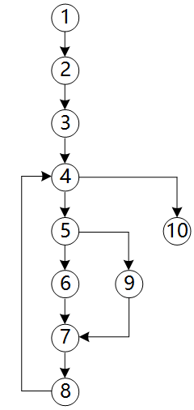
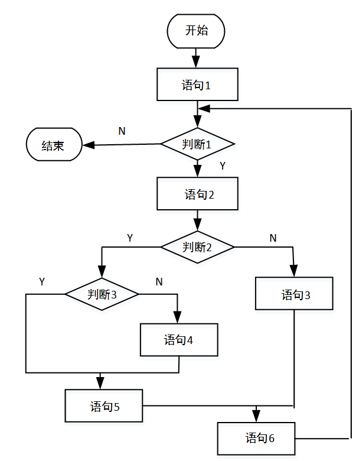
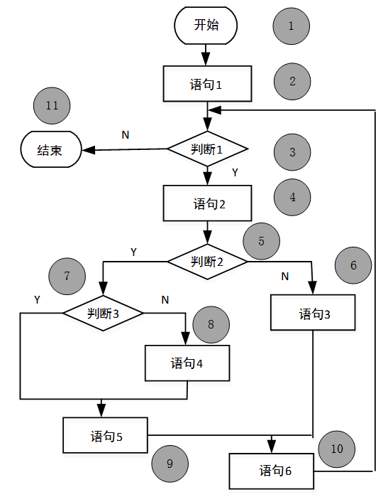
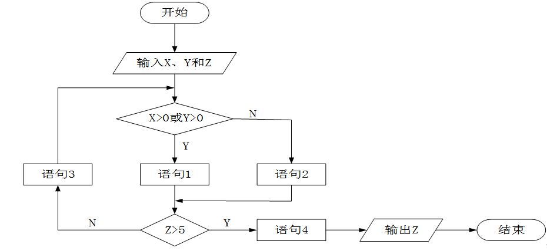
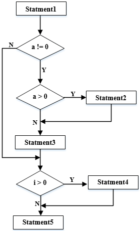
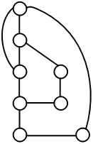
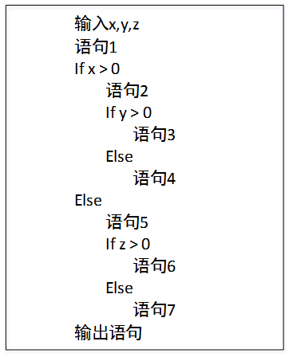
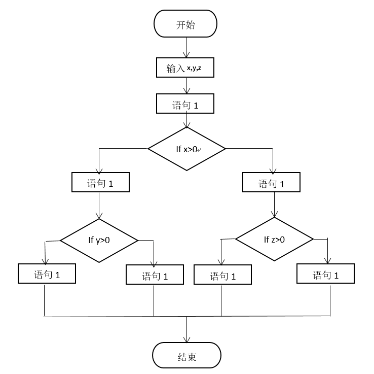
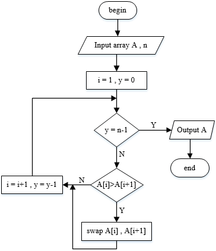
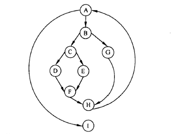

### 概论:

 

[McCabe度量法](https://baike.baidu.com/item/McCabe%E5%BA%A6%E9%87%8F%E6%B3%95/211321)是由 *托马斯·麦克凯* 提出的一种基于程序控制流的复杂性度量方法。又称环路度量，[循环复杂度（Cyclomatic complexity）](https://zh.wikipedia.org/wiki/%E5%BE%AA%E7%92%B0%E8%A4%87%E9%9B%9C%E5%BA%A6)， 也称为条件复杂度或圈复杂度，是一种软件度量。它认为程序的复杂性很大程度上取决于程序图的复杂性。单一的顺序结构最为简单，循环和选择所构成的环路越多，程序就越复杂。

McCabe度量法以**图论**为工具，先画出程序图，然后用该图的**环路数**作为程序复杂性的度量值。程序图是退化的程序流程图。也就是说，把程序流程图的每一个处理符号都退化成一个结点，原来连接不同处理符号的流线变成连接不同结点的有向弧，这样得到的有向图就叫做程序图。

根据图论，在一个强连通的有向图G中，环的个数`V(G)`由以下公式给出：

$$V(G)=m-n+2$$

 

其中，`V(G)`是有向图G中`环路数`，m是图G中`弧数`，n是图G中`结点数`，p是图G中`强连通分量个数`。在一个程序中，从程序图的入口点总能到达图中任何一个结点，因此，程序总是连通的，但不是强连通的。为了使图成为强连通图，从图的出口点到入口点加一条用虚线表示的有向边，使图成为强连通图。这样就可以使用上式计算环路复杂性了。

 

有的也有用E来代表图G中`弧数`,即

$$V(G)=E-N+2$$

 

---

 

### 例题:

 

#### 例1

 

> 采用McCabe度量法计算下图所示程序的环路复杂性为（  ）

 

A.1 &nbsp;
B.2 &nbsp;
C.3 &nbsp;
D.4 &nbsp;

解:

环形复杂度 $V（G）=M-N+2$，其中，E是流图中边的条数，M是结点数。

即 V(G) = 11-10+2 = 3

 

---

 

#### 例2

 

> 下图用 *白盒测试* 方法进行测试，图中有（  ）条路径。采用McCabe度量计算该程序图的环路复杂性为（  ）

 

问题1 选项
 A.3 &nbsp;
 B.4 &nbsp;
 C.5 &nbsp;
 D.6 &nbsp;

问题2 选项
 A.3 &nbsp;
 B.4 &nbsp;
 C.5 &nbsp;
 D.6 &nbsp;

解:

将所有结点标注序号，根据图示，可以找到不同的路径共4条： 

1-2-3-11； 
1-2-3-4-5-6-10-11； 
1-2-3-4-5-7-9-10-11； 
1-2-3-4-5-7-8-9-10-11。 

第一空选择B选项。

 

根据环路复杂度计算公式 $V（G）=M-N+2=13-11+2=4$，第二空选择B选项。

 

---

 

#### 例3

 

> 对下图所示的程序流程图进行判定 *覆盖测试*，则至少需要（  ）个测试用例。采用 McCabe度量法计算其环路复杂度为（  ）。

 

 

问题1选项
 A.2 &nbsp;
 B.3 &nbsp;
 C.4 &nbsp;
 D.5 &nbsp;

问题2选项
 A.2 &nbsp;
 B.3 &nbsp;
 C.4 &nbsp;
 D.5 &nbsp;

 

解:

[判定覆盖](https://baike.baidu.com/item/%E5%88%A4%E5%AE%9A%E8%A6%86%E7%9B%96/4268743)是设计足够多的测试用例，使得程序中的每一个判断至少获得一次“真”和一次“假”，即使得程序流程图中的每一个真假分支至少被执行一次。根据题意，只需2个测试用例即可；

 

根据环路复杂度的计算公式 $V（G）=m-n+2=11-10+2=3$

 

[判定覆盖（分支覆盖）](https://www.cnblogs.com/snailrunning/p/10995576.html)

[判定覆盖与条件覆盖的区别](https://blog.csdn.net/u012441545/article/details/52229473)

[软件测试中条件覆盖，路径覆盖，语句覆盖，分支覆盖的区别](https://www.cnblogs.com/ganmk/archive/2008/11/07/1328585.html)

 

---

 

#### 例4

 

> 对下图所示流程图采用白盒测试方法进行测试，若要满足路径覆盖，则至少需要（  ）个测试用例。采用McCabe度量法计算该程序的环路复杂性为（  ）

 

 

问题1选项
 A.3&nbsp;
 B.4&nbsp;
 C.6&nbsp;
 D.8&nbsp;

 

问题2选项
A.1&nbsp;
B.2&nbsp;
C.3&nbsp;
D.4&nbsp;

 

解:

问题1考查白盒测试路径覆盖：覆盖所有可能的路径。 

根据流程图，若要覆盖所有可能路径，对于a的取值需要a=0，a&lt;0，a&gt;0三种用例，而对于i的取值需要i&gt;0和i&lt;=0两种用例，排列组合，共需要6组用测才能覆盖所有可能的路径。

 

问题2对于环形复杂度计算，根据公式 $V（G）=E-N+2$，其中，E是流图中边的条数，N是结点数。

 

$V（G）=E-N+2=10-8+2=4$。

 

---

 

#### 例5

 

> 采用McCabe度量法计算下列程序图的环路复杂性为（  ）

 

 

问题1选项

 A.2&nbsp;
 B.3&nbsp;
 C.4&nbsp;
 D.5&nbsp;

 

解:

	McCabe度量法先画出程序图，然后采用公式V（G）=m-n+2计算环路复杂度，其中m是有向弧的数量，n是结点的数量。

	10-8+2=4。

 

---

 

#### 例6

 

> 对以下的程序伪代码（用缩进表示程序块）进行路径覆盖测试，至少需要（  ）个测试用例。采用McCabe度量法计算其环路复杂度为（  ）。

 

 

问题1选项

A.2&nbsp;
B.4&nbsp;
C.6&nbsp;
D.8&nbsp;

 

问题2选项
A.2&nbsp;
B.3&nbsp;
C.4&nbsp;
D.5&nbsp;

 

对于本题，用例（x，y，z）分别为（1，1，0）（1，-1，0）（-1，0，1）（-1，0，-1），这4个测试用例可以走完所有可能路径。因为在伪代码中，我们可以看到，当x&gt;0时，只需要对Y分别取大于0和不大于0的值即可，z不参与比较；当x不大于0时，只需要对z分别取大于0和不大于0的值即可，y不参与比较，只需要4个用例即可。

 

对于第二空，转换为结点图如下：

&nbsp;根据$V（G）=m-n+2$，其中m是有向图的弧，为15，n为有向图的节点数，为13，15-13+2=4，即环路复杂的为4。

 

---

 

#### 例7

 

> 下图所示的程序流程图中有（ &nbsp;）条不同的简单路径。采用McCabe度量法计算该程序图的环路复杂性为（ &nbsp;）

 

 

问题1选项

A.3&nbsp;
B.4&nbsp;
C.5&nbsp;
D.6&nbsp;

 

问题2选项

A.3&nbsp;
B.4&nbsp;
C.5&nbsp;
D.6&nbsp;

 

解:

	环形复杂度定量度量程序的逻辑复杂度。描绘程序控制流的流图之后，可以用下述3种方法中的任何一种来计算环形复杂度。

	（1）流图中的区域数等于环形复杂度。
	（2）流图G的环形复杂度V(G)=E-N+2，其中，E是流图中边的条数，N是结点数。
	（3）流图G的环形复杂度V(G)=P+1，其中，P是流图中判定结点的数目。
	这种环路度量法，计算的思路是这样的：它是考虑控制的复杂程度，即条件选择的分支繁杂程度。
	图中有3次简单的判断。故3条简单路径，形成3块环形区域，区域复杂度为3

 

---

 

#### 例8

 

> 软件的复杂性主要体现在程序的复杂性。（ &nbsp;）是度量软件复杂性的一个主要参数。若采用McCabe度量法计算环路复杂性，则对于下图所示的程序图，其环路复杂度为（ &nbsp;）。

 

问题1选项

A.代码行数&nbsp;
B.常量的数量&nbsp;
C.变量的数量&nbsp;
D.调用的库函数的数量&nbsp;

 

问题2选项

A.2&nbsp;
B.3&nbsp;
C.4&nbsp;
D.5&nbsp;

 

解:

代码行数度量法以程序的总代码行数作为程序复杂性的度量值。

 

McCabe度量法先画出程序图，然后采用公式 $V(G)=m-n+2$ 计算环路复杂度，其中m是有向弧的数量，n是结点的数量。在本题中，结点数为9，弧为11，所以环路复杂度为11-9+2=4。

 

---

 

 

---

 

参考:

[McCabe度量方法计算程序复杂度](https://blog.csdn.net/t_1007/article/details/53034408)

[希赛题库](https://www.educity.cn/tiku/32141.html)