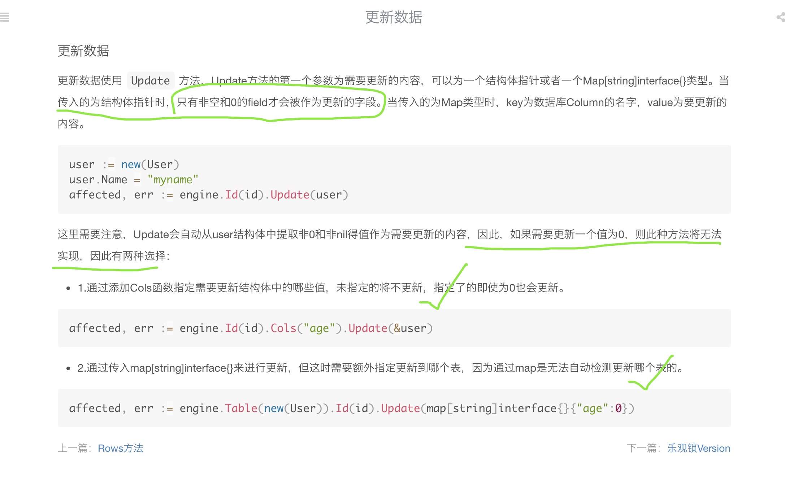

<br>

项目中使用Xorm操作数据库,有次出现Update操作的bug: 当要更新的字段的值为空或0时,可能存在不会去修改的情况...

代码大致如下:

```go
func UpdateXXTable(data model.XXTable) (err error) {
	if rows, err := db.XDb().Update(data, &model.XXTable{Id: rel.Id}); err != nil {
		log.Logger.Error(err)
		return err
	} else if rows != 1 {
		err = errors.New("update XXTable has no effect")
		log.Logger.Error(err)
		return err
	} else {
		return nil
	}
}

```

最初以为是bug, 用 `raw sql` 解决了问题.

之后仔细看了下Xorm的文档,发现不是bug,而是其特有的更新策略.




参见[Xorm更新数据](http://www.kancloud.cn:8080/kancloud/xorm-manual-zh-cn/56025)

确实很好奇为什么要这样设计..
