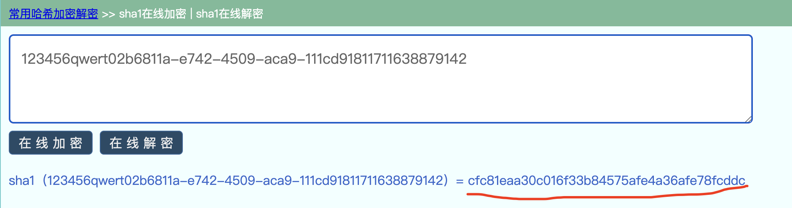
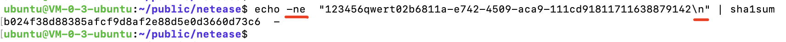
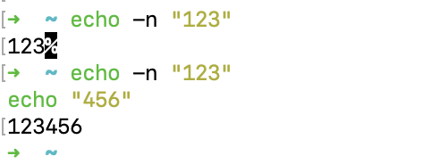
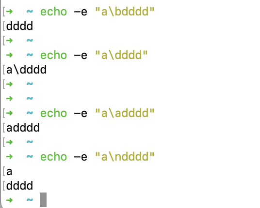

鉴权服务的基本规则是对 秘钥AppSecret、随机字符串Nonce、当前时间戳CurTime，三者拼接然后进行SHA1运算，生成一个CheckSum。鉴权时传递AppKey、Nonce、CurTime及生成的CheckSum，鉴权服务器会进行同样运算，并比较结果。

可参考 [请求结构-Header](https://doc.yunxin.163.com/docs/jcyOTA0ODM/TA5MjEzNTM?platformId=50326)

<br>


QA同事反映鉴权服务出现问题，我计算后发现，他得出的CheckSum和我用Go得出的结果不一致；另一位同事用Java，也得到了和我一致的结果。


QA同事是用shell进行请求，他忙无瑕查看，我要来脚本，代为debug。脱敏和简化后的代码如下：


```sh
#!/bin/bash
AppSecret=123456qwert
Nonce=`cat /proc/sys/kernel/random/uuid` # Linux内核提供的生成uuid的方法
CurTime=`date +%s`   # 当前时间戳
CheckSum=`echo "${AppSecret}${Nonce}${CurTime}"|sha1sum|awk '{print $1}'`
echo ${CheckSum}
```

<br>

加一些调试代码：

```sh
#!/bin/bash
AppSecret=123456qwert
Nonce=`cat /proc/sys/kernel/random/uuid` # Linux内核提供的生成uuid的方法
echo 随机字符串为：${Nonce}
CurTime=`date +%s`   # 当前时间戳
echo 当前时间戳为：${CurTime}

CheckSum=`echo "${AppSecret}${Nonce}${CurTime}"|sha1sum|awk '{print $1}'`
echo ${CheckSum}
```

(在一台Linux机器上) 执行结果如下：

随机字符串为：02b6811a-e742-4509-aca9-111cd9181171

当前时间戳为：1638879142

b024f38d88385afcf9d8af2e88d5e0d3660d73c6


<br>


而使用Go，

```go

package main

import (
 "crypto/sha1"
 "fmt"
 "io"
)

func main() {

 appSecret := "123456qwert"
 nonce := "02b6811a-e742-4509-aca9-111cd9181171"
 //curTimeStr := strconv.Itoa(int(time.Now().Unix()))
 curTimeStr := "1638879142"

 t := sha1.New()
 io.WriteString(t, appSecret+nonce+curTimeStr)
 checkSum := fmt.Sprintf("%x", t.Sum(nil))
 fmt.Println("checkSum is:", checkSum)

}
```


输出：

```go
checkSum is: cfc81eaa30c016f33b84575afe4a36afe78fcddc
```


<br>


将三者拼接的结果 

123456qwert02b6811a-e742-4509-aca9-111cd91811711638879142，找一个在线SHA1网站运算:




<br>

与Go运算出的结果一致，初步可以判断shell写的有bug。


<br>


根据 [这篇](https://www.codenong.com/27527028/)文章提示， 如果echo 指定-n，即不换行输出，则可能得到正确结果。一试果不其然....

<br>

echo不加-n会默认换行输出，换言之 `echo ”123456qwert02b6811a-e742-4509-aca9-111cd91811711638879142“` 隐含有一个换行符`\n`，在进行sha1sum运算时，包含了这个换行符，即


`echo -ne  "123456qwert02b6811a-e742-4509-aca9-111cd91811711638879142\n" | sha1sum`




<br>

Go代码中添加\n, 得到同样结果：

```go

package main

import (
 "crypto/sha1"
 "fmt"
 "io"
)

func main() {

 appSecret := "123456qwert"
 nonce := "02b6811a-e742-4509-aca9-111cd9181171"
 //curTimeStr := strconv.Itoa(int(time.Now().Unix()))
 curTimeStr := "1638879142"

 t := sha1.New()
 io.WriteString(t, appSecret+nonce+curTimeStr+"\n")
 checkSum := fmt.Sprintf("%x", t.Sum(nil))
 fmt.Println("checkSum is:", checkSum)

}
```


输出：

```go
checkSum is: b024f38d88385afcf9d8af2e88d5e0d3660d73c6
```


<br>


另外 **关于 echo -n 和echo -e 参数**的意义：

`echo -n` **不换行输出**





<br>


`echo -e` **处理特殊字符**





带有`-e`选项时，若字符串中出现以下字符,则特别加以处理，而不会将它当成一般文字输出：

- \a 发出警告声；
- \b 删除前一个字符；
- \c 最后不加上换行符号；
- \f 换行但光标仍旧停留在原来的位置；
- \n 换行且光标移至行首；
- \r 光标移至行首，但不换行；
- \t 插入tab；
- \v 与\f相同；
- \ 插入\字符；
- \nnn 插入nnn（八进制）所代表的ASCII字符；


