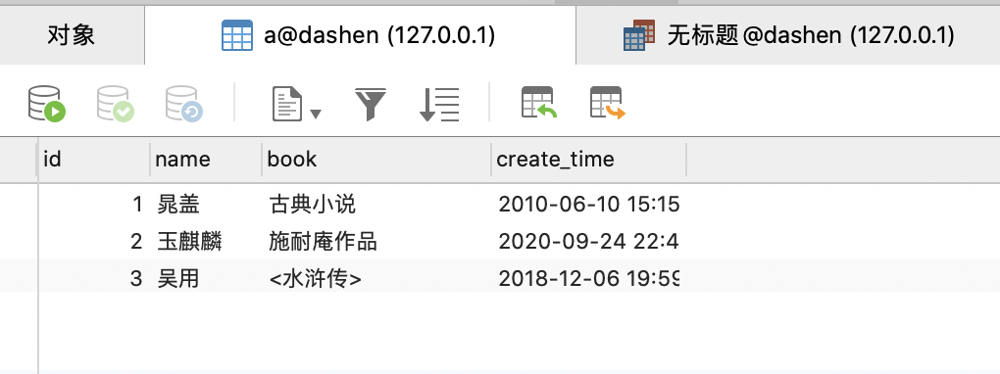
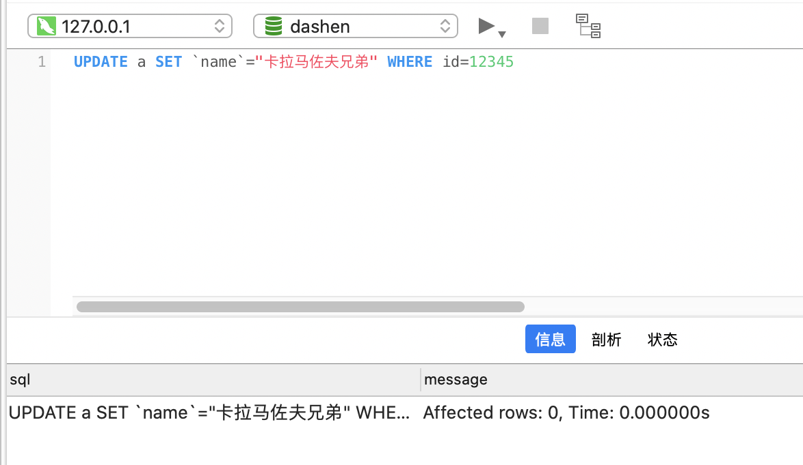
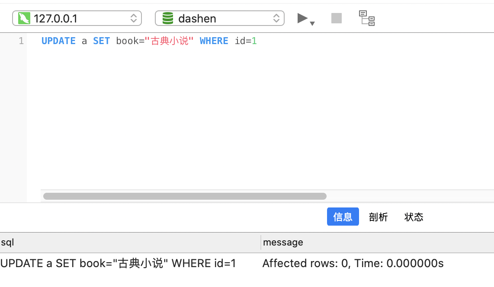

### 乘除顺序问题

<br>

在据[卡特兰数](https://dashen.tech/2021/02/28/%E5%8D%A1%E7%89%B9%E5%85%B0%E6%95%B0/)公式,解决[leetcode-96 不同的二叉搜索树](https://dashen.tech/2015/03/01/leetcode-96-%E4%B8%8D%E5%90%8C%E7%9A%84%E4%BA%8C%E5%8F%89%E6%90%9C%E7%B4%A2%E6%A0%91/)时,遇到一个*非常诡异*的问题, 

```go
package main

import "fmt"

func main() {

	for i := 0; i <= 40; i++ {
		fmt.Printf("第%d个卡特兰数为:%d\n", i, numTrees(i))
	}

}
func numTrees(n int) int {

	rs := 1
	for i := 0; i < n; i++ {
		rs = rs * 2 * (2*i + 1) / (i + 2)
        //rs *= 2 * (2*i + 1) / (i + 2)
	}
	return rs
}
```

<br>

即 注释掉的这一行,居然和上一行得出了完全不同的结果. 虽然马上解决,但对固有认知影响巨大`---`难道对一直以来习以为常的乘法语法糖理解有误???

<br>


<br>


` *= 为乘法和赋值运算符，它将右操作数与左操作数相乘，并将结果赋给左操作数. C *= A 相当于 C = C * A `

读了一遍感觉没问题,那原因出在哪里呢?

<br>

构建demo,


```go
package main

import "fmt"

func main() {

	rs1 := 2
	rs2 := 2
	i := 3
	fmt.Println("当前的rs1,rs2为:", rs1, rs2)
	fmt.Println("2 * (2*i + 1) / (i + 2)为:", 2*(2*i+1)/(i+2))
	rs1 = rs1 * 2 * (2*i + 1) / (i + 2)
	rs2 *= 2 * (2*i + 1) / (i + 2)
	fmt.Println("最后rs1 is,rs2 is:", rs1, rs2)

}

```

<br>

结果为

```rs
当前的rs1,rs2为: 2 2
2 * (2*i + 1) / (i + 2)为: 2
最后rs1 is,rs2 is: 5 4
```

<br>


初步判断,问题出在除法这里. 去掉除法部分后,确实得到的结果都一样.

<br>

在数学中 乘除运算不分先后. 但因为可能无法整除，对计算机来说，除不尽的部分会一律向下取整。所以乘除的先后顺序，实际是对最终结果有影响的

对于 *rs1*,其等于 `2 * 2 * 7 / 5`,即`28/5`,向下取整,即为5

对于*rs2*, 会先计算后面部分`2 * (2*3 + 1) / (3 + 2)` = 14/5 = 2, 而后计算 `2*2 = 4`


<br>


---


<br>


### crontab配置问题

<br>

Linux自带的crontab只能精确到分钟,而某些语言的工具包,可以提供精确到秒的crontab.

但在使用时,务必注意,如`0 */10 * * * *`,是从下一个 **xx:x0:00** 开始,每10分钟执行一次.

如写成 `* */10 * * * *`, 就成了每秒钟执行一次,如有对数据库的读写操作,会造成巨大压力.

上线前可以用[这个工具](https://tool.lu/crontab/), 选`Java(Spring)`项,来校验一下


<br>


---


<br>


### map和slice变量的赋值作用范围问题

<br>


```go
package main

import "fmt"

func main() {

	m := make(map[string]string)

	m["gender"] = "女"

	fmt.Println("map is:", m)

	f1(&m)

	fmt.Println("map is:", m)

}

func f1(m1 *map[string]string) *map[string]string {

	(*m1)["name"] = "dashen"
	(*m1)["gender"] = "男"
	return m1
}

```

<br>

运行结果:

```go
map is: map[gender:女]
map is: map[gender:男 name:dashen]
```

<br>

但这种写法,非常不Golang!


在函数A中定义一个**map**记为m,想要在函数B,函数C中对其进行赋值或修改,是没有必要传指针的


```go
package main

import "fmt"

func main() {

	m := make(map[string]string)

	m["gender"] = "女"

	fmt.Println("map is:", m)

	f1(m)

	fmt.Println("map is:", m)

}

func f1(m1 map[string]string) map[string]string {

	m1["name"] = "dashen"
	m1["gender"] = "男"
	return m1
}
```


<br>

运行结果:

```go
map is: map[gender:女]
map is: map[gender:男 name:dashen]
```

<br>


对于slice,情况有所不同

```go
package main

import "fmt"

func main() {

	sli := make([]string, 1)

	sli[0] = "宋江"

	fmt.Println("slice is:", sli)

	f1(sli)

	fmt.Println("slice is:", sli)

}

func f1(sli1 []string) []string {

	sli1[0] = "晁盖"

	return sli1
}
```

运行结果:

```go
slice is: [宋江]
slice is: [晁盖]
```

<br>


与map的"全部引用"不同,slice只是底层数组是指针类型,长度和容量不是.

对于上面这样只修改原有值,而没有append操作的行为,是没有问题的.

但如果有append操作,引发了扩容,底层数组的地址变了,则将会得不到预期结果


<br>


---


<br>


### sql的update问题

<br>





update一条不存在的记录,Affected rows为0,但并不会报错

`UPDATE a SET `name`="卡拉马佐夫兄弟" WHERE id=12345`





<br>


update一条存在的记录,但实际并没有对现有内容进行更新,Affected rows也会是0





<br>


---


<br>

[Golang 58个坑](https://www.bookstack.cn/read/topgoer/e2f3480b549aebc2.md)