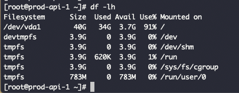
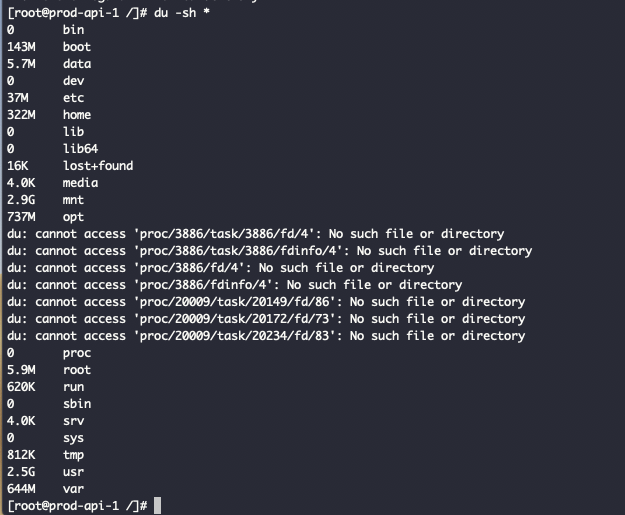
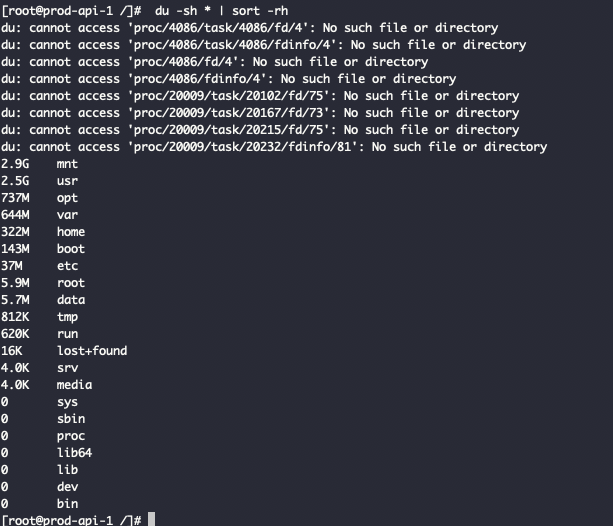
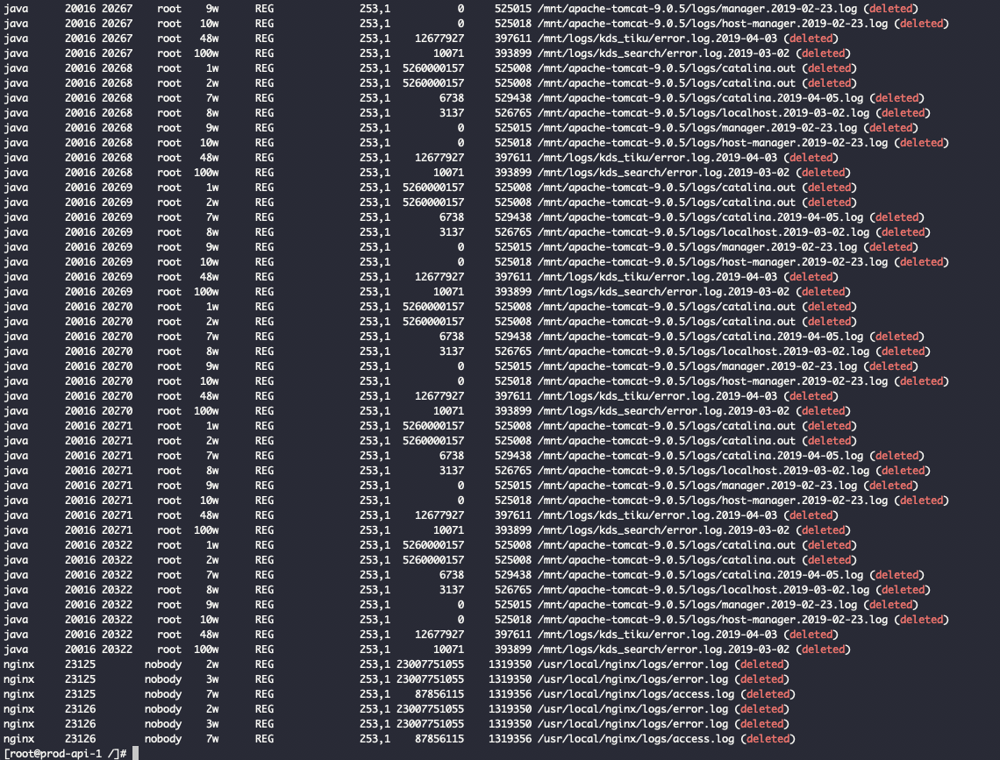
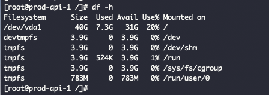
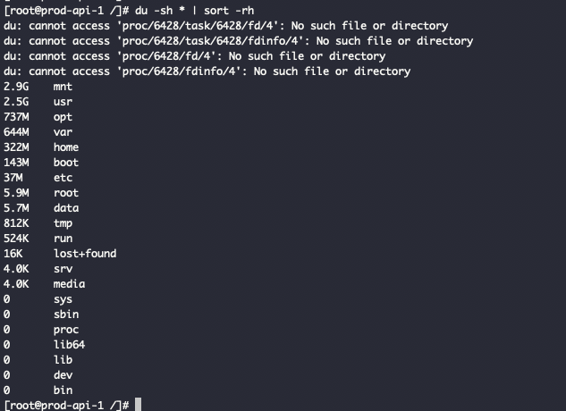

 

### - 服务报错,提示没有足够磁盘空间.
- 登录服务器,使用`df -h` 查看磁盘空间使用率(此台为模拟,真实服务器使用率100%)

- 

- 在根目录下使用`du -sh *`, 查看各文件夹大小, 发现其实这些文件加一起也占不到服务器磁盘空间40G的一半
- 

(使用`du -sh * | sort -rh`命令,对各文件按大小排序,更加直观)

(外记:`du -h --max-depth=1`,用于查看当前目录各文件占用大小)
- 

- 看到 `cannot access 'proc/4086/task/4086/fd/4': No such file or directory`, 很自然想到会不是这里的问题,最后发现实际是一条歧路,/proc目录有时可能会很大,甚至140T,但这个数字既不是磁盘空间,也不是内存空间.可将该目录简单理解为一个"运行中心",是一个位于内存中的伪文件系统(in-memory pseudo-file system).该目录下保存的不是真正的文件和目录,而是一些“运行时”信息.linux中许多工具的数据来源正是proc目录中的内容

更多关于/proc的信息,可参见如下: 
- [linux /proc目录下的文件为何无法用vi编辑保存](https://zhuanlan.zhihu.com/p/26923061) 
- [linux /proc目录下的文件为何无法用vi编辑保存](https://blog.51cto.com/xlogin/1216914) 
- [/proc/kcore文件特别大，感觉很不正常(几个解答都有问题)](https://segmentfault.com/q/1010000008703708)

- ***总之,/proc几乎不占用磁盘空间或只占用极少的空间,可以忽略不计***
 
 

### - 继续追查,谷歌到很多类似症状,大概答案是:

> 通过rm或者文件管理器删除文件，只是将它会从文件系统的目录结构上解除链接(unlink)，也就是说只是删除了文件和系统目录结构的链接；如果文件在删除时是被打开的（有一个进程正在使用该文件，文件被进程锁定或者有进程一直在向这个文件写数据等）状态，那么进程将仍然可以读取该文件，也就是说没有删除掉文件在读取的状态，所以磁盘空间也就会一直被占用。

>一个文件在文件系统中的存放分为两个部分：数据部分和指针部分，指针位于文件系统的meta-data中，数据被删除后，这个指针就从meta-data中清除了，而数据部分存储在磁盘中，数据对应的指针从meta-data中清除后，文件数据部分占用的空间就可以被覆盖并写入新的内容，之所以出现删除文件后，空间还没释放，就是因为有进程还在一直向这个文件写入内容，导致虽然删除了文件，但文件对应的指针部分由于进程锁定，并未从meta-data中清除，而由于指针并未被删除，那么系统内核就认为文件并未被删除，因此通过df命令查询空间并未释放也就不足为奇了。

- 使用`lsof | grep deleted`,果然是好几屏的 已删除文件的磁盘读写操作进程

- 

参见: 

- [Linux磁盘空间查看、磁盘被未知资源耗尽](https://blog.csdn.net/violethan7/article/details/82430993) 
- [Linux磁盘空间被占用问题 (分区目录占用空间比实际空间要大: 资源文件删除后, 空间没有真正释放)](https://www.cnblogs.com/kevingrace/p/6511220.html) 

- 在我准备写shell, 用kill pid 杀死占用被删除文件的进程时,发现那台占用率100%的机器没有安装lsof(是的,lsof需要手动install).想删掉部分日志文件,给其腾出空间,发现刚删除立即yum install lsof,都会提示free空间为0

- 无奈重启服务器,再打开使用`df -h`查看磁盘使用率,然后一切正常...

- 

 

- 

- 8G/20G,约为20%

### 总结
- 重启服务器或kill pid方式都能解决该问题

### 记录排查&解决这个问题中涉及到的一些命令及延伸
#### lsof
- [lsof命令使用详解(原创)](https://czmmiao.iteye.com/blog/1734384)

- [Linux之lsof命令](https://blog.csdn.net/xifeijian/article/details/9088137)
- [用 lsof 替代 netstat 和 ps](https://www.jianshu.com/p/6c1cfb04f441)

#### 查看文件大小&&排序

- [linux 查看磁盘空间大小](https://www.cnblogs.com/zhuiluoyu/p/6598928.html)
- 

- [Linux文件大小排序](http://www.cnblogs.com/xiaochina/p/6294060.html)

- ll -h,输出的文件大小就是human可读的样式了
