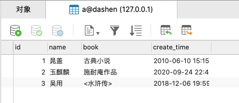
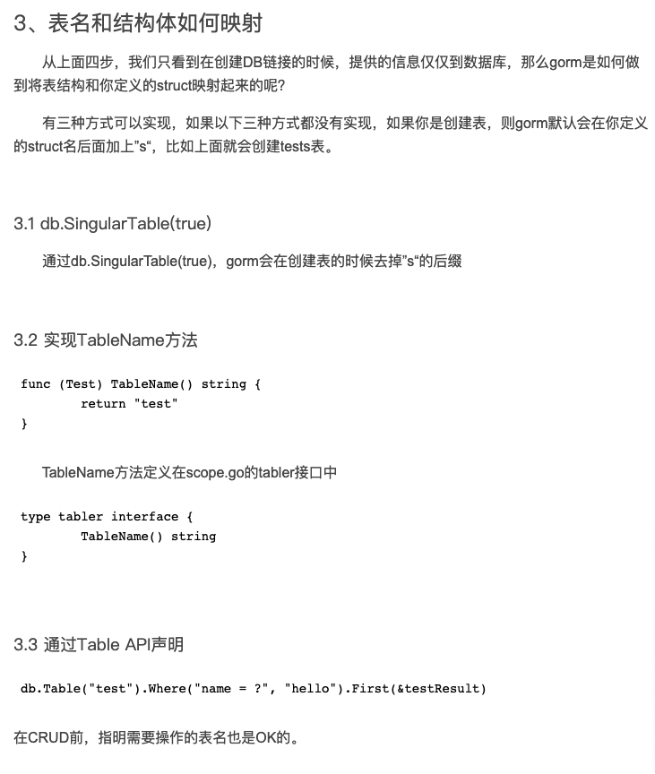
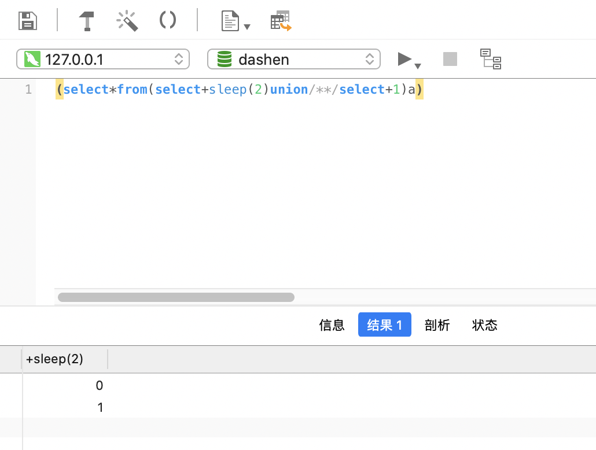
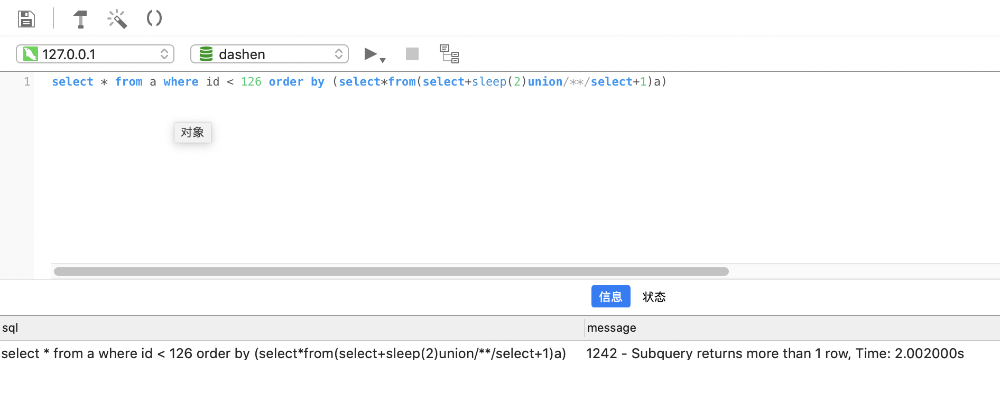

<br>


### <font color="blue">Gorm的使用</font>

<br>


本地*dashen*库里有一张表a如下,现在使用Gorm对其进行操作





<br>

[GORM中文文档](https://learnku.com/docs/gorm/v1/query/3786)


<br>

```go
package main

import (
	"fmt"
	"github.com/jinzhu/gorm"
	_ "github.com/jinzhu/gorm/dialects/mysql"
	"time"
)

func main() {

	db, err := gorm.Open("mysql", "root:12345678@/dashen?charset=utf8&parseTime=True&loc=Local")

	if err != nil {
		panic(err)
	}

	defer db.Close()

	var item A
	db.First(&item)

	fmt.Println("item is:", item)
	fmt.Println("item.Name is:", item.Name)

}

/**
CREATE TABLE `a` (
  `id` int(11) NOT NULL AUTO_INCREMENT,
  `name` varchar(255) DEFAULT '',
  `book` varchar(255) DEFAULT NULL,
  `create_time` datetime DEFAULT CURRENT_TIMESTAMP,
  PRIMARY KEY (`id`)
) ENGINE=InnoDB AUTO_INCREMENT=4 DEFAULT CHARSET=utf8;
*/

// 可通过该工具,将DDL转为对应的Go结构体 https://www.devtool.com/sql2go.html


type A struct {
	Id         int       `gorm:"column:id;primary_key;AUTO_INCREMENT" json:"id"`
	Name       string    `gorm:"column:name" json:"name"`
	Book       string    `gorm:"column:book" json:"book"`
	CreateTime time.Time `gorm:"column:create_time;default:CURRENT_TIMESTAMP" json:"create_time"`
}

//func (A) TableName() string {
//	return "a"
//}

```

<br>


执行程序,结果为:

```go
item is: {0   0001-01-01 00:00:00 +0000 UTC}
item.Name is: 
```


<br>


没有报错,说明连接成功. 但却没有查到数据,是因为**表名和结构体没有建立映射关系**




在此使用第二种方式,即**实现TableName方法**,使 *表名和结构体建立映射关系*,

```go
func (A) TableName() string {
	return "a"
}
```

<br>

再次执行,就可以如愿查到数据:

```go
item is: {1 晁盖 古典小说 2010-06-10 15:15:05 +0800 CST}
item.Name is: 晁盖
```


<br>


[Gorm的更多花式操作](https://blog.csdn.net/weixin_38166686/article/details/101166631)

<br>


---


<br>


### <font color="blue">模拟sql注入</font>


<br>


```go
package main

import (
	"fmt"
	"github.com/davecgh/go-spew/spew"
	"github.com/jinzhu/gorm"
	_ "github.com/jinzhu/gorm/dialects/mysql"
	"time"
)

func main() {

	db, err := gorm.Open("mysql", "root:12345678@/dashen?charset=utf8&parseTime=True&loc=Local")

	if err != nil {
		panic(err)
	}

	defer db.Close()

	books, err := GetBooksInfo(db, 0, 10, "*", "", "", "id < ? ", 126)

	spew.Println("books are:", books)

	books2, err2 := GetBooksInfo(db, 0, 10, "*", "", ",(select*from(select+sleep(2)union/**/select+1)a)", "id < ? ", 126)

	spew.Println("books2, err2", books2, err2)

}

type A struct {
	Id         int       `gorm:"column:id;primary_key;AUTO_INCREMENT" json:"id"`
	Name       string    `gorm:"column:name" json:"name"`
	Book       string    `gorm:"column:book" json:"book"`
	CreateTime time.Time `gorm:"column:create_time;default:CURRENT_TIMESTAMP" json:"create_time"`
}

func (A) TableName() string {
	return "a"
}

func GetBooksInfo(db *gorm.DB, offset, limit int, field, order, sort, where string, params ...interface{}) (res []*A, err error) {

	db = db.Select(field).Where(where, params...)
	if order == "" {
		order = "create_time"
	}
	if sort == "" {
		sort = "DESC"
	}
	db = db.Order(order + " " + sort)
	if limit > 0 {
		db = db.Limit(limit)
	}
	if offset > 0 {
		db = db.Offset(offset)
	}
	err = db.Find(&res).Error

	if err != nil {
		fmt.Printf("GetBooksInfo error (%+v): where (%s), params (%+v)\n", err, where, params)
		return
	}
	if res == nil {
		fmt.Printf("GetBooksInfo empty: where (%s), params (%+v)\n", where, params)
		res = make([]*A, 0)
	}
	return
}

```


<br>

查询结果为:

```go
books are: [<*>{2 玉麒麟 施耐庵作品 2020-09-24 22:44:01 +0800 CST} <*>{3 吴用 <水浒传> 2018-12-06 19:59:53 +0800 CST} <*>{1-06-10 15:15:05 +0800 CST}]

GetBooksInfo error (Error 1242: Subquery returns more than 1 row): where (id < ? ), params ([126])

books2, err2 [] <*>Error 1242: Subquery returns more than 1 row

```


<br>








<br>

实际执行的sql:

```sql
select * from a where id < 126 order by (select*from(select+sleep(2)union/**/select+1)a)
```

<br>

如果后面接的是*delete*或者*drop*,那...故而,需要对每一个入参进行校验.或者对sql进行prepare预处理,提前变为二进制编码


