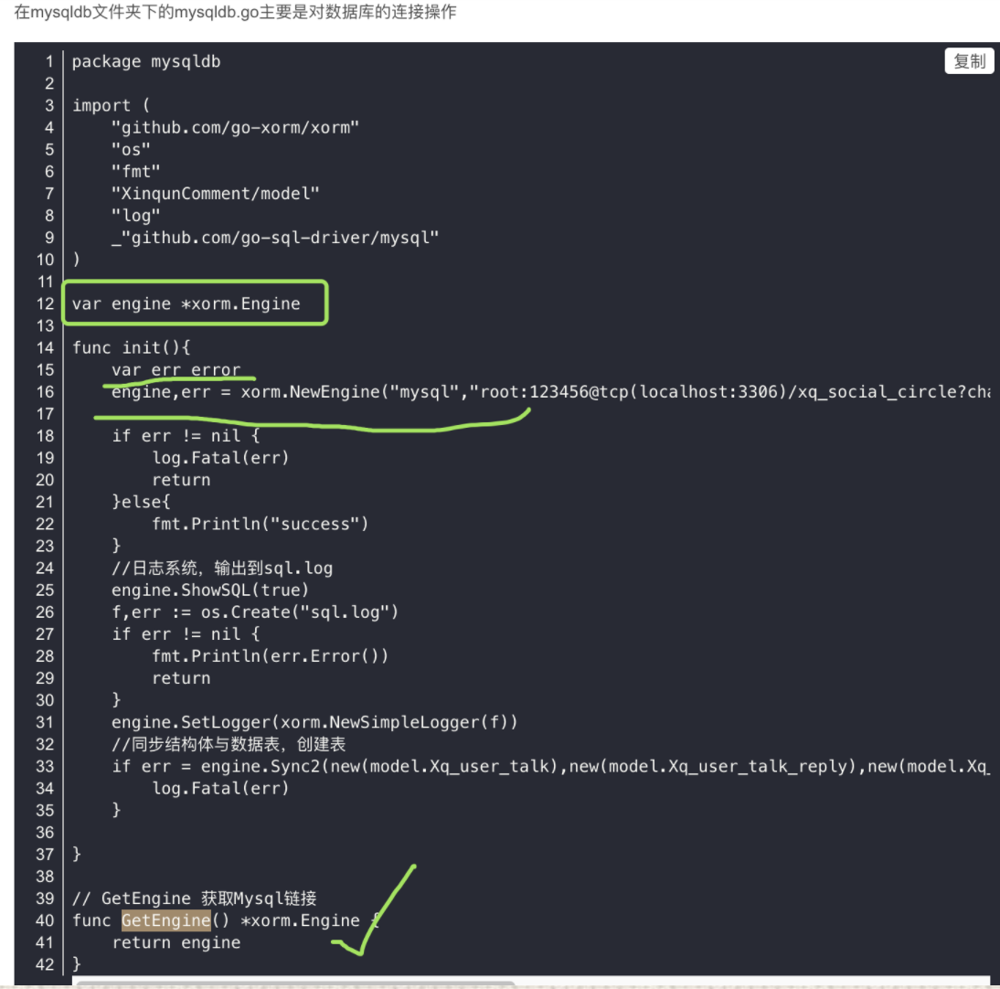
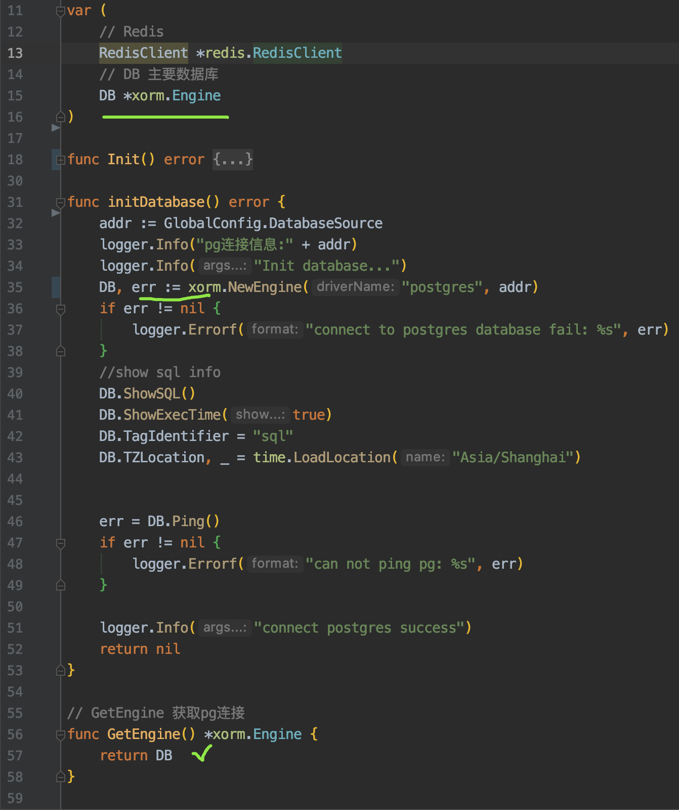
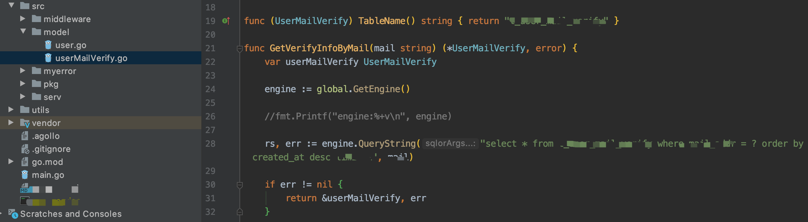
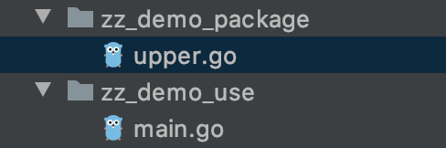
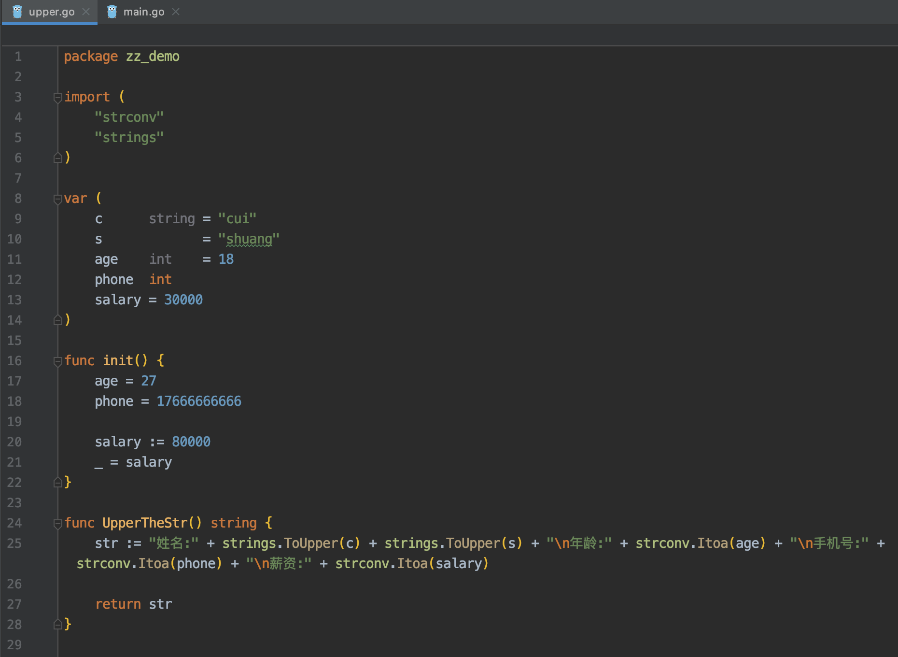
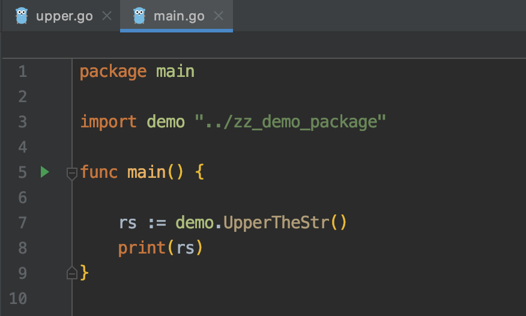

<br>

最近要写一个web服务,对外提供几个Api,选用gin框架. 

gin的路由广泛为人好评,一直是"gin为什么这么快"的主角. 正在看其用到的[httprouter](https://github.com/julienschmidt/httprouter)的源码, 对这种特殊的trie树`---`基树树(Radix Tree),也有还不错的理解.

( *httprouter包只有200多k,非常值得一看* )

就在自以为洞若观火 高屋建瓴,写几个接口如是小菜一碟时,一个诡异的`获取数据库资源句柄`的问题扰了我许久,最后解开疑惑,哑然失笑.




这是随便一搜,从[某处](https://blog.csdn.net/H_XINGHAI/article/details/85125602)复制的代码, 我用的是pg, 这里是mysql,于是调试, 顺手把代码做了下面这样看似更"简洁"的改动





在**initDatabase**方法里调试,可以正常连接pg,获取到数据.


<br>


为使项目层次更清晰,使以后接口数量增多而不致混乱,对项目进行了常规的分层.

在model这个package里,如下图 调用刚才的`pg连接句柄`,发现每次拿到的都是nil




而再回**initDatabase**方法调试,没问题,可以获取到数据

<br>


这就让我感到疑惑...

不得已重新梳理了一下复制的那段代码的逻辑,发现忽略了一个细小知识点`----`*全局变量,局部变量*及*变量的作用范围*:


上述代码中,**全局变量**会在init()方法执行前被执行,而后执行`init()`及其调用到的子方法.

当在其他地方调用到这个package里的函数时(此处为`GetEngine`),上述两步一定会先执行,完成后才到调用到的函数

看下面这个demo,就一目了然



<br>



<br>



output:

```go
姓名:CUISHUANG
年龄:27
手机号:17666666666
薪资:30000
```

**可长点记性吧! 看,薪资一下少了5万**

<br>


具体到遇到的问题,当在model中调用该方法以期返回资源时, 先初始化全局变量(或者说赋值,虽然很多情况下是赋零值),而后执行init(),然后到子方法`initDatabase`,

先前的写法,

```go
DB, err = xorm.NewEngine("postgres", addr)
```

是在修改全局变量`DB`,或者说,在`initDatabase`里操作的,和在外面定义是同一块内存.

而自以为"简约"地改为如下之后, 

```go
DB, err := xorm.NewEngine("postgres", addr)
```
相当于在一个方法里,重新定一个一个同名的局部变量,这个局部变量DB指向的内存,与外面的全局变量DB并不相同.

而最后调用`GetEngine`方法,返回的DB,还是最开始定义的那个全局变量,其并未经过`initDatabase`的赋值操作,故而还是初始化时的值.


