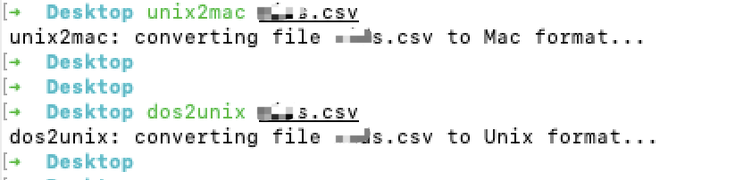

不同系统的换行符有所不同:

<br>

- Windows: `\r\n`

- Unix: `\n`

- MacOs: `\r`

<br>

故而在跨系统处理一些按行分隔的字符串或文件时(如`.csv`),就可能出现因换行符不一致而引发的问题.

如下是一段从csv文件中读取id的代码,


```go

	var ids []int64

	file, err := os.Open("/Users/dashen/Desktop/ids.csv")

	if err != nil {
		panic("err is:",err)
	}

	defer file.Close()
	buff := bufio.NewReader(file)
	for {
		line, errRead := buff.ReadString('\n')
		if errRead == io.EOF {
			break
		}
		if errRead != nil && errRead != io.EOF {
			panic("errRead is:",errRead)
		}
		id, errAtoi := strconv.Atoi(line)
		if errAtoi != nil {
			panic("errAtoi is",errAtoi)
		}

		ids = append(ids, int64(id))
	}
```

<br>

如果都在unix平台运行,则这段代码不会有任何问题,但当文件导出自unix,却在Mac或Windows上运行时,就可能有如下问题:

`strconv.Atoi: parsing “xxx \r”: invalid syntax`

<br>


这时的解决办法,

可以在代码中做处理,如

`line = strings.Replace(line, "\n", "", -1)`

或

`line = strings.Replace(line, "\r", "", -1)`


<br>

也可以借助系统自带(或自行安装)的格式转换工具,如`dos2unix`,`dos2unix`进行处理,而后再执行代码

<br>

