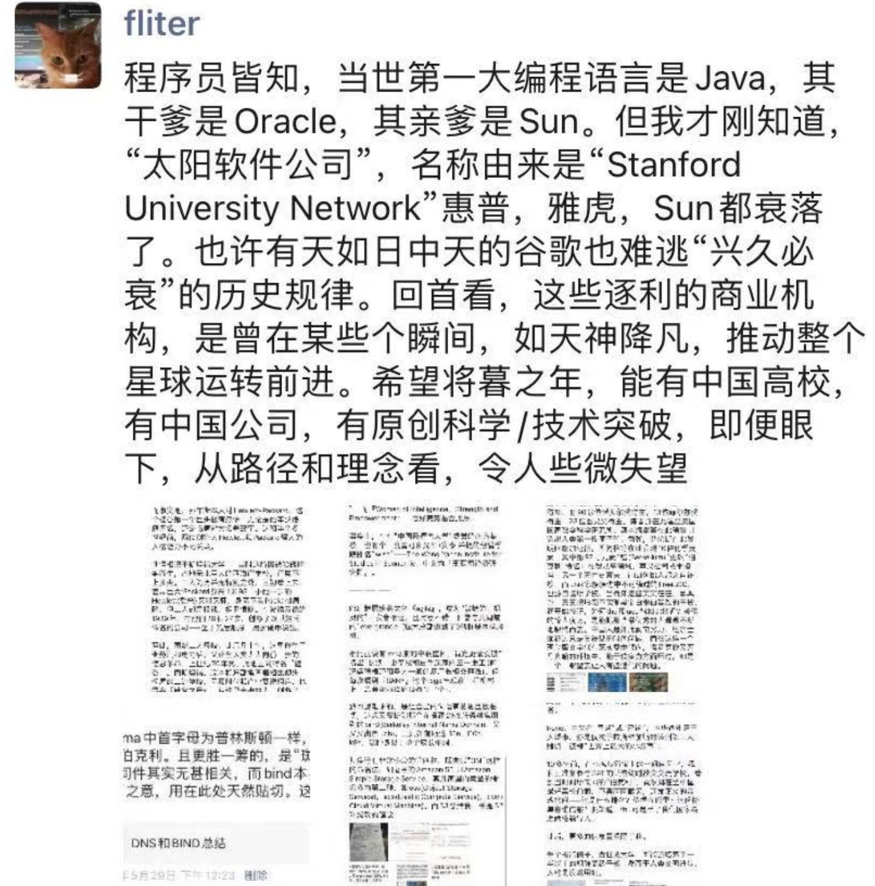
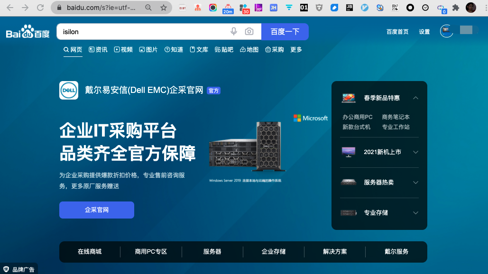
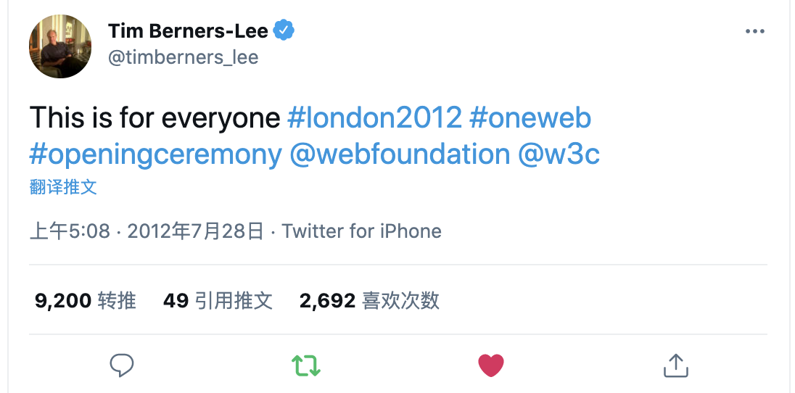
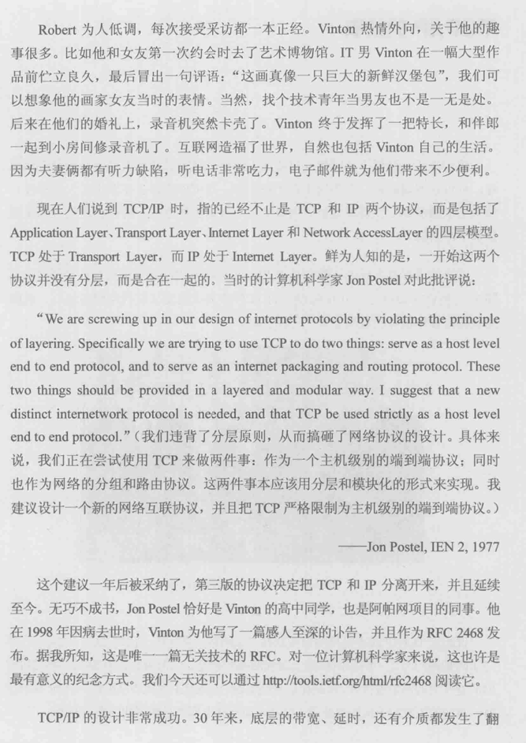
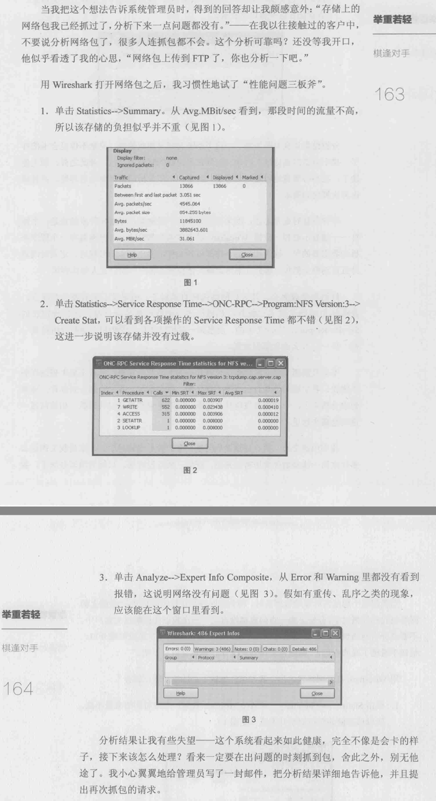

<div align='center' ><font size='4' color="#1E90FF"><b>初试锋芒</b></font></div>


<br>

### 从一道面试题开始说起


<br>


<br>


---

<br>

### 小试牛刀: 一个简单的应用案例


<br>


<br>


---

<br>

### Execl文件的保存过程


<br>


<br>


---

<br>

### 你一定会喜欢的技巧


<br>


<1>. 抓包:

- 只抓包头

- 只抓必要的包


<2>. 个性化设置:

- 调整时间格式

- 不同类型的网络包可以自定义颜色

- Edit-Preferences更多设置

- 可设置时区与服务器一致

<3>. 过滤:

- 用协议名称过滤

- IP地址+Port号

- 用鼠标帮助过滤

- 可以把过滤后得到的网络包存在一个新的文件里,小文件更方便操作

<4>. 让Wireshark自动分析

1. Analyze->Export Info Composite

2. Statistics->Service Response Time

3. Statistics->TCP Stream Graph

4. Statistics->Summary


<5>. Ctrl + F


<br>


---

<br>

### Patrick的故事


<br>

*从此我就喜欢上了Wireshark,因为它实在很有用,就像学武之人得到了一把趁手好剑*


<br>


<br>


---

<br>

### Wireshark的故事


<br>


> 当你透过它看到网络时，不再是没有意义的0和1，而是可以理解的简洁文字。有了它的专业解说，我们几乎能直接看懂网络上发生的一切。以前难以排查的问题，在它介入后便显露无遗。它还提供了权威的分析报告，比如重传率统计、响应时间和对话列表等，这解放了原本负担繁重的网络管理员，使他们有更多时间专注其他事务。

Gerald把这个软件命名为Ethereal，正对应了它的功能`---`还原以太网的真相


```
ethereal	

英[iˈθɪəriəl]
美[iˈθɪriəl]
adj.	优雅的; 轻飘的; 缥缈的; 超凡的;
[例句]She's the prettiest, most ethereal romantic heroine in the movies.
她是所有电影中最美丽、最飘逸的爱情女主角。

```

<br>


---


<br>


<div align='center' ><font size='4' color="#1E90FF"><b>庖丁解牛</b></font></div>


<br>


### NFS协议的解析


<br>


> 20世纪80年代初，一家神奇的公司在硅谷诞生了，它就是Sun Microsystems。这个名字与太阳无关，而是源自互联网的伊甸园`----`Stanford University Network的首字母。在不到30年的时间里， SUN公司创造了无数传世作品。其中， Java.Solaris和基于SPARC的服务器至今还闻名遐迩。后来，人们总结SUN公司衰落的原因时，有一条竟然是技术过剩。

Network File System （NFS）协议也是SUN公司设计的。顾名思义， NFS就是网络上的文件系统。




<br>

portmap的功能是维护一张进程与端口号的对应关系表,而它自己的端口号11是众所周知的


<br>


[rpcinfo命令](https://linux265.com/course/linux-command-rpcinfo.html)


[telnet命令](https://www.linux265.com/course/linux-command-telnet.html)





<br>


---

<br>

### 从Wireshark看网络分层


<br>


传输层: 虽然名曰"传输层",但它并不是把网络包从一个设备传到另一个,而只是对传输行为进行控制. 真正负责设备间传输的是下面两层(即网络层和数据链路层)


<br>


分工(分层)会带来很多好处,因为每个人都可以专注自己擅长的领域,更好的服务他人.


<br>


网络对包的大小是有限制的,其最大值称为MTU,即"最大传输单元".


<br>

知道自己的MTU容易,但对方的MTU如何获得? 在TCP建立连接(三次握手)时,双方都会把自己的MSS(Maxinum Segment Size)告诉对方. MSS加上TCP头和IP头的长度,就得到MTU了.

如MSS是8960,那MTU就是 $$8960+20(TCP头)+20(IP头)=9000$$.

如果MSS是1460,那MTU就是 $$1460+20(TCP头)+20(IP头)=1500$$.


<br>


发包的大小是由MTU较小的一方决定的

<br>


---

<br>

### TCP的连接启蒙


<br>


[nslookup命令](https://linux265.com/course/linux-command-nslookup.html)


<br>

> 为什么要用三个包来建立连接呢，用两个不可以吗？其实也是可以的，但不够可靠。我们可以设想一个情况来说明这个问题：某个网络有多条路径，客户端请求建立连接的第一个包跑到一条延迟严重的路径上了，所以迟迟没有到达服务器。因此，客户端只能当作这个请求丢失了,不得不再请求一次。由于第二个请求走了正确的路径，所以很快完成工作并关闭了连接。对于客户端来说，事情似乎已经结束了。没想到它的第一个请求经过跋山涉水，还是到达了服务器。 服务器并不知道这是一个旧的无效请求，所以按照惯例回复了。假如TCP只要求两次握手，**服务器上就这样建立了一个无效连接**。而在三次握手的机制下，客户端收到服务器的回复时，知道这个连接不是它想要的，所以就发了一个拒绝包.服务器收到这个包后,也放弃这个连接.


<br>

其实用四次挥手来断开连接也不完全可靠,但世界上不存在100%可靠的通信机制.


[两军问题与拜占庭将军问题](https://www.cnblogs.com/charlesblc/p/6271472.html)


<br>


---

<br>

### 快递员的工作策略 `----` TCP窗口


<br>


> TCP显然不用电瓶车送包，但它也有“往返”的需要。因为发包之后并不知道对方能否收到，要一直等到确认包到达，这样就花费了一个往返时间。假如每发一个包就停下来等确认，一个往返时间里就只能传一个包，这样的传输效率太低了。最快的方式应该是一口气把所有包发出去，然后一起确认。但现实中也存在一些限制：接收方的缓存（接收窗口）可能一下子接受不了这么多数据；网络的带宽也不一定足够大，一口气发太多会导致丢包事故。所以，发送方要知道接收方的接收窗口和网络这两个限制因素中哪一个更严格，然后在其限制范围内尽可能多发包。这个一口气能发送的数据量就是传说中的TCP发送窗口。 <br>
发送窗口对性能的影响有多大？在相同的往返时间里，右边比左边多发了两倍的数据量。而在真实环境中，发送窗口常常可以达到数十个MSS.


<br>


<1>. (如图)每个包的TCP层都含有"windows size:"(也就是win=)的信息. 这个值表示发送窗口的大小吗?


很多人会把接收窗口误认为发送窗口. `Windows Size`其实不是发送窗口,而是在向对方声明自己的接收窗口.  

滑动窗口机制,说的就是这两个窗口的关系


<2>. 我如何在包里看出发送窗口的大小呢?

很遗憾,没有简单办法,有时候甚至完全没有办法.


<3>. 发送窗口和MSS有什么关系?


<4> .发送方在一个窗口里发出n个包,是不是就能收到n个确认包?


<5>. 经常听说"TCP Window Scale"这个概念,它究竟和接收窗口有和关系?


<br>


---

<br>

### **重传的讲究**


<br>

前文说到,发送方的发送窗口是受接收方的接收窗口和网络影响的,**其中限制得更严的因素就起决定作用.** 接收窗口的影响方式非常简单,只要在包里用"Win="告知发送方就可以了. 而网络的影响方式非常复杂,这篇来专门介绍.

<br>

能导致网络拥塞的数据量称为*拥塞点*


*慢启动过程*

*拥塞避免*

*超时重传*

*RTO*

*重复确认(Dup Ack)*

*快速重传*

*快速恢复*

*NewReno*

<br>


"本文的信息量有点大，你也许需要一些时间来消化它。有些部分一时理解不了也无妨，即便只记住本文导出的几个结论，在工作中也是很有用的:"

- 没有拥塞时，发送窗口越大，性能越好。所以在带宽没有限制的条件下，应该尽量增大接收窗口，比如启用Scale Option （Windows上可参考KB224829）.

- 如果经常发生拥塞，那限制发送窗口反而能提高性能，因为即便万分之一的重传对性能的影响都很大。在很多操作系统上可以通过限制接收窗口的方法来减小发送窗口， Windows上同样可以参考KB 224829

- 超时重传对性能影响最大，因为它有一段时间（RTO）没有传输任何数据,而且拥塞窗口会被设成1个MSS，所以要尽量避免超时重传。

- 快速重传对性能影响小一些，因为它没有等待时间，而且拥塞窗口减小的幅度没那么大。


- SACK和NewReno有利于提高重传效率，提高传输性能。

- 丢包对极小文件的影响比大文件严重。因为读写一个小文件需要的包数很少，所以丢包时往往凑不满3个Dup Ack，只能等待超时重传了。而大文件有较大可能触发快速重传。下面的实验显示了同样的丢包率对大小文件的不同影响：图11中的test是包含很多小文件的目录，而图12的hi是一个大文件。发生丢包时前者耗时增加了7倍多，而后者只增加了不到4倍。


<br>


---

<br>

### 延迟确认与Nagle算法


<br>


这种方式其实是很低效的,因为一个包的TCP头和IP头至少就40字节,而携带的数据却只有一个字符.这就像快递员开着大货车去送一个小包裹一样浪费.


延迟确认并没有直接提高性能,它只是减少了部分确认包,减轻了网络负担.

和延迟确认一样,Nagle也没有直接提高性能,启用它的作用只是提高传输效率,减轻网络负担.


<br>


---

<br>

### 百家争鸣


<br>


*慢启动算法*

*拥塞避免算法*


Westwood: 在经常发生非拥塞性丢包的环境中(比如无线网络),Westwood最能体现出气优势


Vegas: 独辟蹊径,通过监控网络状态来调整发包速度,从而实现真正的"拥塞避免"


> 与别的算法相比， Vegas就像一位敏感、稳重、谦让的君子。我们可以想象当环境中所有发送方都使用Vegas时，总体传输情况是更稳定、更高效的，因为几乎没有丢包会发生。而当环境中存在Vegas和其他算法时，使用Vegas的发送方可能是性能最差的，因为它最早探测到网络繁忙，然后主动降低了自己的传输速度。这一让步可能就释放了网络的压力，从而避免其他发送方遭遇丢包。这个情况有点像开车，如果路上每位司机的车品都很好，谦让守规矩，则整体交通状况良好；而如果一位车品很好的司机跟一群车品很差的司机一起开车，则可能被频繁加塞，最后成了开得最慢的一个。


<br>


---

<br>

### 简单的代价 `----` UDP


<br>

<1>. **UDP不像TCP一样在乎双方MTU的大小。** 它拿到应用层的数据之后，直接打上UDP头就交给下一层了。那么超过MTU的时候怎么办？在这种情况下，发送方的网络层负责分片，接收方收到分片后再组装起来，这个过程会消耗资源，降低性能。一个32 KB的写操作，可能会根据发送方的MTU被切成23个分片。

<2>. UDP没有重传机制，所以丢包由应用层来处理。如某个写操作需要6个包完成。**当基于UDP的写操作中有一个包丢失时，客户端不得不重传整个写操作（6个包）。相比之下，基于TCP的写操作就好很多，只要重传丢失的那1个包即可。**

<3>. **分片机制存在弱点，会成为黑客的攻击目标。** 接收方之所以知道什么时候该把分片组装起来，是因为每个包里都有“More fragments”的flag. 1表示后续还有分片， 0则表示这是最后一个分片，可以组装了。如果黑客持续快速地发送flag为1的UDP包，接收方一直无法把这些包组装起来，就有可能耗尽内存。 


<br>


---

<br>

### 剖析CIFS协议


<br>

"前文介绍过一个文件共享协议，即Sun设计的NFS。理论上NFS可以应用在任何操作系统上，但因为历史原因，现实中只在Linux/UNIX上流行。那Windows上一般使用什么共享协议呢？它就是微软维护的SMB协议，也叫Common InternetFile System （CIFS）. CIFS协议有三版本： SMB， SMB2和SMB3， 目前SMB和SMB2比较普遍。"


<br>


---

<br>

### 网络江湖


<br>


Linux和Windows上的共享协议之争

NFS vs CIFS


<br>


---

<br>

### DNS小科普


<br>


- A (Address）记录: 从域名解析到IP地址。


- PTR记录：与A记录的功能相反，它能从IP地址解析到域名。PTR有什么作用呢？比如IT部门发现最近公司里的机器10.32.106.47和YouTube 之间数据流量很大，用nslookup一查PTR记录就知道原来是阿满在上班时间偷看视频了

- SRV记录：Windows的域管理员要特别关心SRV记录，因为它指向域里的资源。比如我想知道我们公司的域nas.com里有哪些DC，只要随便在一台电脑上查询＿ldap._tcp.dc._msdcs.nas.com这个SRV记录就可以了。如果你也想查贵司的DC，请把nas.com改成正确域名即可。

- CNAME记录：又称为Alias记录，就是别名的意思。比如我的服务器 10.32.106.73同时提供网页（www）、邮件（mail）和地图（map）服务。那直接把10.32.106.73配给mail和map可以吗？当然是可以的，但如果某天 要改变这个IP地址，就不得不在DNS上修改www、mail和map这3项记录了。 而在使用别名的情况下，只要修改www一项的IP就行了，mail和map都没有必要改动。**别名的使用节省了管理时间，站长们应该会喜欢这个功能。**


<br>

- 递归查询

- 迭代查询

<br>

**DNS的缺点:**

- 就像雕牌洗衣粉被周佳牌模仿一样，DNS上也存在山寨域名。比如招商银行 的域名是www.cmbchina.com，但是www.cmbchina.com.cn和www.cmbchina.cn 却不一定属于招行。如果这两个域名被指向外表和招行一样的钓鱼网站，就可能会骗到部分用户的银行账号和密码。

- 如果DNS服务器被恶意修改也是很危险的事情。比如登录招行网站时虽然 用了正确域名www.cmbchina.com，但由于DNS服务器是黑客控制的，很可能解析到一个钓鱼网站的IP

- 即便是配了正规的DNS服务器，也是有可能中招的。比如正规的DNS服务器遭遇**缓冲投毒**- 之后，也会变得不可信。 

- NS除了能用来欺骗，还能当做攻击性武器。著名的*DNS放大攻击*就很让人头疼。利用这个放大效应,黑客只要控制少量电脑就能把一个大网站拖垮了.


<br>


---

<br>

### 一个古老的协议 `----` FTP


<br>

FTP是用明文传输的,如果对安全要求非常高,就不能采用这种方式


主动模式与被动模式


<br>


---

<br>

### 上网的学问 ---- HTTP


<br>


<blockquote class="twitter-tweet"><p lang="en" dir="ltr">This is for everyone <a href="https://twitter.com/hashtag/london2012?src=hash&amp;ref_src=twsrc%5Etfw">#london2012</a> <a href="https://twitter.com/hashtag/oneweb?src=hash&amp;ref_src=twsrc%5Etfw">#oneweb</a> <a href="https://twitter.com/hashtag/openingceremony?src=hash&amp;ref_src=twsrc%5Etfw">#openingceremony</a> <a href="https://twitter.com/webfoundation?ref_src=twsrc%5Etfw">@webfoundation</a> <a href="https://twitter.com/w3c?ref_src=twsrc%5Etfw">@w3c</a></p>&mdash; Tim Berners-Lee (@timberners_lee) <a href="https://twitter.com/timberners_lee/status/228960085672599552?ref_src=twsrc%5Etfw">July 27, 2012</a></blockquote> <script async src="https://platform.twitter.com/widgets.js" charset="utf-8"></script>



[This is for everyone](https://twitter.com/timberners_lee/status/228960085672599552?s=20)


英国人不但借此传播了开放和分享的互联网精神，也展示了其在IT历史上的地位`----`从奠定现代计算机基础的 **Alan Turing**，到发明分组交换的 **Donald Davies**，再到万维网之父 **Tim Berners—Lee**，每一个重大环节都有英国人的参与。

Tim所实现的HTTP便是我们今天浏览网页所用的网络协议。他当年建立的网站至今还能访问，域名为http：/info.crm.ch，虽然这个页面已经更新过，但我们还可以在http//www3.org/Histor/1992110—ypertexthypertext/wwW/News/9201.html看到当年的内容。


<br>


解密https的包:

Edit->Preferences->Protocl->SSL->RSA key list.


解密所用的密钥只能在服务器端导出


<br>


---

<br>

### 无懈可击的Kerberos


<br>

'在古希腊神话中，冥界的大门由一头烈犬看守。此犬长有三个头，兢兢业业地守在冥河边，从没有灵魂能在它醒着的时候逃离。这头烈犬就是Kerberos，安全守卫的象征。古希腊人下葬时要放好蜜饼，就是为了讨好它。现代游戏里也有它的英姿，比如《英雄无敌》里以一敌多的地狱烈犬。

这篇要介绍的身份认证协议也叫Kerberos，它有着非常广泛的应用，比如Windows域环境的身份认证就会用到它。我们用域账号登录电脑，就在不知不觉间完成了一次Kerberos认证过程。

Kerberos的认证结果是双向的`----`当账号A访问资源B时，不但B要确保A并非冒充，而且A也要查明B不是假货。我们一般只知道前者，比如前文提到的CIFS服务器就要在Session Setup中对造访者验明正身。后者则很少被提及，因为人们一般不会怀疑自己要访问的资源是假的。其实后者还是很有必要的，举一个例子：如果你老板伪造了一台网络打印机，但是你没法确认它的真假，就可能把求职信打到他办公室里去，然后就真的得出去求职了。西游记中其实也出现需要相互认证的场景，比如如来佛祖要认出假冒的访问者六耳猕猴，唐僧师徒也要识别山寨的“资源”小雷音寺。

双向认证的方式不止一种，最简单的做法是互报密码。这个过程就像电影中用暗号接头。A说： “江南风光好”， B说： “遍地红花开”。如果双方都核对无误，就可以激动地握手“同志，我可找到你了！”假如其中一方报错暗号，则接头失败。这种方式的弊端很多，最大的问题是不方便管理。比如在一个数百名员工共享几百台机器的环境中，当新加入一名员工时，就得在几百台机器上更新账号信息。相信没有管理员能忍受这样的环境。'

<br>


---

<br>

### TCP/IP的故事


<br>


一开始这两个协议并没有分层,而是合在一起



> TCP/IP的设计非常成功。30年来，底层的带宽、延时，还有介质都发生了翻天覆地的变化，顶层也多了不少应用，但TCP/IP却安如泰山。它不但战胜了国际标准化组织的OSI七层模型，而且目前还看不到被其他方案取代的可能。*第一代从事TCP/IP工作的工程师，到了退休年龄也在做着朝阳产业。*<br>
令人费解的是，现在的大学课程还在介绍[OSI七层模型](https://dashen.tech/2017/02/17/%E6%88%91%E7%90%86%E8%A7%A3%E7%9A%84OSI%E7%BD%91%E7%BB%9C%E6%A8%A1%E5%9E%8B%E5%92%8CTCP-IP%E5%8D%8F%E8%AE%AE%E6%97%8F/)。因为OSI模型的层数太多，很多学生根本理解不了，甚至连顺序都记不住。于是老师们就用“All People Seem To Need Data Processing”来帮助记忆，因为这7个单词的首字母和OSI模型每一层的首字母是一样的。大学的应试教育由此可见一斑。


<br>


'到今天,OSI模型几乎名存实亡了,它对我们的影响只停留在还没来得及更新的教科书上'

<br>

*可能是唯一篇无关技术的RFC:*

<br>

[rfc2468 -I REMEMBER IANA](https://tools.ietf.org/html/rfc2468)


<br>

---

<br>


<div align='center' ><font size='4' color="#1E90FF"><b>举重若轻</b></font></div>


<br>

### "一小时内给你答复"


<br>

NAT(Network Address Translation)


Life is tough,but Wireshark makes it easy.

<br>


---

<br>

### 午夜铃声


<br>


乱序导致了重传,从而影响了性能


真的和探案一样...

<br>


---

<br>

### 深藏功与名


<br>


一般存储设备都是读比写快


<br>


一般存储端的带宽大，客户端的带宽小。读文件时数据从大带宽进入小带宽，就如同大河水流入小河，有可能会溢出（表现在网络上就是拥塞）而导致性能问题。写文件时方向相反，所以拥塞概率低，性能就会好一些


<br>

---

<br>

### 棋逢对手


<br>





[NFS网络锁管理器（NLM）](http://blog.chinaunix.net/uid-796091-id-3232239.html)

<br>


---

<br>

### 学无止境


<br>


`➜  ~ tshark -h:`

```shell
TShark (Wireshark) 2.4.3 (v2.4.3-0-g368ba1e)
Dump and analyze network traffic.
See https://www.wireshark.org for more information.

Usage: tshark [options] ...

Capture interface:
  -i <interface>           name or idx of interface (def: first non-loopback)
  -f <capture filter>      packet filter in libpcap filter syntax
  -s <snaplen>             packet snapshot length (def: appropriate maximum)
  -p                       don't capture in promiscuous mode
  -I                       capture in monitor mode, if available
  -B <buffer size>         size of kernel buffer (def: 2MB)
  -y <link type>           link layer type (def: first appropriate)
  -D                       print list of interfaces and exit
  -L                       print list of link-layer types of iface and exit

Capture stop conditions:
  -c <packet count>        stop after n packets (def: infinite)
  -a <autostop cond.> ...  duration:NUM - stop after NUM seconds
                           filesize:NUM - stop this file after NUM KB
                              files:NUM - stop after NUM files
Capture output:
  -b <ringbuffer opt.> ... duration:NUM - switch to next file after NUM secs
                           filesize:NUM - switch to next file after NUM KB
                              files:NUM - ringbuffer: replace after NUM files
Input file:
  -r <infile>              set the filename to read from (- to read from stdin)

Processing:
  -2                       perform a two-pass analysis
  -M <packet count>        perform session auto reset
  -R <read filter>         packet Read filter in Wireshark display filter syntax
                           (requires -2)
  -Y <display filter>      packet displaY filter in Wireshark display filter
                           syntax
  -n                       disable all name resolutions (def: all enabled)
  -N <name resolve flags>  enable specific name resolution(s): "mnNtCd"
  -d <layer_type>==<selector>,<decode_as_protocol> ...
                           "Decode As", see the man page for details
                           Example: tcp.port==8888,http
  -H <hosts file>          read a list of entries from a hosts file, which will
                           then be written to a capture file. (Implies -W n)
  --enable-protocol <proto_name>
                           enable dissection of proto_name
  --disable-protocol <proto_name>
                           disable dissection of proto_name
  --enable-heuristic <short_name>
                           enable dissection of heuristic protocol
  --disable-heuristic <short_name>
                           disable dissection of heuristic protocol
Output:
  -w <outfile|->           write packets to a pcap-format file named "outfile"
                           (or to the standard output for "-")
  -C <config profile>      start with specified configuration profile
  -F <output file type>    set the output file type, default is pcapng
                           an empty "-F" option will list the file types
  -V                       add output of packet tree        (Packet Details)
  -O <protocols>           Only show packet details of these protocols, comma
                           separated
  -P                       print packet summary even when writing to a file
  -S <separator>           the line separator to print between packets
  -x                       add output of hex and ASCII dump (Packet Bytes)
  -T pdml|ps|psml|json|jsonraw|ek|tabs|text|fields|?
                           format of text output (def: text)
  -j <protocolfilter>      protocols layers filter if -T ek|pdml|json selected
                           (e.g. "ip ip.flags text", filter does not expand child
                           nodes, unless child is specified also in the filter)
  -J <protocolfilter>      top level protocol filter if -T ek|pdml|json selected
                           (e.g. "http tcp", filter which expands all child nodes)
  -e <field>               field to print if -Tfields selected (e.g. tcp.port,
                           _ws.col.Info)
                           this option can be repeated to print multiple fields
  -E<fieldsoption>=<value> set options for output when -Tfields selected:
     bom=y|n               print a UTF-8 BOM
     header=y|n            switch headers on and off
     separator=/t|/s|<char> select tab, space, printable character as separator
     occurrence=f|l|a      print first, last or all occurrences of each field
     aggregator=,|/s|<char> select comma, space, printable character as
                           aggregator
     quote=d|s|n           select double, single, no quotes for values
  -t a|ad|d|dd|e|r|u|ud|?  output format of time stamps (def: r: rel. to first)
  -u s|hms                 output format of seconds (def: s: seconds)
  -l                       flush standard output after each packet
  -q                       be more quiet on stdout (e.g. when using statistics)
  -Q                       only log true errors to stderr (quieter than -q)
  -g                       enable group read access on the output file(s)
  -W n                     Save extra information in the file, if supported.
                           n = write network address resolution information
  -X <key>:<value>         eXtension options, see the man page for details
  -U tap_name              PDUs export mode, see the man page for details
  -z <statistics>          various statistics, see the man page for details
  --capture-comment <comment>
                           add a capture comment to the newly created
                           output file (only for pcapng)
  --export-objects <protocol>,<destdir> save exported objects for a protocol to
                           a directory named "destdir"

Miscellaneous:
  -h                       display this help and exit
  -v                       display version info and exit
  -o <name>:<value> ...    override preference setting
  -K <keytab>              keytab file to use for kerberos decryption
  -G [report]              dump one of several available reports and exit
                           default report="fields"
                           use "-G help" for more help
```


<br>

---

<br>

### 一个技术男的自白


<br>


> 关于技术,当下的热点是*Full Stack Engineer*,翻译过来就是全栈工程师.我的理解就是从前端到后端,从软件到硬件都懂的通才.其实在全栈的概念出现之前,关于技术广度和深度的讨论就从来没有停止过. 在时间有限的情况下,究竟是应该扩展广度,各种技术都去涉猎,还是把所有精力都投入在一门技术上呢? 我个人更倾向于后者,因为当某项技术学到了较深的程度后,眼界就不样了, 再学其他的技术也容易达到类似境界. .. 假如一个人连最擅长的技术都浅尝辄止,那学习其他技术也会停留在表面上. .. 技术深度和广度的关系,就像登山时的高度和视野．假如你爬到半山腰就停下来眺望,就只能看到一半的视野；但如果埋头爬到山顶,一抬头便是无边的风风景

<br>


---

<br>


[私有笔记](https://note.youdao.com/web/#/file/WEBbf11ef0182d2f5ad5923fd69b966f167/note/WEB4af0158641db1a02eb2c4e8d6648d855/)