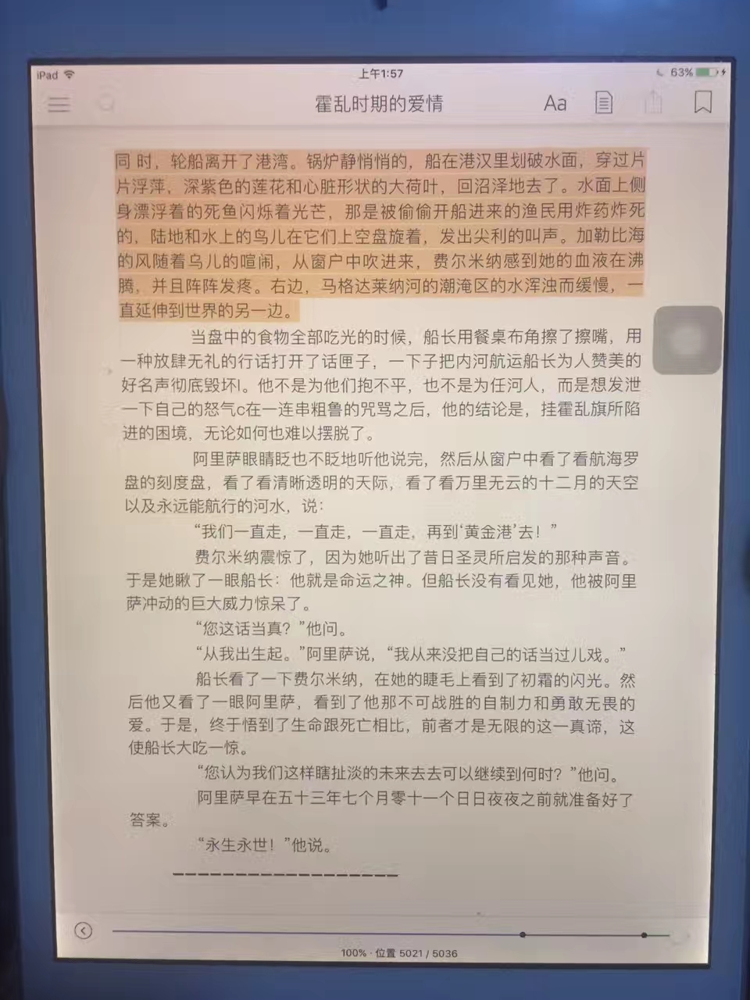
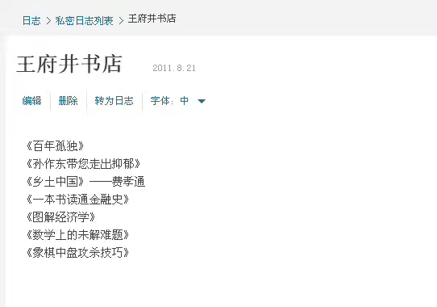
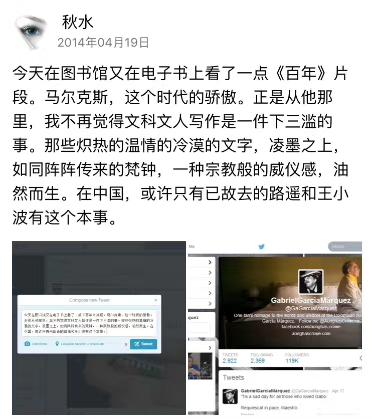
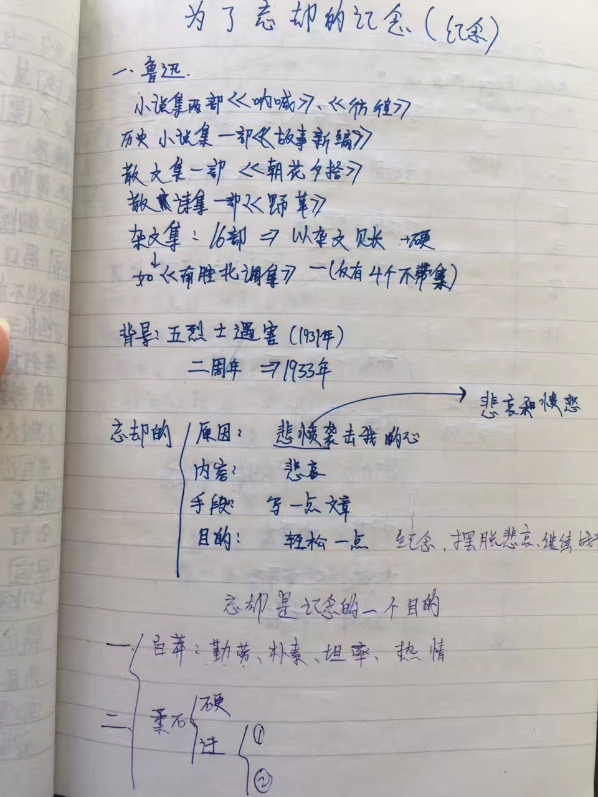
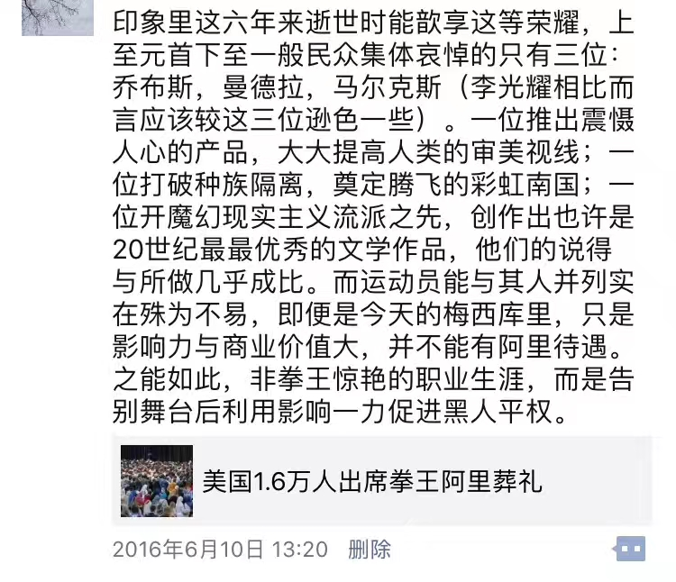

经过好多个静谧深夜，终于草草翻过马尔克斯另一部大作的尾页，该书是这位20世纪最具影响力的作家荣膺诺奖后，第一次又有新作付梓发行。和“惊艳”迷人到手不释卷的<百年孤独>比，<霍乱时期的爱情>没有那样的魔力，如同拍出<霸王别姬>的导演，有好多作品需要按快进。

2011年，我带着些忐忑走进偌大的王府井书店。一楼入口在轮番播报着<百年孤独>译作首次登录国内的消息。在其时，埋头于沉抑的山东高中院落，抬头只见四角天空的我，并不知马尔克斯大名，但心想如此连篇累牍地报道，想来该是不错，于是悄悄记了下来，打算抽空看看。

但这一等就是3年。那年4月，我埋头于无穷级数和线面积分，无暇更无心在旭日初升或斜阳将下的时刻，心无旁骛看一本与前途好像毫无关联的小说。那年4月初，恰巧所在书位上有一本<百年孤独>，于是翻几页作为疲乏时刻的休憩。不期十余天后作家辞世，透过网络，我看到了五大洲许多达官显贵或贩夫走卒自发的哀悼。这本书也实在具有魔力，我一再告知自己不要本末倒置，有时还是忍不住连看几十页。像一部优秀的如<致命魔术>那样情节引人入胜的电影，你只需要按捺住不耐烦的心情看10分钟，剩下的时间，你像是被吸在了那里，即便接下来是一场国家德比，是一桌饕餮盛宴，亦或眉梢起火，泰岳崩塌，甚至是你频送秋波的心怡妹子在楼下等你，你内心也在挣扎“等我看完再说”。

马尔克斯不光影响了莫言，很大程度也靠这部小说改变了我的三观。自此，文学不再是被我有色眼镜下歧视的公民。作为一名喜爱自然科学的高分理科生，我对文科一直无有太好印象。大概有三个比较标志性意义的时刻，让我观念逐渐改变。

一是进到高中再读鲁迅那些佶屈聱牙的文字。初中时学过其<拿来主义>，我的评价是“什么玩意儿”。而进入中学再学<为了忘却的纪念>，这时已有稍多些经历，有好多次郁结于心想要表达，却不知词从何来从何说起的乏力。而他一己之力在记录挞伐一个时代的黑暗，这种细致入微的情感表达，入木三分的刻画，多一字则多少一字则少的把握，都到运斤成风目无全牛程度。也是那时，我开始相信先生弃医从文，真是为影响更多人，而不是“医科更难学”。

二是一位颇好的中学同学，在一士谔谔众士诺诺的高中，我俩算是难得的“同类人”。他的理科与我一般好，但作文每次都是最优，甚至有次聊天，他告诉我以后他最想当一名作家。这让我跌掉眼镜：你怎么会去做这么没有技术含量的工作？我们这样聪明这样优秀，不是还有那么多科学难题在等待我们？…难逢知己，交流许多。他向我推荐了几部网络文学，其中一部叫<庆余年>。

如同两宋之交的人口南迁，彻底让南北方经济易位。<百年孤独>为文学正名。而此后对文学兴致大涨，坚定不移的科学家的大梦，反倒在诡谲的现实世界化为18岁那年的迷雾。

作家辞世已3周年。有的人死了，他还活着。

“永生永世！”他说。