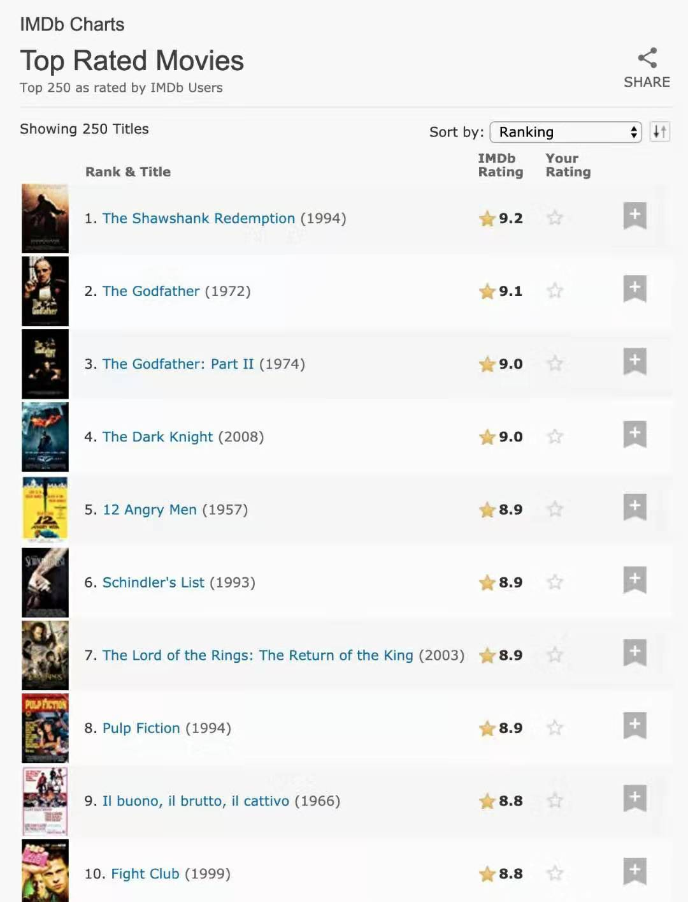
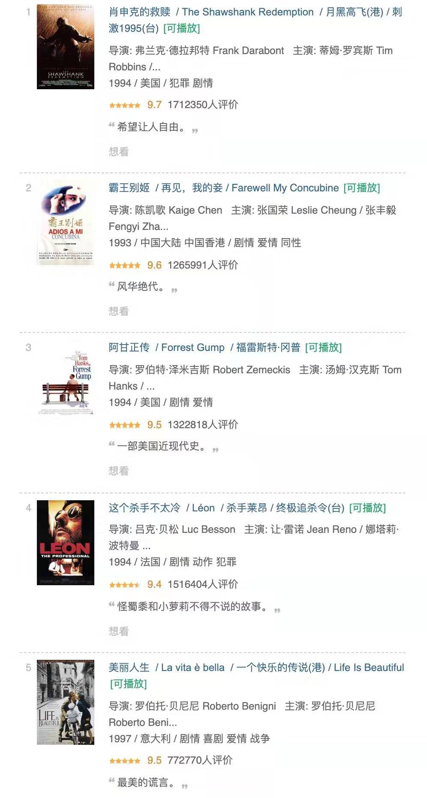
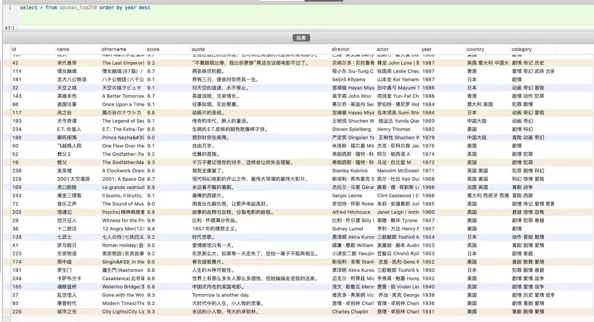
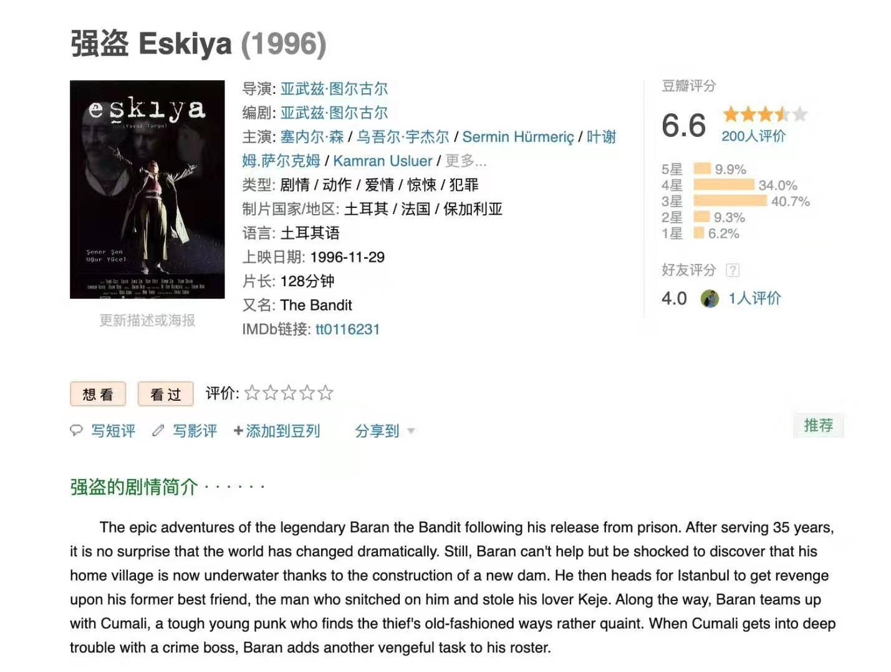
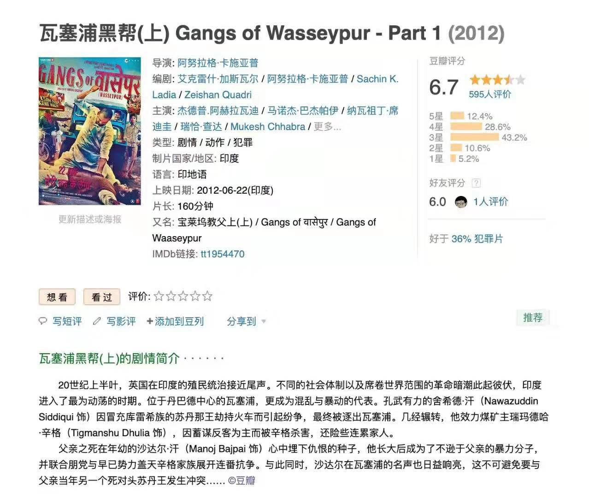
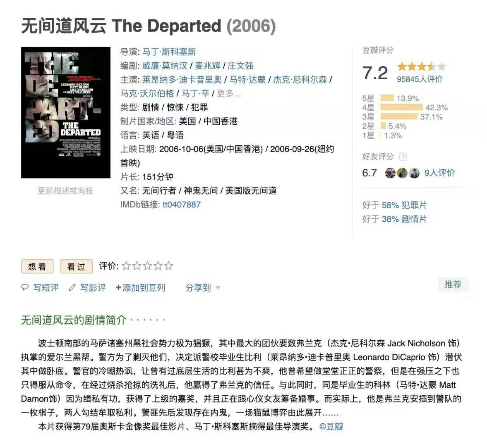
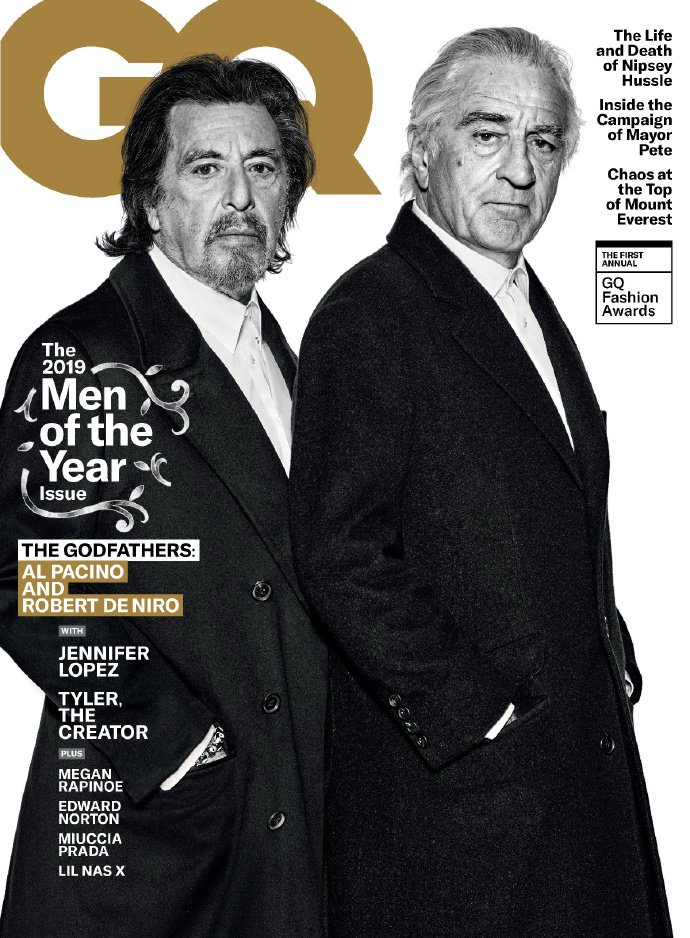
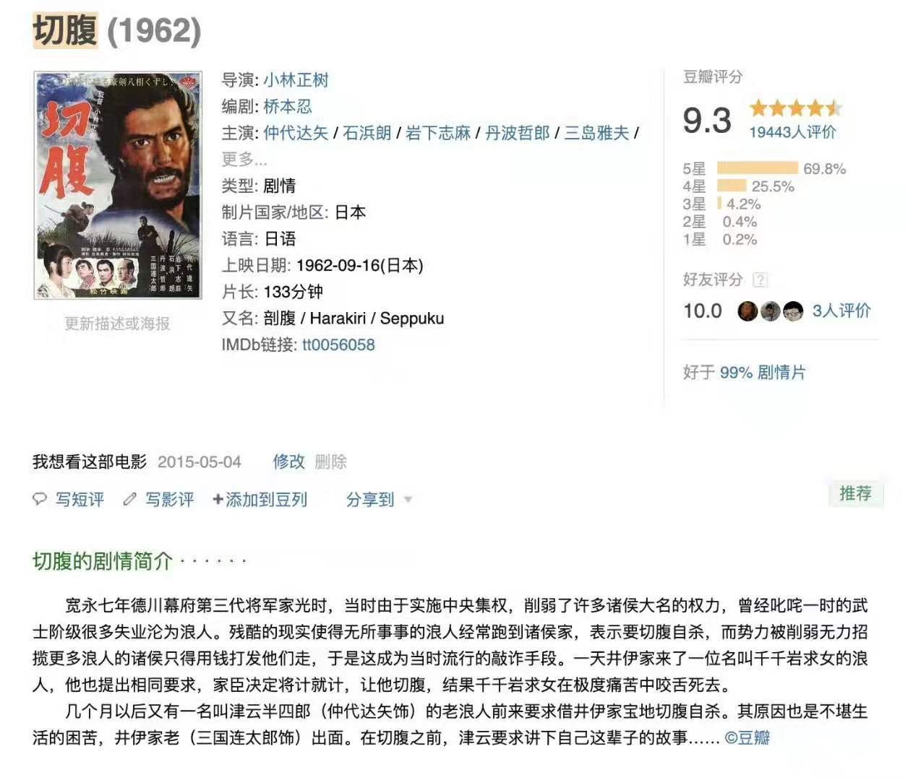
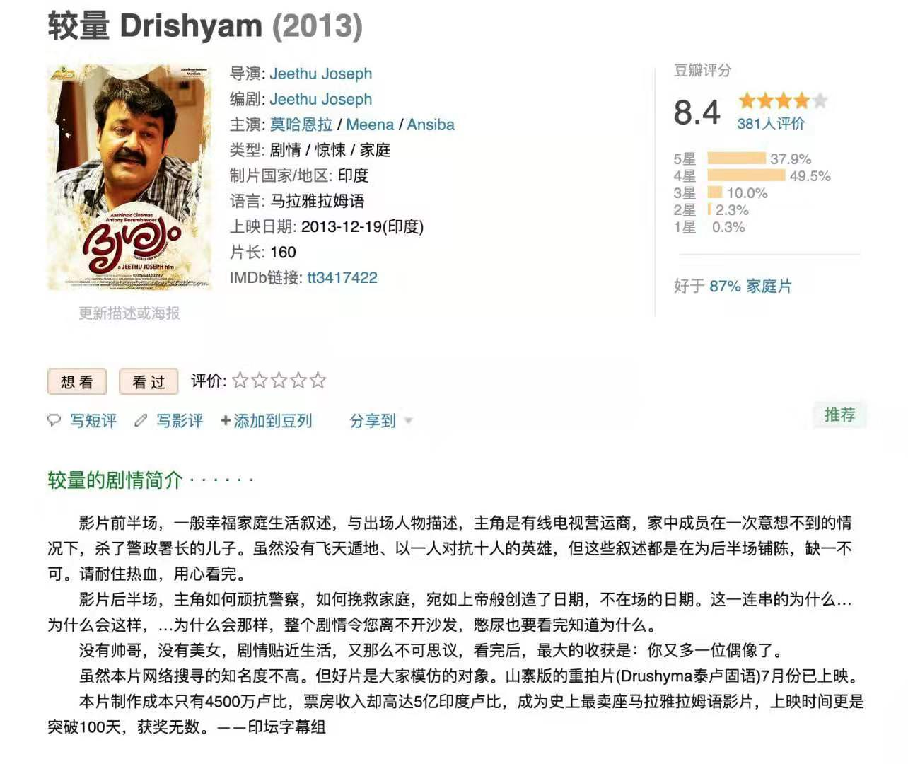
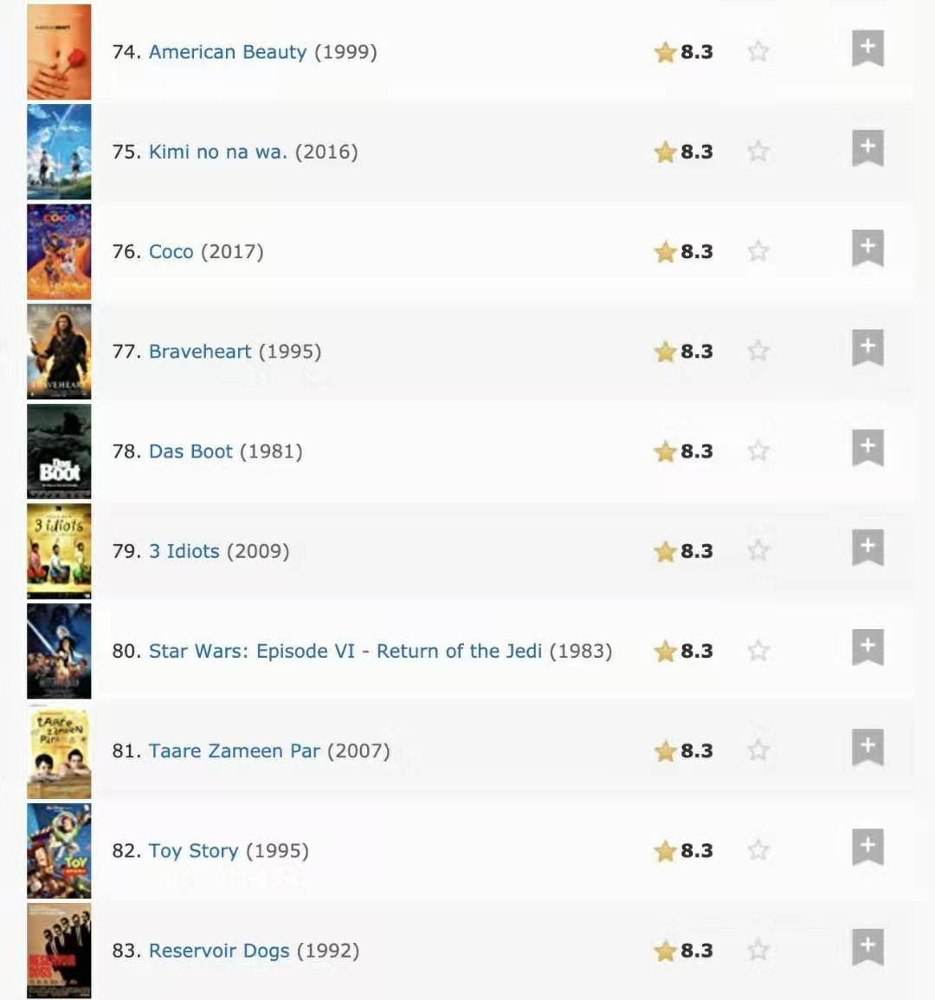

<br>

姊妹篇,[爬取豆瓣电影信息](http://www.dashen.tech/2019/07/13/%E7%88%AC%E5%8F%96%E8%B1%86%E7%93%A3%E7%94%B5%E5%BD%B1%E4%BF%A1%E6%81%AF/)


 ``` IMDb，全称Internet Movie Database，即互联网电影资料库。 不过我还是更喜欢像MySql那样把IM理解为“我”```
 
 <br>

起因是看王兴的一个[专访](https://www.bilibili.com/video/av44231280?p=1)，他表示<美国往事>比<教父>更厉害一点。

都曾看过，但与我直觉有异。`<The Godfather>` 三部曲分别排在豆瓣top250第21，50，151位，`<Once Upon a Time in America>` 则列第73位。

有时候，地域习俗 文化背景 会对同一事物观感与评价有巨大影响。于是想看看国际版“豆瓣电影”`---`IMDb上评分如何。  

经过对其Top250影片分析，果不其然，二者差异十分巨大，两个榜单重合度大概只有1/3
，相当多数在IMDb250的影片，会让国内观众感到生僻`----` 一圈下来，我标注了132部“待看”。

几点结论如下:

### 两份榜单差异巨大
<br>

1.很显然，从国外用户评价看，<教父>前两部占据榜单第二、三名，强于排名第72的<美国往事>。但<教父>第三部没有上榜。

事实上，一个系列能够全部上榜，而不成狗尾续貂真心不易。豆瓣top250中，除去教父，还有此殊荣的只有理查德·林克莱特的“Before”三部曲。其中，问世于1995年的`<Before Sunrise>`(爱在黎明破晓前)位列第110位，9年后续拍的`<Before Sunset>`(爱在日落黄昏时)排名第125，而又过9年后拍摄的`<Before Midnight>`(爱在午夜降临前)“下滑”至第214位。IMDb上该系列同样呈递减趋势，前两部排名第196和237，第三部未入围top250。


### 榜首头名不约而同
<br>

2.两份排名虽迥如云泥，但榜首却是高度一致。也许『教父』和『美国往事』，『罗生门』和『七武士』孰更胜一筹还将见仁见智继续争论，但至于1994年获奥斯卡的『阿甘正传』与那年落败的『肖申克的救赎』，时间已给以最佳裁决。




两者曾你来我往，交替排在豆瓣top250榜首。现今，<阿甘正传>被<霸王别姬>挤下，排名第三。IMDb上更“靠后”排名第12。




如果参考当年，遴选自巴赫，莫扎特，贝多芬及斯特拉文斯基的7首古典音乐，送入太空，作为和地外生命第一次见面交流的“自我介绍”，<阿甘正传>显然远不及<肖申克的救赎>。前者是身残志坚，是努力奋斗，是不气馁不放弃，还有穿插其间看似讨巧的乒乓外交、水门事件等。从时间维度，过后一百年，对这些美国历史的陈仓旧事没多少兴趣;从空间广度，阿甘这样的残障者毕竟只占少数，观众很难联及自身，只觉是在看别人事迹。而肖申克这样的遭遇，却可能保不齐哪天发生于你我，观众更具共情和代入感。

简而言之，阿甘靠“美国梦”征服了奥斯卡评委，肖申克则用“希望”，战胜了岁月。


### IMDb时间跨度更大
<br>

3.入围IMDb top250的作品时间跨度更大:最早可追溯至1921年卓别林的『The Kid』(寻子遇仙记)，另外还有5部20世纪20年代的默片电影上榜，分别是1924年的『福尔摩斯二世』，同样由卓别林主演的上映于1925年的『淘金记』，1926年的『将军号』，1927年的『大都会』，及1928年的『圣女贞德蒙难记』;如图示，最早上榜豆瓣top 250的作品，是喜剧大师拍摄于30年代的『城市之光』和『摩登时代』。




因为算法原因，很难有当年度上映的电影，能登上豆瓣top 250。而IMDb则不然，已有5部2019年影片入选，分别是『小丑』，『寄生虫』，『复仇者联盟4』，『爱尔兰人』，『极速之王』(有个杀马特名字，叫“福特对战法拉利”)。而入围豆瓣的最新作品，是去年上映的『何以为家』，『我不是药神』和『头号玩家』。换言之，IMDb榜流动性更快，更大一些。

另外，IMDb上榜作品时间分布更为均匀，而豆瓣榜单，绝大多数影片是1990年之后拍摄。


### 中外观众口味有别
<br>

4.从其间差异，能明显反应出中外观众电影之外的不同。“外国人”对诺兰，对『星际穿越』，对各种奇幻和外太空探险，对超级英雄，有种狂热的迷恋。而在国内备受赞誉，豆瓣排名第11的文艺片『海上钢琴师』，则在IMDb位列最后一位，行将被挤出榜单。

上榜IMDb top250，而不在豆瓣top 250的作品，在豆瓣也大多评分不差，绝大多数超过8分。但也有两部是不足7分的例外`---` 土耳其电影<强盗>和印度电影<瓦塞浦黑帮>。这或许两国历史高度相干，国内观众难有共鸣可以理解。但作为2007年奥斯卡最佳影片的『无间道风云』，剧情中国观众应当似曾相识，更有两位知名主演，评分竟只有7.2。








另则，『寻梦环游记』在榜，而我认为更佳的<疯狂动物城>未能入围。二者在豆瓣排名第37和22。

同时“发掘”一位不太曾关注的神级老戏骨——[罗伯特·德罗尼](https://movie.douban.com/celebrity/1054445/)。




『两代教父同框! 罗伯特·德尼罗与阿尔·帕西诺』


<br>


### 韩片入围不及豆瓣
<br>

5.一向以“政治尺度大”著称的韩国电影，上榜作品不多，<辩护人>和<熔炉>皆不在列。可能“外国人”对这很难有共鸣。『老男孩』，『小姐』，『杀人回忆』，『寄生虫』，是入围top250的四部作品。其中宋康昊主演两部，是货真价实的“高丽国一级演员”。

### 日本作品上榜更多
<br>

6.相形之下，日本作品入围颇多。因为年代分布更均匀，使以黑泽明为代表的半个多世纪前“黄金时代”的黑白影片，大量上榜top250。除去必定在列的『罗生门』『七武士』，同属黑泽明的『生之欲』『用心棒』，及其后期作品『乱』，小津安二郎的『东京物语』，小林正树的『切腹』，同样榜上有名。



而在豆瓣top250中，与诺兰同样7部作品并列榜首的宫崎骏，则在IMDb榜上稍有逊色:『千与千寻』，『幽灵公主』，『哈尔的移动城堡』，『龙猫』，『风之谷』，『天空之城』。其中『天空之城』在豆瓣排名第36，IMDb排名第249。

除去宫崎骏，高畑勋的『萤火虫之墓』和3年前上映的新海诚『你的名字』，两部动漫电影同样入围。


### 阿米尔·汗 印度国宝当之无愧
<br>

7.作为官方语言为英语的印度，有理由相信其庞大的人口可以很大程度“影响”IMDb。共有『巴萨提的颜色』，『三傻』，『地球上的星星』，『我的个神啊』，『摔跤吧！』，『穆那大哥做医生』，『较量』，『瓦塞浦黑帮』等多部作品入围。其中『较量』即『瞒天误杀记』原版，后者增加预算更换演员重新翻拍。



但这些作品大多排名不高。最靠前的『三傻』，豆瓣排名第12，IMDb第79。这可能也是国情使然，使中国观众在观看时更有同感。




我是在2011年10月，刚刚结束繁重索然的高中，观看了这部少数后来会重新再看的影片 `---` 因实在太有共鸣 `---` 片中“病毒”教授摔下的鸟蛋和说教，与国内绝不在少数的中小学老师和家长的“谆谆教诲”别无二致。在那前后，乔布斯逝世，来自世人如雪片般纷至沓来的缅怀，让高中时代曾将其『Stay hungry，Stay foolish』作为格言的我还是有些惊讶。于是想要找寻这个没上过大学的家伙，究竟对人类有何贡献，也开始思索许些在高中时代没有时间考虑的更深层次问题。

促使我做这期IMDb数据分析的王兴，曾被问到比尔·盖茨是否为其偶像。他说不是，乔布斯对他影响更大一些，主要是审美和品味。去年美团上市，成中国互联网市值仅次于二马的第三大公司，在敲锣前夕，他再次致意乔布斯:是他用iPhone开启了移动互联网，才使包括美团在内的公司有存在的可能。

同样让我印象深刻的，还有主演阿米尔·汗。其上提到的8部电影，有5部是他主演 `---` 印度国宝级演员当之无愧。更令人肃然起敬之处，出身上游社会的他，利用自己巨大影响，以极大魄力拍摄了[<真相访谈>](https://movie.douban.com/subject/10797041/)。"印度良心"必将留名21世纪南亚古国历史。

在『摔跤吧!』之前，我一直以为其戏路和角色塑造较有局限，如陈道明或陈宝国，而不是演啥像啥，如梁家辉，金士杰，张译以及范伟——无论『三傻』还是『我的个神啊』，或是『地球上的星星』<神秘巨星>，以及口碑不佳的<印度暴徒>，多是饰演那种机灵搞怪似的人物。『摔跤吧』一改刻板印象，更用5个月减重54斤的惊人毅力，完美诠释了"敬业"的含义。


### 大陆优秀电影作品 任重道远
<br>

8.华语电影方面，竟无一部大陆作品上榜。中国xx地区上榜两部，分别是排名241的『花样年华』和247的『无间道』。