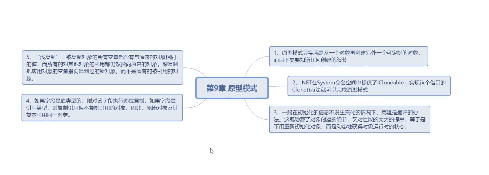

https://refactoringguru.cn/design-patterns

 

### 1.简单工厂模式

 

 

---

 

### 2.策略模式

 

 

---

 

### 3.单一职责原则

 

 

---

 

### 4.开放-封闭原则

 

可以扩展,不可修改

简单工厂模式是不满足开放-封闭原则

 

---

 

### 5.依赖倒转原则

 

 

面向对象设计的标志

针对抽象编程,而不是针对细节编程.

里式替换原则:

 

---

 

### 6.装饰模式

 

 

[装饰器模式 Decorator Pattern](https://www.runoob.com/design-pattern/decorator-pattern.html)

 

---

 

### 7.代理模式

 

 

---

 

### 8.工厂方法模式

 

 

---

 

### 9.原型模式

 

浅拷贝和深拷贝

 

---

 

### 10.模板方法模式

 

 

---

 

### 11.迪米特拉法则(最少知识原则)

 

强调类之间的松耦合

 

---

 

### 12.外观模式

 

 

---

 

### 13.建造者模式

 

比较难以理解

 

---

 

### 14.观察者模式

 

接触耦合

一般通过接口来实现

 

---
 

 

-----

### 15.抽象工厂模式

 

 

---

 

### 16.状态模式

 

 

---

 

### 17.适配器模式

 

 

---

 

### 18.备忘录  模式

 

 

---

 

### 19.组合模式

 

 

---

 

### 20.迭代器模式

 

 

---

 

### 21.单例模式

 

 

---

 

### 22.桥接模式

 

比较复杂

 

---

 

### 23.命令模式

 

 

---

 

### 24.职责链模式

 

 

---

 

### 25.中介者模式

 

 

---

 

### 26.享元模式

 

 

---

 

### 27.解释器模式

 

不太好理解的一个

 

---

 

### 28.访问者模式

 

也是比较难的一个模式

 