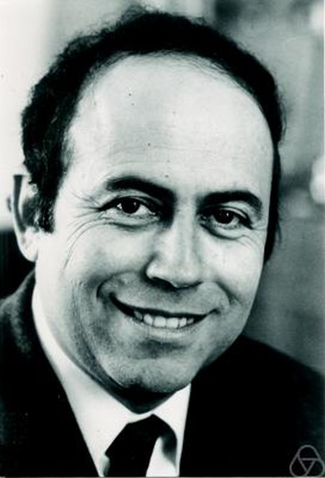
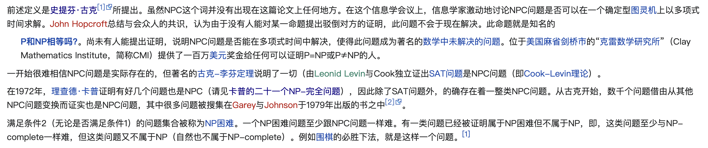
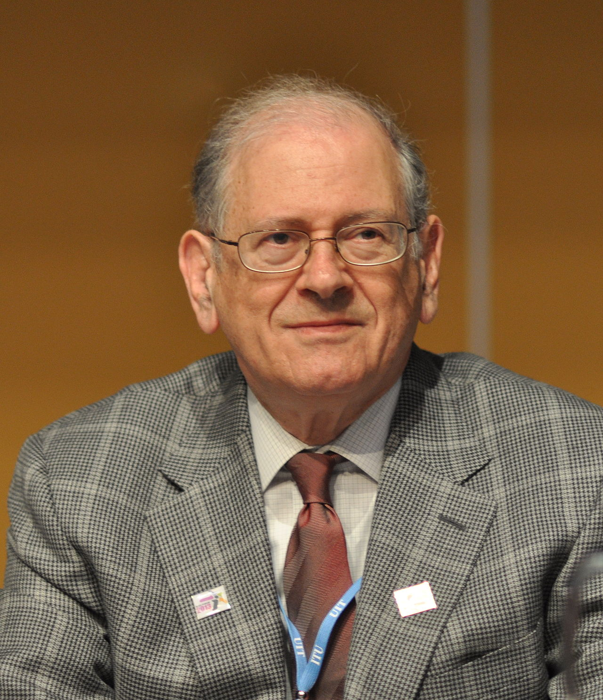
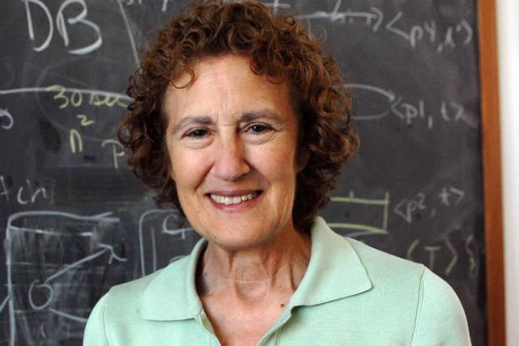
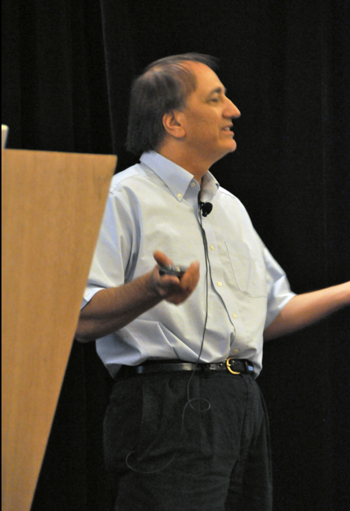

> 任何一个行业中，必定会有这么一到两个让你想想就很兴奋的大师级人物，他们远远地走在前面，背影缥缈而伟岸，让懵懵懂懂的后来者不乏追随的勇气和梦想

<br>


<br>


---


<br>


## Alan Perlis


<br>


<font color="#FF00FF">1966年图灵奖得主

贡献领域: 高级程序设计和编译器构造</font>


<br>

艾伦·佩利,1922年4月1日生于美国宾州匹兹堡,

1990年2月7日去世,终年68岁.


首届图灵奖得主，在*Algol 58* 和*Algol 60* 的形成和修改过程中起到核心和关键作用

<br>


<br>

<font size=1 color="darkgreen">

ALGOL，名称源自算法语言（ALGOrithmic Language）的缩写，指令式编程语言，发展于1950年代中期，对许多其它编程语言产生重大影响。

ALGOL与差不多同时期的FORTRAN、LISP及COBOL并列为四大最有影响力的高阶语言

1960年1月， 艾伦·佩利在巴黎举行的有全世界一流软件专家参加的讨论会上，发表了"算法语言Algol 60报告"，确定了程序设计语言Algol 60。

Algol60语言的第一个编译器由[艾兹赫尔·戴克斯特拉](https://dashen.tech/2020/05/07/%E5%A4%A9%E7%A5%9E%E8%8D%9F%E8%90%83/#Dijkstra)来实现

</font>


<br>

<font size=1 color=orange>

巴科斯范式（Backus Normal Form，BNF），又称`巴科斯-诺尔范式`（Backus-Naur Form， BNF，也译为巴科斯-瑙尔范式、巴克斯-诺尔范式），是一种用于表示上下文无关文法的语言，上下文无关文法描述了一类形式语言。它是由[约翰·巴科斯（John Backus）](https://dashen.tech/2020/05/07/%E5%A4%A9%E7%A5%9E%E8%8D%9F%E8%90%83/#John-Backus)和[彼得·诺尔（Peter Naur）](https://dashen.tech/2020/05/07/%E5%A4%A9%E7%A5%9E%E8%8D%9F%E8%90%83/#Peter-Naur)首先引入的用来描述计算机语言语法的符号集。


约翰·巴科斯首次在ALGOL 58中实现巴科斯范式。彼得·诺尔在ALGOL 60之中，进一步发展它的概念并将它的符号加以简化，称其为巴科斯范式（Backus Normal Form）。但[高德纳](https://dashen.tech/2020/05/07/%E5%A4%A9%E7%A5%9E%E8%8D%9F%E8%90%83/#Donald-Knuth)主张应称为巴科斯-诺尔范式（Backus–Naur Form），因为它不算是一种正规形式（Normal form）

一种典型的元语言

</font>

<br>

---


<br>


## Maurice Wilkes


<br>


<font color="#FF00FF">1967年图灵奖得主

贡献领域: 第一个实际存储程序的电子计算机 </font>


<br>

莫里斯·威尔克斯，1913年6月26日生于英国斯塔福德郡

2010年11月29日去世，终年97岁.

就读于剑桥大学圣约翰学院，之后进入卡文迪许实验室，并于1936年完成其物理学博士学位。


EDSAC（Electronic Delay Storage Auto-matic Calculator），延迟存储电子自动计算器，世界上第一台实际运行的存储程序式电子计算。 受EDVAC启发(Electronic Discrete Variable Automatic Computer,离散变量自动电子计算机,是一台美国早期电子计算机。与它的前任ENIAC不同，EDVAC采用二进制，且是一台冯·诺伊曼结构的计算机)

[First Draft of a Report on the EDVAC by EngrToday](https://www.bilibili.com/video/BV1iK411A7ih)

<font size=1 color="green">

ENIAC,电子数值积分计算机（Electronic Numerical Integrator And Computer）,简称为埃尼阿克,是世界上第一台通用计算机。它是图灵完全的电子计算机，能够重新编程，解决各种计算问题

</font>


<br>


和历史上的 牛顿，戴维，约瑟夫·汤姆森，威廉·汤姆森(开尔文勋爵)，弗莱明， 及后来的 蒂姆·伯纳斯-李一样，获封爵士


<br>


---


<br>


## Richard Hamming


<br>


汉明码（利用汉明矩阵），汉明窗，汉明数，球面堆积（或汉明界）和汉明距离..

<font color="#FF00FF">1968年图灵奖得主

贡献领域: 数值方法，自动编码系统，错误检测和纠错码 </font>


<br>

理查德·汉明，1915年2月11日生于 伊利诺伊州芝加哥市， 1998年1月7日逝世于加州蒙特雷


美国数学家，博士论文为《一些线性微分方程边界值理论上的问题》。主要贡献在计算机科学


美国电脑协会（ACM）的创立人之一，曾任该组织的主席


<br>


参见 [海明校验码](https://dashen.tech/2021/02/15/%E6%B5%B7%E6%98%8E%E6%A0%A1%E9%AA%8C%E7%A0%81/)


<br>

<font size=1 color=green>

`IEEE 理查德·卫斯里·汉明奖章`（IEEE Richard W. Hamming Medal）每年颁发，最多颁给三个人，以表彰在资讯科学、资讯系统和资讯技术方面取得的杰出成就。 获奖者可获得一面金牌奖章、铜制复制品、获奖证书和一笔奖金。

该奖项由电机电子工程师学会（IEEE）于1986年设立，并由高通公司赞助。以 理查·卫斯里·汉明的名字来命名以纪念他在计算机科学和电信产生的深远影响。 他的贡献包括发明汉明码和纠错码等, 也是该奖首位得主(1988年)

</font>

[汉明问题](https://www.lesswrong.com/posts/P5k3PGzebd5yYrYqd/the-hamming-question)


[Erasure-Code: 工作原理, 数学解释, 实践和分析](https://drmingdrmer.github.io/tech/distributed/2017/02/01/ec.html)


在Linux，Go等项目中，多处可见其名


<br>


---


<br>


## Marvin Minsky

<br>

"人工智能之父"

<font color="#FF00FF">1969年图灵奖得主

贡献领域: 人工智能</font>


<br>

> 计算机逻辑奠基者艾伦·麦席森·图灵、提出“人工智能”概念的约翰·麦卡锡、首个创建Snare的马文·明斯、将科技与教育融合的西摩尔·帕普特四人常常被称为人工智能之父


马文·明斯基(1927年8月9日－2016年1月24日)，生于美国纽约犹太人家庭


与`西摩尔·派普特`共同发展了第一个以Logo语言建构的机器人，命名为海龟（Turtle）

1951年，设计并建构了第一部能自我学习的人工神经网络机器，SNARC

1952年，发明会自行关闭电源的无用机器(Useless Machine)

1956年，与[约翰·麦卡锡]()组织了[达特茅斯会议]()，在这场会议中，人工智能的概念被提出，在之后形成了一个新的学门。

在麻省理工学院，与约翰·麦卡锡共同创立了人工智能研究室（MIT计算机科学与人工智能实验室的前身）

奠定了人工神经网络的研究基础


<br>

---


<br>


## John McCarthy


<br>

"人工智能之父"

<font color="#FF00FF">1971年图灵奖得主

贡献领域: Lisp语言, 人工智能</font>


<br>

约翰·麦卡锡,1927年9月4日生于美国波士顿,

2011年10月24日去世,终年84岁.


<br>

[人工智能先驱人物篇之约翰·麦卡锡](https://www.jiqizhixin.com/articles/2019-02-11)


<br>

---


<br>


## Dijkstra


<br>

"计算机领域的欧拉"(爽哥评注)

<font color="#FF00FF">1972年图灵奖得主

贡献领域: [Dijkstra算法](https://dashen.tech/2020/11/14/Dijkstra%E7%AE%97%E6%B3%95/),银行家算法,[信号量,PV原语](https://dashen.tech/2018/09/01/PV%E6%93%8D%E4%BD%9C/)</font>


<br>

中文一般译作"迪杰斯特拉",1930年出生于鹿特丹,大学就读于莱顿大学,研究理论物理学. 但他很快就发现自己的兴趣是计算机科学.

2002年在荷兰家中逝世,终年72岁.


<br>

---


<br>


## Donald Knuth

<br>

"程序设计引路人"

<font color="#FF00FF">1974年图灵奖得主

贡献领域: 算法分析、程序设计语言的设计、程序设计</font>


<br>


**36岁获奖, 至今仍保持着图灵奖最年轻获奖者的纪录.**

*KMP算法中的"K"*

<br>

> 是Knuth独特的审美感决定了他兴趣广泛、富有多方面造诣的特点。Knuth传奇般的生产力也是源于这一点。<br>
对于Knuth来说，衡量一个计算机程序是否完整的标准不只在于它是否可以执行，他觉得一个计算机程序应该是雅致的、甚至可以说是美的。计算机程序设计应该是一门艺术，一个算法应该像一段音乐，而一个好的程序应该如一部文学作品一般。

估计国内的老板们不会喜欢...


尝试使用过LaTeX，且写过[一篇博客](http://www.dashen.tech/2016/03/21/LaTeX%E4%BD%BF%E7%94%A8%E5%B0%8F%E8%AE%B0/)，但在初次使用时还不知道TeX竟是 Donald 牛刀小作。

TeX的版本号不是惯常所见的1.0，1.1…，2.0，而是用圆周率π，每个版本向下一位。现在版本号为3.1415926。

大师还有一项“创举”，每发现一个bug，就“奖励”2.56美元，第二个5.12美元，第三个10.24美元，以此类推——考虑到“象棋发明”的那个讲述指数爆炸型增长的故事，这无疑需要强大的勇气与自信。

但事实是，他并没有为此付出太多美刀。一是错误极少趋于完美;二则如同当下将持有伯克希尔哈撒韦公司股票作为财富象征，许多更“高级”的人，将持有高德纳签名的支票视若珍宝，作为智力超群的佐证。时有说法:什么是聪明？找出Knuth的错误;什么是愚蠢？去兑换那张两块五毛六的支票。

<br>

甚至设立了高德纳奖，首届得主是姚期智

(在计算机领域，名字可以作为奖项名称的，还有图灵奖/冯诺依曼奖/汉明奖)


**参考:**

[计算机大师-Donald Knuth（高德纳） 的传奇](https://www.cnblogs.com/blfbuaa/p/6801446.htm)

关于大师的著作,<计算机程序设计艺术>,参见: [那些有简称的计算机书籍](https://www.douban.com/doulist/127036578/)


<br>

---


<br>


## Michael Rabin

<br>


<font color="#FF00FF">1976年图灵奖得主

贡献领域: 非确定性自动机, 拉宾-卡普算法</font>


<br>

中文一般译作"迈克尔·拉宾",1931年出生于德国布雷斯劳（二战后成为波兰弗罗茨瓦夫). 以色列计算机科学家,犹太人.

1956年获普林斯顿大学博士学位. 1959年，拉宾和[达纳·斯科特]()共同发表了“有限自动机与其判定性问题”（Finite Automata and Their Decision Problems）的论文,提出非确定自动机的观点.他们也因此获得了1976年的图灵奖，并做“计算机复杂性”（Complexity of Computations）的演讲


- 1969年, 证明 N successors的二阶逻辑是可判定的.证明的关键部分暗示了奇偶游戏的确定性

- 1975年, 发明[米勒-拉宾检验](). 这是一个相当快速的随机化算法（有较小的可能性错误）,用于判断一个大数是否是素数. 快速素数检验是目前大部分公钥密码体系的关键.

- 1979年, 发明第一个非对称密码系统`---` [拉宾密码系统](),它的安全性被证明和整数因式分解的复杂度相同.

- 1981年, 提出不经意传输技术

- 1987年, 和[理查德·卡普]()提出了著名的字符串搜索算法`——` [拉宾-卡普算法]()


1976年获奖后,依然成果不断...




<br>


---


<br>


## Dana Scott

<br>


<font color="#FF00FF">1976年图灵奖得主

贡献领域: 非确定性自动机</font>


<br>

中文一般译作"达纳·斯科特",1932年出生于美国加利福尼亚州.

图灵奖的引文是：“因他们的合著论文“有限自动机与其判定性问题”。论文中引入了非确定自动机的概念，被证明是（计算理论科学研究中的）一个非常重要的概念。拉宾和斯科特的这篇经典论文成为了这个领域后续研究的源泉


<br>

---

<br>


## John Backus

<br>


<font color="#FF00FF">1977年图灵奖得主

贡献领域: 高级编程系统，程序设计语言规范的形式化定义</font>

FORTRAN 巴科斯范式 函数级编程

<br>

中文一般译作"约翰·巴科斯",1924年12月3日出生于美国宾州费城，青少年时期平时不爱读书，勉强毕业，没什么过人之处。

后对数学产生极大兴趣,进入IBM工作。

获图灵奖时发表“程序设计能从冯诺伊曼形式中解脱出来吗？函数式风格及其程序的代数”（Can Programming be Liberated from the von Neumann Style? A Functional Style and Its Algebra of Programs）演说，提出了叫做FP的函数级编程语言(这篇演说有时被看作是他为发明了Fortran而致歉)

2007年3月17日在美国俄勒冈州的家中去世，享年82岁


<font size=1 color="grey">


Fortran，音译为"福传"，源自于“公式翻译”（Formula Translation）的缩写，是一种编程语言。1957年由IBM开发出，是世界上第一个被正式采用并流传至今的高级编程语言。

是为满足数值计算的需求而发展出，1953年12月，IBM工程师约翰·巴科斯（J. Backus）因深深体会编写程序很困难，而写了一份备忘录给董事长斯伯特·赫德（Cuthbert Hurd），建议为IBM704系统设计全新的电脑语言以提升开发效率。当时IBM公司的顾问冯·诺伊曼强烈反对，因为他认为不切实际而且根本不必要。但赫德批准了这项计划。

西屋电气公司成为FORTRAN的第一个商业用户

</font>


[【冷知识】基于ABNF重新学习HTTP报文格式](https://juejin.cn/post/6989059702755704862#heading-1)


[BNF rules of JAVA](https://www.google.com/search?q=bnf+java&newwindow=1&sxsrf=AOaemvIx4A3i3iRN8tBKHSIRbjOca1hF3A%3A1633956989601&ei=fTRkYe__I82Q4-EPr5aq8A0&ved=0ahUKEwivssWPtMLzAhVNyDgGHS-LCt4Q4dUDCA4&uact=5&oq=bnf+java&gs_lcp=Cgdnd3Mtd2l6EAMyBAgjECcyBQgAEIAEMgcIABCABBAMMgcIABCABBAMMgcIABCABBAMMgcIABCABBAMMgcIABCABBAMMgcIABCABBAMMgcIABCABBAMMgQIABBDOgcIABCwAxAeOgkIABCwAxAIEB5KBAhBGAFQpO4QWOL3EGCR-hBoAnAAeACAAYoEiAHWD5IBBTQtMi4ymAEAoAEByAEIwAEB&sclient=gws-wiz)


[The syntax is specified using Extended Backus-Naur Form (EBNF):](https://golang.org/ref/spec)

<br>

---

<br>


## Robert W. Floyd

<br>


<font color="#FF00FF">1978年图灵奖得主

贡献领域: [Floyd算法](https://zh.wikipedia.org/wiki/Floyd-Warshall%E7%AE%97%E6%B3%95), 堆结构及[堆排序](https://dashen.tech/2018/10/25/%E5%A0%86%E6%8E%92%E5%BA%8F/) </font>


<br>

弗洛伊德（1936年6月8日－2001年9月25日）,美国计算机科学家, 出生于美国纽约,14岁即完成高中学业. 1953年从芝加哥大学获得文学学士学位，年仅17岁，并于1958年在物理学获得了第二个学士学位

与高德纳工作很密切,是其著作《计算机程序设计艺术》的主要评审,并在书中被多次提及.


最初文学专业毕业，找不到合适工作，在西屋电气做基础到几乎对候选人没什么要求的“计算机操作员”工作(类似打字机打字员，并不需要懂得机器怎么运作，在外面负责敲两下就可以)，决心搞清背后运作原理。

开发了世界上最早的Algol 60编译器之一。堆排序算法和弗洛伊德算法。发表“如何确定程序的意义（Assigning Meanings to Programs）”的学术论文，在当时的计算机界引起巨大轰动。该论文后来被公认为继麦卡锡1963年提出的“以递归函数作为程序模型的方法”后，最为重大的一项进展。

42岁获图灵奖

> 证明了整个计算机界对他的认可，证明了这个来自纽约的文科生，因为热爱计算机领域，即使通过自学，也能达成影响世界的伟大成就


[从14岁上大学的文科生，到拿图灵奖的计算机教授，写在罗伯特·弗洛伊德85周年诞辰](https://www.163.com/dy/article/GCIVB7BK0538B1ZX.html)

<br>

---


<br>


## [Kenneth Iverson](https://baike.baidu.com/item/%E8%82%AF%E5%B0%BC%E6%96%AF%C2%B7%E8%89%BE%E4%BD%9B%E6%A3%AE)


<br>


<font color="#FF00FF">1979年图灵奖得主

贡献领域: 程序设计语言和数学符号，互动系统的设计，APL语言之父，程序设计语言的理论与实践</font>


<br>

中文一般译作"肯尼斯·艾弗森"（1920年12月17日-2004年10月19日）

APL语言之父，后来还设计了J语言


<font size=1 color="darkgreen">

[APL](https://baike.baidu.com/item/APL%E8%AF%AD%E8%A8%80%E6%A0%87%E5%87%86/22105649?fromtitle=APL&fromid=17767419#viewPageContent) 是 A Programming Language 或 Array Processing Language 的缩写。肯尼斯·艾佛森在1962年设计这个语言时他正在哈佛大学工作, 是一种表达能力很强的会话语言。应用范围包括数学统计、事务经营、信息检索、报表生成、财务预算等。也可用于模拟计划管理、图形处理、正文编辑、计算机辅助教学等方面。

APL的特点是，语法规则简单，运算符丰富，表达式简练，并包含多种构造和处理数据的运算符。它在数据加工和矩阵计算上特别有效，不过程序员需具有较高的数学素养

</font>


<br>


---


<br>


## Tony Hoare


<br>

"计算机领域的爵士"

<font color="#FF00FF">1980年图灵奖得主

贡献领域: [快速排序](https://dashen.tech/2015/03/22/%E5%BF%AB%E9%80%9F%E6%8E%92%E5%BA%8F/),CSP理论,哲学家就餐问题</font>


<br>


1934年出生于英属锡兰(今斯里兰卡)，1959年博士毕业于俄罗斯莫斯科国立大学


<br>


> 1960年，霍尔进入艾略特兄弟（Elliott Brothers Ltd) 伦敦公司，成为一名程序员。他接到的第一个任务，就是为Elliott 803计算机编写一个库程序，实现新发明出来的`Shell排序`算法。在此过程中，霍尔对不断提升代码的效率着了迷。他不仅很好地完成了任务，还发明了一种新算法，比Shell还快，而且不会多耗费太多空间。这就是后来闻名于世的快速排序算法Quicksort。值得一提的是，发明该算法时他只有26岁。<br>
随后，霍尔又接到了新任务——在公司新机型Elliott 503上实现Algol 60语言。Elliott Algol的开发非常顺利，大获成功，霍尔本人也从此受到国际学术界的重视。当然，对他来说，另一件事情更为重要，他和项目中另一位当时比自己更专业的女程序员Jill Pym相识相知，并最后结婚。

<br>


> 1971年，Dijkstra提出了一个同步问题，即假设有五台计算机都试图访问五份共享的磁带驱动器。稍后，这个问题被Tony Hoare重新表述为哲学家就餐问题。这个问题可以用来解释死锁和资源耗尽。

<br>


希尔排序于1959年被D.L.Shell提出,第二年Tony Hoare就提出了更优的快速排序..

[排序算法汇总](https://dashen.tech/2019/03/26/%E6%8E%92%E5%BA%8F%E7%AE%97%E6%B3%95%E6%B1%87%E6%80%BB/)

[快速排序](https://dashen.tech/2015/03/22/%E5%BF%AB%E9%80%9F%E6%8E%92%E5%BA%8F/)

[读「Go语言并发之道」](https://dashen.tech/2020/03/17/%E8%AF%BB%E3%80%8CGo%E8%AF%AD%E8%A8%80%E5%B9%B6%E5%8F%91%E4%B9%8B%E9%81%93%E3%80%8D/)


<br>


<br>

[过早优化的谬误](https://www.yuque.com/ruanyf/weekly/issue-97)

[改变世界的十位算法大师](http://imgtec.eetrend.com/d6-imgtec/blog/2018-08/17035.html)


<br>


---

<br>


## Edgar Frank  Codd


<br>


"关系型数据库之父"

<font color="#FF00FF">1981年图灵奖得主

贡献领域: 数据库系统</font>


<br>

埃德加·弗兰克·科德，(1923年8月23-2003年4月18)

生于英格兰多塞特郡波特兰,牛津埃克塞特学院学习数学与化学, 而后作为英国皇家空军飞行员参加二次世界大战

1948年，来到纽约加入IBM，成为一名数学程序员。之后到密歇根大学取得计算机科学博士学位


在IBM工作期间，首创了关系模型理论。为关系型数据库理论做出了奠基性的贡献。


<br>


<font size=1 color="grey">

**科德十二定律（Codd's 12 rules）**

使数据库管理系统关系化需满足的十三条（从0至12）准则,又称为“黄金十二定律”

<br>


**sql**


1972年，IBM以科德所在的加州圣何塞研究院为中心，想要开发一套关系数据库的原型产品。

加入该项目的有两个年轻的博士生，张伯伦和博伊斯。他们决定把科德关系模型中的数学部分隐藏起来，将关系称为表，把复杂的数学符号替换成简单的英语单词 SELECT FROM WHERE。本来想把这门语言叫做 SEQUEL(Structured English Query Language，结构化英语查询语言）。由于*SEQUEL*已是一家英国公司商标，二人将其改名为更简单，更容易记忆的SQL。

不多久后博伊斯因脑瘤去世，年仅27岁。

[27岁发明SQL以后，上帝把他带走了 ](https://www.sohu.com/a/448543330_468731)

<br>

**BCNF范式**

博伊斯还和科德合作，建立了一个数据库中必讲的概念：BCNF范式


[数据库第一二三范式到底在说什么？](https://zhuanlan.zhihu.com/p/20028672)

[数据库设计三大范式](https://dashen.tech/2017/06/30/%E6%95%B0%E6%8D%AE%E5%BA%93%E8%AE%BE%E8%AE%A1%E4%B8%89%E5%A4%A7%E8%8C%83%E5%BC%8F/)


</font>


Codd发表在「ACM通讯」上的关系型数据理论的学术论文启发了Larry Ellison，他1979年创建`Relational Software Inc`（简称RSI，1983年更名为Oracle Corporation)

<br>

SQL数据库软件的历史沿革:


[​1992年IT近代史 ｜ 改变世界的25人（四）—— 数据库软件之父](https://mp.weixin.qq.com/s/iHvH1jwt9-BPrfAIJB1Etw)

<br>

1993 年，70岁的Codd 认为 OLTP（联机事务处理）不足以满足用户的需要，提出了多维数据库和多维分析的概念，即OLAP（联机分析处理）

[计算机先驱诞生日；万维网面世 30 周年|历史上的今天](https://mp.weixin.qq.com/s/9wklqWU65NyZQxIplhh_Mg)


[从空军机长到大厂程序员，关系数据库之父传奇](https://mp.weixin.qq.com/s/G1_oBKd0kejRFYITM9IMNw)


<br>

---


<br>


## Stephen Arthur Cook


<br>


<font color="#FF00FF">1982年图灵奖得主

贡献领域: 计算复杂度理论,NP完全性理论</font>


<br>

斯蒂芬·亚瑟·库克，1939年12月14日生于纽约州布法罗，1961年从*University of Michigan*获得学士学位，1962年和1966年从*哈佛大学*获硕士与博士学位。

1966-1970年，在加州伯克利担任助理教授。

1970年，加盟多伦多大学并工作直到现在。


NP完全性理论的奠基人，1971年发表Cook定理，奠定了NP完全理论的基础而获1982年图灵奖。

但其论文只证明了命题演算的可满足行问题是NP完全的，没有继续深入证明下去。

但在此启发下，卡普在第二年就证明了21个有关组合优化的NP完全问题，从而加强发展了NP完全性理论。




Cook是对计算复杂性理论有突出贡献的计算机科学家之一(1971年 Cook 和 Leonid Levin 相对独立的提出了P/NP问题)


**计算复杂度理论**和**编译理论**，是诞生图灵奖得主最多的两个领域

<br>


[Stephen A. Cook--多伦多大学个人页](http://www.cs.toronto.edu/~sacook/)


<br>

---

<br>


## Ken & Dmr

<br>

<font color="#FF00FF">1983年图灵奖得主

贡献领域: UNIX操作系统和C语言</font>

<br>


<br>


<br>

---

**[Write in C](https://www.electro-tech-online.com/threads/write-in-c-let-it-be.156653/#post-1353006)**

<br>


```go
WRITE IN C ('LET IT BE')

When I find my code in tons of trouble,
Friends and colleagues come to me,
Speaking words of wisdom:
"Write in C."
As the deadline fast approaches,
And bugs are all that I can see,
Somewhere, someone whispers:
"Write in C."
Write in C, Write in C,
Write in C, oh, Write in C.
LOGO's dead and buried,
Write in C.
I used to write a lot of FORTRAN,
For science it worked flawlessly.
Try using it for graphics!
Write in C.
If you've just spent nearly 30 hours,
Debugging some assembly,
Soon you will be glad to
Write in C.
Write in C, Write in C,
Write in C, yeah, Write in C.
BASIC's not the answer.
Write in C.
Write in C, Write in C
Write in C, oh, Write in C.
Pascal won't quite cut it.
Write in C.
```


<br>


---


<br>


## Niklaus Wirth

<br>


"Pascal语言之父"

<font color="#FF00FF">1984年图灵奖得主

贡献领域: 程序设计语言设计、程序设计</font>


<br>

中文一般译作"尼克劳斯·维尔特",1934年出生于瑞士

好几种编程语言的主设计师：

- Algol W (基于与[东尼·霍尔](https://dashen.tech/2020/05/07/%E5%A4%A9%E7%A5%9E%E8%8D%9F%E8%90%83/#Tony-Hoare)共同提出的草案而设计)

- Modula,Modula-2

- Pascal

- Oberon

<br>

> 尼克劳斯·维尔特 的姓名曾以不准确的英文读法，被译为“尼古拉斯·沃斯”。欧洲人通常都将他的名字读得正确，读作“Nih-klaus Virt”；但美国人通常读成“Nickel's Worth”近似的音。于是有人便开玩笑说，欧洲人用**传址调用(Call by Address)**叫他，美国人用**传值调用(Call by Value)**叫他（“传值调用”英文双关“按照价值称呼”，而“Nickel's Worth”中文意为“价值一分钱”）


*"软件变慢的速度永远快过硬件变快的速度"*

<br>


---


<br>


## Richard Karp

<br>


<font color="#FF00FF">1985年图灵奖得主

贡献领域: 算法理论(尤其是[NP-完全性理论](https://zh.wikipedia.org/wiki/NP%E5%AE%8C%E5%85%A8)), 拉宾-卡普算法</font>


<br>

中文一般译作"理查德·卡普",1935年出生于波士顿


1955年先获得哈佛大学文学学士学位,第二年又获得理科硕士学位.之后进入哈佛大学的计算机实验室攻读博士.毕业后进入IBM.


主要研究领域：路径问题、背包问题、覆盖问题、匹配问题、分区问题、调度问题，并取得了许多成果.

这些问题有一个共同的特点:即如果图上增加一个节点,计算机就会爆炸.

在解决“旅行推销商”问题时,提出 **分支限界法**, 是一种构造性的探索法,可在整个允许的解空间中进行最优搜索.(该方法的要点是：对解集合反复进行分支,每次分支时,都对所得的子集计算最优解的界. 如果对某个子集求得的界不优于已知的允许解,则抛弃此子集不再进行分支;否则继续分支以探索更好的解,直到所得到的子集仅含有一个解为止)


<br>


[卡普的二十一个NP-完全问题](https://zh.wikipedia.org/wiki/%E5%8D%A1%E6%99%AE%E7%9A%84%E4%BA%8C%E5%8D%81%E4%B8%80%E5%80%8BNP-%E5%AE%8C%E5%85%A8%E5%95%8F%E9%A1%8C)

<br>


---

<br>

## [John Edward Hopcroft](https://zh.wikipedia.org/wiki/%E7%B4%84%E7%BF%B0%C2%B7%E9%9C%8D%E6%99%AE%E5%85%8B%E6%B4%9B%E5%A4%AB%E7%89%B9) & [Robert Endre Tarjan](https://zh.wikipedia.org/wiki/%E7%BE%85%E4%BC%AF%E7%89%B9%C2%B7%E5%A1%94%E6%8F%9A)

<br>


<font color="#FF00FF">1986年图灵奖得主

贡献领域: 算法和数据结构的设计与分析，如 深度优先搜索算法</font>

<br>


中文一般译作"约翰·霍普克罗夫特","罗伯特·塔扬"。二人发明用于遍历或搜索树或图的[深度优先搜索算法](https://zh.wikipedia.org/wiki/%E6%B7%B1%E5%BA%A6%E4%BC%98%E5%85%88%E6%90%9C%E7%B4%A2)（Depth-First-Search，DFS）。

Hopcroft-Tarjan平面嵌入算法是第一个线性时间平面算法


<br>


约翰·霍普克罗夫特,1939年10月7日生于西雅图,1961年在西雅图大学获电子工程学士学位,1962、1964年在斯坦福大学分别获电子工程硕士和博士学位。

目前在国内多所高校任顾问等


同时也与2020年图灵奖得主[Alfred Aho]()及[Jeffrey David Ullman]()合著大量计算机科学领域的参考书，包括算法、数据结构以及计算机科学基础


> 霍普克罗夫特“教”出了两位图灵奖得主：1986年与他同获图灵奖的罗伯特·塔扬，是其在斯坦福大学学术休假期间指导的博士生；2020年图灵奖得主、“龙书”（编译原理课程的经典教材）作者之一阿尔弗雷德·阿霍则是他在普林斯顿大学任教期间指导的第一位博士生。


获图灵奖的师生，还有这样几对:

- 一门三杰：约翰·麦卡锡及罗杰·瑞迪（Raj Reddy），芭芭拉·丽兹科（Barbara Liskov）

- 1975年获图灵奖的赫伯特·西蒙（Herbert Alexander Simon）和艾伦·纽厄尔（Allen Newell）（前者还是诺贝尔经济奖得主）

- 1986年图灵奖得主约翰·霍普克罗夫特（John Hopcroft）和罗伯特·塔扬（Robert E. Tarjan）

- 2007年获奖的爱德蒙·克拉克（Edmund M. Clarke）和艾伦·艾默生（Allen Emerson）（前者于2020年因新冠肺炎去世）

更多参见

[图灵的遗产和后继者们的责任](https://mp.weixin.qq.com/s/QDyJNBFFmBgZW_F0-1eUng)


<br>


罗伯特·塔扬，1948年4月30日生于加州波莫纳。


Tarjan也开创了重要的数据结构如：斐波纳契堆和splay树（splay发明者还有Daniel Sleator）

<font size=1 color="grey">

Splay Tree即**伸展树**， 是一种能够自我平衡的二叉查找树，由丹尼尔·斯立特（Daniel Sleator）和罗伯特·塔扬在1985年发明

更多参见 [常见的树]()

*某项算法的提出者，某个数据结构的创造者*

</font>

另外他是第一个证明了计算反阿克曼函数的乐观时间复杂度的科学家


<br>


[图灵奖得主约翰•霍普克罗夫特：中国高校过于看重国际声望，应更关注本科教学质量](https://www.bilibili.com/video/BV1GF411a7yB)

[上海交通大学约翰·霍普克罗夫特计算机科学中心](https://jhc.sjtu.edu.cn/)

[约翰·霍普克罗夫特 | 图灵奖获得者 追逐人生的下半场：人类教育](https://mp.weixin.qq.com/s/gD7Y6J_xSxb8k4vD12DMIg)


<br>


---

<br>


## John Cocke


<br>

"RISC架构之父"

<font color="#FF00FF">1987年图灵奖得主

贡献领域: 编译理论,大型系统的体系结构,精简指令集（RISC）计算机的开发,CYK算法</font>


<br>

约翰·科克, 1925年5月30日生于美国北卡罗来纳州夏洛特,

2002年7月16日去世,终年79岁.


<br>

[IBM-RISC Architecture](https://www.ibm.com/ibm/history/ibm100/us/en/icons/risc/)

[A.M. TURING AWARD WINNERS](https://amturing.acm.org/photo/cocke_2083115.cfm)

[Transcript](http://www.iment.com/maida/tv/computer/johncocketranscript.htm)

<br>


---

<br>

## Ivan Edward Sutherland

<br>

"计算机图形学之父", "虚拟现实之父"

<font color="#FF00FF">1988年图灵奖得主

贡献领域: 计算机图形学</font>


<br>

伊凡·爱德华·苏泽兰（1938年5月16日－），生于生于美国内布拉斯加州。于卡内基技术学院（今卡内基梅隆大学）取得学士学位，于加州理工学院取得硕士。1963年，于麻省理工学院取得计算机工程博士学位。

> 在博士论文中设计了一个叫Sketchpad的程序，用户可以利用当时刚被发明出来的光电笔在屏幕上实时绘图。Sketchpad在许多方面都具有开创性的地位,被认为是现代计算机辅助设计（CAD）和图形用户界面（GUI）的鼻祖，为了管理图形提出了面向对象编程的概念


图片来自 [中国的高校计算机教育存在哪些问题？](https://www.zhihu.com/question/265513614/answer/310127634)

<br>


1965年在一篇名为<终极的显示>的论文中首次提出虚拟现实系统的基本思想.1968年发明了第一款VR头盔——“达摩克利斯之剑”,被称为 **虚拟现实之父**

(后来Jaron Lanier的VPL Research公司是第一家将VR设备推向民用市场的公司，因此也被称为”虚拟现实之父“)


<br>

**参考:**

[VR凭什么能火爆全球？诞生了85年，它究竟经历了什么...](https://mp.weixin.qq.com/s/InX2aMlZ5XgyxY1XYqhXdg)

[论有趣，你不得不服这几个严肃的科学家](https://mp.weixin.qq.com/s/l-qLmvAhIuBLw6PHLAcPQg)


[改变世界的先驱，是他在50年前真正定义了计算机图形学和人机共生关系](https://mp.weixin.qq.com/s/A5mqnzzZZbB0QT4dD3LwwA)
<br>

[“终极显示”与“快乐人生”](https://mp.weixin.qq.com/s/VTsL7tQHcfNfB0JXuuxJWQ)

<br>

---

<br>

## William Morton Kahan

<br>

"浮点数之父"

<font color="#FF00FF">1989年图灵奖得主

贡献领域: 浮点数表示</font>


<br>

威廉·墨顿·卡韩（1933年6月5日－），生于加拿大安大略多伦多，数学与计算机科学家，专长于数值分析。1989年图灵奖得主，1994年被提名为ACM院士。现为加州大学伯克利分校 计算机科学名誉教授。卡韩是[IEEE 754-1985](https://baike.baidu.com/item/IEEE%20754/3869922)浮点数运算架构规格书的主要架构师，IEEE 754 系列的标准主要依据他的研究而制定，因此被称为**浮点数之父**


<br>

**参考:**

[Go源码分析之浮点型处理](https://dashen.tech/2020/12/02/Go%E6%BA%90%E7%A0%81%E5%88%86%E6%9E%90%E4%B9%8B%E6%B5%AE%E7%82%B9%E5%9E%8B%E5%A4%84%E7%90%86/)

[William Kahan](https://people.eecs.berkeley.edu/~wkahan/)

<br>


---

<br>


## Fernando José Corbató

<br>


<font color="#FF00FF">1990年图灵奖得主

贡献领域: 分时操作系统</font>


<br>

中文一般译作"费尔南多·考巴托"

更多参考: [星陨-2019](https://dashen.tech/2019/03/07/%E6%98%9F%E9%99%A8-2019/#%E8%B4%B9%E5%B0%94%E5%8D%97%E5%A4%9A%C2%B7%E8%80%83%E5%B7%B4%E6%89%98-1926-7-1%EF%BC%8D2019-7-12)


<br>


---

<br>


## Robin Milner

<br>


<font color="#FF00FF">1991年图灵奖得主

贡献领域: LCF、ML编程语言、并发理论(CCS)</font>


<br>

中文一般译作"罗宾·米尔纳", 1934年1月13日－2010年3月20日


生于英国，曾入伍并获少尉军衔。1952年入读剑桥大学国王学院(1954年毕业于国王学院的图灵自杀)，但当时他没听说过图灵。


1991年获图灵奖，是继威尔克斯（M.V.Wilkes, 1967）、威尔金森（J.H.Wilkinson, 1970）和霍尔（C.ARHoare, 1980）之后第四位获此殊荣的英国计算机科学家，也使英国成为除美国之外获得图灵奖的学者最多的国


他说自己从不喜欢编程..


<br>

> 可计算功能的逻辑 (LCF）是其及其合作者在1970年代初期根据逻辑的理论基础在斯坦福和爱丁堡开发的一种交互式自动定理证明器。 引入了通用编程语言ML，以允许用户编写证明定理的策略，支持代数数据类型，参数多态性，抽象数据类型和异常


[罗宾·米尔纳——标准元语言ML发明者](http://www.iis7.com/a/nr/189387.html)

[罗宾·米尔纳](https://baike.baidu.com/item/%E7%BD%97%E5%AE%BE%C2%B7%E7%B1%B3%E5%B0%94%E7%BA%B3/7868253)

<br>


---


<br>


## Butler Lampson

<br>


<font color="#FF00FF">1992年图灵奖得主

贡献领域: 分布式，个人计算机</font>


<br>

中文一般译作"巴特勒·兰普森", 1943年12月23日生于华盛顿特区


1970年，成为PARC研究中心最早一批员工，属于其中的计算机科学实验室（Computer Science Laboratory）。1972年，在一份备忘录中，首次提出个人电脑设计概念。


*Alto是PARC在20世纪60年代末70年代初设计与开发的世界上第一个个人计算机系统，1973年完成并正式投入运行。 是当时最先进的计算机系统*


另外还有著作 《分布式系统–体系结构和实现：高级课程》


有句著名格言，常被认为由其提出。但其本人则认为这格言最早出自于David Wheeler：


> Any problem in computer science can be solved with another level of indirection (在计算机科学中的任何问题，都可以用加上另一层间接参照来解决)


<br>


<font size=1>
另：

企业界的 *PC之父*/*个人电脑奠基人*当属 [亨利·罗伯茨](http://www.iis7.com/a/nr/219684.html), 也是让比尔盖茨唯一打过工的人

</font>


<br>


[巴特勒·兰普森——Alto系统首席科学家](http://www.iis7.com/a/nr/199462.html)


<br>


---


<br>

## 姚期智

<br>


<font color="#FF00FF">2000年图灵奖得主

贡献领域: 计算理论，包括伪随机数生成，密码学与通信复杂度</font>

<br>

唯一获图灵奖的华人。生于上海，长于台湾，台大物理学学士，哈佛物理学博士，师从后来获诺贝尔奖的Glashow。后放弃物理研究计算机。17年放弃美国国籍(杨振宁也是同年放弃美国国籍)，成为中国公民。(估计大概率也“争取”过丘成桐，丁肇中和崔琦)

以20年为期，我们看看，这些大师究竟能不能培育出新的大师。到2030年，中国的诺贝尔理化生/菲尔兹/图灵奖，能不能有新的突破。到我离世时，能不能超过10位。


<br>


---

<br>

## [Ole-Johan Dahl](https://baike.baidu.com/item/%E5%A5%A5%E5%88%A9-%E7%BA%A6%E7%BF%B0%C2%B7%E8%BE%BE%E5%B0%94/9788198) & [Kristen Nygaard](https://zh.wikipedia.org/wiki/%E5%85%8B%E5%88%A9%E6%96%AF%E7%99%BB%C2%B7%E5%A5%88%E5%8A%A0%E7%89%B9)

<br>


<font color="#FF00FF">2001年图灵奖得主

贡献领域: 面向对象编程</font>

<br>

中文一般译作"奥利-约翰·达尔"(1931年10月12日－2002年1月29日), "克利斯登·奈加特"(1926年8月27日－2002年8月10日)


二人共同创造了Simula，首次引入了面向对象程序设计语言的基本概念：对象、类、继承，被认为是面向对象之父。

二人均为挪威人，均在获奖的次年去世。

**使挪威在信息科学领域闻名世界**


<font size=1 color="darkgreen">

Simula，一种编译式的编程语言，于1960年代诞生于奥斯陆的挪威计算中心，主要设计者为奥利-约翰·达尔与克利斯登·奈加特。开发出了Simula I与Simula 67两代，它承继了ALGOL 60的基础，被认为是第一个面向对象编程的编程语言。

Simula 67引入了对象、类、继承和子类、虚过程，还有协程、离散事件模拟和垃圾收集特征。

Simula影响了Smalltalk以及接下来所有的面向对象编程编程语言，如设计C++语言的比雅尼·斯特劳斯特鲁普，和设计Java语言的詹姆斯·高斯林，都认可自己受到了Simula的重要影响
</font>


二人在创造面向对象思想方面的成功部分显然是由于他们非凡的才能，但部分原因也是由于他们的背景非常不同。有一个故事说，1967年春天，一位新员工震惊地告诉总机操作员："两个人在楼上走廊的黑板前激烈战斗。我们该怎么办？接线员走出办公室，听了几秒钟，然后说："放松。只有达尔和奈加特在讨论SIMULA。


奥利-约翰·达尔后来故意停止进一步发展SIMULA，并去奥斯陆大学任教，研究编程方法，并与[Tony Hoare](https://dashen.tech/2020/05/07/%E5%A4%A9%E7%A5%9E%E8%8D%9F%E8%90%83/#Tony-Hoare)一起制作了一章，名为"分层程序结构"，成为著名著作《结构化程序设计》的一部分。2002年因淋巴癌病逝。 (这本书共三个作者，另外一位为[Dijkstra](https://dashen.tech/2020/05/07/%E5%A4%A9%E7%A5%9E%E8%8D%9F%E8%90%83/#Dijkstra))


<br>


奈加特毕业后进入挪威国防研究院，在计算挪威第一座核反应堆的铀棒直径时，因为需要，而开始设计模拟语言。

除此他还是一位积极的社会活动家，活跃于挪威政坛。“一生获得无数荣誉，深受挪威人民爱戴。”


<br>


---

<br>

<br>


## Ronald Linn Rivest & Adi Shamir & Leonard Max Adleman

<br>


<font color="#FF00FF">2002年图灵奖得主

贡献领域: 公钥密码学（RSA加密算法）</font>

<br>

中文一般译作"罗纳德·李维斯特","阿迪·萨莫尔","伦纳德·阿德曼"


<br>

Ronald L. Rivest,生于1947年,毕业于耶鲁大学、斯坦福大学，发明RSA加密算法，RSA数据安全公司的联合创始人


Adi Shami，以色列魏兹曼科学研究所教授、美国外籍科学院院士、现代密码学奠基人之一


Leonard M. Adleman，1945年12月31日于美国加州旧金山，分别于1968年和1976年从加州大学伯克利分校（UC Berkeley）获得数学学士学位和计算机/电机工程（EECS）博士学位。除此还在研究DNA


<br>

<br>


---

<br>

## [Alan Kay](https://zh.wikipedia.org/wiki/%E8%89%BE%E4%BC%A6%C2%B7%E5%87%AF)

<br>


<font color="#FF00FF">2003年图灵奖得主

贡献领域: 面向对象编程，Smalltalk语言之父</font>

<br>

中文一般译作"艾伦·凯"

1940年5月17日生于美国麻省，童年在澳大利亚度过。


<font size=1 color="orange">


Smalltalk吸取了Simula中class的概念，并发展出图形使用界面（GUI），即苹果麦金塔电脑的原型。

Smalltalk是一种动态类型、反射式的面向对象编程语言。由艾伦·凯、Dan Ingalls、Ted Kaehler、Adele Goldberg等于1970年代初在施乐帕罗奥多研究中心开始开发。

Smalltalk对其它众多的程序设计语言的产生起到了极大推动作用，如 Objective-C、Java、Python和Ruby等。1990年代的许多软件开发思想得利于Smalltalk，例如设计模式、敏捷编程和代码重构

</font>


是施乐PARC研究中心第一位雇员，1972年，PARC发布了Smalltalk第一个版本。1979年，凯邀请乔布斯、Teff Raskin来到PARC参观，乔布斯对视窗图形用户界面印象深刻。

(施乐PARC还发明了复制粘贴功能)


而后曾加入苹果，惠普。


<br>


---

<br>

## [Vinton Cerf](https://zh.wikipedia.org/wiki/%E6%96%87%E9%A0%93%C2%B7%E7%91%9F%E5%A4%AB) & [Robert Kahn](https://zh.wikipedia.org/wiki/%E6%96%87%E9%A0%93%C2%B7%E7%91%9F%E5%A4%AB)

<br>


<font color="#FF00FF">2004年图灵奖得主

贡献领域: TCP/IP协议</font>

<br>

中文一般译作"文特·瑟夫","罗伯特·卡恩"


二人一起发明了传输控制协议（TCP）和互联网协议（IP,也称 网际协议），这两个协议成为互联网核心通信协议的基础,二人均被公认为“互联网之父”之一





[TCP/IP的故事](https://dashen.tech/2021/03/16/Wireshark%E7%BD%91%E7%BB%9C%E5%88%86%E6%9E%90%E5%B0%B1%E8%BF%99%E4%B9%88%E7%AE%80%E5%8D%95/#TCP-IP%E7%9A%84%E6%95%85%E4%BA%8B)

[Presidential Medal of Freedom](https://en.wikipedia.org/wiki/Presidential_Medal_of_Freedom)


<br>


---

<br>

## [Peter Naur](https://zh.wikipedia.org/wiki/%E5%BD%BC%E5%BE%97%C2%B7%E8%AB%BE%E7%88%BE)

<br>


<font color="#FF00FF">2005年图灵奖得主

贡献领域: Algol 60语言, BNF范式</font>

<br>

中文一般译作"彼得·诺尔"

1928年10月25日生于丹麦腓特烈斯贝

天文学博士，毕业后研究方向转向计算机科学。

目前唯一一位丹麦籍图灵奖得主


> 他在ALGOL 60中，导入巴科斯范式（Backus Normal Form），进一步发展它，并根据其发明者约翰·巴科斯来命名。高德纳认为，彼得·诺尔在这个记号法中也具有很大贡献，主张应称为巴科斯-诺尔范式（Backus-Naur Form），但彼得·诺尔本人不愿居功，他本人仍然称呼其为巴科斯范式。


2016年1月3日去世


<font size=1 color="darkgreen">


彼得·诺尔(Peter Naur）完善了BNF范式(Bcakus-Naur-Form)，中文叫做巴斯克语言公式。实际上他著名的成果就是Algol 60报告，Algol 60是一个算法语言编译器。在他之前，计算机语言是通过说明性的使用手册和编译代码本身而非正式的定义。他通过使用BNF来定义语法，并用精心选择的说明文字定义语义，简洁而准确。现在全世界所有的、各种算法语言都是基于这个巴斯克语言公式的，所以他的贡献是很大的，这个东西是原创


[计算机技术突飞猛进，计算机科学发展并不快](https://mp.weixin.qq.com/s/bFZbuUkJuAHPk5cwogVgvg)

</font>


[调查了72名图灵奖得主背景，却发现计算机专业很难得奖！](https://mp.weixin.qq.com/s/QVYmDKgDgNsMTnMKH0IE0w)


[BNF for Go](https://kuree.gitbooks.io/the-go-programming-language-report/content/18/text.html)


<br>

---

<br>


<br>

## [Frances Allen](https://zh.wikipedia.org/wiki/%E6%B3%95%E5%85%B0%C2%B7%E8%89%BE%E4%BC%A6)

<br>


<font color="#FF00FF">2006年图灵奖得主

贡献领域: 编译器优化</font>

<br>

中文一般译作"法兰(西斯)·艾伦","罗伯特·卡恩"


<br>

编译器优化领域先驱, 成就主要包括编译器的基本原理、代码优化和并行编译等

第一位获图灵奖的女性


<br>

---

<br>

## [Barbara Liskov](https://zh.wikipedia.org/wiki/%E8%8A%AD%E8%8A%AD%E6%8B%89%C2%B7%E5%88%A9%E6%96%AF%E7%A7%91%E5%A4%AB)

<br>


<font color="#FF00FF">2008年图灵奖得主

贡献领域: 编程语言和系统设计的实践与理论,里氏替换原则</font>

<br>

中文一般译作"芭芭拉·利斯科夫",1944年出生于洛杉矶


1961年在加州大学伯克利分校获得数学学士学位. 1968年在斯坦福大学获得博士学位,*是美国第一个计算机科学女博士*,导师为1971年图灵奖得主[约翰·麦卡锡](https://dashen.tech/2020/05/07/%E5%A4%A9%E7%A5%9E%E8%8D%9F%E8%90%83/#John-McCarthy)

和美国华人计算机科学家[周以真](https://www.guokr.com/article/439742/)提出著名的 [里氏替换原则](https://baike.baidu.com/item/%E9%87%8C%E6%B0%8F%E6%9B%BF%E6%8D%A2%E5%8E%9F%E5%88%99/3744239), 是面向对象程序设计中最重要的几大原则之一




<br>

[她改变了编程](http://www.360doc.com/content/19/1215/14/485301_879885333.shtml)

[Barbara Liskov：CLU与Argus语言发明人](https://blog.csdn.net/weixin_33906657/article/details/92566431)

[计算机领域中的女性](https://zh.wikipedia.org/wiki/%E8%AE%A1%E7%AE%97%E6%9C%BA%E9%A2%86%E5%9F%9F%E4%B8%AD%E7%9A%84%E5%A5%B3%E6%80%A7)


<br>

---

<br>


## Charles  Thacker

<br>

2009 

todo


https://xueqiu.com/3993902801/85271025


## Whitfield Diffie & Martin Hellman

<br>


<font color="#FF00FF">2015年图灵奖得主

贡献领域: 公开密钥加密技术,迪菲-赫尔曼密钥交换</font>


<br>

中文一般译作"惠特菲尔德·迪菲",1944年出生于华盛顿


在华盛顿特区出生,在纽约市长大,从10岁开始就对密码学有兴趣. 大学进入麻省理工,主修数学.


<br>


中文一般译作"马丁·赫尔曼",1945年出生于纽约


在大学主修主修电机工程。1966年，在纽约大学取得学士学位。1967年，在斯坦福大学取得硕士学位，1969年取得电机工程博士。曾在在IBM华生研究中心（Thomas J. Watson Research Center）工作

[迪菲-赫尔曼密钥交换](https://zh.wikipedia.org/wiki/%E8%BF%AA%E8%8F%B2-%E8%B5%AB%E7%88%BE%E6%9B%BC%E5%AF%86%E9%91%B0%E4%BA%A4%E6%8F%9B)发表于1976年


[迪菲-赫尔曼密钥交换](https://zh.wikipedia.org/wiki/%E8%BF%AA%E8%8F%B2-%E8%B5%AB%E7%88%BE%E6%9B%BC%E5%AF%86%E9%91%B0%E4%BA%A4%E6%8F%9B)（Diffie–Hellman key exchange，缩写为D-H）发表于1976年,可以让双方在完全没有对方任何预先信息的条件下通过不安全信道创建起一个密钥。这个密钥可以在后续的通讯中作为对称密钥来加密通讯内容。

这个方法被发明后不久出现了RSA，另一个进行公钥交换的算法，其使用了非对称加密算法


不论是SSL还是TLS, 其核心都是利用 *迪菲-赫尔曼密钥交换（D-H）*, 或者其他类似的算法进行加密 (默认用的是RSA，但用D-H算法更安全，可参考 [阮一峰-图解SSL/TLS协议](https://www.ruanyifeng.com/blog/2014/09/illustration-ssl.html))


<br>

[马丁·赫尔曼：那个带给我们“安全感“的男人](https://www.freebuf.com/articles/people/216090.html)

<br>


---


<br>


## [Tim Berners-Lee](https://twitter.com/timberners_lee)


<br>

<font color="#FF00FF">2016年图灵奖得主

贡献领域: HTTP</font>


<br>

中文一般译作"蒂姆·伯纳斯-李"


<br>


---


<br>


## [John Hennessy](https://zh.wikipedia.org/wiki/%E7%B4%84%E7%BF%B0%C2%B7%E8%BB%92%E5%B0%BC%E8%A9%A9) & [David Patterson](https://zh.wikipedia.org/wiki/%E5%A4%A7%E8%A1%9B%C2%B7%E5%B8%95%E7%89%B9%E6%A3%AE_(%E5%AD%B8%E8%80%85))


<br>

<font color="#FF00FF">2017年图灵奖得主

贡献领域: 计算机体系结构，微处理器 </font>


<br>

中文一般译作"约翰·轩尼诗","大卫·帕特森"。 二人开发了RISC微处理器 并且让这一概念流行起来。

二人还有一本合著 [《计算机体系结构：量化研究方法》](https://book.douban.com/subject/7006537/)


<br>

约翰·轩尼诗（1953年9月22日 - ）, [MIPS公司]()创办人，第十任斯坦福大学校长, 2018年担任Alphabet董事会主席

马克·安德森称其为 “硅谷教父”

<br>


大卫·帕特森(1947年11月16日 － ), 加州大学伯克利分校教授(2016年从UCB退休，作为杰出工程师加入谷歌)，曾任ACM主席一职。主要成就包括 精简指令集，RAID(磁盘阵列的三位主要研发者之一)与计算机集群


<br>


[MIPS，路在何方？](https://mp.weixin.qq.com/s/8dMgZMDIAILWIsp7VTBv9w)

[解读两大精简指令集：RISC-V和MIPS](https://mp.weixin.qq.com/s/LreWWlXAQL-dqQBCk93soQ)


<br>


<br>


两人平分由谷歌提供的100万美元奖金。而轩尼诗恰好是谷歌母公司Alphabet的执行主席，帕特森则是Google Brain团队的成员，故而有[2017年图灵奖得主花落谁家？GOOGLE竟把图灵奖奖金发给自己的员工](https://mp.weixin.qq.com/s/GZBevOuHJCBC59o4YGFpgw)


<br>

---


<br>


## Yoshua Bengio & Geoffrey Hinton & Yann LeCun


<br>


<font color="#FF00FF">2018年图灵奖得主

贡献领域: 深度学习 </font>

<br>

约书亚·本希奥（法语：Yoshua Bengio，1964年3月5日－），加拿大计算机科学家，因人工神经网络和深度学习领域的研究而闻名


杰弗里·辛顿（英语：Geoffrey Hinton，1947年12月6日－），英国出生的加拿大计算机学家和心理学家，多伦多大学教授。以其在类神经网络方面的贡献闻名。辛顿是反向传播算法和对比散度算法的发明人之一，也是深度学习的积极推动者，被誉为**“深度学习之父”** （同时还是[乔治·布尔](https://zh.wikipedia.org/wiki/%E4%B9%94%E6%B2%BB%C2%B7%E5%B8%83%E5%B0%94)的曾曾孙；布尔值即出自其名）


杨立昆（法语：Yann Le Cun，英语：Yann LeCun，原中文译名扬·勒丘恩，1960年7月8日－），法国籍计算机科学家，2018年图灵奖得主，其在机器学习、计算机视觉、移动机器人和计算神经科学等领域都有很多贡献。最著名的工作是在光学字符识别和计算机视觉上使用卷积神经网络 (CNN)，因而也被称为**卷积网络之父**。他同Léon Bottou和Patrick Haffner等人创建了DjVu图像压缩技术，同Léon Bottou开发了Lush语言。 Facebook人工智能研究院的第一任主任

<br>


[诺奖季说诺奖：一家 9 次 15 人获诺贝尔奖的公司，它是怎样兴衰的?](https://mp.weixin.qq.com/s/ZGA7qYqnw3uuvYftseBt7g)

[Yoshua Bengio、 Yann LeCun、Geoffrey Hinton 获 2018 年图灵奖 ](https://www.sohu.com/a/304222893_651893)

[Deep Learning Pioneers: Yoshua Bengio, Yann LeCun & Geoffrey Hinton](https://www.bilibili.com/video/av65812161/)


<br>

---


<br>


## Edwin Catmull & Patrick Hanrahan


<br>


<font color="#FF00FF">2019年图灵奖得主

贡献领域: 计算机图形学及其应用 </font>


是自 1988年图灵奖得主[Ivan Edward Sutherland](https://dashen.tech/2020/05/07/%E5%A4%A9%E7%A5%9E%E8%8D%9F%E8%90%83/#Ivan-Edward-Sutherland)后，时隔31年，计算机图形学再获图灵奖


<br>


艾德文·卡特姆（1945年3月31日－），迪士尼动画工作室和皮克斯动画工作室现任总裁，皮克斯的创始人之一


<br>

帕特里克·汉拉恩（1955年－），斯坦福大学计算机图形实验室计算机科学与电机工程学教授，主要研究渲染算法、图形处理器及科学插画与可视化,因渲染和计算机图形研究获得三个奥斯卡金像奖。 Tableau创办者




<br>


[2019图灵奖得主10年前的对话](https://mp.weixin.qq.com/s/6Kz0ONy9K0N6rQcVKHGsnw)


<br>

---


<br>


## Alfred Aho & Jeffrey Ullman


<br>


<font color="#FF00FF">2020年图灵奖得主

贡献领域: 编译原理 </font>


<br>

阿尔佛雷德·艾侯（1941年8月9日－），生于加拿大安大略省提明斯（Timmins）。在哥伦比亚大学任教，贝尔实验室计算机科学研究中心的会长。研究领域为量子计算、编程语言、编译器和算法


AWK中的A就是其姓氏“Aho ”的缩写

同时也与杰弗瑞·乌尔曼和约翰·霍普克洛夫特著作大量计算机科学领域的参考书，包括算法、数据结构以及计算机科学基础。其中最著名的是与 Ravi Sethi及杰弗瑞·乌尔曼合著[《编译器：原理、技术、工具》](https://book.douban.com/subject/3296317/),即著名的*龙书*

也写了Unix下egrep和fgrep工具的最初版本

<br>


<br>


杰弗瑞·乌尔曼（1942年11月22日－），斯坦福大学名誉教授。其合作编写的编译器教材（也称龙书）、计算理论（也称灰姑娘书，中文一般译作「自动机理论、语言和计算导论」）、数据结构、数据库教材，被认为是所在领域的标准


<br>

[图灵奖出炉，“龙书” 作者、编程语言大佬 Alfred Aho 和 Jeffrey Ullman 获奖](https://mp.weixin.qq.com/s/8vaG-g9zZ4K_gp_EpCRmJQ)

[2020图灵奖颁给编程的回忆——Jeff Dean的编译启蒙](http://finance.sina.com.cn/tech/csj/2021-04-01/doc-ikmyaawa3111597.shtml)

[红宝书与绿宝书与书：哪些经典计算机书籍的诨名和它们背后的故事](https://zhuanlan.zhihu.com/p/119497274)


<font size=1 color="grey">

[原文地址](https://www.claudxiao.net/oldblog/?action=show&id=14)

不少诨名得自原书封面，比如“灰姑娘书”，说的就是图灵得主Hopcroft等人的名作《自动机理论、语言和计算导论》（Addison－Wesley，1979，清华大学出版社2002年影印了第2版）。本来书名实在拗口，要不是内容了不起，恐怕会拒不少读者于千里之外；但聪明的读者们不仅没有被这个原名吓倒，反而从封面上找到了解决之道：该书初版的封面也确实吸引人——画的是一个小女孩儿，拼命地从一个古怪装置上拉一条绳子（那个恶魔般的装置上赫然写着“NP完全问题”）。对，就叫它“灰姑娘书”吧！这个名字在读者中不胫而走，每个人刚拿到这本书，看着那小女孩儿的认真样儿（封底上画着她把那个劳什子弄得一团糟），都不禁对“灰姑娘”这个称呼会心一笑。

该书甫一问世就成了这个领域最权威的教材，20多年的工业发展都未能撼动灰姑娘的地位。但经过时代变迁，“自动机理论”逐渐从研究生科目落到了本科生的课程表里。为了让学生们好过一些，作者们推出了难度降低、涉及面减小的第二版。不想读者们根本不领情——老师和学生都说还是第一版内容充实，说第二版删掉了一些关键内容，还说作者们为了显得“易懂”，有些地方竟改得口罗嗦了。在我看来，这些抱怨都有道理，但很可能大家的腹诽更多地是为了封面：灰姑娘不见了，取而代之的是蓝黑过渡的底色上的状态机图案。这不能不让念旧的老读者沮丧。抱怨在所难免，而对所有人来说，无论封面怎样，这本书还是“灰姑娘书”。

另一部因封面得名的书是“龙书”，也就是Aho等人所著的《编译原理技术与工具》（Addison－Wesley，1986，人民邮电出版社2002年影印版）。Aho是ACM会员奖得主，还与上述Hopcroft合著过《数据结构与算法》等名作，但他最了不起的著作恐怕还是这一部。所谓“龙书”，说全了应该是“屠龙宝书”，因为封面上画着一条红龙和一位骑士。西方人眼里，龙都是恶龙，是妖邪之物，而这条龙身上却写着“编译器设计复杂度”的字样！那么骑士又会用何种法宝迎战呢？只见他披着“数据流分析”铠甲，挟着“LALR分析器生成器”长剑，正忙着在一台终端前输入呢，敢情是个高科技武士！这部“龙书”，人人谈起都要皱眉，列出一堆牢骚（概念定义不清晰呀，多位作者分工不明确呀），但没人能绕过它谈编译原理：毕竟“编译器设计”这条恶龙太歹毒，而此书还是屠龙的最佳指南。

有意思的是，该书3位作者中的两位此前还合作过另一本《编译器设计原则》，封面上同样是对峙的恶龙和勇士，只不过那时他们还没开打，仅仅怒目相向而已。为了区别，人们把早先的这本称为“绿龙书”，而后来名声更大的还是“红龙书”。从绿龙到红龙，从怒视到交手，也许封面上的冲突程度也体现了编译器领域的研究进展吧。

如果在编程语言课上有人说到了“旧约”、“新约”，大家用不着以为这是在讨论信仰问题。这里的“圣经隐喻”，指的无非是编程语言的圣书，Kernighan和Ritchie写的《C程序语言》（也被按作者称为“K＆R”），而所谓旧、新约，不过是该书的初版（Prentice－Hall，1978）和第二版（Prentice－Hall，1988，清华大学出版社2000年影印版）。

Kernighan是上述Aho在贝尔实验室的同事，甚至还共同发明了另一门语言AWK（他们俩分别是其中的A和K），但谈到对C语言的贡献，Kernighan却连忙撇清自己：“Ritchie发明了C语言，没我什么事，句号。”

那么这部圣经呢？它的雏形是Kernighan给贝尔的同事们写的一份教程。后来，Kernighan索性“拧着Ritchie的胳膊”，和这个原创者一起完成了全书。ANSIC标准形成后，两位作者又把该书更新到第二版。虽然Kernighan总在称赞Ritchie这位合作者和图灵奖得主（“Ritchie的文章绝了，我们俩写的段落放在一起高下立判”），但其实他本人在C语言发展中的作用也难以抹煞——我们知道，“旧约”出版的几年后，实验室里他负责的那个部门来了一个叫Stroustrup的年轻人；我们还知道，这个年轻人后来发明了C＋＋语言。

既然在计算机课上“圣经”未必有宗教含义，那么“四人帮（GoF）”也往往另有所指。这说的是划时代的软件开发专著《设计模式》（Addison－Wesley，1995，机械工业出版社2002年影印版）。

GoF指的是四位作者Gamma、Helm、Johnson和Vlissides。当年他们还是声名未彰的软件开发者，而本书一炮打响后，这四位都成了名重天下的大师。说起他们能结成“帮派”，并最终成书，简直近乎不可思议：在写作该书时，四人分散在北美大陆的不同角落：魁北克、伊利诺斯、纽约、加州，Vlissides甚至愿意用“3个时区”强调他们地理分布上的跨度。

未来的大师们主要通过当时刚刚时兴的电子邮件交换意见，有时候，他们发现距离对这样复杂的写作可能也是一种优势：大家要考虑成熟再发表想法；而当东部的同事早已丢下问题蒙头大睡时，西部的某个同事还能拾起难题，从他止步的地方重新开始。“设计模式”对软件行业的影响无法低估，很多幼稚的开发者甚至言必称“模式”或“GoF”，殊不知这四位老友现在比当时更加天各一方（Gamma、Helm分别回了瑞士、澳大利亚老家），大家至今也只是在会议上碰过几次面而已。

谈到这里，如果您是一位雄心勃勃的作者，也许您已经大致明白了构成名著的要素：最好是有奇特的封面，要不就得找到有趣的合作者，再不，还可以在版次方面下功夫——这样八成能够促成一个响亮的外号，作品的知名也指日可待。可是，如果“巴巴雷里”先生画不好画儿，恐怕个头儿再高也没法成为艺术史上的乔尔乔内；同样，要是您的大作里没有“干货”，再响亮的诨名怕也只是个玩笑吧。

</font>

<br>

---


<br>


<br>


[图灵奖获得者](https://zh.wikipedia.org/wiki/%E5%9B%BE%E7%81%B5%E5%A5%96)


[看了 72 位图灵奖得主成就，才发现我对计算机一无所知](https://www.bilibili.com/read/cv6679842)


---

<br>


“沧海遗珠”

约翰·冯·诺伊曼（德语：John von Neumann，德语发音： [joːn.fɔn.ˈnɔɪ̯man]，英语发音：/dʒɒn.vɒn.ˈnɔɪmən/，1903年12月28日－1957年2月8日），原名诺依曼·亚诺什·拉约什（匈牙利语：Neumann János Lajos，匈牙利语发音：[ˈnɒjmɒn ˈjaːnoʃ ˈlɒjoʃ]），出生于匈牙利的美国籍犹太人数学家，理论计算机科学与博弈论的奠基者，在泛函分析、遍历理论、几何学、拓扑学和数值分析等众多数学领域及计算机科学、量子力学和经济学中都有重大贡献。


