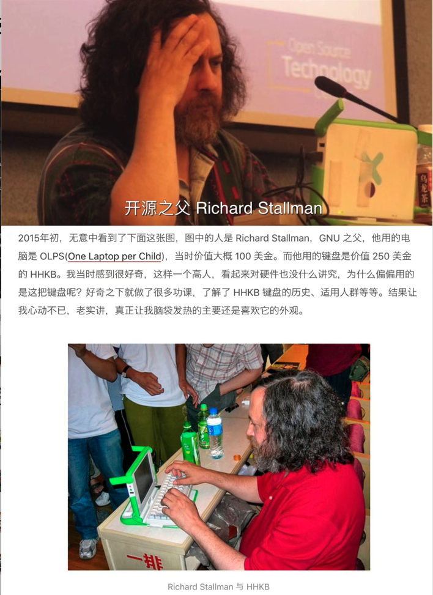

## Richard Matthew Stallman

 

贡献领域:  Emacs, [GCC](), [GDB](https://dashen.tech/2019/10/30/%E7%A5%9E%E5%99%A8gdb/)

 

中文一般译作"理查德·斯托曼",Geek圈内一般简称"RMS"

1953年生于美国,自由软件运动的精神领袖、GNU计划以及自由软件基金会（Free Software Foundation）的创立者、著名黑客

所写作的 *GNU通用公共许可证（GPL）* 是世上最广为采用的自由软件许可证

别出心裁,创造了[*著佐权(Copyleft)*](https://baike.baidu.com/item/%E8%91%97%E4%BD%90%E6%9D%83/3339812?fromtitle=Copyleft) 这一概念, 即可以拷贝,可以修改,可以出售, 只是有一条:源代码所有的改进和修改必须向每个用户公开,所有用户都可以获得改动后的源码. Copyleft保证了自由软件传播的延续性

有和RMS用同款键盘   ( =•ω•= )

 

[理查德·斯托曼一直是对的](http://www.ruanyifeng.com/blog/2012/01/richard_stallman_was_right_all_along.html)

 

---

 

## Fabrice Bellard

 

贡献领域: 贝拉公式(最快圆周率算法),TCCBOOT,TCC（微型C编译器）
,FFMPEG

 

中文一般译作"法布里斯·贝拉"

1972年生于法国

[Fabrice Bellard 是个什么水平的程序员？](https://www.zhihu.com/question/28388113)

---

 

## Chris Lattner

 

贡献领域: LLVM项目主要作者之一,Clang编译器作者,Swift之父

 

中文一般译作"克里斯·拉特纳"

1978年生于美国

[Chris Lattner's Homepage](http://www.nondot.org/sabre/)

[github.com/lattner](https://github.com/lattner)

---

 

[开源人物](https://www.facesofopensource.com/)

http://www.iis7.com/a/lm/bk/

