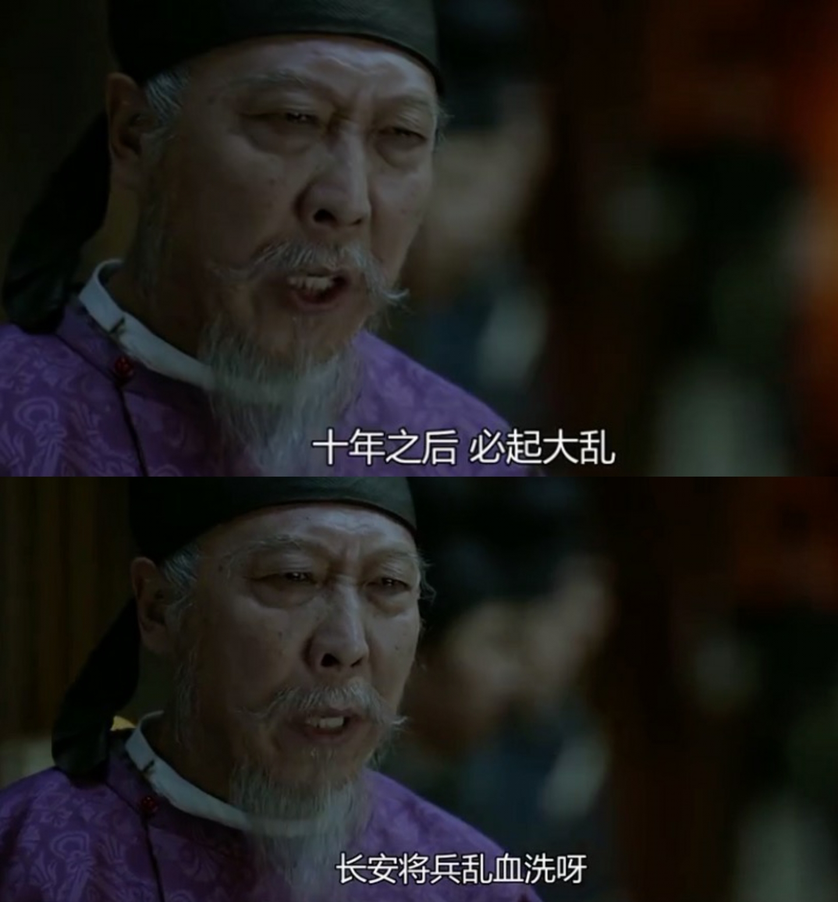
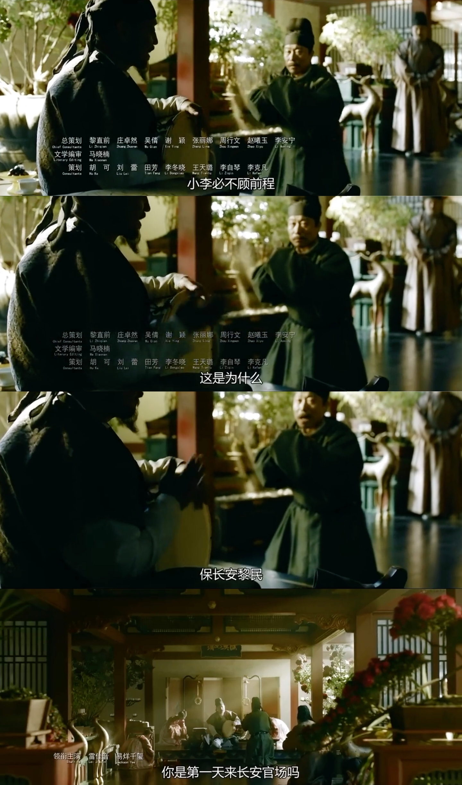
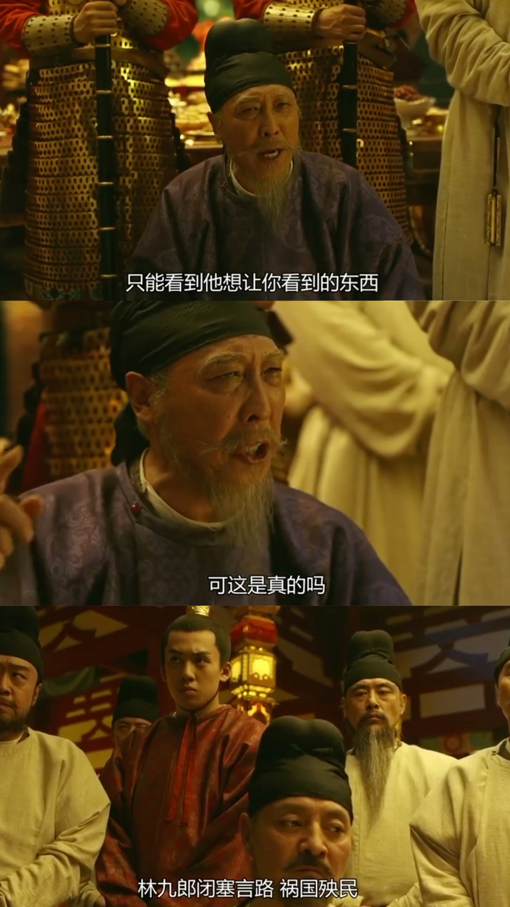
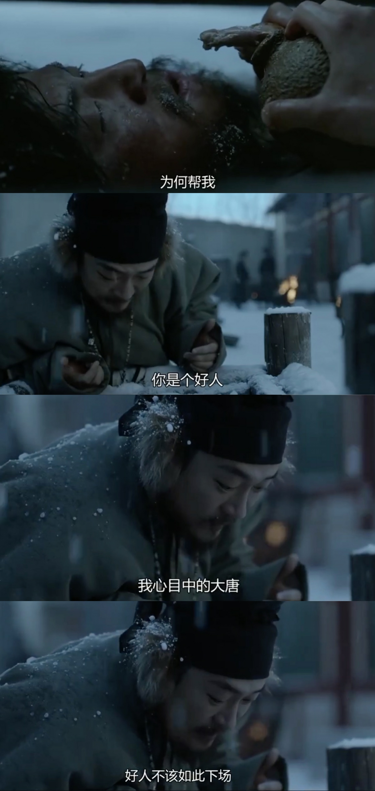
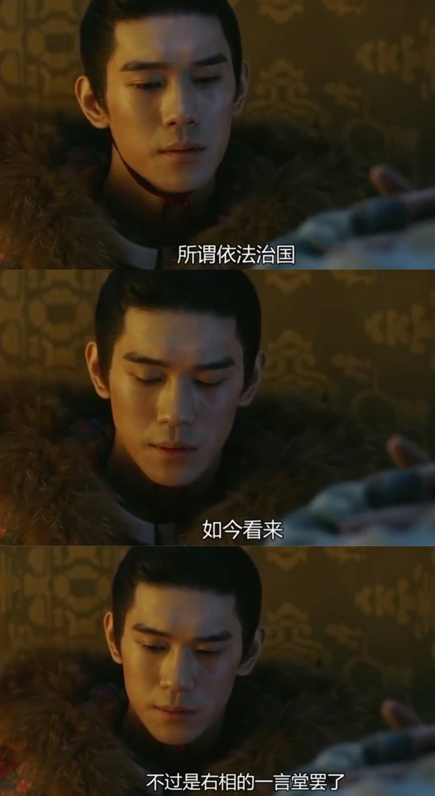
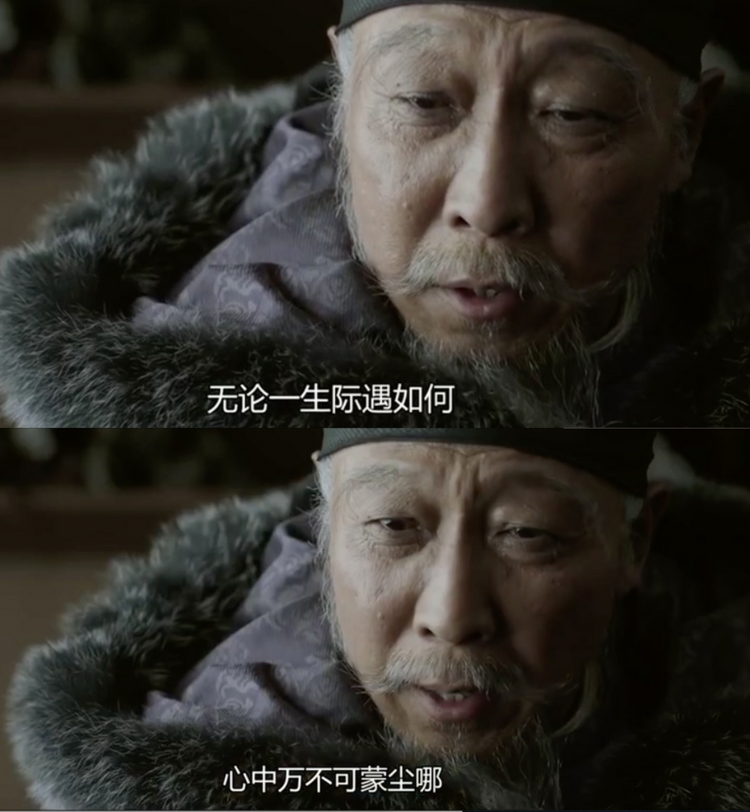

追完了『长安十二时辰』，一部为过审，改的支离破碎面貌全非的历史悬疑剧。大概是想强行凑够“十二时辰”，更是为增加集数收回成本，后期太过拖沓烂尾明显。

细细想来，“出道即巅峰”，却最终“狗尾续貂”的作品实在不少，从白先勇『台北人』，到『三国杀』桌游。而影视剧中，<大染坊2>，<神医喜来乐2>，<大宋提刑官2>，<闯关东2>，无一不是前作可称经典，续作难堪优秀。欧美剧如<神探夏洛克>，<生活大爆炸>，亦有此症结。这般比较，更能领会随剧而终的<大侦探波罗>，几十年来水准一直在线，殊是难得。

---

按天宝三载计，为公元745年。 实际上，作为有唐一代福禄寿考之典范，归宿最好的诗人&政客，这时贺知章可能已经去世(约659-约744年)。

剧中曾假"何执正"之口说“十年内，长安必乱”。10年后的755年，安史之乱爆发，成为划开盛唐与中晚唐之泾渭。

后来写出『安禄山事迹』的姚汝能，在狱中奉劝27岁的岑参: “给你指条明路，去西域发展，长安，你混不了”。

当年度，岑参考中进士，两度从军边塞。但出场吟诵的“忽如一夜春风来，千树万树梨花开”，实际写于9年后的天宝十三载。

当年按兵不援，导致烽燧堡惨剧的盖嘉运，历史上颇有建树。最知名的吹捧诗作，即出自岑参之手`---`『玉门关盖将军』，最后四句“我来塞在按边储，为君取醉酒剩沽。醉争酒盏相喧呼，忽忆咸阳旧酒徒”。联系此剧，会觉违和。

后来依靠裙带关系，杨国忠逐渐掌权，口蜜腹剑的李林甫渐渐边缘，8年后病死，随后按谋反清算，子孙多被流放岭南黔中。

而外番安禄山与朝堂杨国忠矛盾激化，又过两年，以“诛国忠 清君侧”为由发动叛乱。自此天旋地转，一年后，玄宗败撤蜀中避难，专权误国，败坏朝纲的祸首，在马嵬坡，被失去小拇指的前弓弩手张小敬射杀，记录于姚汝能『安禄山事迹』中，(除了这名这事，别的都为编纂)。时年71岁的李三郎痛失所爱，羁旅夜雨，想念“严羽幻”，作『雨霖铃』。后宋人柳三变，将此词牌发扬光大。

“二月春风似剪刀”政治讽喻诗的解释，不身临其境当真get不到。

相比之下，作为“为人不识陈近南，纵使英雄也枉然”的原版，李太白“生不用封万户侯，但愿一识韩荆州”，享谪仙这般盛誉的韩朝宗，首先顾及的，不是留名千古的欣喜，更多为眼下的坐立不安。

大将军王忠嗣，奏言安禄山必反，又与李林甫不睦，被安以“欲奉太子即位”而遭贬，并在4年后郁郁而终(以剧情发生的745年为时间基准)。

剧中的士人领袖，宁王之孙，当为与李白，贺知章，焦遂，张旭，李适之，崔宗之同位列『饮中八仙歌』的汝阳王李琎。

吉州永新县(今吉安永新)百姓温饱未及，而舍命供奉打点，希冀其村姑许合子，能得圣人恩宠，成杨太真第二，以免税赋徭役。历史上许合子为著名歌唱家，可以和春秋时期留下成语“余音绕梁”的韩娥，及西汉武帝时谱下『佳人曲』的李延年齐名。安史乱后，流落风尘。…但不常见于诗词经传，后人所知，有唐最知名歌唱家是李龟年。

见风使舵善于逢迎的元载，时年32岁。后来果真平步青云，深得宠信，官至宰相。其独揽朝政专横跋扈，但也提拔任用刘晏进行财税体系改革，为乱后残缺的大唐又续命百载。

太子李亨，后来在灵武登基，即为肃宗。在郭子仪等人帷幄拼杀下，平定了叛乱。但他算不得一位好皇帝，在玄宗病逝后十多天，为权宦政变惊惧而死。

与李亨本幼年交好的永王李璘，无奈生于皇家，成年后与兄长反目。八年战乱期间，也起兵自立。一把年纪，本在天柱山避难，顺道炼丹修仙的李白，政治觉悟极低站错了队。而后永王兵败身死江西赣州，李白也被刺配。行至白帝城遇大赦，遂有“朝辞白帝彩云间，千里江陵一日还”。

少年英杰李泌，时年23岁，北周太师李弼之后，七岁能文，被称神童。一生几起几落，为国为民，内修外联，颇有建树。

宦官在古代，几乎不曾能有好名声，蔡伦郑和可算作寥寥例外。而皇帝的贴身太监，基本脸谱是专横跋扈，贪财弄权。因“力士脱靴，贵妃捧砚”留名的高力士，亦难逃此印象。剧集里他有贪财瑕疵，却是极为关键的正派人物。历史上对其评价亦高，一生对玄宗忠心耿耿，不离不弃。被誉“千古贤宦第一”，死后陪葬于泰陵。

---

[姊妹篇: 起承转合--由陈子昂<国殇>](http://www.dashen.tech/2019/01/20/%E8%B5%B7%E6%89%BF%E8%BD%AC%E5%90%88-%E7%94%B1%E9%99%88%E5%AD%90%E6%98%82-%E5%9B%BD%E6%AE%87/)

[姊妹篇: 渔阳鞞鼓](http://www.dashen.tech/2018/08/12/%E6%BD%9C%E5%B1%B1-%E7%9A%96%E5%9B%BD%E5%8F%A4%E9%83%BD-%E5%AE%89%E5%BE%BD%E4%B9%8B%E6%BA%90/)