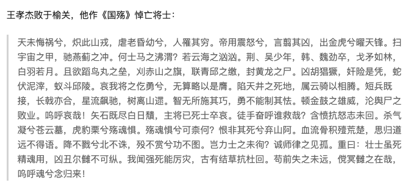
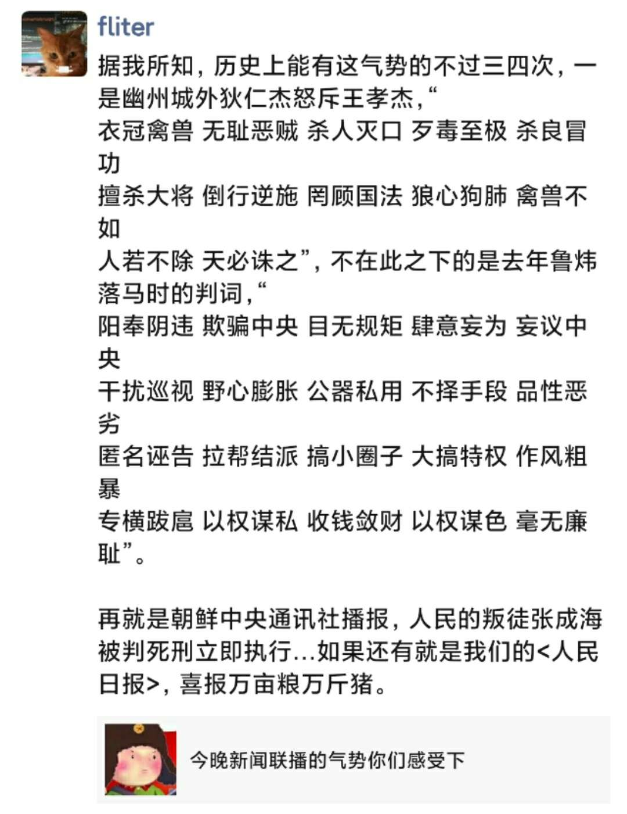

没看上下文，乍以为这[『国殇文』](https://baike.baidu.com/item/%E5%9B%BD%E6%AE%87%E6%96%87/22763790)是王孝杰所作，着实惊讶了。相形之下，后世给狄大人杜撰的这几句看似气势激昂的台词，简直太小儿科。

公元697年，清边道行军总管王孝杰，率大军攻伐契丹。于东硖石谷(今河北唐山一带)误中埋伏，寡不敌众坠谷而亡。

两度从军，对边塞防务颇有见数的陈子昂，闻讯后悲恸不已。于他41岁人生的倒数第5年，愤而作『国殇』。一年后，陈子昂解官回乡，照看膏肓病父。而后居丧期间，为武三思指使射洪县令，罗织罪名，枉死狱中

他回四川老家这年，盛唐时代的“七绝圣手”王昌龄出生。59年后安史大乱时，这位"诗家天子"，同样以令人扼腕的悲壮方式，令后来人“天地悠悠，怆然涕下”。

陈子昂和“初唐四杰”年代大致。虽是“初唐”，其实大多不在太宗时期，而主要活动于唐高宗和武则天年间: 李世民于公元649年病逝，在位23年(略少于隋文帝)。四杰中享寿最长的骆宾王，约生于619年，卒于687年;卢照邻约生于635年，溺水亡于685年;杨炯生于650年，卒于693年，王勃同样生于650年，溺亡于676年。

从高宗649年继位至武曌705年驾崩，时间长河里约略的这窄窄一甲子，属于初唐诗人们驰骋之天地。公元8世纪前后，接过前人衣钵的晚辈已然鱼贯而出，他们有王昌龄(生于698年)，李白，王维(均生于701年)，高适(704年)。早他们而来的襄阳孟山人(孟浩然，生于689年)启后，晚一旬而来的襄阳杜工部(杜甫，生于712年)承前。至公元755年渔阳鞞鼓动地来，盛唐乃至整个民族最高光璀璨时刻，将由他们见证记述。

8年战后，开元天宝的繁盛一去不返，藩镇割据，吐蕃东扰，整个国家凋敝，生灵涂炭。战乱结束的前一年，李白“追月坠水”而去; 又8年后，生活无着老病无依的杜甫，客死于湘江上的一叶孤舟。两年后，白居易出生，此后他将四处寻落，将这60年来前辈诗文里出现的绮丽景象，和天崩地坼山呼海啸的叛乱，凝结为一曲『长恨歌』。

安史之乱发生于唐朝建立的第137个年头，距离这个王朝寿终正寝却还有152年。此后更漫长的后半程，有元白的“激情四射”，有因王叔文改革造就的一票诗文，有风格迥然的小李杜高歌低咏，但属于这个朝代，更多是江河日下的悲歌，那如日中天的60年，再也未能复演。

[姊妹篇: 盛唐之殇--观<长安十二时辰>记](http://www.dashen.tech/2020/01/24/%E7%9B%9B%E5%94%90%E4%B9%8B%E6%AE%87-%E8%A7%82-%E9%95%BF%E5%AE%89%E5%8D%81%E4%BA%8C%E6%97%B6%E8%BE%B0-%E8%AE%B0/)

[姊妹篇: 渔阳鞞鼓](http://www.dashen.tech/2018/08/12/%E6%BD%9C%E5%B1%B1-%E7%9A%96%E5%9B%BD%E5%8F%A4%E9%83%BD-%E5%AE%89%E5%BE%BD%E4%B9%8B%E6%BA%90/)