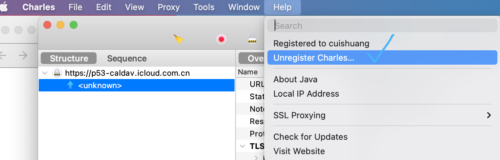

<br>

### 安装

<br>

```sh

brew先安装好node和npm

npm install -g cnpm --registry=https://registry.npm.taobao.org

# 全局安装 vue-cli
$ cnpm install --global vue-cli


# 创建一个基于 webpack 模板的新项目
$ vue init webpack my-project(你想叫的项目名称)


# 这里需要进行一些配置，默认回车即可
This will install Vue 2.x version of the template.

? Project name charles_register
? Project description A Vue.js project
? Author cuishuang <cuishuang@bilibili.com>
? Vue build standalone
? Install vue-router? Yes
? Use ESLint to lint your code? Yes
? Pick an ESLint preset Standard
? Set up unit tests Yes
? Pick a test runner jest
? Setup e2e tests with Nightwatch? Yes
? Should we run `npm install` for you after the project has been created? (recom
mended) npm

   vue-cli · Generated "charles_register".


# Installing project dependencies ...
# ========================

安装各种依赖...


# Project initialization finished!
# ========================

To get started:

  cd charles_register
  npm run dev
  
Documentation can be found at https://vuejs-templates.github.io/webpack

```

 


<br>


执行:

```sh
$ cd my-project
$ cnpm install
$ cnpm run dev
```

 


 


<br>


---


<br>


### 熟悉项目目录,配置IDE


<br>

先熟悉下目录结构:

 


<br>


[webstorm中实现vue 项目按住ctrl+引用组件名自动跳转到对应组件](https://blog.csdn.net/yede0632/article/details/106692097)

 

 

这样就可以直接点过去

<br>


组件的内容是：template（构成HTML骨架） 、script（数据交互事件响应）、style scoped（受限作用域的CSS样式）,即所谓的 **结构**,**样式**,和**行为**

 


[Vue.js进阶](https://blog.csdn.net/calmreason/article/details/82995522)

<br>

---

<br>


### 进行开发


<br>

需求:做一个简单的获取Charles注册码功能,前端只需要拿到用户输入的名称,提交给服务端,再将结果展示给用户即可~


<br>


#### 前端样式,获取用户输入的信息


<br>

 

 


<br>


#### 使用axios发送http请求

<br>


> **cnpm install axios**


<br>


解决跨域问题:

 


 

<br>

安装 [http-proxy-middleware](https://www.cnblogs.com/zhaoweikai/p/9969282.html)

> **cnpm install -s http-proxy-middleware**

在config/index.js下,将proxyTable做如下配置:

```js
    proxyTable: {
      // 配置跨域
      '/api': {
        target: 'http://localhost:8081/register',
        // ws: true,
        secure: false,
        changeOrigin: true,  // 在本地会创建一个虚拟服务端，然后发送请求的数据，并同时接收请求的数据，这样服务端和服务端进行数据的交互就不会有跨域问题
        pathRewrite: { // 路径重写，
          '^/api': ''  // 替换target中的请求地址，也就是说以后你在请求http://localhost:8081/api这个地址的时候直接写成/api即可。
        }
      }
    },
  ```

 


<br>

几个主要文件的代码如下:


<details>
<summary><b>src/router/index.js:</b></summary>


```js
import Vue from 'vue'
import Router from 'vue-router'
import Register from '@/components/Register'

Vue.use(Router)

export default new Router({
  routes: [
    {
      path: '/',
      name: 'Register',
      component: Register
    }
  ]
})
```
</details>


<details>
<summary><b>config/main.js:</b></summary>


```js
// The Vue build version to load with the `import` command
// (runtime-only or standalone) has been set in webpack.base.conf with an alias.
import Vue from 'vue'
import App from './App'
import router from './router'
import axios from 'axios'

Vue.config.productionTip = false

// 安装其他插件的时候，可以直接在 main.js 中引入并使用 Vue.use()来注册，但是 axios并不是vue插件，所以不能 使用Vue.use()，所以只能在每个需要发送请求的组件中即时引入。
// 为了解决这个问题，我们在引入 axios 之后，通过修改原型链，来更方便的使用。
// 在 main.js 中添加了这两行代码之后，就能直接在组件的 methods 中使用 $http命令
Vue.prototype.$http = axios

/* eslint-disable no-new */
new Vue({
  el: '#app',
  router,
  components: { App },
  template: '<App/>'
})
```
</details>


<details>
<summary><b>config/index.js:</b></summary>


```js
'use strict'
// Template version: 1.3.1
// see http://vuejs-templates.github.io/webpack for documentation.

const path = require('path')

module.exports = {
  dev: {

    // Paths
    assetsSubDirectory: 'static',
    assetsPublicPath: '/',

    proxyTable: {
      // 配置跨域
      '/api': {
        target: 'http://localhost:8088/register',
        // ws: true,
        secure: false,
        changeOrigin: true,  // 在本地会创建一个虚拟服务端，然后发送请求的数据，并同时接收请求的数据，这样服务端和服务端进行数据的交互就不会有跨域问题
        pathRewrite: { // 路径重写，
          '^/api': ''  // 替换target中的请求地址，也就是说以后你在请求http://localhost:8088/api这个地址的时候直接写成/api即可。
        }
      }
    },

    // Various Dev Server settings
    host: 'localhost', // can be overwritten by process.env.HOST
    port: 8080, // can be overwritten by process.env.PORT, if port is in use, a free one will be determined
    autoOpenBrowser: false,
    errorOverlay: true,
    notifyOnErrors: true,
    poll: false, // https://webpack.js.org/configuration/dev-server/#devserver-watchoptions-

    // Use Eslint Loader?
    // If true, your code will be linted during bundling and
    // linting errors and warnings will be shown in the console.
    useEslint: true,
    // If true, eslint errors and warnings will also be shown in the error overlay
    // in the browser.
    showEslintErrorsInOverlay: false,

    /**
     * Source Maps
     */

    // https://webpack.js.org/configuration/devtool/#development
    devtool: 'cheap-module-eval-source-map',

    // If you have problems debugging vue-files in devtools,
    // set this to false - it *may* help
    // https://vue-loader.vuejs.org/en/options.html#cachebusting
    cacheBusting: true,

    cssSourceMap: true
  },


  build: {
    // Template for index.html
    index: path.resolve(__dirname, '../dist/index.html'),

    // Paths
    assetsRoot: path.resolve(__dirname, '../dist'),
    assetsSubDirectory: 'static',
    assetsPublicPath: './',

    /**
     * Source Maps
     */

    productionSourceMap: true,
    // https://webpack.js.org/configuration/devtool/#production
    devtool: '#source-map',

    // Gzip off by default as many popular static hosts such as
    // Surge or Netlify already gzip all static assets for you.
    // Before setting to `true`, make sure to:
    // npm install --save-dev compression-webpack-plugin
    productionGzip: false,
    productionGzipExtensions: ['js', 'css'],

    // Run the build command with an extra argument to
    // View the bundle analyzer report after build finishes:
    // `npm run build --report`
    // Set to `true` or `false` to always turn it on or off
    bundleAnalyzerReport: process.env.npm_config_report
  }
}
```

</details>


<details>
<summary><b>src/componets/Register.vue:</b></summary>

```js
<template>

  <div>
    <div class="registerinfor">
      <p><font color="#6495ed">请输入想注册的名称,如 <b>zhangsan</b></font></p>
      <input id="cui" type="text" placeholder="输入注册名称" v-model="username">

      <p @click="register()">
        <button class="shuang_button">点击注册</button>
      </p>

      <p><font color="#6495ed">密钥为: </font></p>
      <input id="shuang" type="text" placeholder="密钥" v-model="userpass">

    </div>
  </div>
</template>

<script>

export default {
  name: 'Register',
  methods: {
    register () {
      window.console.log(this.username, this.userpass)
      this.$http({
        method: 'post',
        url: '/api',
        data: {
          name: this.username
        }
      }).then((response) => {
        // vue中的then方法 https://blog.csdn.net/weixin_39225682/article/details/107254797
        console.log(response)
        this.userpass = response.data
      })
      setTimeout(function () {
        alert('注册成功,请复制密钥,进行激活')
      }, 500)
    }
  },
  data () {
    return {
      username: this.username,
      userpass: this.userpass
    }
  }
}
</script>

<!-- Add "scoped" attribute to limit CSS to this component only -->
<style scoped>

#cui {
  width: 200px;
  height: 30px;
}

#shuang {
  width: 200px;
  height: 30px;
}

.shuang_button {
  color: darkred;
  background: aquamarine;
  font-size: 20px;
}

h1, h2 {
  font-weight: normal;
}

ul {
  list-style-type: none;
  padding: 0;
}

li {
  display: inline-block;
  margin: 0 10px;
}

a {
  color: #42b983;
}
</style>
```

</details>

<br>

全部代码在此[https://gitee.com/cuishuang/charles_register](https://gitee.com/cuishuang/charles_register)

<br>

---

<br>

### 解决项目打包后dist文件夹index.html为空白 & 部署到服务器

<br>

> **cnpm run build**

打开*dist/index.html*,预期应该和 http://localhost:8080/#/ 一样,但发现却是空白.

[解决vue-cli2和vue-cli3项目分别打包后dist文件中index.html出现空白](https://blog.csdn.net/weixin_45851208/article/details/107200398)


对于Vue 2.x, 将config/index.js中 *build*部分的 *assetsPublicPath*由
`'/'`改为`'./'`即可


<br>


此时还是有跨域问题

 


<br>


先将代码push到仓库git@gitee.com:cuishuang/charles_register.git

在gitee新创建一个git仓库,并将项目文件夹初始化为git仓库.参照 [git 将本地文件夹初始化为git仓库，并上传到对应的github远程仓库中](https://www.cnblogs.com/zdj8023/p/11096881.html),push代码到仓库


<br>

在服务器上,执行 

```js
cnpm install
cnpm run build
```


执行

```go
go build http_register.go

// 后台运行
nohup ./http_register &
```


 

<br>

然后进行nginx配置.

将匹配到*api*的请求,交由Go服务即127.0.0.1:8088处理

ngnix配置如下:

/usr/local/openresty/nginx/conf/domains
/charles_vue.conf

```nginx
 server {
        listen       80;
        server_name  charles.dashen.tech;
        #server_name localhost;

        access_log  /var/log/charles.access.log  main;
        error_log  /var/log/charles.error.log;
        root /home/ubuntu/lab/charles_register/dist;
        index index.html index.htm;

         error_page   500 502 503 504  /50x.html;
         location = /50x.html {
             root   html;
         }

 location / {
        add_header Cache-Control 'no-store, no-cache, must-revalidate, proxy-
        revalidate, max-age=0';
        try_files $uri $uri/ /index.html;
}

   location /api {
    proxy_pass http://127.0.0.1:8088;
    }

 }
```

(关于匹配的优先级,rewrite等,可参考 [亲测体验Nginx中location的优先级](https://dashen.tech/2020/06/28/%E4%BA%B2%E6%B5%8B%E4%BD%93%E9%AA%8CNginx%E4%B8%ADlocation%E7%9A%84%E4%BC%98%E5%85%88%E7%BA%A7/))


<br>

再到域名服务商设置相应的A记录. 这里轻车熟路,不需赘述

<br>

访问 [http://charles.dashen.tech/](http://charles.dashen.tech/#/),即可注册并得到注册码


 


 

<br>

---


<br>

参考:


[菜鸟教程-Vue.js](http://www.runoob.com/vue2/vue-tutorial.html)


[20-Vue实战项目：电商管理系统（Element-UI）](https://www.bilibili.com/video/BV1EE411B7SU?p=13)