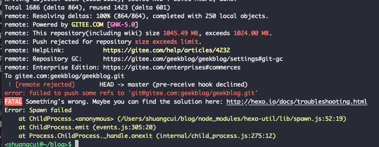
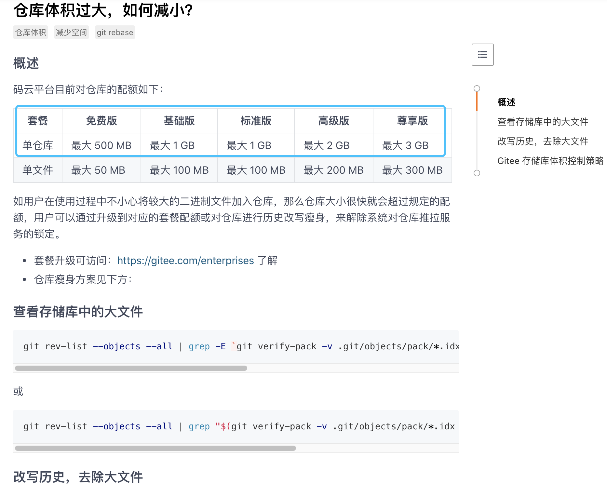
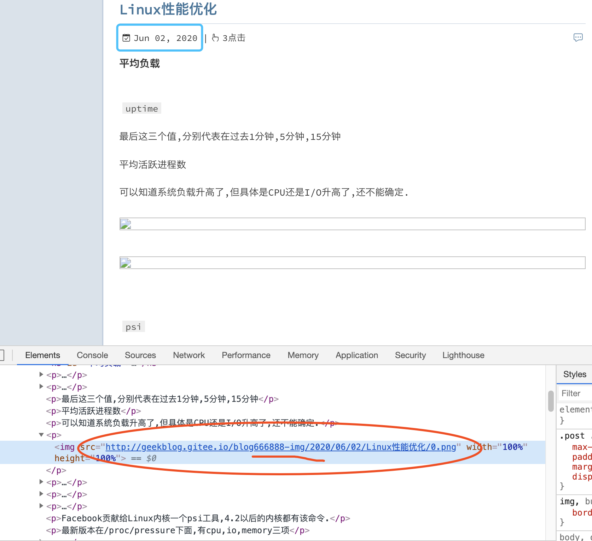
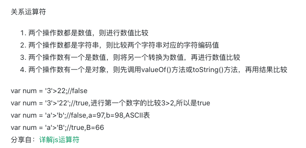
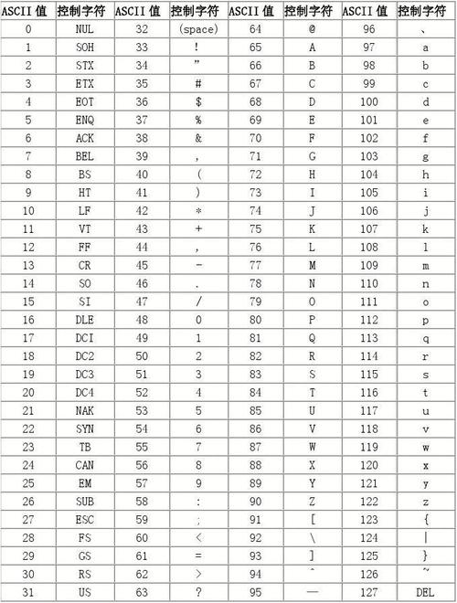
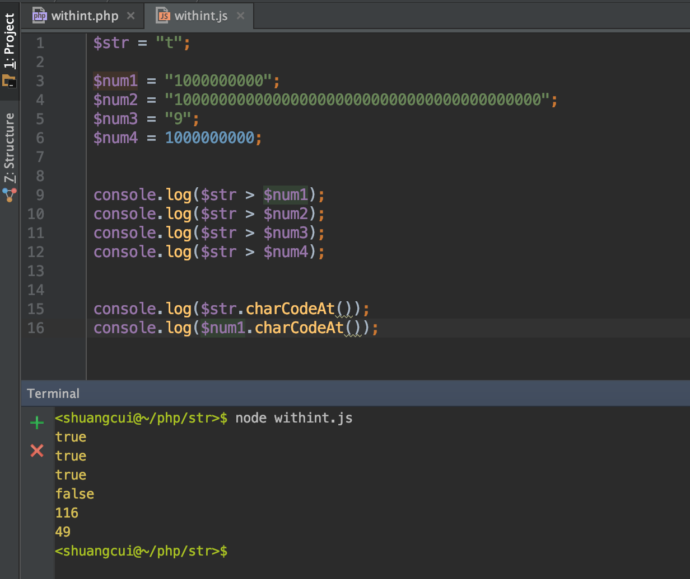
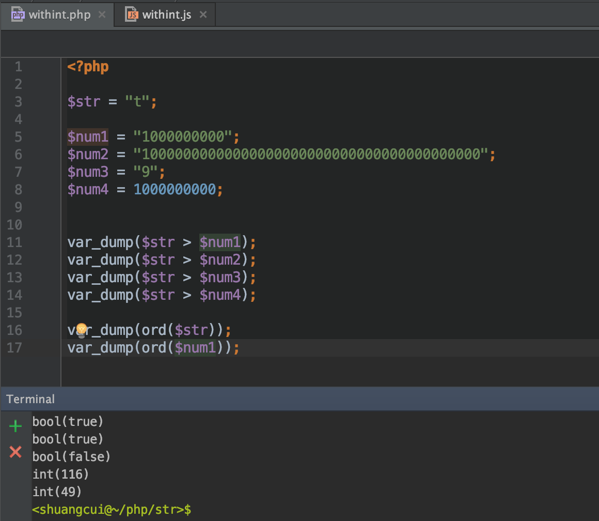
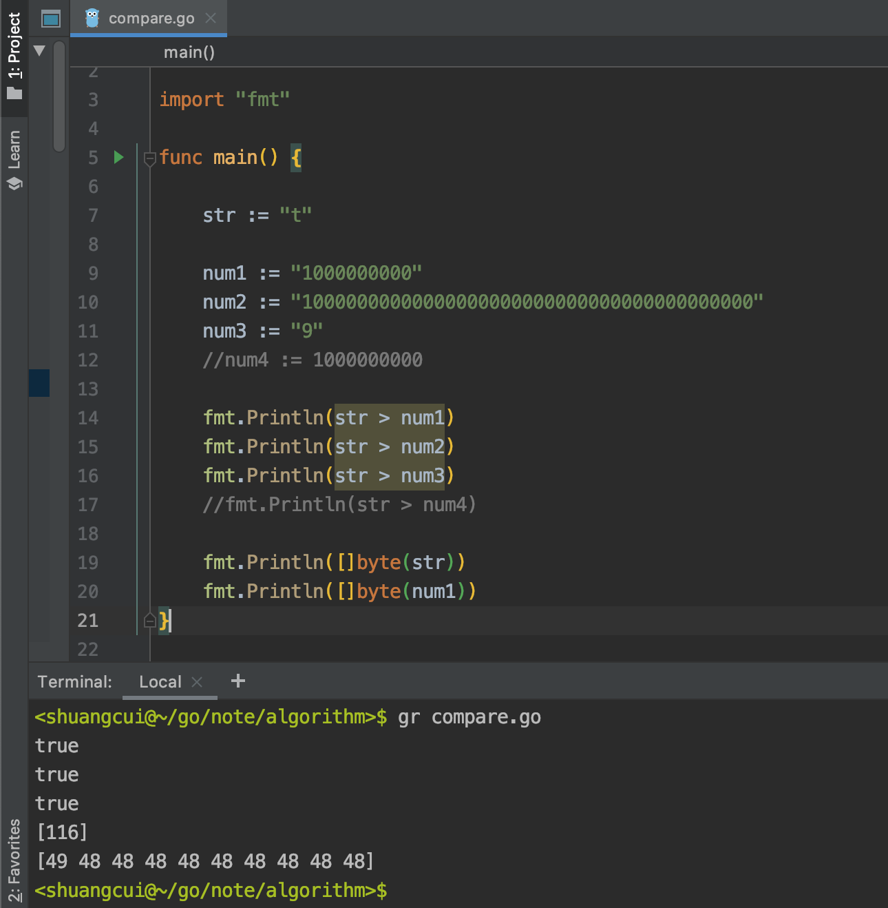

### 案情简介:

<br>

正常情况下,git仓库中应当只存放代码,像编译成的二进制包,以及许多静态资源如图片/视频,都不应该放在里面.但对于我的博客项目,为方便添加图片使用了`hexo-asset-image`,该package会在`hexo new article-title`时生成(近似)同名的文件夹,用以存放该篇博客用到的图片.

这样做的问题是伴随文章数量的增加,尤其是许多图片较多的文章,会使仓库体积变得愈发庞大臃肿.github对单个仓库的限制较为宽泛,但码云的免费版,单仓库大小不能超过1G,否则就会提交失败.




(注:

之所以用gitee,是为解决github图片国内访问速度极慢的问题,而采用[bai piao]码云的CDN加速---具体办法是同时将代码提交至gitee,然后访问的图片地址前拼接地址.魔改`hexo-asset-image`的index.js如下:

```js
$(this).attr('src', 'https://geekblog.gitee.io/' + link + src);
```

)


<br>


最直接的解决方案自然是开通码云企业版,但纵是如此,单仓库的容量上线也不过3G,不过几年又会面临同样问题.  




<br>

审视`hexo-asset-image`这个插件,其会在`hexo g`将markdown转换成静态网页时,将每篇文章``后的内容加上`permalink`里的年月日等信息,生成新的图片地址.

采用这样一种方案: 

解绑老的gitee仓库, 然后在为每篇博客生成图片引用的地址时加一个判断, 如果时间小于"2020.06",则读取老gitee仓库地址; 另外建一个新的gitee仓库,专门用来存储图片,"2020.06"及之后的博客,图片读取该地址. 原则上这样就可以永久解决容量上限的问题.

当然这样会稍稍增大操作成本,原本博客完成后`hexo g` && `hexo d`两个命令.现在还需要将对应文件夹及图片上传新的码云仓库,这个可以后续考虑脚本自动化实现.


修改`hexo-asset-image`的`index.js`代码如下:

```js
    //新增
    //permalink: :year/:month/:day/:title/   
    var newLink = data.permalink;
    var infoArr = link.split("/")
    var year = infoArr[0]
    var month = infoArr[1]


    if (year >= "2020" && month > "05") {
            $(this).attr('src','http://geekblog.gitee.io/blog666888-img/' + link + src)

        } else {
            $(this).attr('src', 'https://geekblog.gitee.io/' + link + src);
        }

```

<br>


---


### 匪夷所思:

<br>


但在实践过程中,每次都会将全部图片地址变为`http://geekblog.gitee.io/blog666888-img/`,让我一度感到困惑.

由于对js了解有限,最开始云里雾里. 开始一步步调试,用[写文件的方式](https://www.runoob.com/nodejs/nodejs-fs.html),将*year*和*month*两个变量写到一个新文件中:


```js
    var fs = require("fs");

    fs.writeFile('input.txt', '这是通过fs.writeFile写入文件的内容',  function(err) {
        if (err) {
            return console.error(err);
        }
    });


    fs.writeFile('input123.txt', newLink[0],  function(err) {
        if (err) {
            return console.error(err);
        }
    });


    fs.writeFile('input456.txt', newLink[1],  function(err) {
        if (err) {
            return console.error(err);
        }
    });


    fs.writeFile('input789.txt', newLink.toString(),  function(err) {
        if (err) {
            return console.error(err);
        }
    });
```


(虽然`console.log`不仅可以在浏览器控制台打印内容,在终端同样可以.但`hexo g`终端输出大量数据,寻找不易,故用写文件的方式...好吧其实最开始以为console.log在终端中无效..)

<br>

发现得到的`h`和`t`..这大概是过程中的某步骤,在原字符串前拼接了`http://`,修正后, 最新的博客其图片地址如愿读新的仓库.




这样一来,之前困扰百思不解的问题就变成了,  "t" > "2020"甚至 "t" > "10000000" 为何成立的问题.


<br>


---


### 水落石出:


<br>


参考:

[js字符串与数字比较大小的问题](https://segmentfault.com/q/1010000002758462/a-1020000002758493)




**两个比较的变量都是字符串,则比较其对应的字符编码值(ASCII值),先比较第一位,如果第一位相同,再比较第二位...直至区分出大小.**




对于字符串"t",其ascii值为116,而字符串"100000000000000..."其第一个元素"1"的ascii值为49,第一轮即分出高下....


<br>

如对以下几种编程语言,有


在js中:

```js
$str = "t";

$num1 = "1000000000";
$num2 = "10000000000000000000000000000000000000000";
$num3 = "9";
$num4 = 1000000000;


console.log($str > $num1);
console.log($str > $num2);
console.log($str > $num3);
console.log($str > $num4);


console.log($str.charCodeAt());
console.log($num1.charCodeAt());
```




<br>

在php中:

```php
<?php

<?php

$str = "t";

$num1 = "1000000000";
$num2 = "10000000000000000000000000000000000000000";
$num3 = "9";
$num4 = 1000000000;


var_dump($str > $num1);
var_dump($str > $num2);
var_dump($str > $num3);
var_dump($str > $num4);

var_dump(ord($str));
var_dump(ord($num1));

```




<br>


在golang中:


```go
package main

import "fmt"

func main() {

	str := "t"

	num1 := "1000000000"
	num2 := "10000000000000000000000000000000000000000"
	num3 := "9"
	//num4 := 1000000000

	fmt.Println(str > num1)
	fmt.Println(str > num2)
	fmt.Println(str > num3)
	//fmt.Println(str > num4)

	fmt.Println([]byte(str))
	fmt.Println([]byte(num1))
}

```





