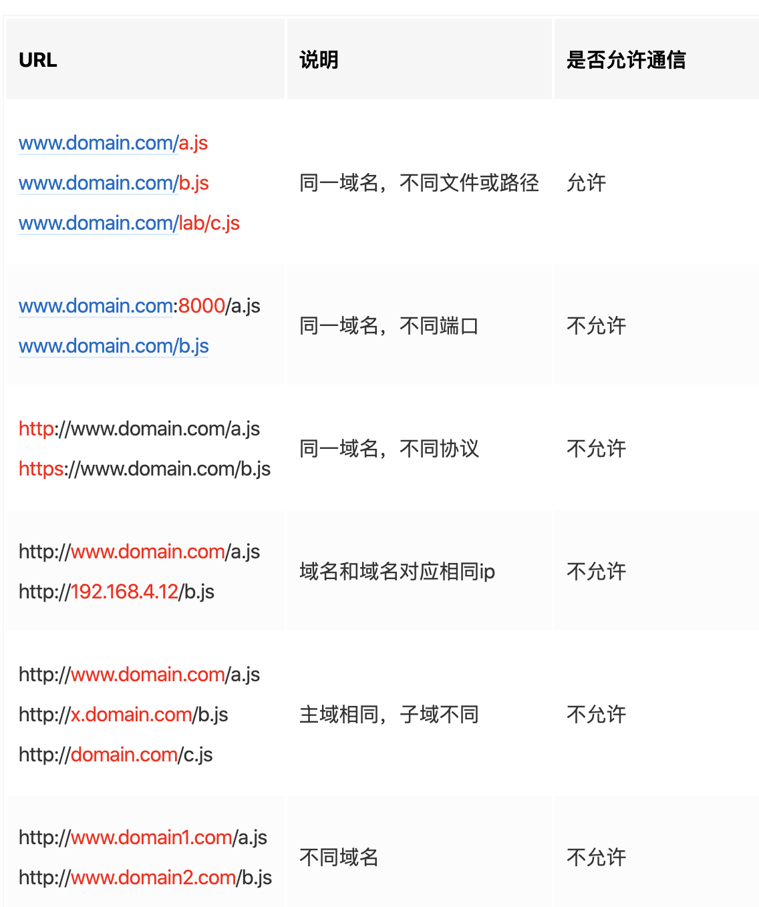

 

> 跨域是指浏览器允许向服务器发送跨域请求，从而克服Ajax只能`同源`使用的限制。

 `同源策略`是一种约定，由Netscape公司1995年引入浏览器，它是浏览器最核心也最基本的安全功能，如果缺少了同源策略，浏览器很容易受到XSS、CSFR等攻击。所谓同源是指"协议+域名+端口"三者相同，即便两个不同的域名指向同一个ip地址，也非同源。

同源策略限制以下几种行为：

- Cookie、LocalStorage 和 IndexDB 无法读取
- DOM和JS对象无法获得
- AJAX 请求不能发送

9种解决方案:

- **JSONP跨域(只适用于GET请求)**

- **跨域资源共享（CORS）**

- **nginx代理跨域**

- **nodejs中间件代理跨域**

- document.domain + iframe跨域

- location.hash + iframe跨域

- window.name + iframe跨域

- postMessage跨域

- WebSocket协议跨域

> jsonp（只支持get请求，支持老的IE浏览器）适合加载不同域名的js、css，img等静态资源； CORS（支持所有类型的HTTP请求，但浏览器IE10以下不支持）适合做ajax各种跨域请求； Nginx代理跨域和nodejs中间件跨域原理都相似，都是搭建一个服务器，直接在服务器端请求HTTP接口，这适合前后端分离的前端项目调后端接口。 document.domain+iframe适合主域名相同，子域名不同的跨域请求。 postMessage、websocket都是HTML5新特性，兼容性不是很好，只适用于主流浏览器和IE10+。

参考自:

[9种常见的前端跨域解决方案（详解）](https://juejin.im/post/5d1ecb96f265da1b6d404433), 版权归原作者所有
