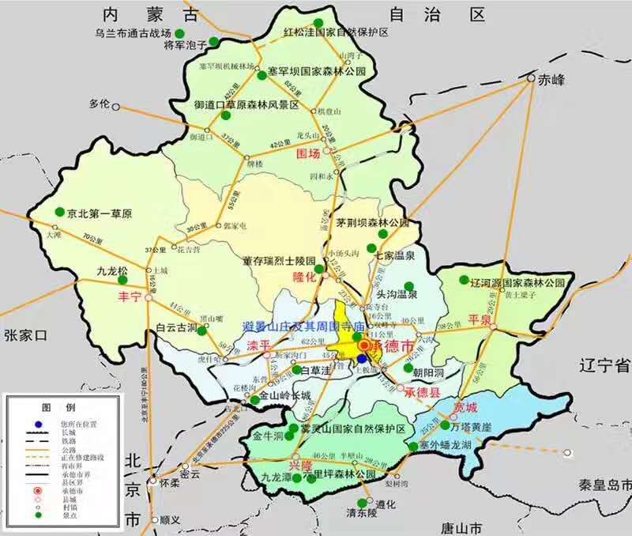
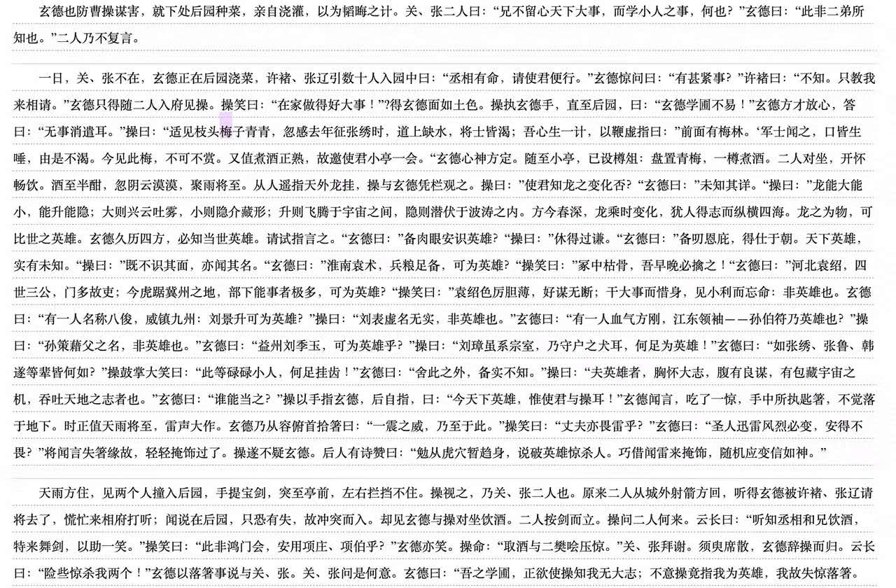

 

承德平泉撤县设市。平泉处河北东北，邻接内蒙古辽宁，有`通衢辽蒙、燕赵门楣`之称。平泉面积广阔，3297平方公里，与深港面积之和相当，但人口较少，经济发展一般。

提及承德，多数人第一观感是避暑山庄和木兰围场，是辛酉政变恭亲王慈禧叔嫂扳倒顾命八大臣。甚或，还有多年前许晴代言的露露。平泉这个处于边角位置的寻常县域，并不为人熟知。

平泉是典故`老马识途`和`望梅止渴`的发生地。前者出自<韩非子>，齐桓公应燕国要求，出兵攻打入侵燕国的外族山戎，部队迷路，放出老马，找到了出路。

而后一成语，是否出自平泉我却颇有疑惑，在<三国演义>第二十一回，青梅煮酒论英雄，此出在曹操征讨宛城张绣的路上。宛城即今天南阳，曹操应在南阳以南，前去征讨不会路过南阳以北的河北平泉（要说与<观沧海>一样，产生于征讨乌桓，就没有这个疑问了）

 

稍稍有些感到意外的，是新的平泉市归石家庄代管，而非承德。那这样原本是承德下辖一县的平泉，岂不是一下子和承德再无半点行政关系？…但与新近同样发生在河北，原本波静縠纹平的行政区划领域，始料不及炸出的炸弹“雄安新区”相比，这样的“意外”不足深究。