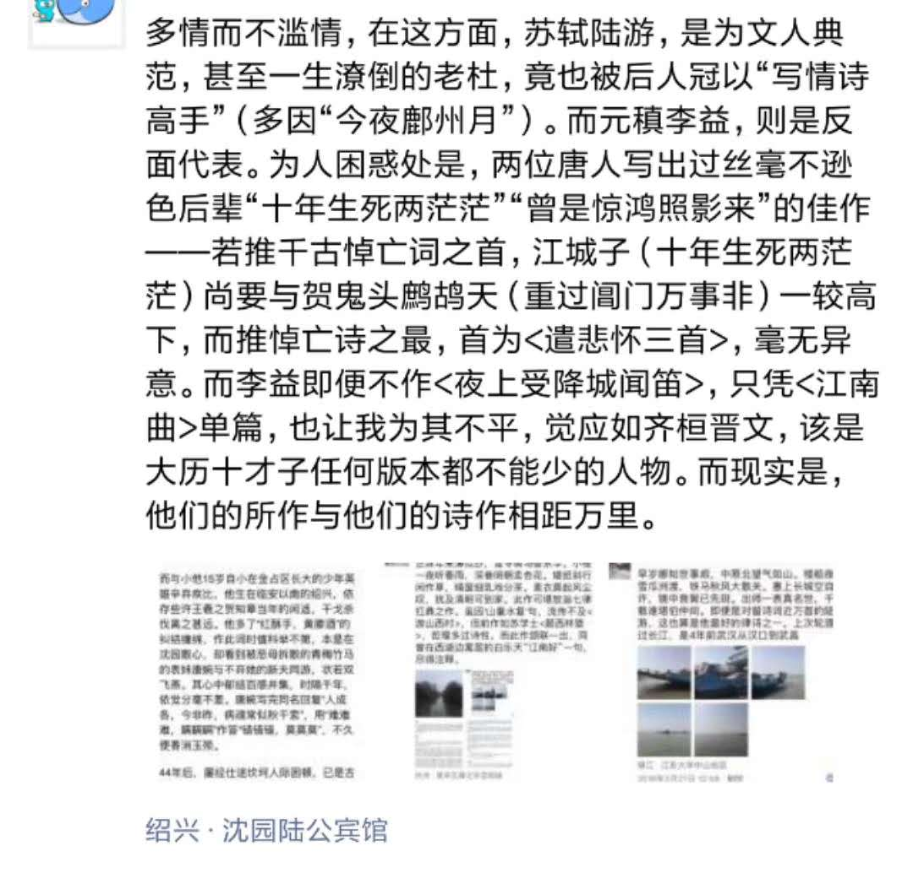

 

### 撤县设市 ###

 安徽潜山撤县设市，该县以西部天柱山闻名。天柱山为安徽11个5A景区之一，与黄山九华山并称安徽三大名山，又称潜山，皖山，安徽简称即由此来。地处安徽省西南部，濒临长江黄金水道。是皖、鄂、赣三省通衢之地。素有“皖国古都、二乔故里、安徽之源、禅宗之地、京剧之祖、黄梅之乡”的美誉，是安徽省历史文化名城，是京剧的发源地、长篇叙事诗《孔雀东南飞》故事的发生地，是三国佳丽大乔、小乔的生长地，自东汉至南宋先后为州、郡、府治所近800年。

初知天柱山，自是因为李白。渔阳鼙鼓动地，安史之乱爆发，潜心老庄飘逸的青莲居士于此炼丹。此刻避居四川的李隆基，已年过70，夜雨闻铃，感念马嵬坡下土一抔，只遣词造句，而无实权和心力。名动天下的李白此时抱负尚未全死，受玄宗第16子永王李璘集团相邀，政治觉悟薄弱而名动天下的他，就这样成为一支并不合法的军队幕僚。一曲<永王东巡歌>，成为其获罪之源。

 

继承大统的是玄宗第三子李亨，他于安史之乱次年继位，是为肃宗。年轻李白11岁的老杜，心怀社稷，安顿家人一路西去天水追随朝廷，却中途被俘。幸因位卑而无杀身，只被困居长安。诗人不幸诗家幸，百感之中，能排古往今来五言律诗前三的<春望>，和这个好男人最美情诗的<月夜>先后应运而出。为其作品赢得“诗史”称号的三吏三别，也出自这一时刻。

李璘自幼失母，由其异母兄李亨亲自抚养。李亨常将其抱在怀中同睡。情同手足兄弟，可怜生在皇家。安史之乱尚未结束，肃宗和永王便开始兵戎相向。经那个边塞诗人高适谋段手腕，最终使李璘于今江西大余兵败身死。李白遭流放，刺配夜郎，也渐和原本关系不错的高适不再来往。

 

李白扬名长安时，曾救一正直而被诬陷的小官免遭断头。20多载后，昔日险作刀下鬼，今时却是抗击安史叛军，拱卫李唐皇祚的擎天白玉柱。他是郭子仪，大概是继程咬金后，有唐一代最知名的福将，权倾朝野朝不忌，功盖一代主不疑。

昔日恩人遭难，郭以官位身家为注，赎李白不死。而后又逢肃宗大赦，李白得以离开川贵一带，沿江东下。在他生命的倒数第三年，已在世上潇洒忐忑走一遭，心境再不是年少出川时的“山随平野尽，江入大荒流”，转而是“两岸猿声啼不住，轻舟已过万重山”。

年幼之时便识，却不解其意，直到读800多年后“天际立法者”，普鲁士人开普勒传记，“我已盗得埃及的金瓶，并已远离埃及国土，木已成舟，瓜熟蒂落”。摆脱劫难之以手抚膺额冠相庆，大抵相似。

在恢复自由之身3年后，已近安史之乱尾声，李白在长江边的安徽马鞍山当涂县，醉酒失足，“上天捉月”溺水而亡（亦说病重而去，此说法可能性更高，时人及后人多希望谪仙人死法亦不同凡人）。

 

在李白遇赦写下<早发白帝城>这一年，虽然跟对了人，但仍仕途不顺生活无着的老杜，携妻带子举家南下入蜀。说来也是，自司马相如和扬雄起便是中国文学高地，后来又孕育李白和三苏的川蜀，怎么能少了这位最伟大现实主义诗人的浓墨重彩。四年时间，240首诗多有珠玉，甚至1300多年后，一文化水平并不高的浙江商人，在给其建筑公司取名时，依然想到“安得广厦千万间”，但他并没有老杜这样的情怀，几年前曾因官商勾兑被查。

 

谪仙逝世几个月后，公元763年春，叛军内斗，史思明自缢，安史之乱比预期提早结束了。“剑外忽传收蓟北，初闻涕泪满衣裳”，一向以儒士示人正襟危坐的老杜，喜不自胜，手舞足蹈。

但出川后的杜甫境况也没有好很多，但国家看上去复兴有望，还是老骥伏枥。我实在想象不出，力道千钧的<登岳阳楼>，竟然是这个贫病交加际遇坎坷的“老人”最后的绝唱。

音讯阻隔，他当时大抵是不知道，那个洒脱不羁的李十二郎，已经不在人世了。一生困顿，最后客死在湘江一条小船上的他，更不会想到，当年和李白洛阳相见，竟被后人盛称，是自春秋时儒道两派宗师碰面后，中国文化史上最伟大的相遇。

这个比喻贴切之处，除去四人在中国文化史上地位鲜有人及，还在于一种传承和碰撞，二人可认做儒道两家在唐代的代言人。

 

---

[姊妹篇: 起承转合--由陈子昂<国殇>](http://www.dashen.tech/2019/01/20/%E8%B5%B7%E6%89%BF%E8%BD%AC%E5%90%88-%E7%94%B1%E9%99%88%E5%AD%90%E6%98%82-%E5%9B%BD%E6%AE%87/)

[姊妹篇: 盛唐之殇--观<长安十二时辰>记](http://www.dashen.tech/2020/01/24/%E7%9B%9B%E5%94%90%E4%B9%8B%E6%AE%87-%E8%A7%82-%E9%95%BF%E5%AE%89%E5%8D%81%E4%BA%8C%E6%97%B6%E8%BE%B0-%E8%AE%B0/)