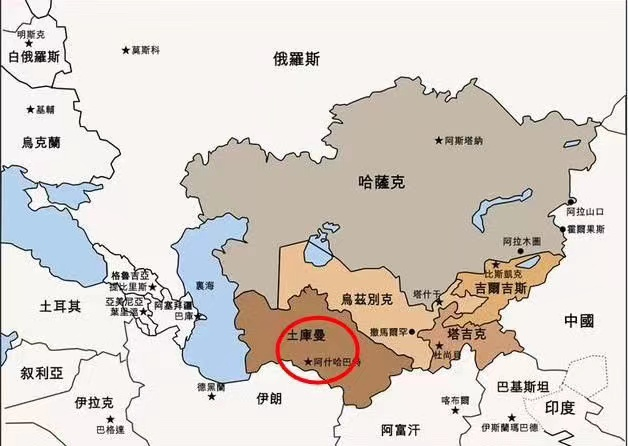

2018年世界各国人均GDP

 

1.一个错觉，一直以为美国人均GDP在20名左右，落后英法德加澳，实则不然。人均GDP排在美国之前的7个国家及中国澳门地区，无一人口超过1000万。

 

2.北欧四国全在前15，芬兰人口竟不及丹麦。

 

3.新加坡与美国人均GDP相当，约为中国大陆地区6-7倍。日本人均GDP约为大陆地区4倍，韩国约为3倍;中国台湾省约为大陆地区2.6倍(与上海与海南人均GDP差距相当)，中国xx地区约为大陆5倍(大陆地区各省人均GDP最高的北京与甘肃相差4.5倍)，中国澳门地区约为大陆8.5倍。

 

4.中国人均GDP为印度4.75倍。这个数据指标此后二十年要务必关注。

 

5.中亚五个内陆“斯坦”，最北最西的哈萨克斯坦与土库曼斯坦人均GDP相对较好。与中国搭界的吉尔吉斯斯坦，及世界两个双重内陆国之一的乌兹别克斯坦，人均GDP仅为中国大陆地区13%。最靠后的塔吉克斯坦，不足大陆地区9%。

 

6.排名倒数前十的悉数为非洲国家，其中包括莫桑比克和马达加斯加。非洲地区只有三个小国人均GDP在中国大陆地区之上:塞舌尔，毛球，赤道几内亚。

 

7.阿联酋人均GDP高过日本，文莱人均GDP高于韩国。科威特，巴林，沙特，阿曼，马尔代夫，马来西亚，人均GDP高过大陆地区。

 

8.有四个人口过亿国家人均GDP排在中国大陆地区之前:美国，日本，俄罗斯，墨西哥。巴西人口突破2亿，印度尼西亚人口超过2.5亿，菲律宾人口超过1亿。尼日利亚人口即将突破2亿。孟加拉国人口1.6亿。印度人口与中国相去不大。巴基斯坦人口突破2亿。埃及，越南，刚果民主共和国人口即将过亿。

多年前，确切说我还在学校未下车间时，世界人口过亿国家共10个，最末为西非强国尼日利亚。现在这个数量是12，如无错误，新上榜的是墨西哥与菲律宾。

 