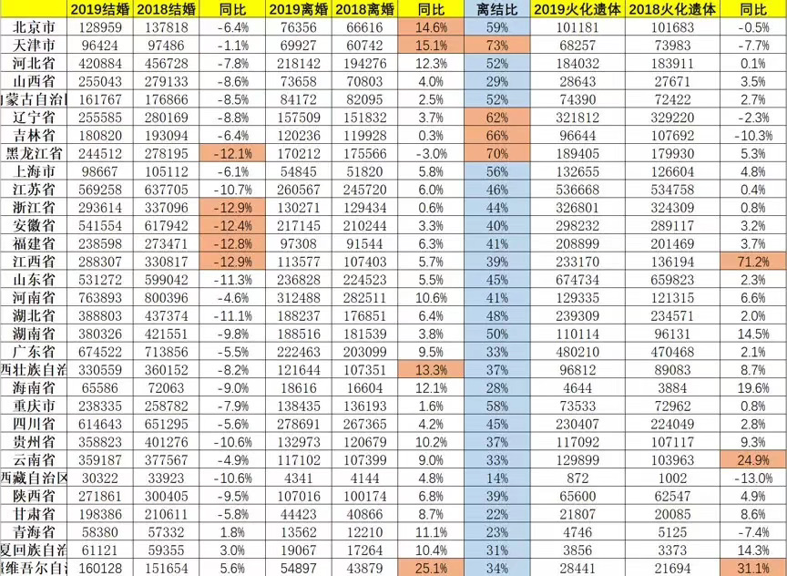
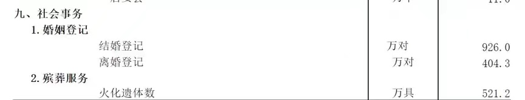
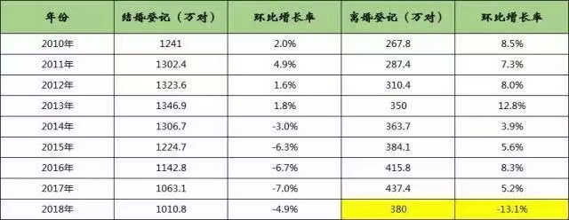
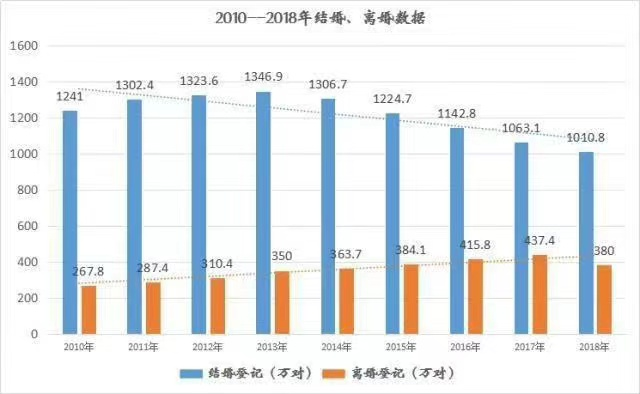
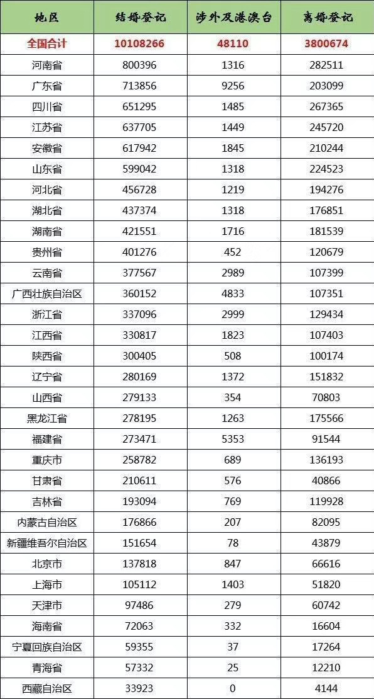
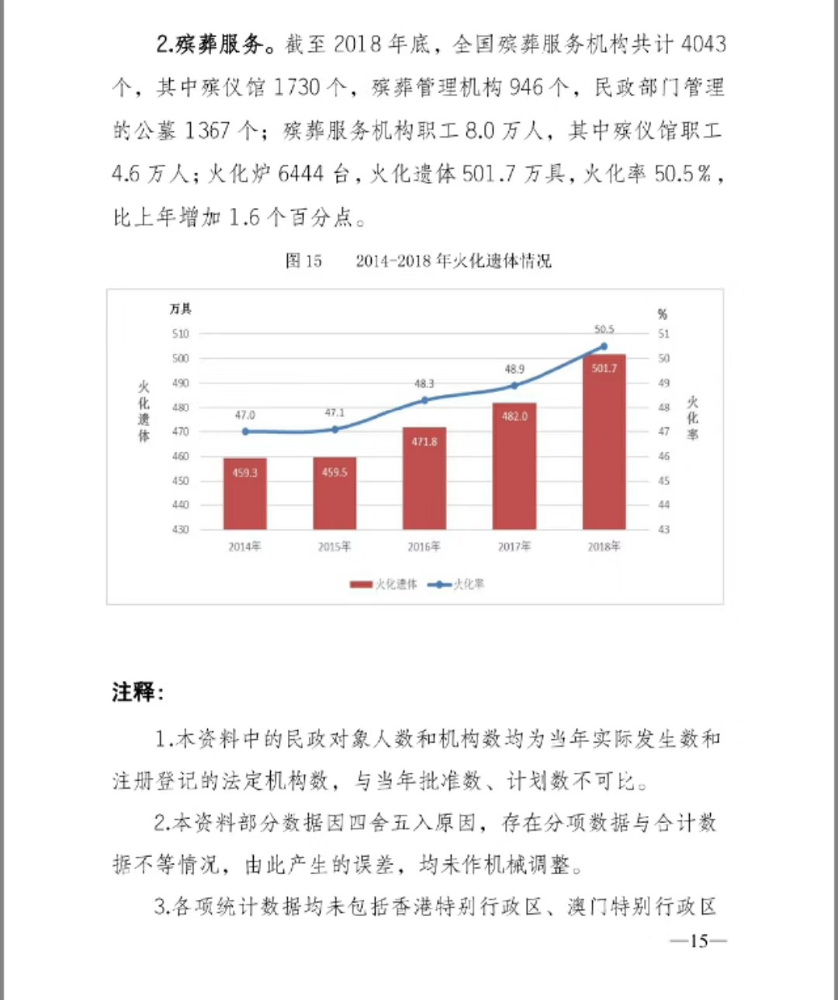

<1>

2019年『离结比』连续几年走高，登记结婚926万对，离婚404万对，离结比为44%——这意味着每有两对鸳鸯聚首，便有将近一对分手。

除西部三个省域，大陆地区各省份结婚人数均下降;除黑龙江，各省份离婚人数均上升。离结比最高的是四大直辖市和东三省，每两对人登记结婚，就有超过一对人离婚(京沪可能有 为买房假离婚现象)。

看过了太多未来预言，很多次提到，“婚姻”，这种人类社会最基础的组织形式，正在瓦解消亡。从数据看是有这种趋向。纵然过去几代人那种黏糊和凑合的婚姻，令崇尚自由的新一代人难以接受。但作为一件人生大事，“婚姻”如此快速得被解构，让内心相对保守的我有些慌，有话可聊，相携到老，竟成许多人奢望。

 

<2>

 2018年出生人口1523万，连续三年下降，没有出现放开二胎，想象中的“婴儿潮”。预计2019年，新出生人口或锐减至1100万。

2018年死亡人口993万，其中有一半逝者为火葬。2019年，火化遗体数量最多的省为山东，67万具🙏。该年度山东省死亡人口为71.99万。

人口规模与山东相近的河南，2019年火化遗体数为12.9万具。河南省2018年死亡人口74万🙏。

江西省2019年遗体火化数增加71%。2018年，江西省死亡人口28万🙏。

 

<3>  

2018年，中国男性人口7.1亿，女性6.8亿——这亦是“3000万光棍”推论的理论依据。实际上分摊到年龄段所占比例(如女性更长寿)，情况不至如此焦灼。但无可否认，许多地方，依然有性别鉴定，非法流产，买卖女婴状况。扭转这一根深蒂固观念非一代人之功，除去地产商，还得有其他方式加以遏制调节。