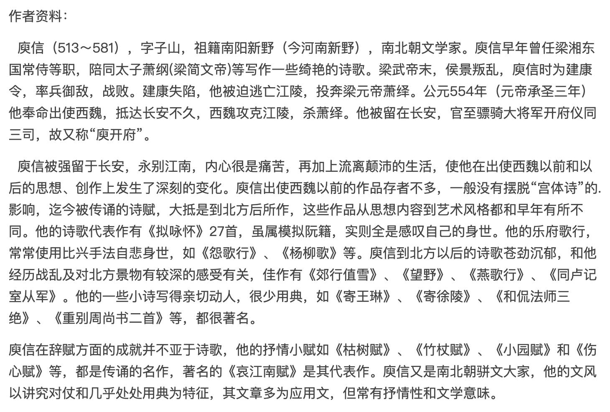

桓宣武平荆州，外白：「有称楚丘先生，来诣门下。」桓公曰：「名父之子，流离江汉，孤之责矣！」及令引进，乃曰：「噫，子老矣！鹤发皮，蓬头历齿。乃是江、汉英灵，衡、荆杞梓，虽有闻于十室，幸无求于千里。寡人有铜环灵寿，银角桃枝。开木瓜而未落，养莲花而不萎。迎仙客于锦市，送游龙于葛陂。先生将以养老，将以扶危。」

先生笑而言曰：「中国明于礼义，暗于知人。心之忧矣，惟我生民。虽复条劲柘，促节贞筠，杖端刻鸟，角首图麟，岂能相予此疾，将予此身？若乃世变市朝，年移陵谷，猿吟鹰厉，风霜惨黩；楚、汉争衡，袁、曹竞逐，兽食无草，禽巢无木。于时无惧而栗，不寒而战。胡马哀吟，笳凄啭，亲友离绝，妻孥流转。玉关寄书，章台留钏，寒关凄怆，羁旅悲凉。疏毛抵于矰缴，脆骨被于风霜，发种种而愈短，眉髟髟而竞长。是以忧干扶，悲条郁结，宿昔僛丑，俄然耆耋。变田凤于承宫，改阳文于鬷蔑。潘岳秋兴，嵇生倦游，桓谭不乐，吴质长愁，皆年华未暮，容貌先秋。予此衰矣，虽然有以，非鬼非蜮，乃心忧矣。未见从心，先求顺耳。伯玉何嗟，丘明唯耻。拉虎捭熊，余犹稚童；观形察貌，子实悲翁。别有九棘庞眉，三槐暮齿，孔光谢病，袁逢致仕，吴濞不朝，杨彪丧子。明公此赠，或非乖理。」

先生乃歌曰：「秋藜促节，白藋同心。终堪荷蓧，自足驱禽。一传大夏。空成邓林。」

 

 

---

 

参考:

[从《竹杖赋》解读庾信入北后对仕途的看法](http://m.fx361.com/news/2006/0728/5398913.html)

 

《竹杖赋》是南北朝著名作家庾信入北后的借物咏怀之作。全文以“楚丘先生见桓温”始，通篇表达了“楚丘先生”对“赐杖”的强烈反应。这实际代表着自比为“楚丘先生”的庾信与隐喻为“桓宣武”的魏、周政权的一次正面交涉。正是基于这个原因，此赋对说明庾信入北后的仕隐观，就成为不可忽视的一个证据。但令人遗憾的是，后人对此赋寓意的推测往往莫衷一是，竟然形成了“辞官之作”和“求官之作”两种截然不同的看法！前者认定魏、周逼迫庾信仕敌，过分关注庾信的“哀思”，继而推理出庾信由“哀”到“恨”，不情愿步入北周仕途的心态，得出此篇亦为哀思之作；后者认为庾信入北后因为对自身的高度自负与现实有强烈的反差，借文章表达求官之意。其实这两种看法都忽视了庾信心态的矛盾性，因而难免各有片面之见。事实上庾信在入北后一直怀有矛盾的心情，一方面他总结了梁王朝灭亡的原因，指出了梁元帝在政治、军事、外交等方面的失误（见《哀江南赋》），可见他虽恨西魏政权夺他家园，使得他不能返回故土，但也不能不面对现实，客观地总结教训，况且陈已代梁，想回也回不去了。面对这个现实，羁留北方多年的庾信不再象刚入北时那样愤怒。同时他在魏、周也得到了一定的尊敬，出于实现个人抱负的想法，他也想做出一番事业！只是家仇国恨一直困扰着他，强烈的思乡又使他悲伤不已，所以他一面仕周，一面在作品中自然流露出哀伤的情感。这种矛盾的心理，使得他进入了“仕途”与“归田”两难的境地。因此他在文中所表达的思想情感也时时存在着矛盾，如何把握这种矛盾的心态是理解此赋的关键。

桓宣武平荆州，外白：“有称楚丘先生，来诣门下。”

庾信在赋中为何要设置桓温和楚丘先生这两个人物，成为后人理解此赋时第一个要点。桓温为东晋大将，永和元年（345年）任荆州刺史，专擅朝政，死后封宣武侯。其子篡晋帝位，追其为宣武皇帝。这与魏相宇文泰的发迹史十分相似。这里有个历史问题，宇文泰并不是平荆州的人，而且平荆州时庾信也不在江陵，因此桓温指代谁也引起了后人的争议。鲁释在桓宣武指代谁的问题上，认为不过是 “借古人发端，并无需合乎历史，更不益事事比附。”这一理解典故的方法十分可取，但他在解释时仍有拘泥：鉴于史实，他推翻了倪释的桓玄武指代宇文泰的说法，指出桓玄武实际上既非宇文泰，亦非于瑾，而是比喻北周朝廷，又各含于瑾、周武帝的影子。我认为根据鲁释的出发点，就不必拘泥于宇文泰是否参与当平荆州，庾信借用桓温其人，显然意在比喻北魏与北周得当权者。

“楚丘”、“荆州”都指代梁元帝时的国都“江陵”。可见庾信时时不忘自己的来历。“楚丘先生”，倪释中提到是出自刘向《新序》“楚丘先生见孟尝君”。谭正璧、纪馥华《庾信诗赋选》注出处为《韩诗外传》，记载如下：“楚丘先生披蓑带索，往见孟尝君。孟尝君曰：‘先生老矣！春秋高矣！多遗忘矣！何以教文？楚丘先生曰：‘恶君谓我老！恶君谓我老！意者将使我投石超距乎？追车赴马乎？逐麋鹿、搏豹虎乎？吾则死矣，何暇老哉！将使我深计远谋乎？定犹豫而决嫌疑乎？出正辞而当诸侯乎？吾乃始壮耳，何老之有！孟尝君赧然，汗出至踵，曰：‘文过矣！文过矣！诗曰：‘老夫灌灌。”刘向《新序》中所记与此大体相同。这段典故能否成为证明《竹杖赋》为求官之作的首要依据？有必要参照赋中如下描写：

桓帝曰：“名父之子，流离江汉，孤之责矣！”及命引进，乃曰：“噫，子老矣！鹤发鸡皮，蓬头历齿。乃是江、汉英灵，衡、荆杞梓，虽有闻於十室，幸无求於千里。寡人有铜环灵寿，银角桃枝。开木瓜而未落，养莲花而不萎。迎仙客於锦市，送游龙於葛陂。先生将以养老，将以扶危。”

所谓“名父之子”与庾信的身世很吻合。我国古代王朝，都有赐杖与老臣的惯例，如：《礼记?王制》：“五十杖于家，六十杖于乡，七十杖于国，八十杖于朝。”；《礼记·曲礼》：“大夫七十而致事。若不得谢，则必赐之几杖。”；“谋与长者，必操几杖以从之。”可见赐杖之举偏重于尊老，“先生将以养老，将以扶危”。对于赐杖的理解，鲁释把重点放在“养老”，而倪释把重点放在“扶危”上，认为这是魏、周王朝借赐杖赋予庾信以权位。虽然授杖也有过给予权力的象征，但是从下文楚丘先生举的几个“授杖”的例子：“孔光谢病，袁逢致仕，吴濞不朝，杨彪丧子”，读者不难看出，这里的“授杖”重点在于“养老”，倪注不确，谭正璧、纪馥华释为 “是魏、周逼己以仕也”也是臆测。 但是否真如鲁释所说是庾信 “求官”的发端？其实庾信在接着的一段文字中，借楚丘先生之口，已表达出此时自己对做官的态度：

先生笑而言曰：“中国明於礼义，闇於知人。心之忧矣，为我生民。

这句话可谓庾信的心理写照！上文桓宣武十分客气委婉的表达了对楚丘先生“老矣”的看法，庾信对此既礼貌地点出了所谓“赐杖”是符合“礼义”的，又对当权者不懂己心的事实作了先扬后抑式的批评。这里“闇於知人”有两重意思：一是不知民心，二是不知庾信之心，即他的抱负所在：“心之忧矣，为我生民”，把“民心”与“己心”很好的连在了一起。“重民生”是庾信思想的重要内涵：“在昔金陵，天下丧乱，王室板荡，生民涂炭”（《伤心赋》）、“城崩杞妇之哭，竹染湘妃之泪”《哀江南赋》；由于他长期为官，也有一套政治理论和思想：“达人以四海为务，明君以百姓为心”（《郊庙歌辞·徵调曲》）、 “皇帝以上圣之姿……克己备于礼容，威武总于戎政……百姓为心，

虽复疏条劲拓，促节贞筠，杖端刻鸟，角首图麟，岂能相予此疾，将于此身！若乃世变市朝，年移陵谷，猿吟鹰厉，风霜惨黩；楚、汉争衡，袁、曹竞逐，兽食无草，禽巢无木。於时无惧而慄，不寒而战。胡马哀吟，羌笳凄啭，亲友离绝，妻孥流转，玉关寄书，章台留钏，寒关凄怆，羁旅悲凉。

庾信针对“赐杖”一事，不断表述自己的“忧”，百姓的“苦难”，从“若乃世变市朝”到“羁旅悲凉”几句，全是庾信战乱中的所见所感。这其中包含了对自己处境幽怨，同时更多的是在向当权者控诉战争的残酷。庾信赋予“楚丘先生”以善辩之才，抓住 “赐杖”一事，在其 “忧而貌老”上大做文章！

疏毛抵於矰缴，脆骨被於风霜。发种种而愈落，眉髟髟而竞长。是以忧干扶疏，悲条郁结，宿昔僛丑，俄然耄耋。变田凤於承宫，改阳文於鬷篾。潘越秋兴，嵇生倦游，桓谭不乐，吴质长愁，并皆年华未暮，容貌先秋。予此衰矣，虽然有以，非鬼非蜮，乃心忧矣。未见从心，先求顺耳。伯玉何嗟，丘明唯耻，拉虎捭熊，予犹稚童；观形察貌，子实悲翁。别有九棘庞眉，三槐暮齿，孔光谢病，袁逢致仕，吴濞不朝，杨彪丧子。明公此赠，或非乖理。

这段话曾被研究者作为证明庾信有求官之心主要依据，但文意的理解果然如此吗？从“疏毛抵於矰缴”到“俄然耄耋”，都是庾信对自己老态的直接描写。“变田凤於承宫，改阳文於鬷篾。”均是由貌美之人变成丑陋之人。这种“老丑”的变化，与上文所提到的经历了世事沧桑，整日“惧怕”、“寒心”、“悲哀”是密不可分的。庾信为了强调自己的衰老是由于“心病”的缘故，因此他一连举了四个因心忧而容貌先衰的例子：“潘越秋兴，嵇生倦游，桓谭不乐，吴质长愁，并皆年华未暮，容貌先秋。”他的重点不是在反驳自己貌老，而是在一直强调貌老的实际原因。

“未见从心，先求顺耳。伯玉何嗟，丘明唯耻”一句,倪释为庾信自觉虽匿怨于魏周，却仍在出仕，实在可耻，意在强调若不是魏、周强逼，庾信本身是不愿以身仕敌的。这种说法不确切。《论语·为政篇》：“子曰：‘六十而耳顺，七十而从心所欲，不逾距。”作者在说明自己年龄的同时，也隐约透露了对目前人生状况的一种无奈。《论语·公冶长》“子曰：‘匿怨而友其人，左丘明耻之，丘亦耻之。”这句意思是说对于自己怨恨的人，把怨恨隐藏在内心深处而与他交往，对于这样的事情，左丘明感到羞耻，不会去做，我（孔子）也感到羞耻，不会做这样的事情的。庾信深受儒家思想的影响，自然也遵循着这一原则，他在复述自己貌老的原因时，实际上也是在表达心中的些许不满，即“怨”：因统治者发动战争，弄得民不聊生，本身也因心忧而早衰。自己已然身事敌国，这些沉痛的经历就不能不反思，这些“怨由”就更不能不说！否则“伯玉何嗟，丘明唯耻。”

这里并不存在逼仕的问题，而是作者在对无可奈何的命运的感伤！

庾信对当权者说他“老”有否辩解，这成为理解其入仕心态的关键。而对赋中“拉虎捭熊，予犹稚童”一句的理解大为举足轻重。此句真如有的阐释者所说是他在向统治者证明自己力犹能仕吗？这里又要翻看前文所说“楚丘先生见孟尝君”的典故了，乍一看，好像庾信犹如楚丘先生，在力驳统治者对其不能为官的判断。但我认为这句话恰恰证明了庾信此番前来不是为了求官！仔细比较庾信与楚丘先生的不同，这个问题就可以迎刃而解。一，楚丘先生真的有七十岁了，而庾信要年轻得多；二，楚丘先生明确表示自己年老，不能胜任年轻力壮的人所做的事了：“意者将使我投石超距乎？追车赴马乎？逐麋鹿、搏豹虎乎？吾则死矣，何暇老哉！”这是以体力上的衰弱与心智上的茂盛形成对比。庾信始终在“貌老”上做文章，强调的是形态上的衰老：“拉虎捭熊，予犹稚童；观形察貌，子实悲翁”，进而道出未老先衰的缘由；三，楚丘先生有明确的求官目的，“将使我深计远谋乎？定犹豫而决嫌疑乎？出正辞而当诸侯乎？吾乃始壮耳，何老之有！”而庾信一直在强调“心之忧矣，为我生民”，这其实也正是庾信的政治理想和抱负的叙说。综合这三点，我认为庾信并不是在驳其年老以求得官职，而是借题发挥，坦陈了自己的怨言和抱负。理解了这一点，我们再看结局是不肯“受杖”，更能明白作者的内在意图。

先生乃歌曰：“秋藜促节，白藋同心。终堪荷筱，自足驱禽。一传大夏，空成邓林。”

对于这段“歌词”，几乎所有的注释都未予深论。但这恰恰是庾信矛盾心理的体现。“秋藜”、“ 白藋”都是野生植物，和竹子体性相通：“促节”、“同心”，“荷筱”、“驱禽”。竹从大夏传来，做成竹杖。“空成邓林”的典故取自《山海经》夸父追日的故事，表明持杖的人达不到自己的理想，也只能弃其杖，化成树林，反而不如卑贱的野草实用。这正是庾信的兴叹，也使原本靠个人意志所能决定的不肯受杖之举，更染上了一种宿命的色彩。

庾信在入北后确实经历了一段生不如死的丧国被羁的痛苦，但他毕竟是个软弱的文人，在归国无望的情况下，他的政治主张和思想，尤其是民本思想，也希望得到统治者的认可，他对待仕途既不是毫无眷恋，也并不是十分渴求。在经历了变故后，庾信一直处在矛盾和痛苦之中，变故使他的一些思想得到升华，作为故国遗臣，他悔恨自己的懦弱，痛恨魏、周夺取他的家园；作为现任政府的官员，他又想把自己丧国的经验教训和原来的抱负理想运用进去，所以赋中的寓意人物“楚丘先生”去见了统治者，但偏偏统治者触动了他内心的痛楚，从而得以借题发挥。

(刘雅娇，南京大学外国语学院)

