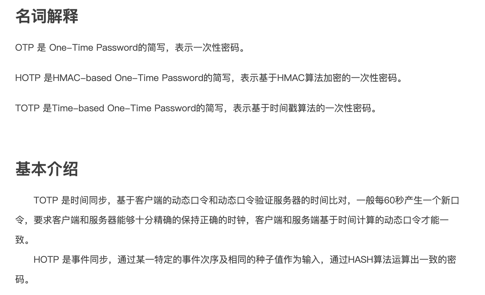
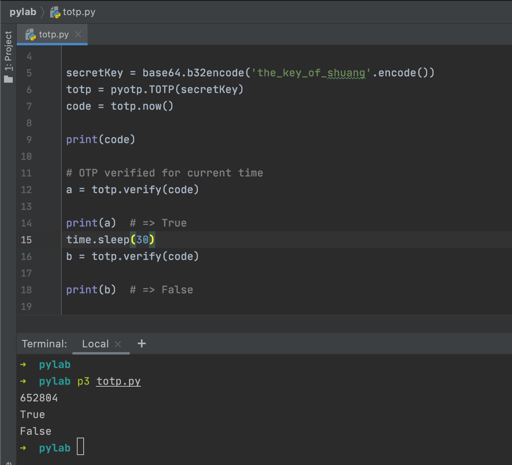

曾就职的公司好几家都使用*谷歌认证器*([Google Authenticator](https://github.com/google/google-authenticator),俗称谷歌令牌),作为二次校验的工具.相比于短信这样的并不算安全的OTP(One Time Password),使用令牌可以增强安全性, 同时还节省了短信的费用.


<font size=1>
类似产品还有阿里巴巴的身份宝,默认的时间是60秒;
腾讯的Token,时间是60秒
</font>

<br>




<br>

客户端(可以是Google Authenticator的APP,也可以是浏览器插件,或者集成进钉钉/企业微信等IM的类似插件等)绑定证书后, 会隔一段时间(如30s)产生一串随机数字(一般为6位). 服务端和客户端始终保持产生的数字相同,这样客户端在发起请求时,就多了一层校验.


问题是,如何保证两边的验证码一致? (实际上,客户端绑定完证书,从此之后断网,依然能和服务端生成一致的验证码)

本质上说,其实非常简单: 双方约定好使用的哈希函数,约定好一个秘钥,而后对(当前的时间戳/时间间隔)和秘钥做哈希运算,这样双方在时间戳相同的情况下,就能得到相同的一个哈希值.

```python
import pyotp
import base64
import time

secretKey = base64.b32encode('the_key_of_shuang'.encode())
totp = pyotp.TOTP(secretKey)
code = totp.now()

print(code)

# OTP verified for current time
a = totp.verify(code)

print(a)  # => True
time.sleep(30)
b = totp.verify(code)

print(b)  # => False

```

输出为:

```python
652804
True
False
```



<br>

Golang可参阅[gotp](https://github.com/xlzd/gotp)实现


<br>


有个疑惑:

*客户端和服务端是同一个秘钥吗? 这不就成了对称加密,如果客户端的秘钥泄露,不是很容易伪造吗?*


---

<br>

更多参考:

[双因子认证(2FA)](http://www.ruanyifeng.com/blog/2017/11/2fa-tutorial.html)


[OTP,HOTP,TOTP基本原理](https://blog.csdn.net/weixin_37569048/article/details/80257368)


[谷歌身份验证器后面的实现原理](https://note.youdao.com/web/#/file/recent/note/WEBe3bb3ec24ad7843a93038931715024e0/?search=Authenticator)

