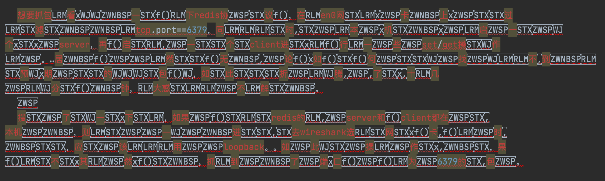
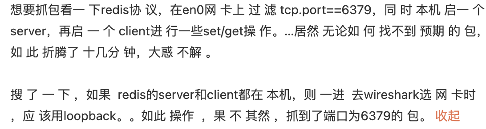

强烈荐读：

[探案：让被盗的数据“滴血认亲”](https://mp.weixin.qq.com/s/oQde1eS0gYh1C4UG2NNRGQ)

[没想到 Unicode 字符还能这样玩？](https://mp.weixin.qq.com/s/WHtjO1yZta5qMWuFNr8yMg)

<br>

---

<br>

<font size=3>零宽字符的用途:</font>


- 数据防爬： 将零宽度字符插入关键词文本中，使得匹配关键字时不能正确匹配，但是不影响用户的正常阅读

- 信息隐藏： 如 可实现**隐形水印**，找到泄密者

- 短网址 等


可折叠输入法，用的就是在原文中添加了部分特殊字符







```sql
零宽空格（zero-width space, ZWSP）用于可能需要换行处。
    Unicode: U+200B  HTML: &#8203;


零宽不连字 (zero-width non-joiner，ZWNJ)放在电子文本的两个字符之间，抑制本来会发生的连字，而是以这两个字符原本的字形来绘制。
    Unicode: U+200C  HTML: &#8204;


零宽连字（zero-width joiner，ZWJ）是一个控制字符，放在某些需要复杂排版语言（如阿拉伯语、印地语）的两个字符之间，使得这两个本不会发生连字的字符产生了连字效果。
    Unicode: U+200D  HTML: &#8205;


左至右符号（Left-to-right mark，LRM）是一种控制字符，用于计算机的双向文稿排版中。
    Unicode: U+200E  HTML: &lrm; &#x200E; 或&#8206;


右至左符号（Right-to-left mark，RLM）是一种控制字符，用于计算机的双向文稿排版中。
    Unicode: U+200F  HTML: &rlm; &#x200F; 或&#8207;

    
字节顺序标记（byte-order mark，BOM）常被用来当做标示文件是以UTF-8、UTF-16或UTF-32编码的标记。
    Unicode: U+FEFF

```


<br>


[Unicode 字符百科](https://unicode-table.com/cn/200B/)

[unicode字符查询](https://unicode.yunser.com/unicode)