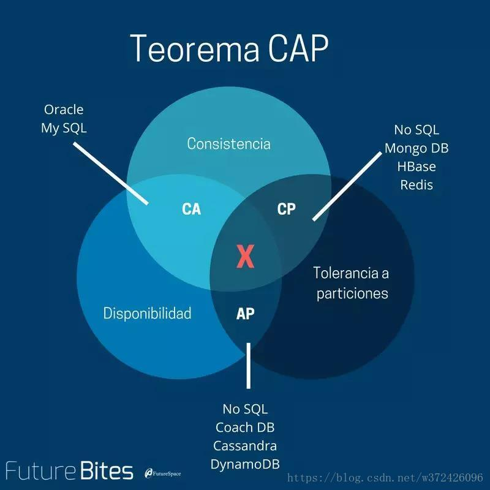
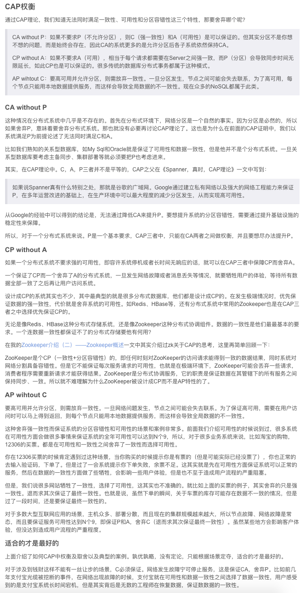

[相关内容参考此文](https://blog.csdn.net/w372426096/article/details/80437198),版权归原作者所有,转载请注明出处

`由UC Berkeley的Eric Brewer教授提出(故CAP定理(CAP theorem)又被称作布鲁尔定理(Brewer's theorem)),MIT的Seth Gilbert和Nancy Lynch从理论上予以证明.CAP理论已成为分布式计算领域的公认定理。`

 

## CAP理论

1.一致性（Consistency）：每次读操作都能保证返回的是最新数据；

2.可用性（Availablity）：任何一个没有发生故障的节点，会在合理的时间内返回一个正常的结果；

3.分区容忍性（Partition-torlerance）：当节点间出现网络分区，照样可以提供服务。

CAP理论指出：CAP三者只能取其二，不可兼得

类似`钱多或少离家近`,可以满足其二,但三者都满足理论上很难.就看如何取舍~

 

单机都只能保证CP,

etcd满足了CP,牺牲了高可用性

---

### Consistency 一致性

 

通常通过Raft或Paxos算法实现; 

Paxos协议是第一个被证明的一致性算法，但Paxos的论文非常晦涩难懂，导致基于Paxos的工程实践和教学都十分头疼; 于是Raft在设计的过程中，就从可理解性出发，使用算法分解和减少状态等手段，目前已经应用非常广泛.

---

### Availability 可用性

 

---

### Partition Tolerance分区容错性

 

---

微服务中必须要具备`Partition Tolerance`即分区容错性,否则没什么意义,故而,
依据CAP理论，必须在可用性（availability）和一致性（consistency）之间做出选择。

落地实践中，可用性一般是更好的选择，但是在服务和数据库之间维护数据一致性是非常根本的需求，微服务架构中应选择满足最终一致性。

---

 

## ACID中的"C"(`Consistency`),和CAP中的"C"(`Consistency`)的区别

[理解数据库的事务，ACID，CAP和一致性](https://www.jianshu.com/p/2c30d1fe5c4e)

 

---

 

更多参考:

[从Paxos不违反CAP来解释什么是CAP定理](https://www.jianshu.com/p/770880e5e200)

[浅谈分布式数据库中的事务](https://zhuanlan.zhihu.com/p/54749657)

[阮一峰-CAP 定理的含义](https://www.ruanyifeng.com/blog/2018/07/cap.html)