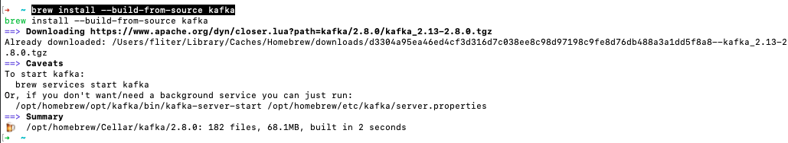
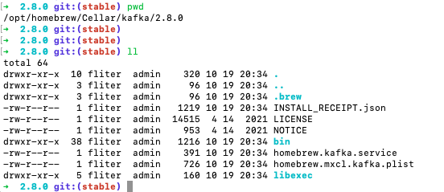
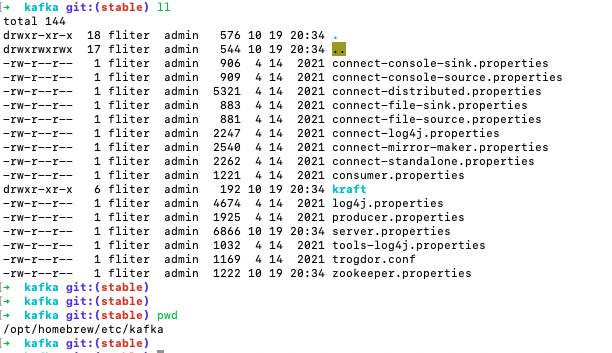
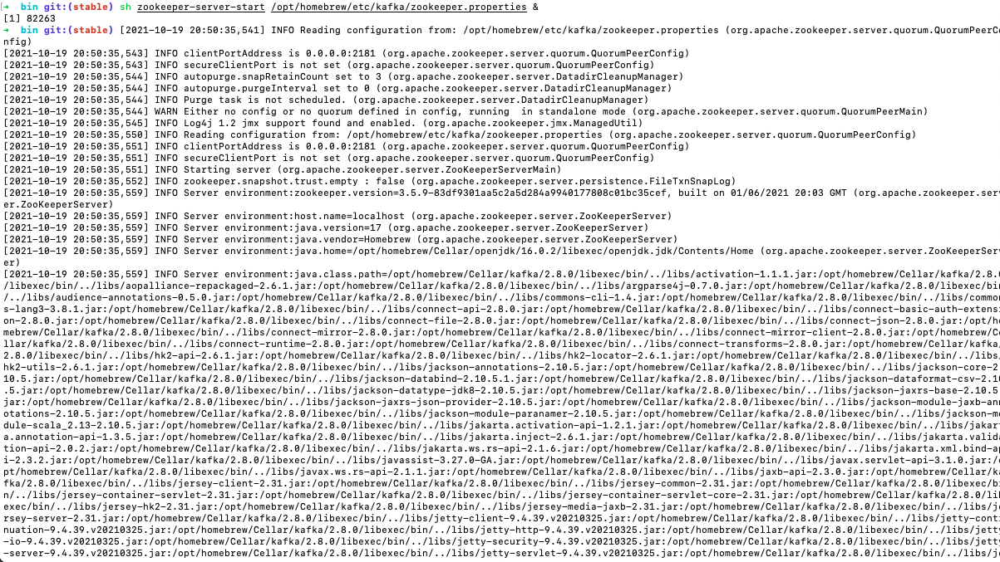
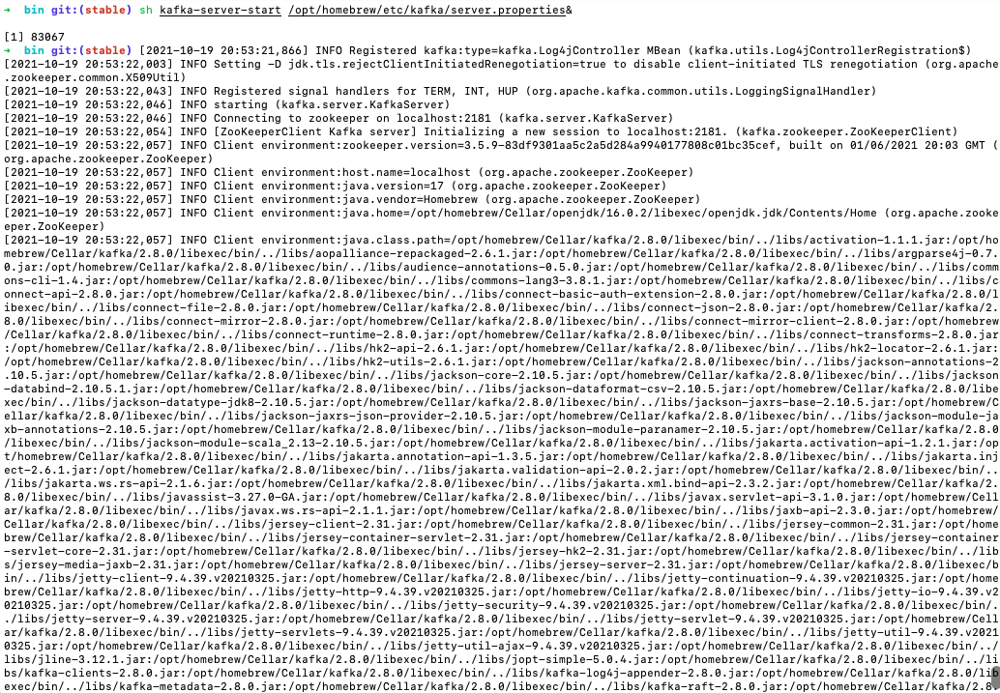
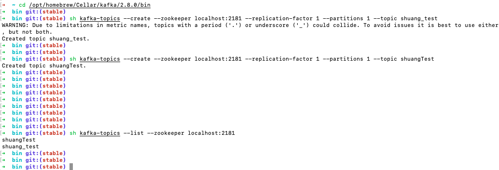
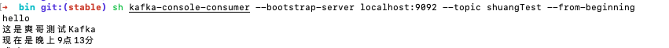
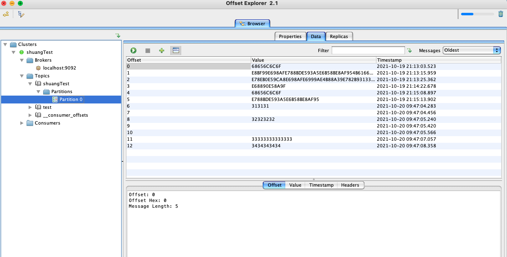

<br>


### 安装

<br>

对于Mac：

`brew install kafka`

如果是 M1，安装zookeeper时会失败。可[参考](https://zhuanlan.zhihu.com/p/367159436)下方的评论：


<font size=1 color="grey">


`brew install --build-from-source zookeeper `

m1芯片可以安装！亲测，需要更改一些东西。

brew 会先下载资源，然后通过 brew 里面安装的 maven 进行 mvn install，报错是因为 m1 使用 openjdk16 有bug！并不是zookeeper安装不了。


解决办法：

通过命令 `brew install openjdk@11` 安装**jdk11**，然后去homebrew的文件夹里找到mvn 的地址，如 /opt/homebrew/Cellar/maven/3.8.x/bin

这个文件夹下有个 mvn 文件。vim mvn 打开，内容如下：

```java
#!/bin/bash
JAVA_HOME="${JAVA_HOME:-/opt/homebrew/opt/openjdk/libexec/openjdk.jdk/Contents/Home}" exec "/opt/homebrew/Cellar/maven/3.8.1/libexec/bin/mvn" "$@"
```


大概可以看出这个命令是指定了使用brew安装的openjdk（虽然没写明，但是版本是默认的openjdk16）进行 mvn 操作，

更改前边的命令把指定的jdk版本换成我们刚才下载的11就行了，jdk11地址根据这个命令的地址，自己模仿着去homebrew文件夹里找。

即改为

```java
#!/bin/bash
JAVA_HOME="${JAVA_HOME:-/opt/homebrew/opt/openjdk@11/libexec/openjdk.jdk/Contents/Home}" exec "/opt/homebrew/Cellar/maven/3.8.2/libexec/bin/mvn"  "$@"
```

然后再重新执行`brew install --build-from-source zookeeper`，这时在报错那一步不会再报错，但是会卡住！

只需要等待就好！等了十多分钟，然后就完成了，不要以为卡住是有问题，要等其结束，比较慢。

</font>





目录为 `/opt/homebrew/Cellar/kafka/2.8.0/bin`




配置文件路径为 `/opt/homebrew/etc/kafka/server.properties`





<br>


---

<br>

### 启动 Zookeeper

<br>


`cd /opt/homebrew/Cellar/kafka/2.8.0/bin`

`sh zookeeper-server-start /opt/homebrew/etc/kafka/zookeeper.properties &`





<br>


---

<br>


### 启动 Kafka

<br>


`sh kafka-server-start /opt/homebrew/etc/kafka/server.properties&`





<br>


---

<br>


### 创建topic

<br>

`sh kafka-topics --create --zookeeper localhost:2181 --replication-factor 1 --partitions 1 --topic shuangTest `

<br>

---

<br>


### 查看创建的topic

<br>


`sh kafka-topics --list --zookeeper localhost:2181`


*带有句点 ('.') 或下划线 ('_') 的主题可能会发生冲突。 为避免出现问题，最好使用其中之一，但不能同时使用*




<br>

---

<br>


### 删除topic

<br>


`sh kafka-topics --zookeeper localhost:2181 --delete --topic shuang_test`


<br>

---

<br>


### 发送消息

<br>


Kafka提供了一个命令行客户端，从文件或标准输入接收输入，并将其作为消息发送到Kafka集群。

默认情况下，每行都将作为单独的消息发送。

<br>

运行生产者，然后在控制台中键入一些消息发送到服务器。

`sh kafka-console-producer --broker-list localhost:9092 --topic shuangTest`


<br>

**zookeeper的默认端口是2181，kafka的默认端口是9092**


<br>


---

<br>


### 消费消息

<br>

Kafka还有一个命令行消费者，将消息转储到标准输出


`sh kafka-console-consumer --bootstrap-server localhost:9092 --topic shuangTest --from-beginning`



<br>

---

<br>


### [使用可视化工具 Kafka Tool](https://blog.csdn.net/qq_20042935/article/details/105845495)


<br>


[Kafka可视化客户端工具（Kafka Tool 2）的安装和使用](https://www.hangge.com/blog/cache/detail_2945.html)
[Kafka可视化客户端工具Kafka Tool](https://w3sun.com/1067.html)
[]()




### 关闭Kafka & Zookeeper

<br>


`sh kafka-server-stop`

`sh zookeeper-server-stop`


---

<br>

