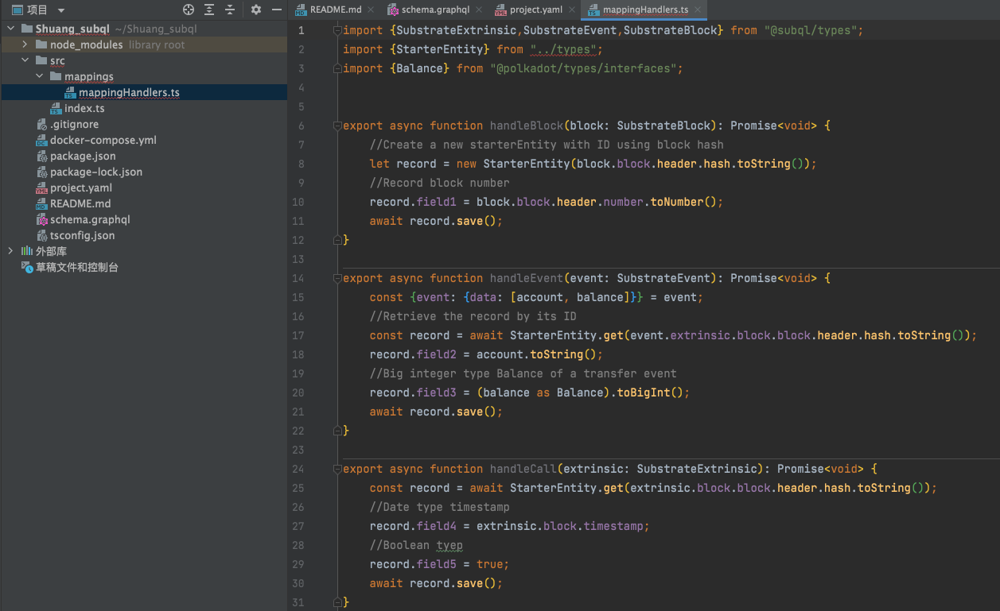

SubQuery是波卡生态的 The Graph(以太坊生态的数据服务提供者)

SubQuery可以让开发者专注于其核心用例和前端，而无需浪费时间来构建用于数据处理的后端。


<br>


### 下载SubQuery CLI

<br>

> npm install -g @subql/cli

> subql help 


<br>


### 初始化 Starter SubQuery 项目

<br>

> subql init --starter Shuang_subql


- Git 存储库（可选）：提供指向此 SubQuery 项目的，并将在其中托管的存储库的 Git URL（当托管在 SubQuery Explorer 中时）。

- RPC 端点（必需）：提供一个 wss URL给一个正在运行的 RPC 端点，该端点将默认用于此项目。 您可以快速访问不同 Polkadot 网络的公共端点，甚至可以使用 OnFinality，或仅使用默认的 Polkadot 端点创建您自己的私有专用节点。

- 作者（必填）：在此处输入此 SubQuery 项目的所有者。

- 描述（可选）：您可以提供关于您项目的简短段落，描述项目包含哪些数据以及用户可以使用它做什么。

- 版本（必填）：输入自定义版本号或使用默认版本 (1.0.0)。

- 许可证（必需）：提供此项目的软件许可证或接受默认（Apache-2.0）。

> cd Shuang_test

> npm install


<br>


### 配置和构建入门项目

<br>




之后的开发将主要处理以下文件：


- project.yaml 中的清单

- schema.graphql 中的 GraphQL 架构

- src/mappings/ 目录中的映射函数


<br>


### GraphQL 模型生成


<br>


> npm run-script codegen


此时会自动新建/src/types/models文件夹，里面是自动生成的文件

<br>


### 构建项目


<br>

> npm run-script build


<br>

### 运行 SubQuery 项目

<br>

打开本地的Docker，然后执行


> docker-compose pull && docker-compose up


<br>

### 查询新建的项目

<br>


打开浏览器并前往 http://localhost:3000


这时会看到 GraphQL playground 显示在资源管理器中，其模式是准备查询。 在 Playground 的右上角，会找到一个 Docs 按钮，该按钮将打开文档绘图。 该文档是自动生成的，能帮助找到可以查询的实体和方法。


对于新的 SubQuery 入门项目，可以尝试以下查询以了解其工作原理或了解有关 GraphQL 查询语言的更多信息。


```sql
{
  query{
    starterEntities(first:10){
      nodes{
        field1
        field2
        field3
        id
      }
    }
  }
}
```


<br>


现在有一个本地运行的 SubQuery 项目，该项目接受 GraphQL API 对示例数据的请求~

下一篇将向展示如何将新项目发布到 SubQuery Projects, 并使用ta们的资源管理器去查询

<br>

参考 

[SubQuery丨开发者快速入门指南](https://mp.weixin.qq.com/s/ymuziBgS9qr1R2_EXxdwHw)

[SubQuery丨Hello world 入门简介](https://mp.weixin.qq.com/s/6y9tHW1YPUWqjdYgnUte7Q)

[SubQuery开发者指南丨Hello World Explained](https://mp.weixin.qq.com/s/hX-xncFOkDTG8dC9HP9VSg)

[!!!SubQuery开发者指南丨清单文件（Manifest File）](https://mp.weixin.qq.com/s/ZIAJ1HKipaI6ZRkQ9pHIGA)