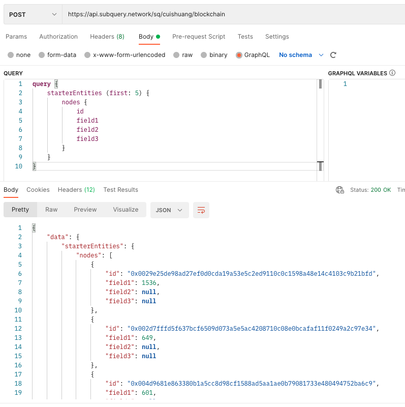

[SubQuery开发者指南丨Hello World (由SubQuery 托管)](https://mp.weixin.qq.com/s/Nyy3ogj0-ySOTczJBvpQxw)


<br>


### 创建项目

<br>

> subql init --starter Cui_subql


```sh
cd Cui_subql
npm install
npm run-script codegen
npm run-script build
```


<br>

### 创建 GitHub 存储库


<br>


git@github.com:cuishuang/subql_demo.git


<br>

### 推送到 GitHub

<br>


<br>

```sh
cd Cui_subql
git init
git remote add origin git@github.com:cuishuang/subql_demo.git  //将远程存储库设置为 git@github.com:cuishuang/subql_demo.git

git add .
git commit -m"first commit"
git push --set-upstream origin master
```


<br>

### 创建项目


<br>


点击[project.subquery.network](https://project.subquery.network)并使用github登录


- GitHub 帐户：如果有多个 GitHub 帐户，请选择将在哪个帐户下创建此项目。 在 GitHub 组织帐户中创建的项目在该组织的成员之间共享。

- 项目名称：在此处为项目命名。

- 副标题：为项目提供副标题。

- 描述：解释 SubQuery 项目的用途。

- GitHub 存储库 URL：这必须是包含 SubQuery 项目的公共存储库的有效 GitHub URL。schema.graphql 文件必须位于目录的根目录中。

- 隐藏项目：如果选中，这将在公共 SubQuery 浏览器中隐藏项目。 如果想与社区共享您的 SubQuery 项目，请不要选择此项！


<br>

单击创建后，将跳转到控制面板。这上面包含许多有用信息，如它使用的网络、它运行的源代码的 GitHub 存储库 URL、它的创建时间和上次更新时间，尤其是部署的详细信息


<br>

### 部署项目


<br>


现在已在 SubQuery Projects 中创建了项目，下一步是部署项目使其可操作。 

部署一个版本会触发新的 SubQuery 索引操作启动，并设置所需的查询服务以开始接受 GraphQL 请求。 还可以在此处将新版本部署到现有项目。


可以选择部署到各种环境，例如生产槽或暂存槽。 在这里，将部署到生产槽。 单击“部署”按钮会显示如下：


- 新版本的 Commit Hash：从 GitHub 中选择您要部署的 SubQuery 项目代码库的正确交付 (因为只有一个交付/提交，所以下拉菜单中只有一个选项)

- 索引器版本：这是要在其上运行此SubQuery项目的SubQuery节点服务的版本。 可登录[此网址参考](https://www.npmjs.com/package/@subql/node)

- 查询版本：这是要在其上运行此 SubQuery 项目的 SubQuery 查询服务的版本。 可登录[此网址参考](https://www.npmjs.com/package/@subql/query)


将使用最新版本的索引器和查询版本，因此此处接受默认值，然后单击“部署更新”


然后，将看到部署处于“正在处理”状态。 在这里，代码正在部署到 SubQuery 的托管基础架构上。 服务器正在按需启动并准备提供服务，这将需要几分钟的时间。


<br>

### 测试项目


<br>


<br>

### 运行一个简单的 GET 查询

<br>


Query Endpoint:	https://api.subquery.network/sq/cuishuang/blockchain


