Prometheus(普罗米修斯) 是一种 新型监控告警工具,Kubernetes的流行带动了Prometheus的应用。

全文参考自 [prometheus学习笔记(1)-mac单机版环境搭建](https://www.cnblogs.com/yjmyzz/p/how-to-install-prometheus-and-grafana.html)

<br>


---


### Mac上安装Prometheus

<br>

`brew install prometheus`


安装路径在 */usr/local/Cellar/prometheus/2.20.1*,

配置文件在 */usr/local/etc/prometheus.yml*:

```yaml
global:
  scrape_interval: 15s

scrape_configs:
  - job_name: "prometheus"
    static_configs:
    - targets: ["localhost:9090"]
```

<br>


切换到安装目录的bin文件夹,

> cd /usr/local/Cellar/prometheus/2.20.1/bin

执行:

> ./prometheus --config.file=/usr/local/etc/prometheus.yml


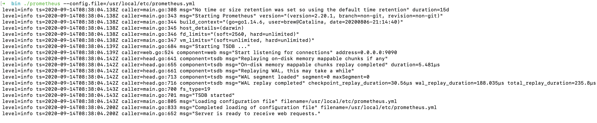

<br>

此时可访问`localhost:9090`,有如下页面:

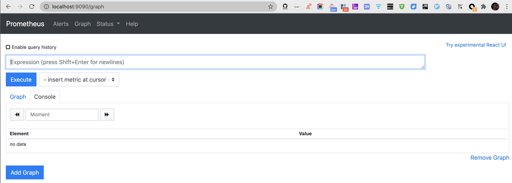

在**Status**中可以看到若干元信息.

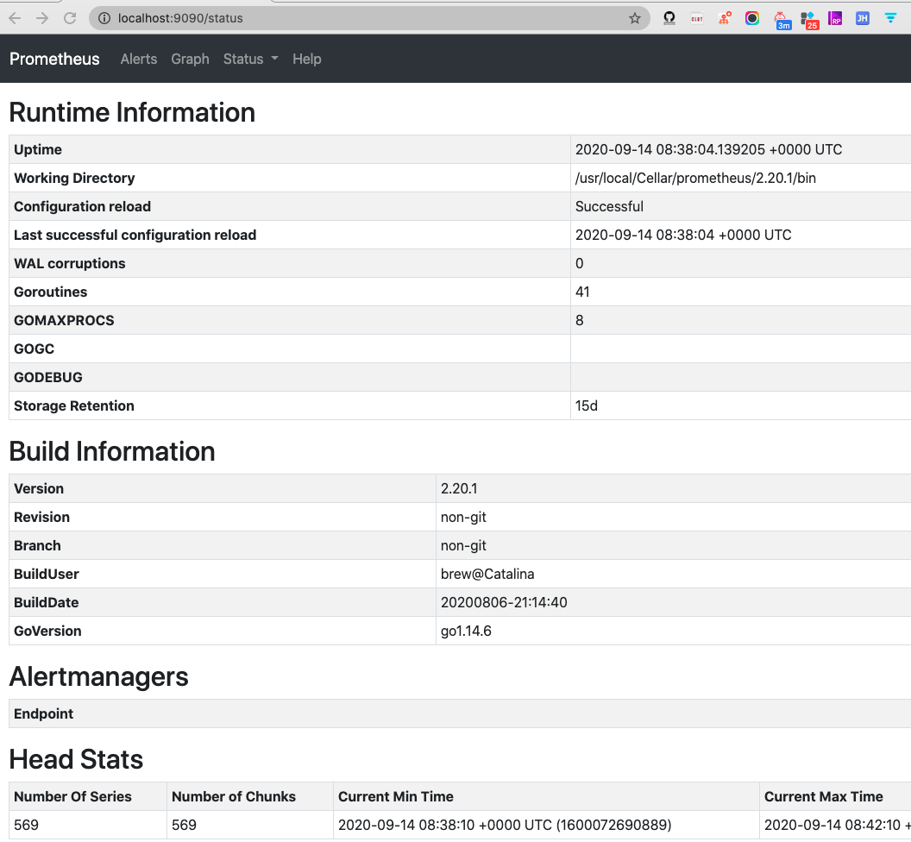


<br>


---

<br>

### 安装grafana

<br>


`brew install grafana`

安装路径在 */usr/local/Cellar/grafana/7.1.5*,

配置文件在 */usr/local/etc/grafana/grafana.ini*,

<font size=1>可在此修改默认的端口等信息</font>


<br>


启动:
> grafana-server --config=/usr/local/etc/grafana/grafana.ini --homepath /usr/local/share/grafana --packaging=brew cfg:default.paths.logs=/usr/local/var/log/grafana cfg:default.paths.data=/usr/local/var/lib/grafana cfg:default.paths.plugins=/usr/local/var/lib/grafana/plugins

访问`localhost:3000`,有如下页面:

<font size=1>(默认的用户名/密码均为admin,首次登陆必须修改密码)</font>


<br>


**Grafana** 是一个单纯的前端图表展示工具, 必须为其添加数据源,才能读取到数据进而进行展示, 参考下图:

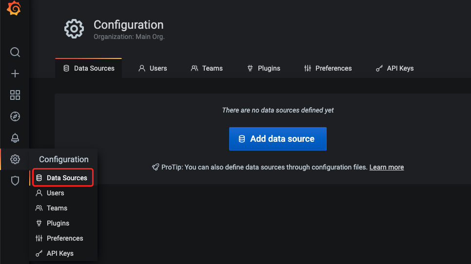

<br>

**Grafana** 支持非常多的数据源.
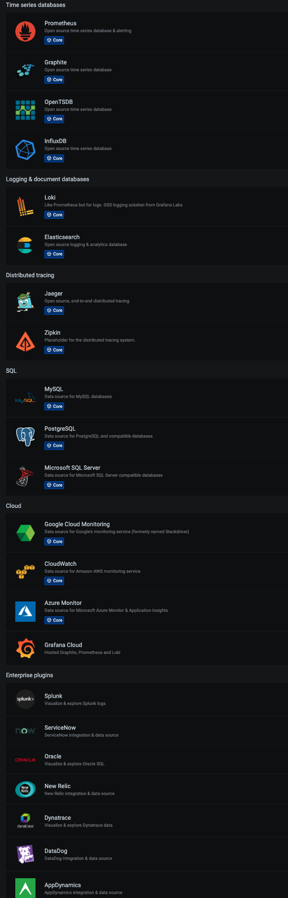


<br>


选择**Prometheus**数据源, 指定URL地址, 然后保存即可

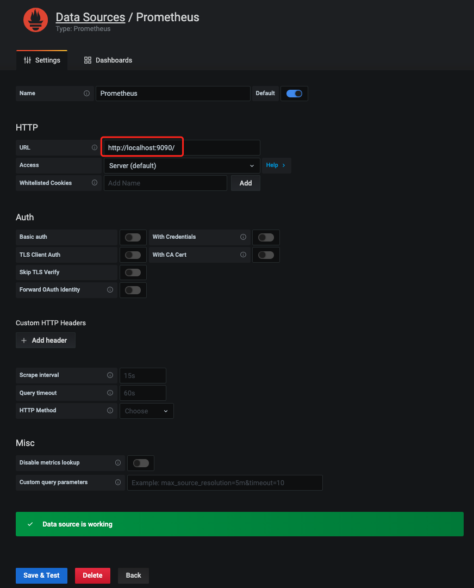

<br>


---


### 安装pushgateway

<br>

在 [Prometheus官网](https://prometheus.io/download/)搜索`pushgateway`, 下载 [pushgateway-1.2.0.darwin-amd64.tar.gz](https://github.com/prometheus/pushgateway/releases/download/v1.2.0/pushgateway-1.2.0.darwin-amd64.tar.gz)

本地解压,运行

> ./pushgateway

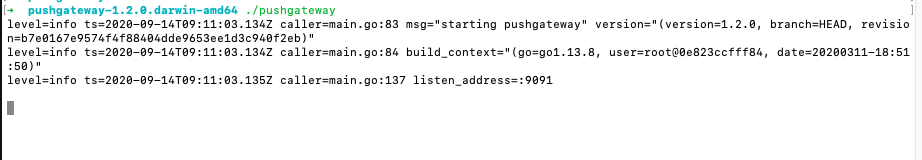

<br>


此时, 在`localhost:9091/`页面*Status*这个Tab页,可见:

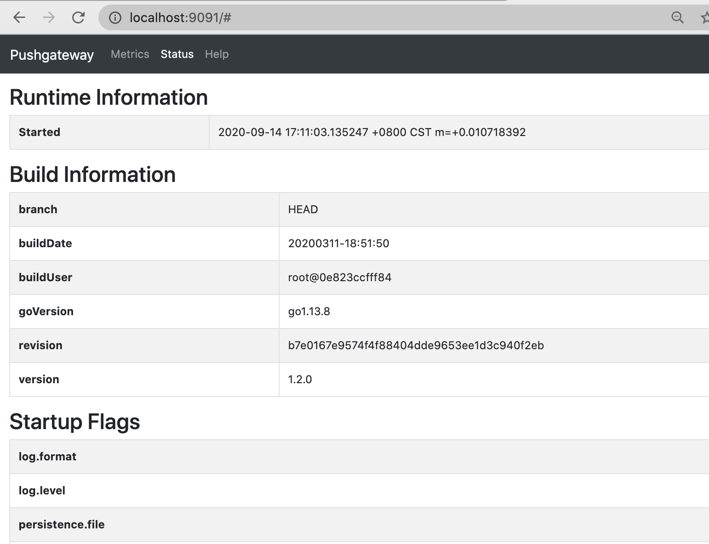


<font size=1>**pushgateway**的作用:(图片来自网络)</font>


<font size=1>(图片来自煎鱼大佬的 [Prometheus 快速入门](https://eddycjy.com/posts/prometheus/2020-05-16-startup/))</font>

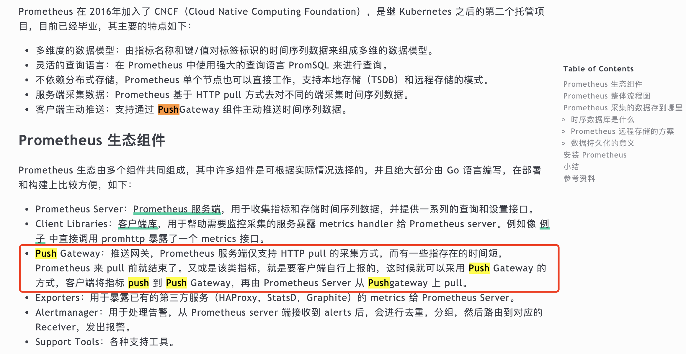


即  客户端(不管是通过代码, 还是直接终端敲命令行) 将数据push到网关(pushgateway), 然后Prometheus从网关pull数据


<br>

---

### 修改Prometheus的配置文件

<br>

> vim /usr/local/etc/prometheus.yml


增加如下几行,重启Prometheus,以让新的配置文件生效.

```yaml
  - job_name: "push-metrics"
    static_configs:
    - targets: ["localhost:9091"]
    honor_labels: true
```

<br>


(<font size=1>Prometheus提供了多种语言的sdk, 最简单的方式是通过shell)</font>

推送一个指标:

```shell
echo "cui_metric 100" | curl --data-binary @- http://localhost:9091/metrics/job/dashen_blog
```

<br>

推送多个指标:
```shell
cat <<EOF | curl --data-binary @- http://localhost:9091/metrics/job/dashen_blog
blog_visit_total{blogid="12345",domain="dashen.tech",clientip="10.0.1.1"} 20
blog_visit_total{blogid="34567",domain="dashen.tech",clientip="10.0.1.2"} 30
blog_visit_total{blogid="56789",domain="dashen.tech",clientip="10.0.1.3"} 40
EOF
```

<font size=1> blog_visit_total相当于指标名称，{ }中的内容相当于tag，在查询时可根据tag进行过滤，最后的20、30、40相当于具体的指标值。</font>


<font size=1>dashen_blog是job名称, 可根据需要修改</font>

<br>

此时http://localhost:9091上, 已能看到刚才push的数据:


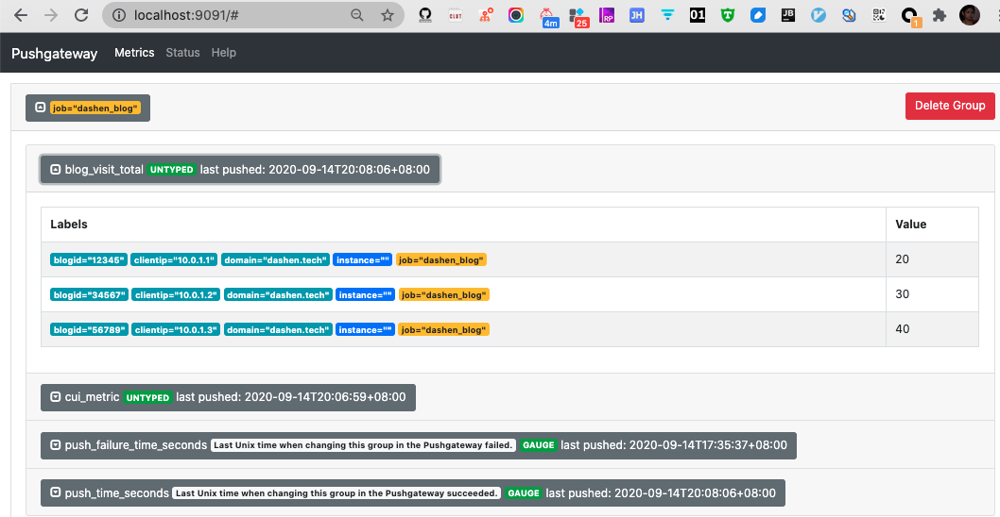

<br>

http://localhost:9090, Prometheus里也能感知刚添加的数据 

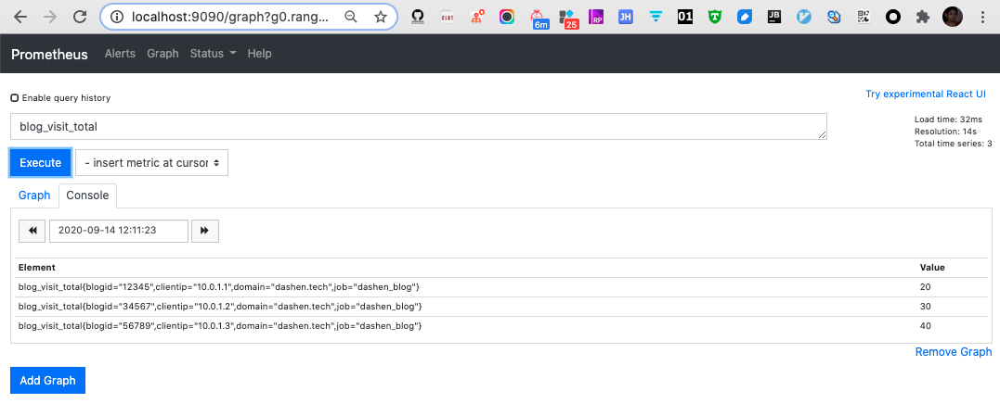

Prometheus本质上是一个时序数据库. curl命令可以多执行几次, 相当于持续向时序数据库中写入数据.


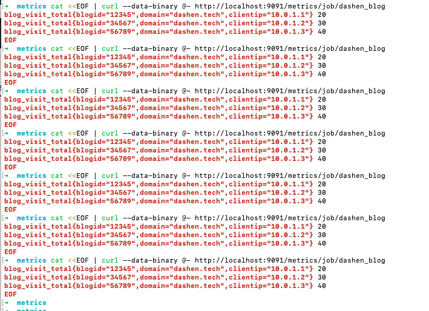

<br>

---


### 配置Grafana

<br>

**1.新建Dashboard**


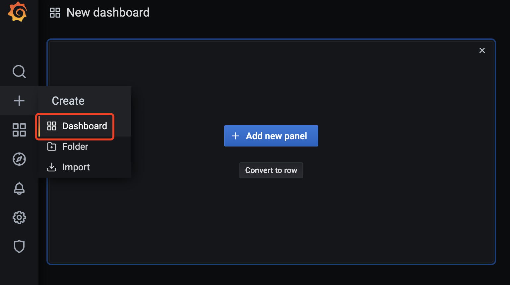


<br>

可在*设置*中进行相关修改

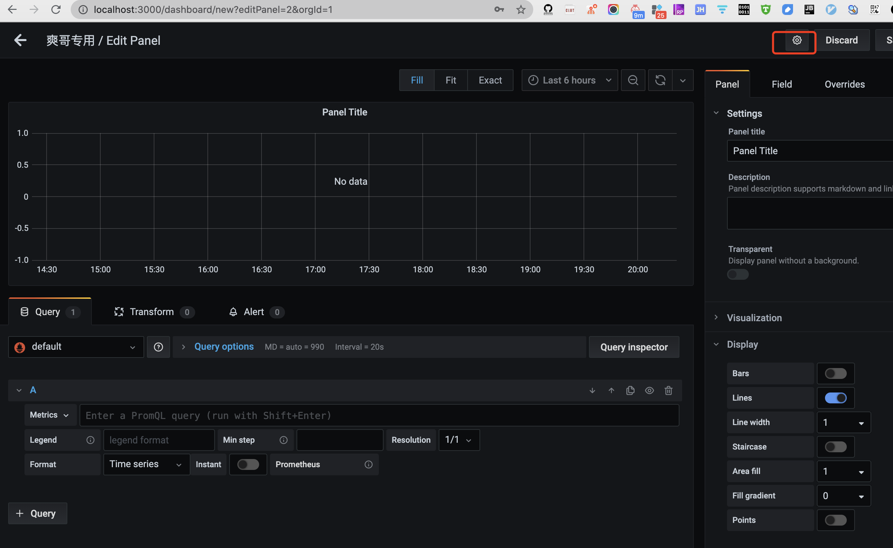

---

<br>

**2.添加图表**

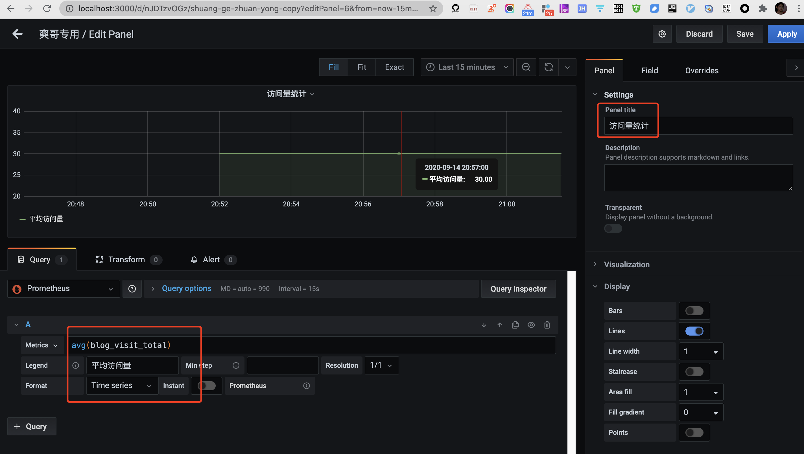

<font size=1>(可以用sum/max/min/avg这类聚合函数统计指标)</font>

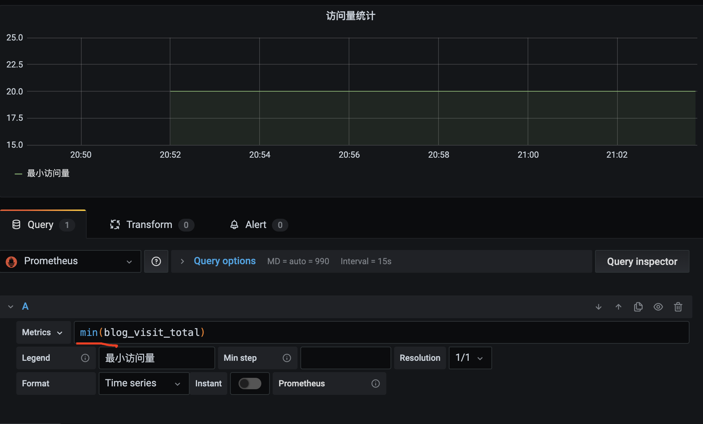

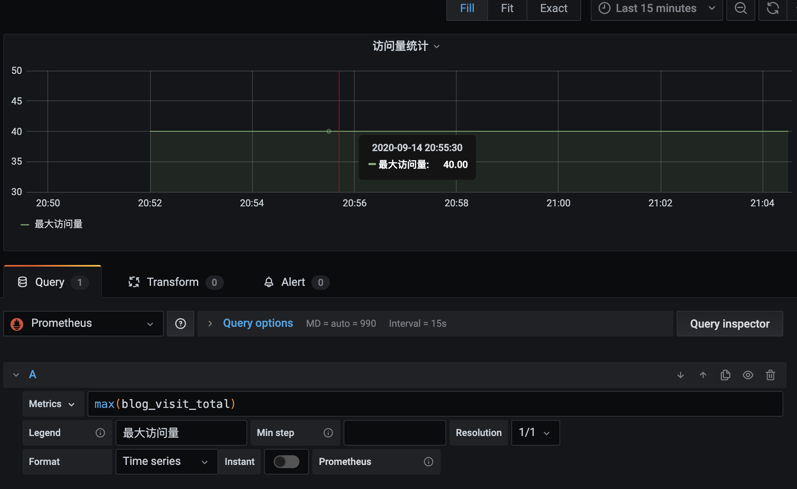

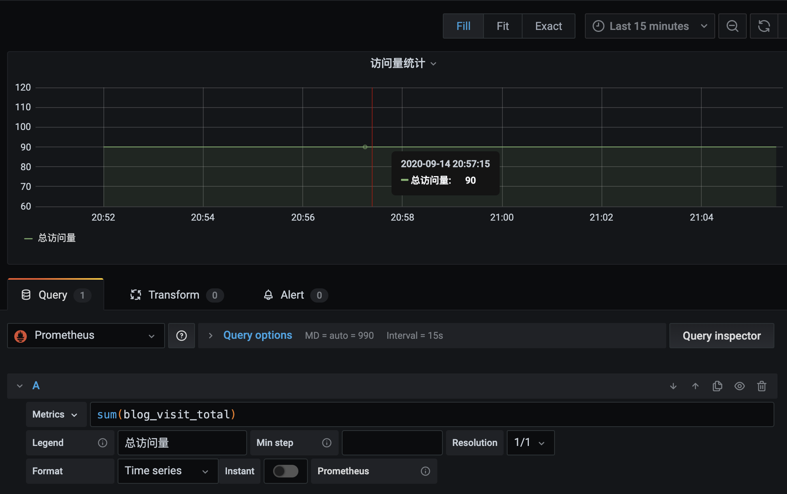


---


<br>


参考&进阶:


[新型监控告警工具prometheus（普罗米修斯）的入门使用](https://blog.csdn.net/lijiaocn/article/details/81865120)


[Prometheus 快速入门](https://eddycjy.com/posts/prometheus/2020-05-16-startup/)

[Prometheus 四大度量指标的了解和应用](https://eddycjy.com/posts/prometheus/2020-05-16-metrics/)

[使用 Prometheus 对 Go 程序进行指标采集](https://eddycjy.com/posts/prometheus/2020-05-16-pull/)