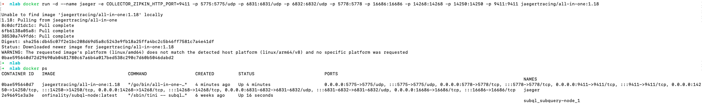
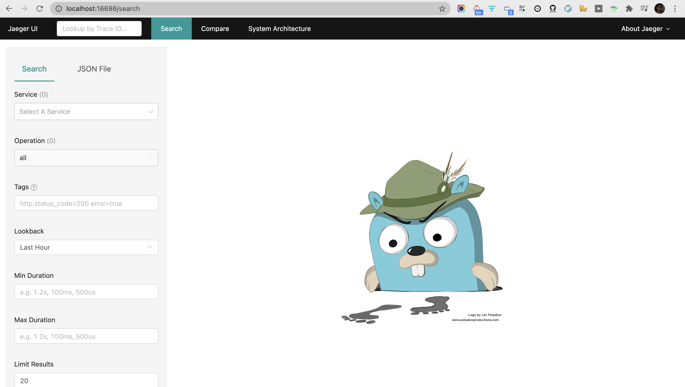
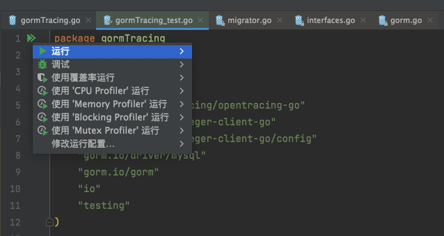
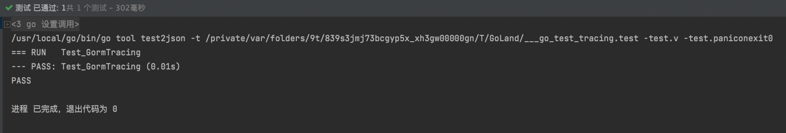
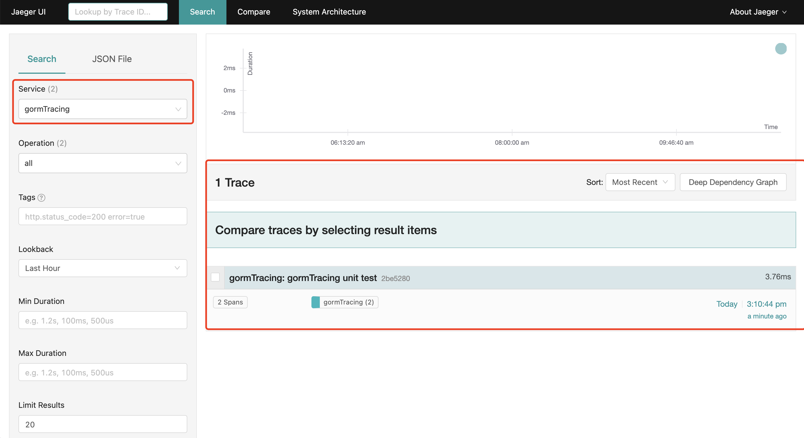
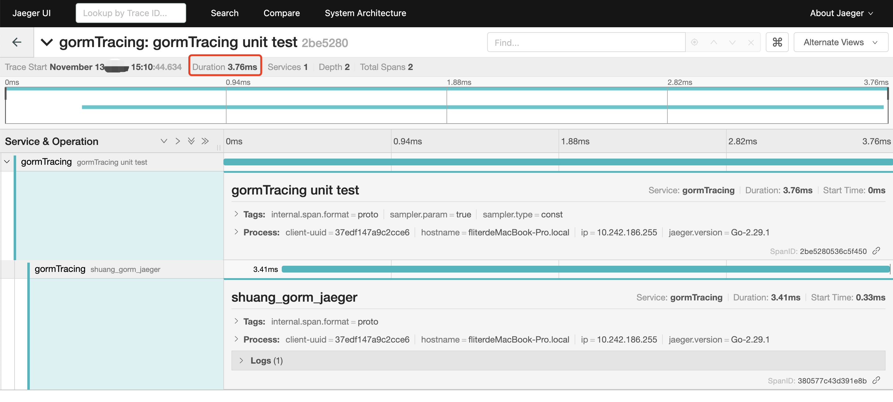
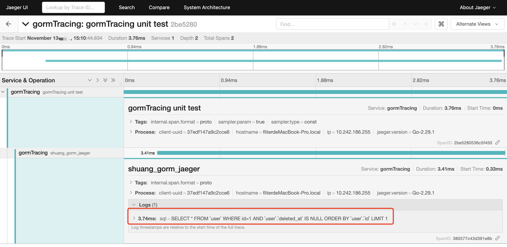
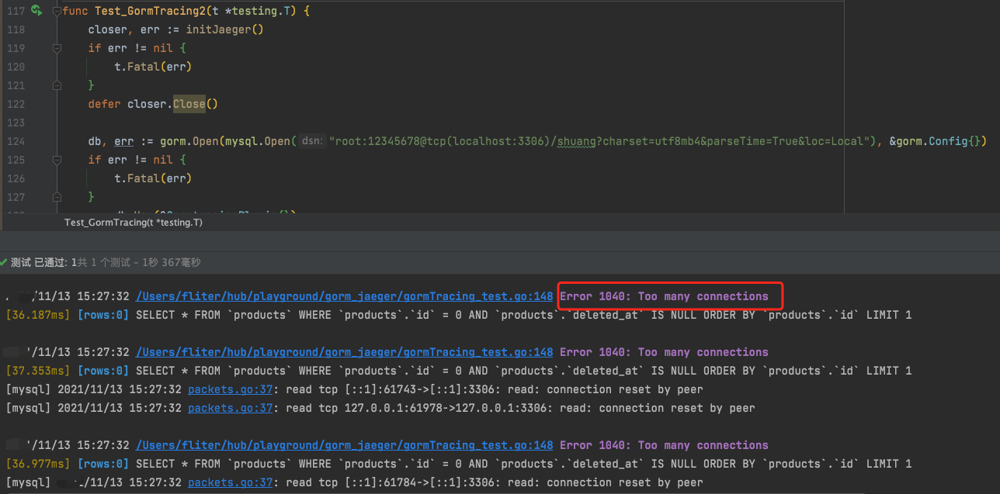
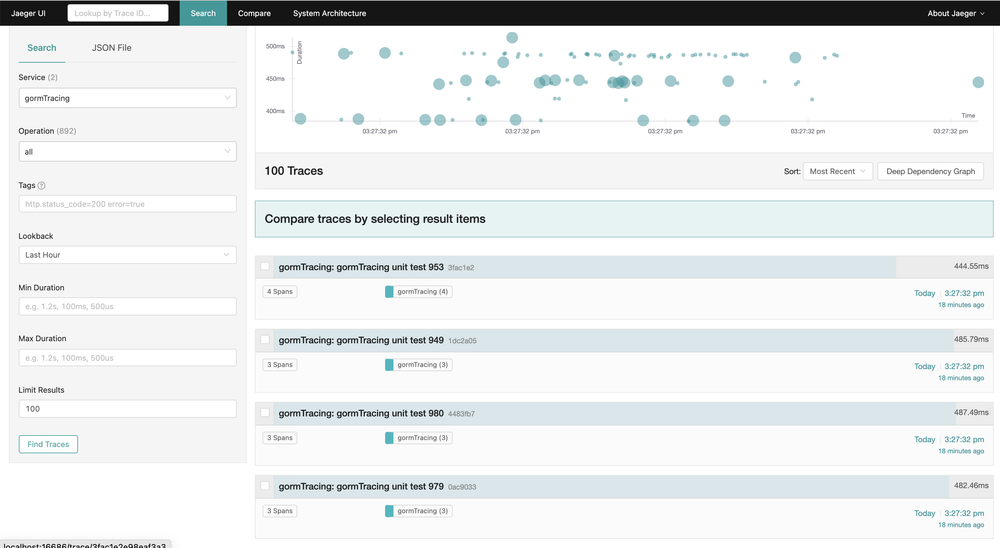

姊妹篇:

[prometheus入门](https://dashen.tech/2020/09/14/prometheus%E5%85%A5%E9%97%A8/)


<br>

本篇是对 [Golang 上手GORM V2 + Opentracing链路追踪优化CRUD体验（源码阅读）](https://github.com/codehorseman/gormTracing) 阅读与实践

<br>


[该篇相关代码](https://github.com/cuishuang/gorm_and_jaeger)

<br>


---

<br>


GORM V2版本开始支持Context上下文传递，支持插件Plugins(有了插件，callback和hook的代码就能更优雅一点)

ORM利用反射，以牺牲一定的性能为代价，快速构建项目


<br>

### 使用Docker搭建Opentracing + jaeger 平台


<br>


`docker run -d --name jaeger -e COLLECTOR_ZIPKIN_HTTP_PORT=9411 -p 5775:5775/udp -p 6831:6831/udp -p 6832:6832/udp -p 5778:5778 -p 16686:16686 -p 14268:14268 -p 14250:14250 -p 9411:9411 jaegertracing/all-in-one:1.18`





访问 [http://localhost:16686/](http://localhost:16686/) 如下：





<br>

---

<br>

### 编写CallBacks插件


<br>

> CallBacks和Hook不同,前者将伴随GORM的DB对象的整个生命周期,利用CallBacks对GORM框架进行侵入,实现自定义的一些功能

<br>

#### 1. 在每次SQL操作前,从context上下文生成子span

<br>


**gormTracing.go:**

```go
package gormTracing

import (
	"github.com/opentracing/opentracing-go"
	"gorm.io/gorm"
)

const gormSpanKey = "__gorm_spqn"

func before(db *gorm.DB) {

	//生成子span。 名字可以自定义
	span, _ := opentracing.StartSpanFromContext(db.Statement.Context, "shuang_gorm_jaeger")

	// 利用db实例去传递span
	// gorm v1.x版本没有InstanceSet，有scope.Set
	db.InstanceSet(gormSpanKey, span)

}
```

<br>

#### 2. 在每次SQL操作后 从DB实例拿到Span并记录数据

<br>

**gormTracing.go:**

```go
func after(db *gorm.DB) {
	_span, isExist := db.InstanceGet(gormSpanKey)
	if !isExist {
		// 不存在则直接抛弃掉
		return
	}

	// 断言 进行类型转换
	span, ok := _span.(opentracing.Span)
	if !ok {
		return
	}

	// 一定要Finish掉
	defer span.Finish()

	// 记录error
	if db.Error != nil {
		span.LogFields(tracerLog.Error(db.Error))
	}

	span.LogFields(tracerLog.String("sql", db.Dialector.Explain(db.Statement.SQL.String(), db.Statement.Vars...)))

}
```


同样可以非常简单就可以从DB的Setting中，拿到用于处理GORM操作的子Span。

只需要调用span的LogFields方法就能记录下想要的信息


<br>

#### 3. 创建结构体，实现gorm.Plugin接口

<br>


**gormTracing.go:**
```go
const (
	callBackBeforeName = "opentracing:before"
	callBackAfterName  = "opentracing:after"
)

type OpentracingPlugin struct{}

func (op *OpentracingPlugin) Name() string {
	return "opentracingPlugin"
}

func (op *OpentracingPlugin) Initialize(db *gorm.DB) (err error) {
	// 开始前 - 并不是都用相同的方法，可自定义
	db.Callback().Create().Before("gorm:before_create").Register(callBackBeforeName, before)
	db.Callback().Query().Before("gorm:query").Register(callBackBeforeName, before)
	db.Callback().Delete().Before("gorm:before_delete").Register(callBackBeforeName, before)
	db.Callback().Update().Before("gorm:setup_reflect_value").Register(callBackBeforeName, before)
	db.Callback().Row().Before("gorm:row").Register(callBackBeforeName, before)
	db.Callback().Raw().Before("gorm:raw").Register(callBackBeforeName, before)

	// 结束后 - 并不是都用相同的方法，可自定义
	db.Callback().Create().After("gorm:after_create").Register(callBackAfterName, after)
	db.Callback().Query().After("gorm:after_query").Register(callBackAfterName, after)
	db.Callback().Delete().After("gorm:after_delete").Register(callBackAfterName, after)
	db.Callback().Update().After("gorm:after_update").Register(callBackAfterName, after)
	db.Callback().Row().After("gorm:row").Register(callBackAfterName, after)
	db.Callback().Raw().After("gorm:raw").Register(callBackAfterName, after)
	return
}

// 告诉编译器这个结构体实现了gorm.Plugin接口
var _ gorm.Plugin = &OpentracingPlugin{}
```

<br>

需要给GORM所有的最终操作（Create、Query、Delete、Update、Row、Raw等）, 注册上刚刚编写的两个方法 `before`和`after` （即在sql执行前要做的操作，和sql执行后要做的操作）

<br>


GORM的Plugin接口源码如下：

```go
// Plugin GORM plugin interface
type Plugin interface {
	Name() string
	Initialize(*DB) error
}
```
只需如上面代码，实现**Name**和**Initialize**这两个方法，即实现了这个接口


<br>

---

<br>

### 单元测试


<br>


#### 1. 初始化Jeager

<br>


**gormTracing_test.go:**


```go
package gormTracing

import (
	"github.com/opentracing/opentracing-go"
	"github.com/uber/jaeger-client-go"
	"github.com/uber/jaeger-client-go/config"
	"io"
)

func initJaeger() (closer io.Closer, err error) {
	// 根据配置初始化Tracer， 返回Closer

	tracer, closer, err := (&config.Configuration{
		ServiceName: "gormTracing",
		Disabled:    false,
		Sampler: &config.SamplerConfig{
			Type: jaeger.SamplerTypeConst,
			// param的值在0到1之间，设置为1则将所有的Operation输出到Reporter
			Param: 1,
		},
		Reporter: &config.ReporterConfig{
			LogSpans:           true,
			LocalAgentHostPort: "localhost:6831",
		},
	}).NewTracer()

	if err != nil {
		return
	}

	// 设置全局Tracer - 如果不设置将会导致上下文无法生成正确的Span
	opentracing.SetGlobalTracer(tracer)
	return

}
```

<br>

#### 2. 实现GORM官方范例

<br>


[GORM V2文档](https://gorm.io/zh_CN/docs/)

```go
package gormTracing

import (
	"context"
	"github.com/opentracing/opentracing-go"
	"github.com/uber/jaeger-client-go"
	"github.com/uber/jaeger-client-go/config"
	"gorm.io/driver/mysql"
	"gorm.io/gorm"
	"io"
	"testing"
)

func initJaeger() (closer io.Closer, err error) {
	// 根据配置初始化Tracer， 返回Closer

	tracer, closer, err := (&config.Configuration{
		ServiceName: "gormTracing",
		Disabled:    false,
		Sampler: &config.SamplerConfig{
			Type: jaeger.SamplerTypeConst,
			// param的值在0到1之间，设置为1则将所有的Operation输出到Reporter
			Param: 1,
		},
		Reporter: &config.ReporterConfig{
			LogSpans:           true,
			LocalAgentHostPort: "localhost:6831",
		},
	}).NewTracer()

	if err != nil {
		return
	}

	// 设置全局Tracer - 如果不设置将会导致上下文无法生成正确的Span
	opentracing.SetGlobalTracer(tracer)
	return

}

type Product struct {
	gorm.Model
	Code  string
	Price uint
}
type User struct {
	gorm.Model
	Id     int
	Name   string
	gender string
}

// V2需要利用Driver来连接MySQL数据库
func Test_GormTracing(t *testing.T) {
	// 1. 初始化Jaeger
	closer, err := initJaeger()
	if err != nil {
		t.Fatal(err)
	}
	defer closer.Close()

	// 2. 连接数据库
	// "user:pass@tcp(127.0.0.1:3306)/dbname?charset=utf8mb4&parseTime=True&loc=Local"
	dsn := "root:12345678@tcp(localhost:3306)/shuang?charset=utf8mb4&parseTime=True&loc=Local"
	db, err := gorm.Open(mysql.Open(dsn), &gorm.Config{})
	if err != nil {
		t.Fatal(err)
	}

	// 3. 最重要的一步，使用之前自定义的插件
	_ = db.Use(&OpentracingPlugin{})

	// 迁移 schema ---> 生成对应的数据表
	//_ = db.AutoMigrate(&Product{})

	// 4. 生成新的Span - 注意将span结束掉，不然无法发送对应的结果
	span := opentracing.StartSpan("gormTracing unit test")
	defer span.Finish()

	// 5. 把生成的Root Span写入到Context上下文，获取一个子Context
	// 通常在Web项目中，Root Span由中间件生成
	ctx := opentracing.ContextWithSpan(context.Background(), span)

	// 6. 将上下文传入DB实例，生成Session会话
	// 这样子就能把这个会话的全部信息反馈给Jaeger
	session := db.WithContext(ctx)

	// ---> 下面是官方文档GORM的范例
	// Create
	//session.Create(&Product{Code: "D42", Price: 100})
	//
	//// Read
	//var product Product
	//session.First(&product, 1)                 // 根据整形主键查找
	//session.First(&product, "code = ?", "D42") // 查找 code 字段值为 D42 的记录
	//
	//// Update - 将 product 的 price 更新为 200
	//session.Model(&product).Update("Price", 200)
	//// Update - 更新多个字段
	//session.Model(&product).Updates(Product{Price: 200, Code: "F42"}) // 仅更新非零值字段
	//session.Model(&product).Updates(map[string]interface{}{"Price": 200, "Code": "F42"})
	//
	//// Delete - 删除 product
	//session.Delete(&product, 1)

	var user User
	//db.Table("user").Where("id=?", 1).First(&user)
	session.Table("user").Where("id=?", 1).First(&user)

}


```


<br>

#### 3. 执行并查看结果

<br>






<br>


访问Jaeger控制台（localhost:16686），可发现有一条新的记录：



<br>

点击进入查看详情，可以非常清楚看到整个单元测试从开始到结束的SQL执行情况：

总共执行了2条SQL命令，整个过程耗时3.76ms（因为连接的本地库，所以比较快）



<br>


点开对应的Span，可以看到每次GORM操作所执行的SQL命令：




<br>

> 至此使用OpenTracing对GORM执行过程进行链路追踪已成功实现，从此摆脱需要检索庞大日志查找慢查询、异常和错误的情况，直接一目了然


<br>

#### 4. 并发情况下链路追踪的效果

<br>

```go
func Test_GormTracing2(t *testing.T) {
	closer, err := initJaeger()
	if err != nil {
		t.Fatal(err)
	}
	defer closer.Close()

	db, err := gorm.Open(mysql.Open("root:12345678@tcp(localhost:3306)/shuang?charset=utf8mb4&parseTime=True&loc=Local"), &gorm.Config{})
	if err != nil {
		t.Fatal(err)
	}
	_ = db.Use(&OpentracingPlugin{})

	rand.Seed(time.Now().UnixNano())

	num, wg := 1<<10, &sync.WaitGroup{}

	wg.Add(num)

	for i := 0; i < num; i++ {
		go func(t int) {
			span := opentracing.StartSpan(fmt.Sprintf("gormTracing unit test %d", t))
			defer span.Finish()

			ctx := opentracing.ContextWithSpan(context.Background(), span)
			session := db.WithContext(ctx)

			p := &Product{Code: strconv.Itoa(t), Price: uint(rand.Intn(1 << 10))}

			session.Create(p)

			session.First(p, p.ID)

			session.Delete(p, p.ID)

			wg.Done()
		}(i)
	}

	wg.Wait()
}
```




<br>




<br>


### 番外：GORM V2 部分源码阅读


<br>

[ GORM V2 部分源码阅读](https://github.com/avtion/gormTracing)

<br>


---


<br>

更多参考:

[Jaeger V1.18文档](https://www.jaegertracing.io/docs/1.18/getting-started/)


[分布式链路追踪：OpenTracing SDK 与 Jaeger 的对接方法](https://www.lijiaocn.com/%E7%BC%96%E7%A8%8B/2020/02/15/opentracing.html)

[gRPC与分布式链路追踪](https://www.selinux.tech/golang/grpc/grpc-tracing)


[全链路监控Jaeger搭建实战](https://www.jianshu.com/p/ffc597bb4ce8)


