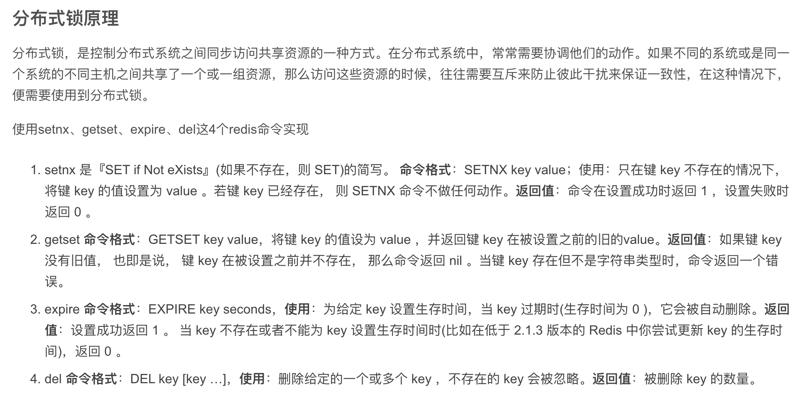

分布式锁可以基于数据库方式、基于redis方式、基于ZooKeeper方式去实现，一般基于redis的使用比较多


[分布式锁机制原理及实现方式](https://segmentfault.com/a/1190000016351095)


<br>


以用户抢优惠券为例，100张优惠券，10000个用户来抢：


**使用setnx，添加一个锁标志位，如称为lockKey, 如果添加成功, 则能够继续向下执行扣减优惠券数量操作, 最后再释放此标志位**


> setnx(key, value)，key不存在就新增，存在就什么都不做。同时有多个客户端发送setnx命令，只有一个客户端可以成功，返回1（true）；其他的客户端返回0（false)

但这样在一定情况下可能发生死锁 （如果获取到锁的线程，异常结束, 没有执行释放锁操作, 这样就会 产生死锁）


<br>

**对 Redis 的 锁标志位加上过期时间即可**

但在极端情况下，如请求加锁成功后, 接着还没来得及设置过期时间就宕机...


需要使*添加锁标志位 & 添加过期时间命令* 具有原子性，要么一起成功, 要么一起失败


<br>


从 Redis 2.6.x 版本起, 提供了可选的 字符串 set 复合命令,可以保证添加字符串&设置超时时间是原子的


> SET key value [expiration EX seconds|PX milliseconds] [NX|XX]


- EX: 设置超时时间，单位是秒

- PX: 设置超时时间，单位是毫秒

- NX: IF NOT EXIST 的缩写，只有 KEY 不存在的前提下 才会设置值

- XX: IF EXIST 的缩写，只有在 KEY 存在的前提下 才会设置值


<br>


如`set(locakKey,"当前状态，如locked"，”nx“，”ex“，5)` ，即如果没有locakKey，则原子性的设置locakKey值为locked，过期时间为5秒

这样 加锁以及设置过期时间就确实保证了原子性


<br>


还可能存在问题：

线程一获取锁成功, 设置过期时间五秒, 接着执行业务逻辑；执行的时间超过了过期时间， 锁标志位过期将进行释放。此时线程二获取锁成功；接着线程一执行完成, 执行释放锁的逻辑, 会顺手把线程二获取取的锁释放了，这时再来线程三，还是可以和线程二同时拿到这个资源  (如线程2执行时，就剩下最后一张优惠券了，线程三再一来，相当于超卖了)

<br>


创建辨别业务身份的唯一uuid，将这个uuid作为lockKey的value

解锁时需要判断锁的 val 是否和自己uuid的相同, 辨别成功才会释放锁


<br>

但可能还有问题

因为*判断锁能不能释放*和*删除标志位*并不是原子性的, 所以可能还是会存在误删


但redis的del 删除操作并没有提供原子命令...


Redis 2.6.x后 允许开发者使用 Lua 语言编写脚本，并传到 Redis 中执行；Redis 会将 Lua 脚本中的命令当作一个整体执行, 中间不会插入其它命令

在Lua脚本中处理，保重删除的原子性


<br>





---


<br>


更多：


[redis分布式锁原理与实现](https://blog.csdn.net/dazou1/article/details/88088223)


[分布式锁基本原理](https://dunwu.github.io/design/distributed/%E5%88%86%E5%B8%83%E5%BC%8F%E9%94%81.html#zookeeper-%E5%88%86%E5%B8%83%E5%BC%8F%E9%94%81%E5%AE%9E%E7%8E%B0)


<br>

关键词：

```
setnx 
getset
expire
del及lua脚本
```

