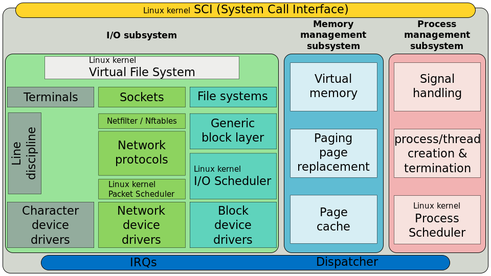
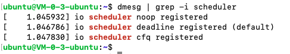

**Linux IO Scheduler**即 *Linux IO 调度器*,其基本目的是将请求按照它们对应在块设备上的扇区号进行排列，以减少磁头的移动，提高效率

 

## 一、I/O调度的4种算法

 

### CFQ (完全公平队列 Completely Fair Queueing)

完全公平队列（Completely Fair Queueing）

特点:

在最新的内核版本和发行版中,都选择CFQ做为默认的I/O调度器,对于通用的服务器也是最好的选择.
CFQ试图均匀地分布对I/O带宽的访问,避免进程被饿死并实现较低的延迟,是deadline和as调度器的折中.
CFQ对于多媒体应用(video,audio)和桌面系统是最好的选择.
CFQ赋予I/O请求一个优先级,而I/O优先级请求独立于进程优先级,高优先级的进程的读写不能自动地继承高的I/O优先级.

工作原理:
CFQ为每个进程/线程,单独创建一个队列来管理该进程所产生的请求,也就是说每个进程一个队列,各队列之间的调度使用时间片来调度,
以此来保证每个进程都能被很好的分配到I/O带宽.I/O调度器每次执行一个进程的4次请求.

 

---

 

### NOOP(电梯式调度程序)

特点:

在Linux2.4或更早的版本的调度程序,那时只有这一种I/O调度算法.
NOOP实现了一个简单的FIFO队列,它像电梯的工作主法一样对I/O请求进行组织,当有一个新的请求到来时,它将请求合并到最近的请求之后,以此来保证请求同一介质.
NOOP倾向饿死读而利于写.
NOOP对于闪存设备,RAM,嵌入式系统是最好的选择.
电梯算法饿死读请求的解释:
因为写请求比读请求更容易.
写请求通过文件系统cache,不需要等一次写完成,就可以开始下一次写操作,写请求通过合并,堆积到I/O队列中.
读请求需要等到它前面所有的读操作完成,才能进行下一次读操作.在读操作之间有几毫秒时间,而写请求在这之间就到来,饿死了后面的读请求.

 

---

 

### Deadline(截止时间调度程序)

特点:

通过时间以及硬盘区域进行分类,这个分类和合并要求类似于noop的调度程序.
Deadline确保了在一个截止时间内服务请求,这个截止时间是可调整的,而默认读期限短于写期限.这样就防止了写操作因为不能被读取而饿死的现象.
Deadline对数据库环境(ORACLE RAC,MYSQL等)是最好的选择.

 

---

 

### AS(预料I/O调度程序)

特点:
本质上与Deadline一样,但在最后一次读操作后,要等待6ms,才能继续进行对其它I/O请求进行调度.
可以从应用程序中预订一个新的读请求,改进读操作的执行,但以一些写操作为代价.
它会在每个6ms中插入新的I/O操作,而会将一些小写入流合并成一个大写入流,用写入延时换取最大的写入吞吐量.
AS适合于写入较多的环境,比如文件服务器
AS对数据库环境表现很差.

---

 

### 查看系统配置

 

#### 1.查看当前系统支持的IO调度算法

`dmesg | grep -i scheduler`

 

#### 2.查看当前系统的I/O调度方法

`cat /sys/block/sda/queue/scheduler`

该命令对ubuntu无效..

[ubuntu wiki-IOSchedulers](https://wiki.ubuntu.com/Kernel/Reference/IOSchedulers)

 

#### 3.临时及永久更改I/O调度方法

临地更改I/O调度方法:
例如:想更改到noop电梯调度算法:
`echo noop > /sys/block/sda/queue/scheduler`

永久更改:

修改内核引导参数,加入elevator=调度程序名
`vi /boot/grub/menu.lst`
更改到如下内容:
`kernel /boot/vmlinuz-2.6.18-8.el5 ro root=LABEL=/ elevator=deadline rhgb quiet`

---

 

参考:

[Linux I/O 调度算法](https://www.cnblogs.com/reaperhero/p/10261625.html#idx_4)

[Linux IO Scheduler（Linux IO 调度器）](https://www.cnblogs.com/cobbliu/p/5389556.html)

[Zorro's Linux Book-Linux的IO调度](https://zorrozou.github.io/docs/books/linuxde-io-diao-du.html)

[linux之 修改磁盘调度算法](https://blog.csdn.net/weixin_33936401/article/details/93273469)

[如何更改 Linux I/O 调度器来调整性能](https://blog.csdn.net/jzy996492849/article/details/72781509)

[linux内核调度器进化史:O(n)->O(1)->O(log(n))](https://blog.csdn.net/fly_qj/article/details/8944889)

[Linux进程调度之 大O(1)调度算法](https://blog.csdn.net/Code_beeps/article/details/86661130)

