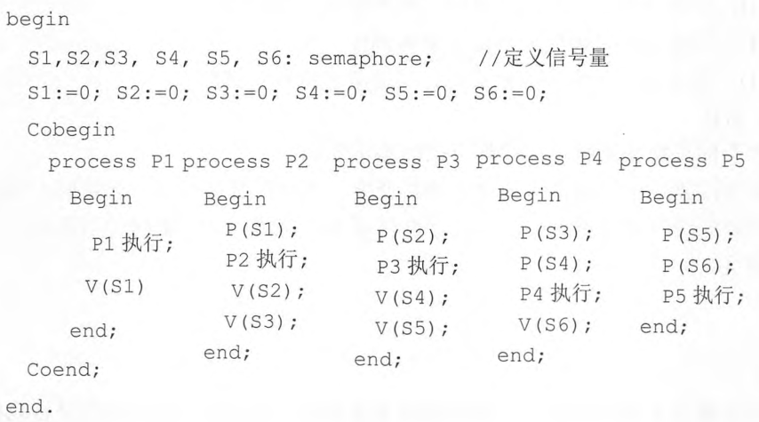

[什么是信号量](https://mp.weixin.qq.com/s/Pc9iWLvW7kfP-19QnaYYVA)


```
计数信号量具备两种操作动作，称为V（signal()）与P（wait()）（即部分参考书常称的“PV操作”）。V操作会增加信号量S的数值，P操作会减少它。

运行方式：

初始化信号量，给与它一个非负数的整数值。
运行P（wait()），信号量S的值将被减少。企图进入临界区的进程，需要先运行P（wait()）。当信号量S减为负值时，进程会被阻塞住，不能继续；当信号量S不为负值时，进程可以获准进入临界区。
运行V（signal()），信号量S的值会被增加。结束离开临界区的进程，将会运行V（signal()）。当信号量S不为负值时，先前被阻塞住的其他进程，将可获准进入临界区。
```

<br>

### 例题

<br>


#### 例1

<br>


> 进程P1、P2、P3、P4和P5的前趋图如下所示：

<br>


<br>

若用 *PV操作* 控制进程P1、P2、P3、P4 、P5并发执行的过程，则需要设置5个信号量S1、S2、S3、S4和S5，且信号量S1～S5的初值都等于零。下图中a、b 和c处应分别填写（ &nbsp;）；d和e处应分别填写（ &nbsp;），f和g处应分别填写（ &nbsp;）。

<br>


<br>


问题1选项

<br> A.V（S1）、P（S1）和V（S2）V（S3）&nbsp;
<br> B.P（S1）、V（S1）和V（S2）V（S3）&nbsp;
<br> C.V（S1）、V（S2）和P（S1）V（S3）&nbsp;
<br> D.P（S1）、V（S2）和V（S1）V（S3）&nbsp;


<br>

问题2选项

<br> A.V（S2）和P（S4）&nbsp;
<br> B.P（S2）和V（S4）&nbsp;
<br> C.P（S2）和P（S4）&nbsp;
<br> D.V（S2）和V（S4）&nbsp;


<br>


问题3选项

<br> A.P（S3）和V（S4）V（S5）&nbsp;
<br> B.V（S3）和P（S4）P（S5）&nbsp;
<br> C.P（S3）和P（S4）P（S5）&nbsp;
<br> D.V（S3）和V（S4）V（S5）&nbsp;

<br>


解:

<div> 空 (1) 的正确的选项为 A 。


根据前驱图，$P_1$进程执行完需要通知$P_2$进程，故需要利用$V(S_1)$操作通知$P_2$进程，所以空 a 应填$V(S_1)$;

<br>


$P_2$ 进程需要等待$P_1$进程的结果，故需要利用 $P(S_1)$ 操作测试 $P_1$ 进程是否运行完，所以空 b 应填 $P(S_1)$;

<br>

又由于$P_2$进程运行结束需要利用$V(S_2)$、$V(S_3)$操作分别通知$P_3$、$P_4$进程，所以空 c应填 $V(S_2)$、$V(S_3)$。<br></div>


---


<br>


#### 例1-2

<br>


> 进程P1、P2、P3、P4和P5的前趋图如下所示：

<br>


<br>

用 *PV操作* 控制这5个进程的同步与互斥的程序如下，程序中的空①和空②处应分别为（&nbsp; ），空③和空④处应分别为（&nbsp; ），空⑤和空⑥处应分别为（&nbsp; ）。


<br>


问题1选项

A.V (S1）和P(S2）P (S3)）&nbsp;
B.P(S1）和V(S1）V (S2)）&nbsp;
C.V (S1）和V (S2）V (S3)）&nbsp;
D.P (S1）和V(S1）P (S2)）&nbsp;


<br>


问题2选项

 A.V (S4）V (S5）和P(S3)&nbsp;
 B.V (S3) V (S4）和V(S5)&nbsp;
 C.P (S4）和P (S5）V (S5)&nbsp;
 D.P(S4）和P(S5) V (S4)&nbsp;


<br>


问题3选项

A.P (S6）和P (S5） V (S6)&nbsp;
B.V (S5）和V (S5) V (S6)&nbsp;
C.P (S6）和P (S5）P (S6)&nbsp;
D.V (S6）和P (S5) P(S6)&nbsp;

<br>


解:

根据前驱图，P1进程运行完需要利用V操作V(S1）通知P2进程，所以空①应填 V (S1)。P2进程运行完需要利用V操作V(S2)、V(S3）分别通知P3、P4进程，所以空②应填V (S2） V (S3）。<br>

根据前驱图，P3进程运行完需要利用V操作V(S4)、V(S5）分别通知P4、P5 进程，故空③应为填写V(S4）V(S5)。P4需要等待P2和P5进程的通知，需要执行2个Р操作，由于P4进程的程序中执行前有1个Р操作P(S4)，故空④应为填写P(S3)。<br>


根据前驱图，P4进程执行完需要通知P5进程，故P4进程应该执行1个V操作，即空⑤应填V(S6)。P5进程运行前需要等待P3和P4进程的通知，需要执行2个Р操作，故空⑥应填写P(S5）和P(S6)。<br>


根据上述分析，用PV操作控制这6个进程的同步与互斥的程序如下：




<br>


---


<br>


#### 例1-3

<br>


> 进程P1、P2、P3、P4、P5的前趋图如下：


若用PV操作控制进程并发执行的过程，则需要设置4个信号量S1、S2、S3和S4，且信号量初值都等于零。下图中a和b应分别填写( )，c和d应分别填写( )，e和f应分别填写( )。

<br>


<br>

A．P(S1)和P(S2)</p><p>B．P(S1)和V(S2)</p><p>C．V(S1)和V(S2)</p><p>D．V(S1)和P(S2)</p></div>


<br>


<br>


---


<br>


#### 例1-4

<br>


> 进程P1、P2、P3、P4和P5的前趋图如下：


<br>


<br>

若用PV操作控制进程P1～P5并发执行的过程，则需要设置6个信号S1、S2、S3、S4、S5和S6，且信号量S1-S6的初值都等于零。下图中a和b处应分别填写（ &nbsp;）；c和d处应分别填写（ &nbsp;），e和f处应分别填写（ &nbsp;）。

<br>


<br>

<div class="p2">
问题1选项
<br> A. P（S1）P（S2）和P（S3）P（S4）
<br> B. P（S1）V（S2）和P（S2）V（S1）
<br> C. V（S1）V（S2）和V（S3）V（S4）
<br> D. P（S1）P（S2）和V（S1）V（S2）
<br>
</div>

<br>

<div class="p2">
问题2选项
<br> A. P（S1）P（S2）和V（S3）V（S4）
<br> B. P（S1）P（S3）和V（S5）V（S6）
<br> C. V（S1）V（S2）和P（S3）P（S4）
<br> D. P（S1）V（S3）和P（S2）V（S4）
<br>
</div>

<br>


解:


本题主要考查用PV操作控制进程的并发执行。首先我们需要弄清楚前驱图中给出的各进制的执行顺序。从图中我们不难看出进程P1和P2没有前驱，也就是可以首先并发执行，而进程P3的前驱是P1和P2，P4的前驱是P1和P3，P5的前驱是P2和P3。那么怎么理解前驱呢？其实前驱就是指只有在前驱进程完成后，该进程才能开始执行


&nbsp; 在本题的前驱图中我们不难看出，有6条路径，分别是P1-&gt;P3，P1-&gt;P4，P2-&gt;P3，P2-&gt;P5，P3-&gt;P4，P3-&gt;P5。而且题目也告诉我们分别有6初值为0个信号量（S1-S6），要我们用PV操作来控制进程P1～P5的并发执行。这里我们就需要清楚P与V这两种操作。
<

	P原语的主要操作是：
<div>
	（1）信号量（sem）减1； 　　</div>
<div>
	（2）若相减结果大于等于零，则进程继续执行； 　　</div>
<div>
	（3）若相减结果小于零，则阻塞一个在该信号量上的进程，然后再返回原进程继续执行或转进程调度。</div>

<br>

<div>
	V原语的主要操作是： 　　</div>
<div>
	（1）信号量（sem）加1； 　　</div>
<div>
	（2）若相加结果大于零，则进程继续执行； 　　</div>
<div>
	（3）若相加结果小于或等于零，则唤醒一阻塞在该信号量上的进程，然后再返回原进程继续执行或转进程调度。</div>
<div>

<br>
	&nbsp; 总而言之，进行P操作的主要目的是阻塞某信号量上的进程，而进行V操作的主要目的是唤醒某信号量上的进程。</div>
<div>
	&nbsp; 下面我们具体来求解这个题目。a空处，是在进程P1执行完成以后，那么根据题目的前驱图我们可以知道，这个时候它应该唤醒它的后继进程P3和P4，因此需要执行两个V操作，同样的道路，b空处也需要执行两个V操作，因此可以知道第一空答案选C。</div>

<br>

<div>
	&nbsp; 至于C空处，它是在进程P3执行前进行的处理。根据前驱的意义，我们可以知道执行P3要在P1和P2完成后，因此这个时候，它首先需要判断P1和P2进程是否完成，如何它们完成的话，会分别执行唤醒P3的V操作（换句话说就是会给相应的信号量进行加1操作），那么这个时候我们也可以通过同样的信号量来判断，即对相应的信号量进行减1操作，判断它是否大于0，如果大于等于0，则执行P3，也就是需要P操作。从题目给出的答案来看，这两个信号量应该分别是S1和S3。那么执行完P3后，它也需要唤醒它的后继进程P4和P5，因此需要执行两个V操作，因此D空处应该是两个V操作。综上所述，我们可以知道第二空的答案选B。</div>

<br>

<div>
	&nbsp; 分析到这里后，第三空的答案应该就很明显了，P4和P5进程在执行前，都需要做与P3进程执行前一样的判断，因此都需要进行两个P操作。所以本题答案选C。</div>
<br>

<div>
	&nbsp; 其实做这类题也不难，首先需要我们对PV操作要有一个透彻的理解，另外就是能分析出题目执行的逻辑关系。</div></div>
</div>


<br>


---


<br>


#### 例2

<br>

> 若用PV操作来管理相关临界区，且信号量的值总是在[-2，1]之间变化，则(　　)


<div style="font-size: 16px;">

<br> A.最多只有一个进程在相关临界区执行
<br> B.至少有两个进程在等待进入相关临界区
<br> C.相关临界区的个数最多2个
<br> D.竞争相关临界区执行权的进程最多2个
<br>
</div>


解:

<p>本题考查进程管理-进程同步。相关临界区：指并发进程中涉及到相同变量的那些临界区。对于若干个并发进程共享某一变量的相关临界区的管理有三个要求：（1）一次最多一个进程能够进入临界区；（2）不能让一个进程无限制地在临界区执行；（3）不能强迫一个进程无限制地等待进入它的临界区。

若用PV操作来管理相关临界区，且信号量的值总是在[-2，1]之间变化，则最多只有一个进程在相关临界区执行。故本题选A。</p>


<br>


---


<br>


#### 2-2

<br>

> <div style="font-size: 16px;" class="re-render" data-html="<p>临界区是（）。</p>"><p>临界区是（）。</p></div>


<div style="font-size: 16px;">

<br> A.一段共享数据区
<br> B.一个缓冲区
<br> C.一段程序
<br> D.一个同步机制
<br>
</div>

解:


<p>本题考查进程管理-进程同步。临界区指的是一个访问共用资源（例如：共用设备或是共用存储器）的程序片段，而这些共用资源又无法同时被多个线程访问的特性。当有线程进入临界区段时，其他线程或是进程必须等待（例如：bounded waiting等待法），有一些同步的机制必须在临界区段的进入点与离开点实现，以确保这些共用资源是被互斥获得使用。故本题选C。</p>


---

<br>

参考:


[软件设计师：第五章：操作系统考点总结](https://blog.csdn.net/weixin_43823808/article/details/108254765)


> 前趋图(Precedence Graph) 是一个有向无环图，记为：→={（P<sub>i</sub>，P<sub>j</sub>&nbsp;）|P<sub>i</sub><span style="font-size: 12px;">&nbsp; &nbsp;</span>must complete before &nbsp;P<sub>j</sub>&nbsp; may strat}。假设系统中进程P={P<sub>1，</sub>P<sub>2，</sub>P<sub>3，</sub>P<sub>4，</sub>P<sub>5，</sub>P<sub>6，</sub>P<sub>7，</sub>P<sub>8</sub>}，且进程的前驱图如下：<br>


那么前驱图可记为：（ &nbsp;）。


问题1选项
<br> A.→={（P
<sub>2</sub>,P
<sub>1</sub>）,（P
<sub>3</sub>,P
<sub>1</sub>）,（P
<sub>4</sub>,P
<sub>1</sub>）,（P
<sub>6</sub>,P
<sub>4</sub>）,（P
<sub>7</sub>,P
<sub>5</sub>）,（P
<sub>7</sub>,P
<sub>6</sub>）,（P
<sub>8</sub>,P
<sub>7</sub>）}
<br> B.→={（P
<sub>1</sub>,P
<sub>2</sub>）,（P
<sub>1</sub>,P
<sub>3</sub>）,（P
<sub>1</sub>,P
<sub>4</sub>）,（P
<sub>2</sub>,P
<sub>5</sub>）,（P
<sub>5</sub>,P
<sub>7</sub>）,（P
<sub>6</sub>,P
<sub>7</sub>）,（P
<sub>7</sub>,P
<sub>8</sub>）}
<br> C.→={（P
<sub>1</sub>,P
<sub>2</sub>）,（P
<sub>1</sub>,P
<sub>3</sub>）,（P
<sub>1</sub>,P
<sub>4</sub>）,（P
<sub>2</sub>,P
<sub>5</sub>）,（P
<sub>3</sub>,P
<sub>5</sub>）,（P
<sub>4</sub>,P
<sub>6</sub>）,（P
<sub>5</sub>,P
<sub>7</sub>）,（P
<sub>6</sub>,P
<sub>7</sub>）,（P
<sub>7</sub>,P
<sub>8</sub>）}
<br> D.→={（P
<sub>2</sub>,P
<sub>1</sub>）,（P
<sub>3</sub>,P
<sub>1</sub>）,（P
<sub>4</sub>,P
<sub>1</sub>）,（P
<sub>5</sub>,P
<sub>2</sub>）,（P
<sub>5</sub>,P
<sub>3</sub>）,（P
<sub>6</sub>,P
<sub>4</sub>）,（P
<sub>7</sub>,P
<sub>5</sub>）, （P
<sub>7</sub>,P
<sub>6</sub>）,（P
<sub>8</sub>,P
<sub>7</sub>）}
<br>

<br>


解:

<div style="font-size: 16px;" id="answer">本题考查前趋图，该图的标记方法是将图中各条边的起始记录好，以便描述这个图。以本题的图为例，由于P<sub>1</sub>有箭头指向P<sub>2</sub>，所以有（P<sub>1</sub>，P<sub>2</sub>），又由于P<sub>1</sub>有指向P<sub>3</sub>的箭头，所以有（P<sub>1</sub>，P<sub>3</sub>）依次类推可得到完整的集合与C选项一致。</div>


<br>


---


<br>

