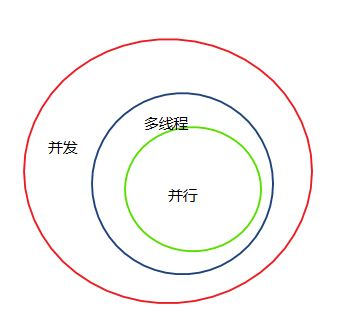
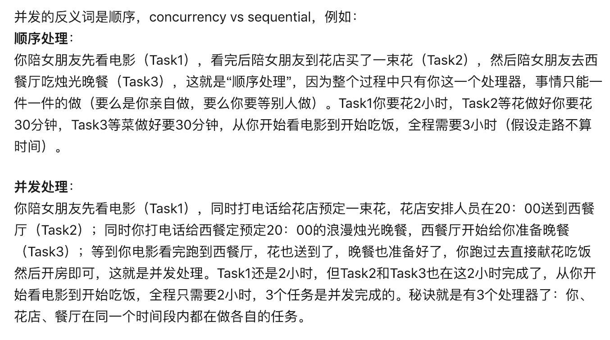
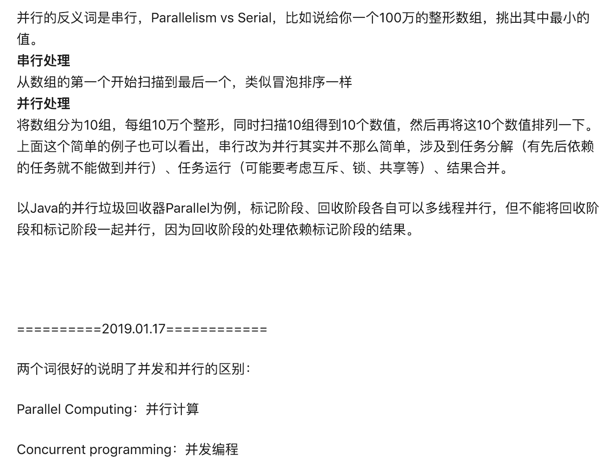
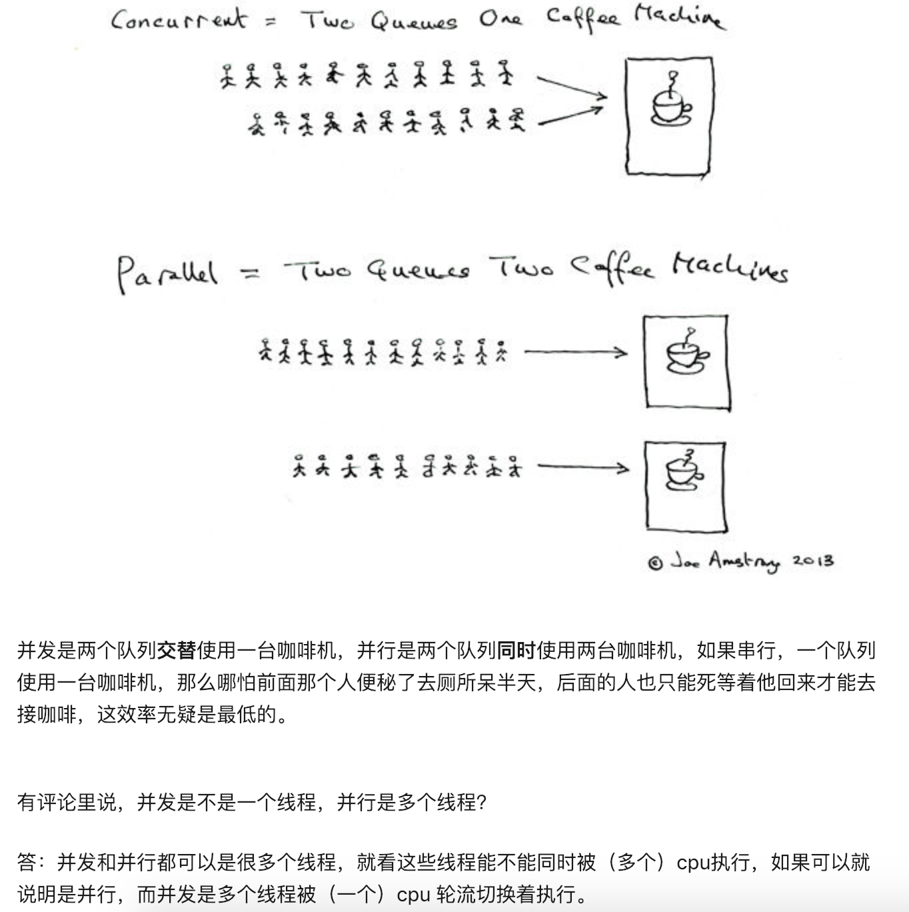
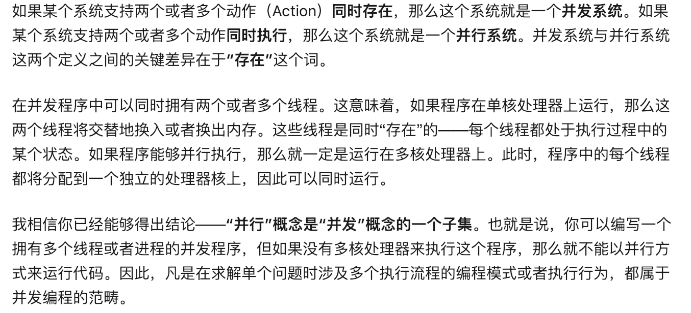
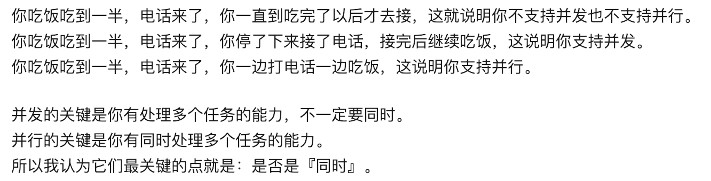

 

### 并发(Concurrency)和并行(Parallelism)的区别

[参考](https://laike9m.com/blog/huan-zai-yi-huo-bing-fa-he-bing-xing,61/)
[引用来自知乎](https://www.zhihu.com/question/33515481)

- 只有当CPU至少有两个核心的时候才有可能并行，而能不能并发与CPU的核心数无关，单核CPU也可以实现并发。
并行是一种并发的特殊情况，并行要求必须是时间上的同时，而并发只要求逻辑上同时就可以。(*无多核，不并行*)

- 并发是有若干个任务，相互穿插着执行。
  并行是只有一个任务，同时执行这个任务的不同部分（或者相同部分不同上下文）。
  
  小明排Dota天梯的时候抽空吃水果，排上了就放下水果，叫并发。
  小明右手操作英雄，左手吃水果，叫并行。
  
  并发是不等待，并行是一起上
  
  假设你需要洗衣服和做饭。
  

串行：先洗完衣服再做饭，或者先做完饭再洗衣服。

并发：一会洗衣一会做饭，但疾如闪电。

并行：把洗衣盆拿到灶台上，左手挥铲右手搓衣。

  
  
  
  
- 并发：指在同一时刻做不止一件事情。比如数据库处理请求时，接受了第一个请求但是未处理完成，此时也可以接受第二个请求。两个请求任务在处理时间节点上可以有交集。
  并行：指将大量的任务，拆解成多个子任务分配到多个线程上，并发的执行。比如你要计算1到100的和，可以将计算分成两个部分，一个线程计算1到50的和，另一个线程计算51到100的和。
  简单的说：并行是多线程的一种形式，多线程是并发的一种形式。异步也是并发的一种形式
  
  
- 并行（parallelise）同时刻（某点），并发（concurrency）同时间（某段）
  并行 是在 某一时刻上 有多个任务在执行
  并发 是在 某一时段内 有多个任务在执行
  
  
   
    
   
   
     
      
      
   
     
         
   
     
            
   
     
               
  
  
 
