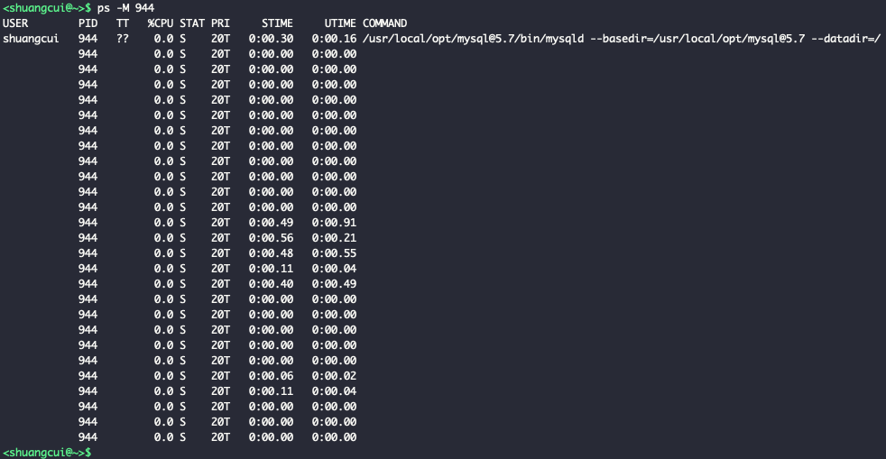

### Golang

<br>

Golang的GPM调度模型，多个G即goroutine，是建立在线程之上还是进程之上？

据资料，P为逻辑处理器，~~M为机器cpu核心数（不是物理核心数，如果有超频，则是超频后的cpu数量）~~，~~两者数量一致。~~


用代码验证：


```go

package main

import (
	"fmt"
	"sync"
)

func main() {
	var wg sync.WaitGroup
	wg.Add(1)
	go func() {
		defer wg.Done()
		for {
			fmt.Println("A:", 1)
		}
	}()

	wg.Wait()
}

```


运行上述代码`go run t.go`，而后查看活动监视器


<br>

使用`runtime.GOMAXPROCS(num)`来设置允许该程序使用的cpu数量，最早版本默认为1，后来改为机器的（逻辑）cpu数。所以不设置，就等同于`runtime.GOMAXPROCS(runtime.NumCPU())`。


<br>


查看进程的线程列表:


参考： [mac 进程和线程工具](https://www.cnblogs.com/brookin/p/9803173.html)


故而，GPM中的M实际指线程。通过抽象，在用户级别实现了m个goroutine和n个线程之间的对应（一般m远远大于n）

<br>

更多关于golang的调度，可参考：

[6.5 调度器](https://draveness.me/golang/docs/part3-runtime/ch06-concurrency/golang-goroutine/)

[Go goroutine理解](https://segmentfault.com/a/1190000018150987)


---


### nginx

<br>


典型的多进程处理模型


启动ngnix后，查看 活动监视器 如下：


<br>

此处的2个用户为`nobody`的工作进程，在nginx.conf中设置：


---


### php

<br>

同nginx一样，php-fpm也是多进程模式：


可以查看并修改PHP-CGI进程的数量


---


### redis服务端

<br>


**面试常问，redis（服务端） 的所谓单线程，指的仅仅是网络请求模块使用了一个线程，即一个线程处理所有网络请求，其他模块仍用了多个线程。且最新版本中，网络请求模也支持多线程**


参考： [为什么 Redis 选择单线程模型](https://draveness.me/whys-the-design-redis-single-thread/)

[redis网络IO模型](https://www.cnblogs.com/hainingwyx/p/13860764.html)

<br>


---


### mysql服务端和postgresql服务端

<br>


两大数据库显著差异之一，就是mysql通过多线程方式，实现高并发；而pg和nginx类似，使用多进程方式。

如下：





所以mysql有线程池的说法。


而对于pg：


<br>

---

<br>


进程有独立的地址空间,线程则没有独立地址空间. 同一个进程的不同线程, 它们之间共享地址空间的.

对于多进程模型, 因为之间相互独立, 其优点就是安全性比较好. 一个进程的crash, 不会导致整个软件的崩溃;而线程则不行,一个进程里的某个线程crash,会影响整个进程.

多进程的缺点, 是其创建和上下文切换的开销比较大, 另外进程之间要想相互通讯需要[专门的机制(IPC)](http://www.dashen.tech/2020/06/16/Linux%E8%BF%9B%E7%A8%8B%E9%97%B4%E9%80%9A%E4%BF%A1-IPC-%E7%9A%84%E5%87%A0%E7%A7%8D%E6%96%B9%E5%BC%8F/)才能实现进程间通讯. 

这恰恰是线程的优点, 如果是同一个进程的不同线程, 它们在一个进程的地址空间里，所以, 其相互通讯比较方便, 它们之间的切换也比较简单. (创建线程比较简单, 切换也比较轻巧, 通讯也比较方便, 相互协作比较好). 

但多线程也有缺点,就是不稳定.因为同一个进程里的若干个线程，如果有一个(线程)崩溃, 就会使得整个进程的其他线程也一起崩溃, 相互干扰比较大. (相互通讯比较容易,相互干扰也比较大)


那软件设计时,一般采用*多进程模型*还是*多线程模型*呢? 要看具体的应用场景, 比如对于浏览器软件, (浏览器的每一个选项卡, 或说每一个浏览器页面, 是用多线程还是多进程实现更好呢?) 显然是多进程，为什么呢, 因为浏览器页面之间几乎没什么通讯需求, 所以这时候线程易于通讯的优点就发挥不出来, 反而是一个线程崩溃,导致同进程其他线程崩溃这个缺点非常致命. (肯定不希望一个页面崩溃,会连带导致其他页面也崩溃) .  所以我们一般是用多进程来实现浏览器的 ,实际上是访问同一个网站的若干页面是在一个进程的不同线程(如打开了三个新浪的新闻页,这三个页面对应一个进程), 但访问不同的网站是不同的进程(如打开了两个新浪,三个搜狐,一个网易,对应三个进程)

<br>

---


因为早期Linux对线程支持不好,导致很多软件的Linux版本大多是多进程模型,如Oracle和Postgre.而Windows早期对线程相对就支持较好,故而某些软件的Win版本,大多采用多线程模型.  现在Linux提供了多线程支持,一般来说多线程模型更多一些.


