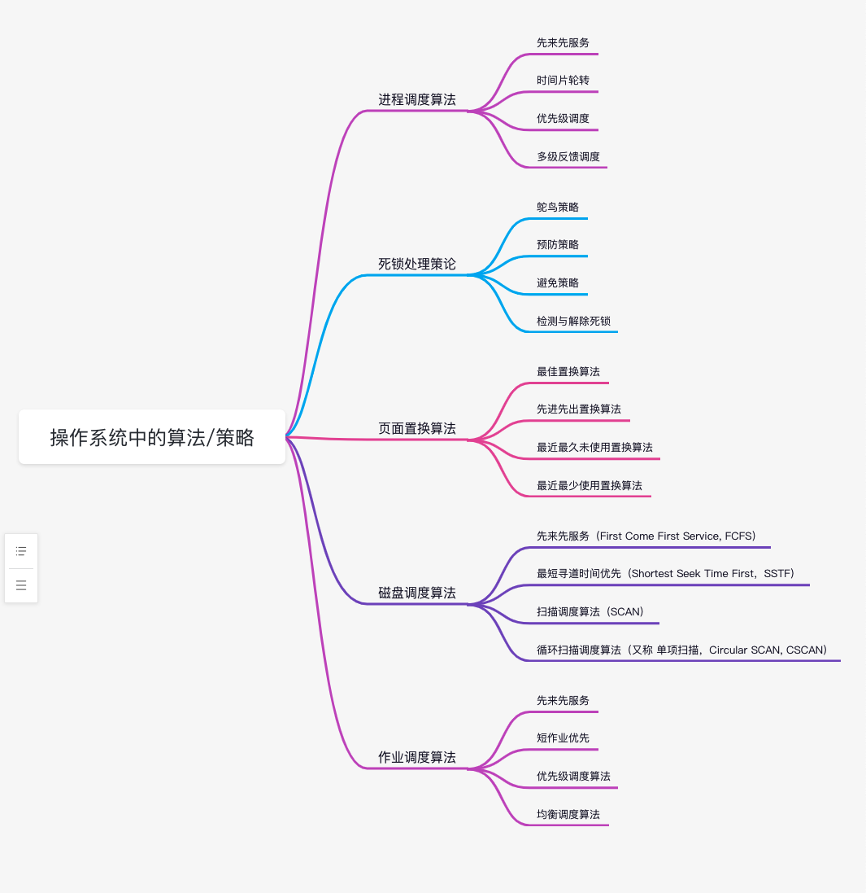
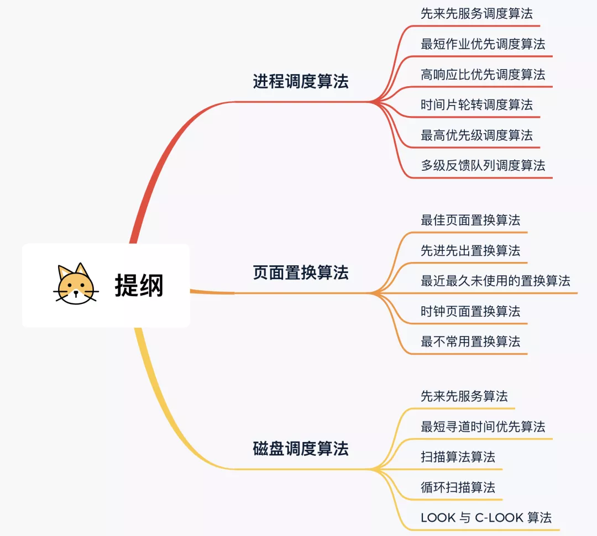

[OS中的几种进程调度算法](https://blog.csdn.net/gettogetto/article/details/76653975)

[大厂面试爱问的“调度算法”，20 张图一举拿下](https://mp.weixin.qq.com/s/ZifCDDU-zdUa7fOFo7epiw)

 

### 页面置换算法

 

[页面置换算法](https://dashen.tech/2018/09/05/%E9%A1%B5%E9%9D%A2%E7%BD%AE%E6%8D%A2%E7%AE%97%E6%B3%95/)

---

 

### 磁盘调度算法

 

[四种常用的磁盘调度算法](https://dashen.tech/2020/02/15/%E5%9B%9B%E7%A7%8D%E5%B8%B8%E7%94%A8%E7%9A%84%E7%A3%81%E7%9B%98%E8%B0%83%E5%BA%A6%E7%AE%97%E6%B3%95/)

[Linux的I/O调度算法](https://dashen.tech/2020/04/16/Linux%E7%9A%84I-O%E8%B0%83%E5%BA%A6%E7%AE%97%E6%B3%95/)