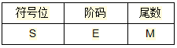
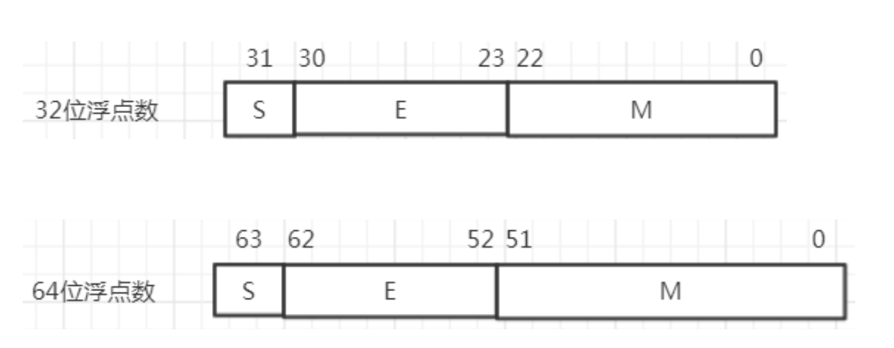
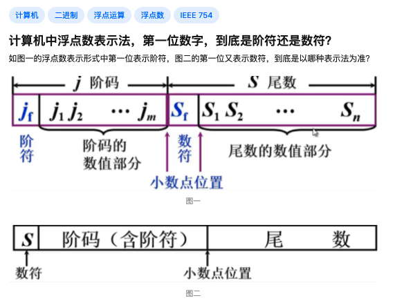
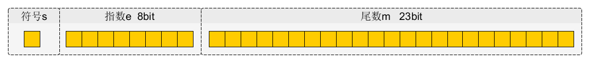
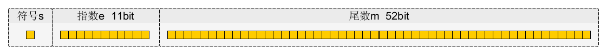
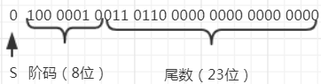

$$N = M * R^e$$

<br>

其中,


**S**称为 <font color="#00CED1">数符</font>,也称为<font color="#00CED1">符号位</font>, 为0或1,用来标识*M*的正或负 

*e* 是比例因子的<font color="#CDCDB4">指数</font>, 称为浮点数的指数, 是一个整数. 常称为<font color="#CDCDB4">真值</font>,其与<font color="#00CED1">**阶码E**</font>的关系为E=e+127, E的正负称之为 <font color="#CDCDB4">阶符</font>


**M** 称为浮点数的<font color="#00CED1">尾数</font>, 是一个纯小数

<br>


**R** 是比例因子的<font color="#CDCDB4">基数</font>, 对二进记数制的机器R是常数 *2*


故而对计算机有

$$N = M * 2^e$$





浮点数所能表示的数值范围主要由**阶码**决定，所表示数值的精度则由**尾数**决定。


<br>

<font size=1 color="#8B658B">

mantissa

n.  （数学）假数；（对数）尾数；数值部分;

[例句]An Algorithm for Adjusting Mantissa Errors Resulted from Data Dealing

一种针对数据尾数误差的调整算法
</font>

<br>


按[IEEE754](https://baike.baidu.com/item/IEEE%20754/3869922)标准,32位浮点数和64位浮点数的标准格式为




无论是32位浮点数还是64位浮点数, 由于基数 **R**是固定常数**2**,所以不必用显示方式来表示

32位的浮点数中，浮点数的 *符号位*  **S** 占1位，安排在最高位，S=0表示正数，S=1表示负数。

**M**是 *尾数*，放在低位部分，占用*23位*，小数点位置放在尾数域最左（最高）有效位的右边。

**E**是 *阶码*，占用*8位*

阶符 采用隐含方式，即采用 **移码** 方法来表示正负指数。

> IEEE 754是第二种。IEEE 754没有阶符，它的阶码是阶数加上一个固定的位移，使得其阶数可以按照无符号整型数处理





<br>

<font size=1 color="#8B658B">
    
移码方式 对两个指数大小的比较和对阶操作都比较方便，因为阶码域值大者 其指数值也大。

采用这种方式时，将浮点数的指数 真值e变成阶码E时，应将指数e加上一个固定的偏移值127（即二进制 01111111），即E=e+127

</font>


<br>

为提高能表征的精度,当尾数的值不为0时,尾数域的最高有效位应为1,这称为浮点数的规格化表示

否则以修改阶码同时左右移动小数点位置的办法,使其变成规格化数的形式

(可结合 最后的例题理解)


<br>





在IEEE754标准中，一个规格化的32位浮点数x的真值表示为

$$x = (-1)^S  \times 1.M  \times 2^{E-127}$$

e = E - 127


其中尾数域所表示的值是1.M。由于规格化的浮点数的尾数域最左位（最高有效位）总是1，故这一位经常不予存储，而认为隐藏在小数点的左边。于是用23位字段可以存储24位有效数。

<br>


---

<br>




64位的浮点数中符号位1位，阶码域11位，尾数域52位，指数偏移值是1023.因此规格化的64位浮点数x的真值为

$$x = (-1)^S \times 1.M \times 2^{E-1023}$$

e = E - 1023


<br>


---


<br>


### 例题


<br>


> 1.  若浮点数x的754标准存储格式为$(4136000)_{16}$，求其浮点数的十进制数值。

<br>

解：将16进制数展开后，可得二进制数格式为

<br>

0100 0001 0011 0110 0000 0000 0000 

<br>

即




$$指数e = 阶码-127 = 10000010-01111111 = 00000011 = (3)_{10}$$


包括隐藏位1的尾数 $1.M = 1.011 0110 0000 0000 0000 0000 = 1.011011$

于是有

$$x=(-1)^S  \times 1.M  \times 2^e = +（1.011011）  \times 2^3 = +1011.011 = (11.375)_{10}$$


<br>

---

<br>


> 2.将数 $(20.163)_{10}$ 转换成754标准的32位浮点数的二进制存储格式。

<br>


解：


<1>. 首先分别将整数和小数部分转换成二进制数：

<br>

十进制浮点数，整数部分转换成二进制，采用除2取余法，将余数从低到高排列，即为整数的二进制数；


```

整数部分

20/2=10    ....  0

10/2=5      ....  0

5/2=2        ....  1

2/2=1        ....  0

1/2=0         ..... 1

```

<br>

小数部分转换成二进制，采用乘2取整法，将取整数顺序排列，即为小数的二进制数。

小数部分乘2直到小数部分为0，或取到想要的位数，或循环出现前。

```

小数部分

0.163*2=0.326        0

0.326*2=0.652        0

0.652*2=1.304        1

0.304*2=0.608        0

0.608*2=1.216        1

0.216*2=0.432        0

0.432*2=0.864        0

0.864*2=1.728        1

0.728*2=1.456        1

0.456*2=0.912        0

```

*不要求精度时，通常取到8~10位*


<br>


即 $20.163_{10} = 10100.0010100110_{2}$


---

<br>


<2>. 移动小数点到第1、2位之间，得e的值

<br>

$$10100.0010100110 = 1.01000010100110 * 2^4$$

即 e=4  （小数点移动了4位）

---

<br>

<3>. 求出**S、E、M** 的值

<br>

S=0，&nbsp; E=4+127=131，&nbsp; M=01000010100110

S由小数点的后一位可以看出，0为正数，1为负数。

<br>


所以有:

0  10000001 01000010100110000000000

IEEE754标准中32位浮点数表示

S         E               M

S是符号位占1位，E是阶码占8位，M是尾数占23位。

<br>

---

<br>


> 3.设16位浮点数，其中阶符1位、阶码值6位、数符1位、尾数8位。若阶码用移码表示，尾数用补码表示，则该浮点数所能表示的数值范围是


<br>


如果浮点数的阶码(包括1位阶符)用X位的移码表示，尾数(包括1位数符)用Y位的补码表示，则浮点数表示的数值范围如下:

<br>

最大正数:

$$+(1-2^{-Y+1})*2^{2^{X-1}-1}$$


最小负数:

$$-1*2^{2^{X-1}-1}$$

<br>

此处, X=6+1=7, Y=8+1=9


<br>


---


<br>


当尾数的值不为0时，尾数的最高有效位应为1，这称为浮点数的规格化表示

这样形式的叫规格化


<br>


---

<br>

参考:

[计算机浮点数规格化表示](https://blog.csdn.net/qq_29287973/article/details/78914821)


<br>


工具:


[可视化浮点数](http://evanw.github.io/float-toy/)

该网页提供32位浮点数和64位浮点数的二进制结构图，可以方便地设置每一个二进制位，显示对应的数字。


<br>

推荐阅读：

[阮一峰-浮点数的二进制表示](https://www.ruanyifeng.com/blog/2010/06/ieee_floating-point_representation.html)