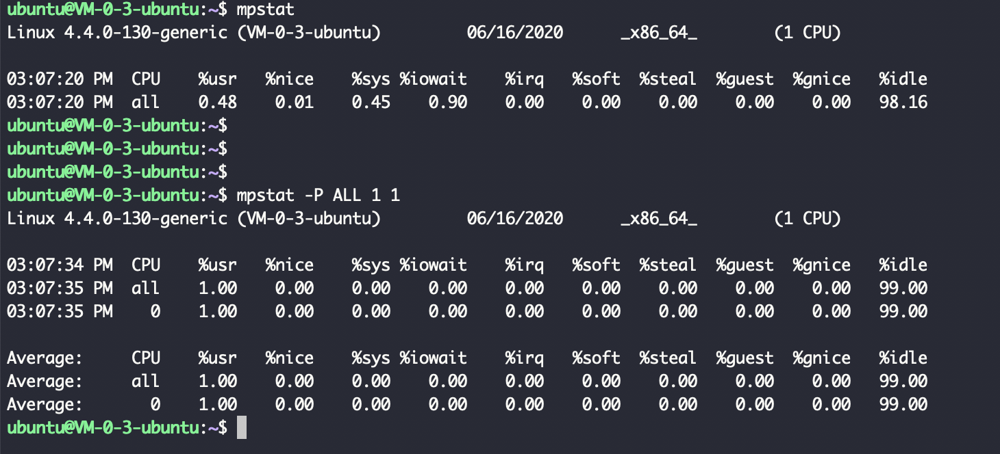

> cgroups，control groups的简写，是Linux内核的一个功能，用来限制，控制与分离一个进程组群的资源（如CPU、内存、磁盘输入输出等）。

参考:

[Zorro's Linux Book - Cgroup系列](https://zorrozou.github.io/)

[Linux CGroup 基础](https://wudaijun.com/2018/10/linux-cgroup/)