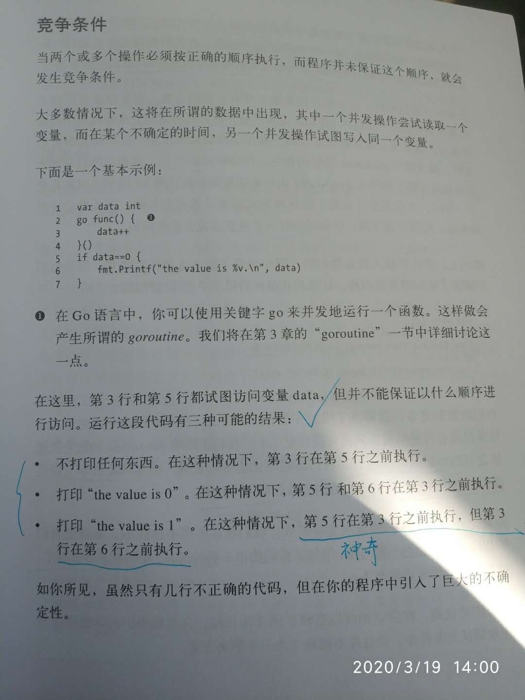
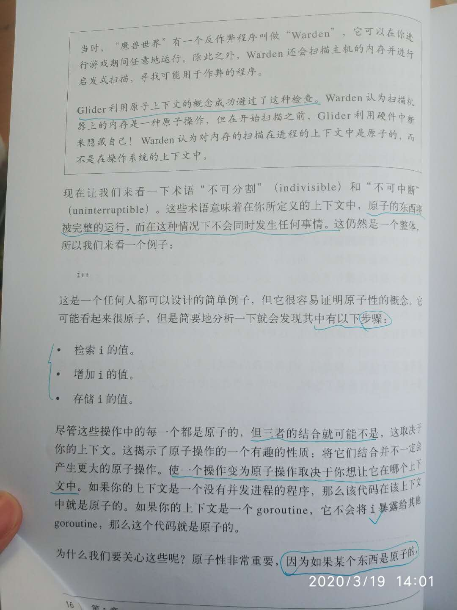
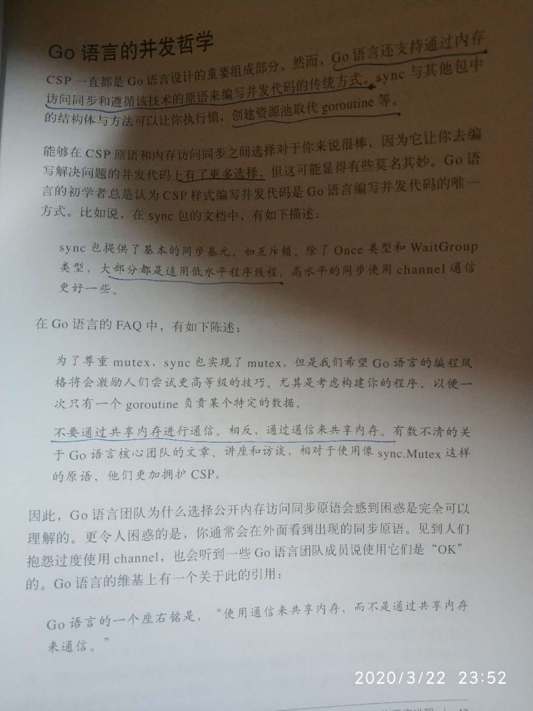
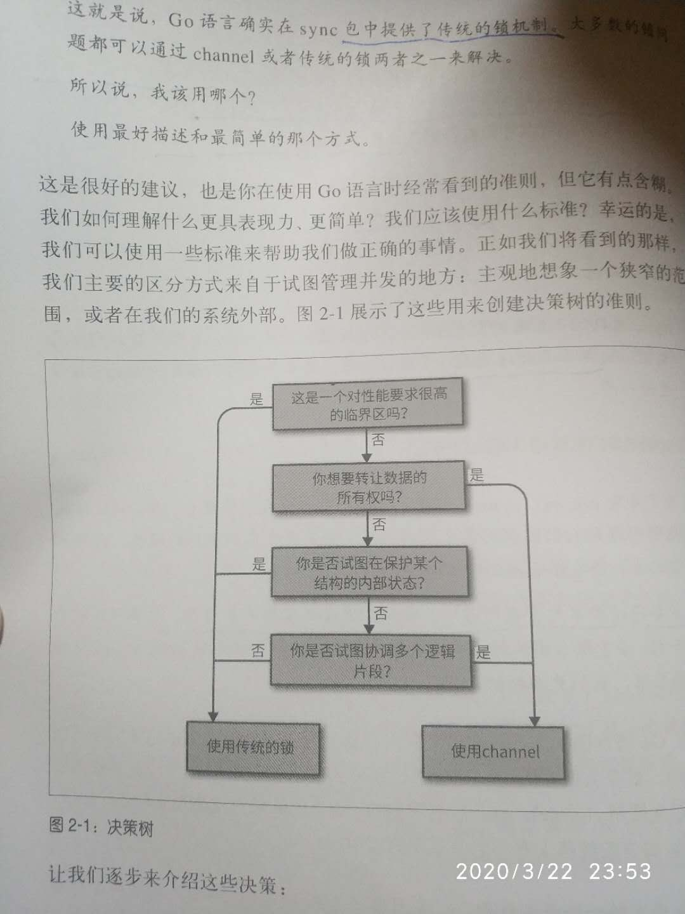

<br>


### <font color="#FF34B3">并发概述</font>




<br>

```go
package main

import "fmt"

func main() {
	var data int

	go func() {
		data++
	}()

	if data == 0 {
		fmt.Println("the value is %v.\n", data)
	}

}
```
实际上,大多数时候的输出为:
```go
the value is %v.
 0
 ```

 <br>




<br>

<font color="#B8860B">金句:</font>

<br>

<font color="#4876FF">
原子的东西将被完整地运行,而不会同时发生任何事情.

使一个操作变为原子操作,取决于你将它放在哪个上下文中.

如果某个东西是原子的,隐含的意思是它在并发环境中是安全的.

atomic包的操作是原子操作
</font>


<br>

---


### <font color="#FF34B3">建模: 通信顺序进程</font>

<br>


#### <font color="#836FFF">并发与并行的区别</font>

<br>

<font color="#B8860B">金句</font>

<br>

<font color="#4876FF">

当开发者们讨论代码的时候,他们真的应该使用"并发"这个词.

并发属于代码; 并行属于一个运行中的程序.

在只有一个核心的机器上运行(两部分可以并行运行的程序). 你们中的某些人会认为程序会并行运行, 但事实并不是这样的!

并行是我们程序运行时的属性,而不是我们的代码.(即并行取决于机器)


</font>


作者的这些个解释堪称灾难,更容易使人如坠云雾.

可参考:

[咬文嚼字-并发和并行](http://www.dashen.tech/2018/10/04/%E5%92%AC%E6%96%87%E5%9A%BC%E5%AD%97-%E5%B9%B6%E5%8F%91%E5%92%8C%E5%B9%B6%E8%A1%8C/)


简而言之:
```
并发 : 逻辑上同时处理多个任务。

并行 : 物理上同时处理多个任务。
```

<br>

---


####  <font color="#836FFF">什么是CSP</font>

<br>

`通信顺序进程`

<br>

<font color="#B8860B">金句</font>

<br>

<font color="#4876FF">

Go语言的`运行时`自动将goroutine映射到系统的线程上,并为我们管理它们之间的调度.  参考:[Go调度器GPM](http://www.dashen.tech/2019/03/19/Go%E8%B0%83%E5%BA%A6%E5%99%A8GPM/)

在Go 1.5中,goroutine的调度顺序发生了改变. 参考:[Golang调度器源码分析](http://ga0.github.io/golang/2015/09/20/golang-runtime-scheduler.html),搜索`调度器的设计`

除了基于CSP的goroutine/channel/select等,Go语言还是提供了通过内存访问同步来编写并发代码的传统加锁方式,见sync包

channel本质上比sync包锁的方式更具可组合性.将锁分散在整个对象图中听起来像是一场噩梦,但是,channel在代码中随处可见,是被鼓励以及期待的..

</font>


<br>







<br>


> Go语言的并发处理参考了CSP（Communicating Sequential Process）模型。CSP并发模型不同于传统的多线程通过共享内存来通信，CSP讲究的是“以通信的方式来共享内存”。
<br>
Don’t communicate by sharing memory; share memory by communicating.
<br>
不要以共享内存的方式来通信，要通过通信来共享内存。
<br>
golang的CSP模型实现与原始的CSP实现有点差别：原始的CSP中channel里的任务都是立即执行的，而go语言为其增加了一个缓存，即任务可以先暂存起来，等待执行线程准备好再顺序执行。


**CSP理论之父，和快速排序之父竟然系同一人…**


[Tony Hoare](https://baike.baidu.com/item/%E6%89%98%E5%B0%BC%C2%B7%E9%9C%8D%E5%B0%94/65848?fromtitle=Tony%20Hoare&fromid=9875780&fr=aladdin)，[牛津大学](http://www.cs.ox.ac.uk/people/tony.hoare/)古典学学士毕业，后来出于“机器翻译”，投身计算机。1980年图灵奖得主，2000年获英国王室爵士头衔——和牛顿，开尔文，霍金同享此殊荣——前两人名字成为物理量单位，霍金也几乎名撒寰宇。

快速排序是合格程序员必备算法，也闻知CSP大名，甚至还曾不自量尝试看一下[上百页的论文](http://www.usingcsp.com/)，却没想到竟然同出一人机杼, 惭愧不识这尊大神


<br>


协程相比线程轻量多了..每次创建操作系统层级的线程,都会消耗系统资源,在
<阿里巴巴Java开发手册>中明确要求,使用线程池,而不允许自己在代码里新建一个线程


参考:

[Goroutine与GMP模型](https://www.bitlogs.tech/2019/03/goroutine%E4%B8%8Egmp%E6%A8%A1%E5%9E%8B/)

---


### <font color="#FF34B3">Go语言并发组件</font>

<br>

---


### <font color="#FF34B3">Go语言的并发模式</font>

<br>

---


### <font color="#FF34B3">大规模并发</font>

<br>

---


### <font color="#FF34B3">goroutine和Go语言runtime</font>

<br>

---

