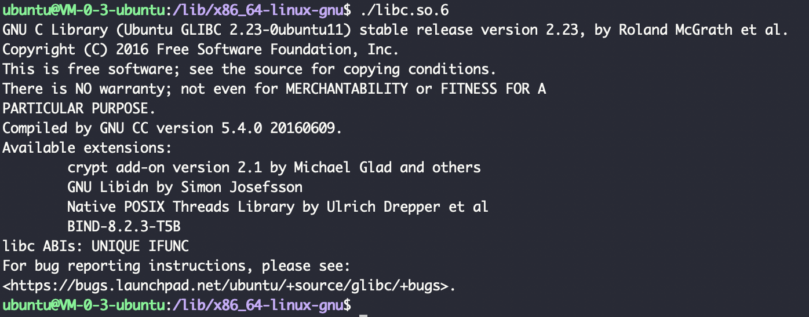
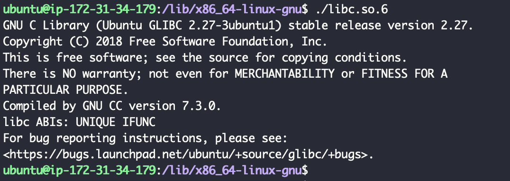
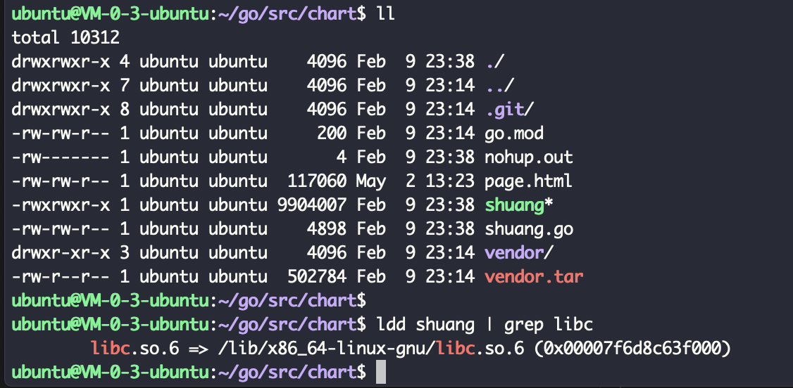
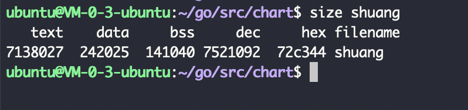
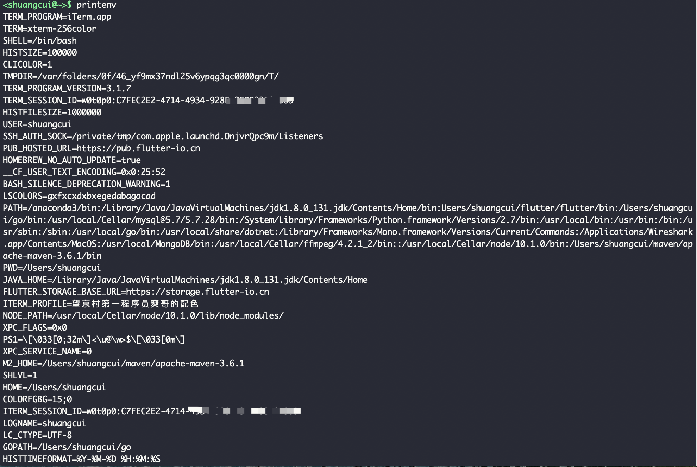
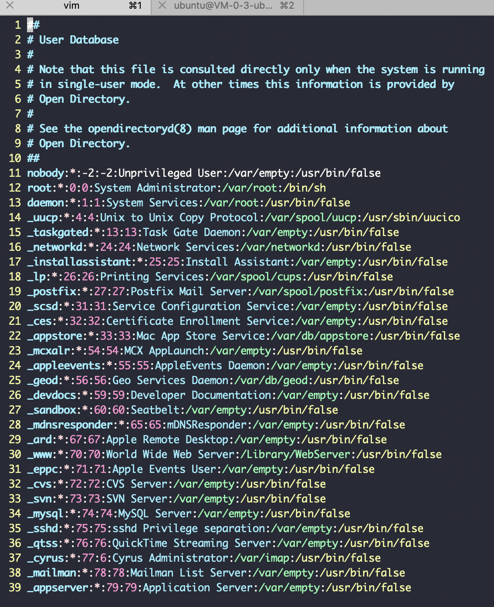
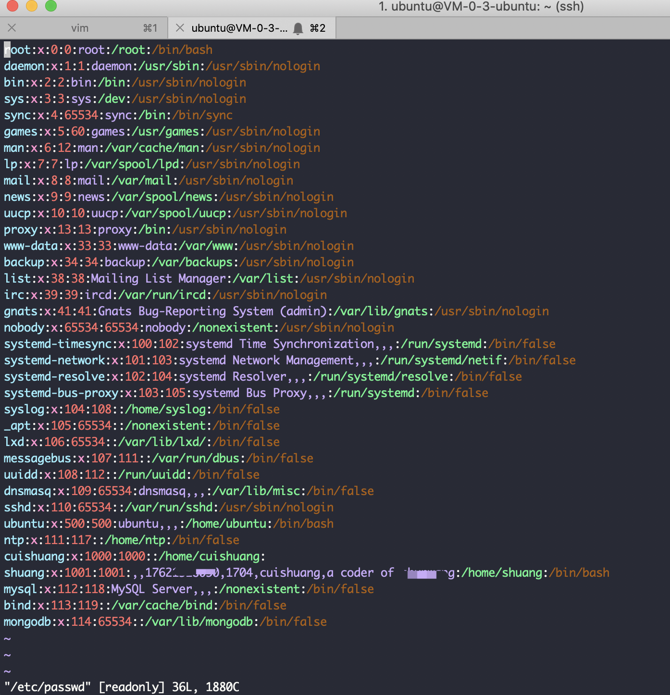
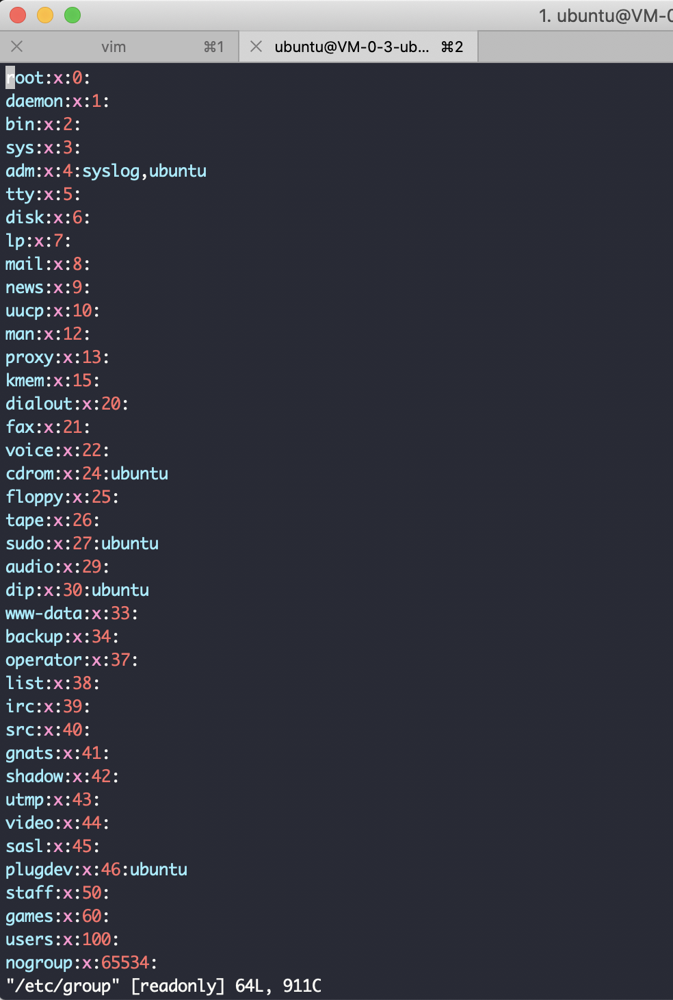
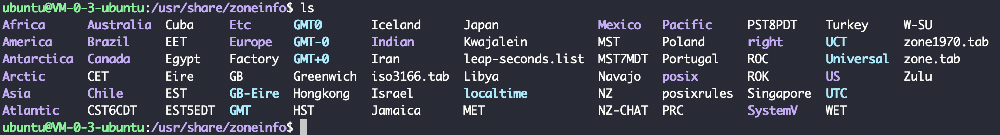

 

### 第3章 系统编程概念

*确定系统的glibc版本*

> g lib c即GNU C 语言函数库

P37页

腾讯云cvm机器:

 

aws的ec2:

---

确定GNU C 语言函数库的路径:

ldd为列出动态依赖性

---

 

### 第6章 进程

**size** 命令 可显示二进制可执行文件的 文本段,初始化数据段,非初始化数据段(即block started by symbol,bss) 的大小

P94

---

P97 虚拟内存管理,值得一看. 如搞清楚

**页表**是怎样联通起*进程虚拟地址空间*和*物理内存(RAM)?*

PMMU把要访问的每个虚拟内存地址,转换成相应的物理内存地址

---

**printenv**,显示当前的环境列表

 

虚拟内存以*页*为单位进行分配

更多可参考:

[为什么 Linux 需要虚拟内存](https://draveness.me/whys-the-design-os-virtual-memory/)

[为什么 Linux 默认页大小是 4KB](https://draveness.me/whys-the-design-linux-default-page/)

 

---

### 第8章 用户和组

P124

执行 `vim /etc/passwd`

MacBook:

Ubuntu:

7个字段,用冒号分隔

 

执行 `vim /etc/group`

Ubuntu:

 

---

### 第10章 时间

时区:

