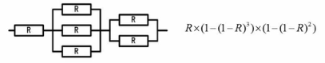
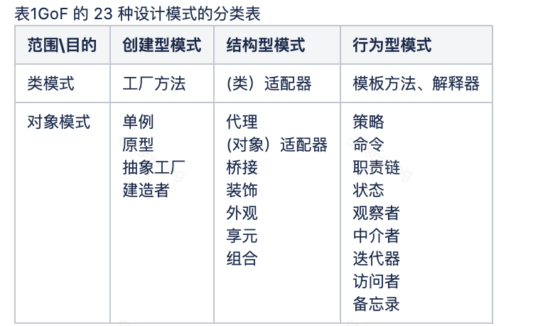
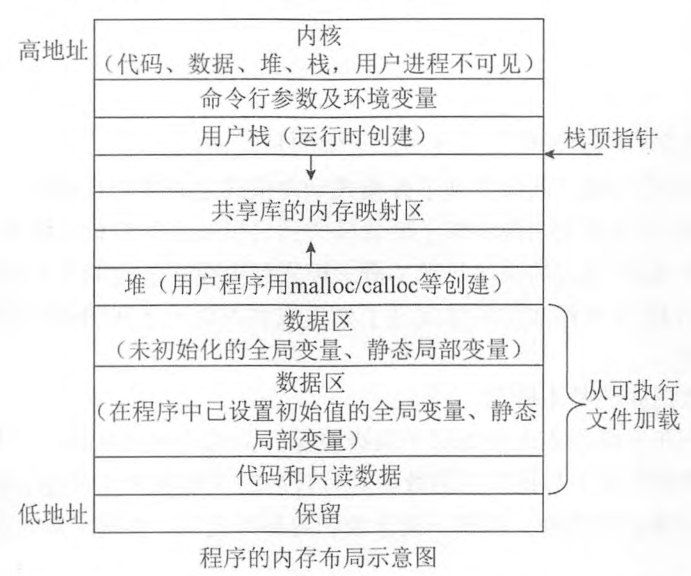

1、内存又称主存，是CPU能直接寻址的存储空间，由半导体器件制成。CPU内外的高速缓存不属于主存，与主存容量无关，它是用来解决CPU与内存之间速度、容量不匹配的问题，容量相对于其他存储层次，量级较小。

<br>


2、系统的可靠性：

串联系统: $R = R_1 \cdot R_2 \cdot R_N$

并联系统:  $R = 1-(1-R_1) \cdot (1-R_2)  \cdot (1-R_N)$

<br>



<br>


3、流水线周期为执行时间最长的一段，

流水线计算公式: 

`一条指令执行时间 + (指令条数-1)*流水线周期 `


<br>


[流水线相关问题](https://dashen.tech/2020/03/27/%E6%B5%81%E6%B0%B4%E7%BA%BF%E7%9B%B8%E5%85%B3%E9%97%AE%E9%A2%98/)


<br>


4、[MIME](https://baike.baidu.com/item/MIME/2900607)是一个互联网标准，拓展了电子邮件标准，与安全无关。

<font size=1>

MIME(Multipurpose Internet Mail Extensions)多用途互联网邮件扩展类型

</font>


[PGP](https://baike.baidu.com/item/PGP/212244)是一套用于信息加密、验证的应用程序.采用IDEA的散列算法作为加密与验证之用


<font size=1>
PGP（Pretty Good Privacy，中文翻译“优良保密协议”）
</font>


<br>


5、公开密钥加密也称为**非对称加密**，

公开密钥加密（public-key cryptography）也称为非对称密钥加密（asymmetric cryptography），是一种密码学算法类型。该加密算法使用两个不同的密钥：加密密钥和解密密钥。(公钥加密,私钥解密)


<br>


常见的**对称密钥**加密算法：DES、3DES、RC-5、IDEA

 对称加密(私钥加密体制)是发送者把密码和文件一起告诉接收方，使用同一套密钥，效率高，风险高

非对称加密使用的是两套公钥私钥，用接收方的公钥进行加密，接收方的私钥进行解密

数字签名用发送方的私钥签自己的名字，拿发送方的公钥来验证发送方的签名。

[密钥加密技术和数字签名](https://blog.csdn.net/qyfx123456/article/details/104355015)

<br>


6、Kerberos系统中可通过在报文中加入时间戳来防止重放攻击

<br>

7、外部实体一般为组织机构、人员、第三方系统

<br>


8、磁盘调度管理中，先进行移臂调度寻找磁道，再进行旋转调度寻找扇区

[四种常用的磁盘调度算法](https://dashen.tech/2020/02/15/%E5%9B%9B%E7%A7%8D%E5%B8%B8%E7%94%A8%E7%9A%84%E7%A3%81%E7%9B%98%E8%B0%83%E5%BA%A6%E7%AE%97%E6%B3%95/)

<br>


9、对N个数排序，最坏情况下时间复杂度最低的算法是**归并排序算法**

[排序算法汇总](https://dashen.tech/2019/03/26/%E6%8E%92%E5%BA%8F%E7%AE%97%E6%B3%95%E6%B1%87%E6%80%BB/)

<br>


10、关键路径：持续时间加起来最长的那个,

关键路径上的活动没有总时差，可以根据关键路径上的活动求出最迟开始时间，然后反推出最迟完成时间，根据最早开始时间、持续时间、最早完成时间可以得出活动的总时差

<br>


11、编译器的工作过程划分为**词法分析、语法分析、语义分析、中间代码生成、代码优化、目标代码生成、目标程序** 几个阶段，

其中语法分析阶段的输入(词法分析阶段的输出)是**记号流**

<br>

12、对象图的对象名会有: 标识，并且对象图的关联关系一般不会出现多重度。

关联的多重度是指一个类的实例能够与另一个类的多少个实例相关联。

<br>


13、桥接设计模式将抽象部分与实现部分分离，属于结构型模式 



<br>

14、在TCP/IP网络中，建立连接进行可靠通信是在运输层完成，此功能在OSI/RM中是在传输层来实现的

[我理解的OSI网络模型和TCP/IP协议族](https://dashen.tech/2017/02/17/%E6%88%91%E7%90%86%E8%A7%A3%E7%9A%84OSI%E7%BD%91%E7%BB%9C%E6%A8%A1%E5%9E%8B%E5%92%8CTCP-IP%E5%8D%8F%E8%AE%AE%E6%97%8F/)

<br>

15、IPv4用32位二进制表示(即4个字节)，能够表示的地址空间是$2^{32}$

IPV6用128位二进制表示(即16个字节)，能够表示的地址空间是$2^{128}$

即IPV6的地址空间是IPV4的 $2^{96}$ 倍

<br>

16、 最短移臂调度算法，即优先响应距离较近磁道的申请。

<br>


---

<br>


1、计算机执行指令的过程中，需要由CPU的**控制器**产生每条指令的操作信号并将信号送往相应的部件进行处理，以完成指定的操作

CPU的运算器只能完成运算，而控制器用于整个CPU的工作

<br>


2、DMA(*直接主存存取*) 是指 数据主存与I/0设备间(即主存与外设之间)直接成块传送

[操作系统中常见缩略词翻译及简明释要](https://dashen.tech/2020/06/10/%E6%93%8D%E4%BD%9C%E7%B3%BB%E7%BB%9F%E4%B8%AD%E5%B8%B8%E8%A7%81%E7%BC%A9%E7%95%A5%E8%AF%8D%E7%BF%BB%E8%AF%91%E5%8F%8A%E7%AE%80%E6%98%8E%E9%87%8A%E8%A6%81/#%E5%86%85%E5%AD%98%E7%AF%87)


<br>


3、时间局部性是指程序中一条指令一旦被执行，则不久的将来可能再次被执行

空间局部性是指一旦程序访问了某个存储单元，则在不久的将来，其附近的存储单元也最有可能被访问

<br>

4、在循环冗余校验CRC方法中，采用模2运算来构造校验位

[CRC算法原理](https://dashen.tech/2021/02/17/CRC%E7%AE%97%E6%B3%95%E5%8E%9F%E7%90%86/)

<br>

5、RISC寻址方式比较单一，多寄存器寻址

<br>


6、应用级网关防火墙是内部网和外部网的隔离点

数据库防火墙部署于应用服务器和数据库之间

Web防火墙是入侵检测系统，入侵防御系统的一种

<br>


7、用户进行身份认证就是数字签名的认证，应使用**发送方的公钥**，数字证书中包含发送方公钥，使用数字签名来确保消息不可否认

<br>

8、震网病毒是一种 蠕虫病毒

<br>


9、数据流图建模应遵循:**自顶向下、从抽象到具体的原则**

<br>

10、符号表 在编译程序工作的过程中需要不断收集、记录和使用源程序中一些语法符号的类型和特征等相关信息。

<br>


11、要求嵌入式操作系统能运行在不同的微处理器平台上，能针对硬件变化进行结构与功能上的配置。体现了嵌入式操作系统的可定制性

<br>


12、极限编程(XP)先写测试代码，然后再编写程序

<font size=1>

Extreme Programming


extreme	

英[ɪkˈstriːm]
美[ɪkˈstriːm]

adj.	极度的; 极大的; 异乎寻常的; 严重的; 严厉的; 极端的; 偏激的; 过分的;

n.	极端不同的感情(或境况、行为方式等); 完全相反的事物; 极端; 极度; 极限;

[例句]Don't go doing anything extreme like leaving the country.

千万不要做出诸如离开国家之类的极端行为。


</font>

<br>


13、在ISO/IEC9126软件质量模型中，软件质量特性 **功能性** 包含质量子特性安全性

<br>


14、聚合对象是指一个对象 **包含其他对象**


[对象关系之聚合关系](https://www.cnblogs.com/creasing/p/10633949.html)

UML类图 那一套

[UML基础-类图-类之间的关系](https://dashen.tech/2020/12/16/UML%E5%9F%BA%E7%A1%80/#%E7%B1%BB%E4%B9%8B%E9%97%B4%E7%9A%84%E5%85%B3%E7%B3%BB)

<br>


15、在UML图中，**部署图**用于展示所交付系统中软件组件和硬件之间的物理关系


<br>

16、顺序图是一种交互图，它由一组对象或参与者以及它们之间可能发送的消息构成，展示了一个用例和多个对象的行为

<br>

17、**观察者模式** 适用于一对多对象依赖关系，当一个对象修改后，依赖它的对象都自动得到通知

**迭代器模式** 适用于访问一个聚合对象的内容而无须暴露它的内部表示

**备忘录模式** 适用于将对象的状态恢复到先前的状态

<br>

18、当某一场地故障时，系统可以使用其他场地上的副本而不至于使整个系统瘫痪。这称为分布式数据库的可用性

<br>

19、具有4个节点的二叉树有14种

[卡特兰数](https://dashen.tech/2021/02/28/%E5%8D%A1%E7%89%B9%E5%85%B0%E6%95%B0/)

[leetcode-96 不同的二叉搜索树](https://dashen.tech/2015/03/01/leetcode-96-%E4%B8%8D%E5%90%8C%E7%9A%84%E4%BA%8C%E5%8F%89%E6%90%9C%E7%B4%A2%E6%A0%91/)

[n个节点的二叉树有多少种形态（Catalan数）](https://blog.csdn.net/garrulousabyss/article/details/86619962)

<br>


20、在Windows命令行窗口中使用`ipconfig/all`可以查看本机DHCP服务是否已启用


<br>


21、单代号网络图 求完成该项目的最少时间, 就是求它的关键路径,也就是持续时间加起来最长的


<br>

22、TCP和UDP协议均提供了`端口寻址能力`


<br>

---


<br>


1、CPU执行指令的过程中，会自动修改PC的内容，

PC是指令计数器，用来存放将要执行的下一条指令。

指令寄存器(IR)存放即将执行的指令，

指令译码器(ID)对指令中的操作码字段进行分析和解释，

地址寄存器(AR)不是我们常用的CPU内部部件，其作用是用来保存当前CPU所要访问的内存单元或I/O设备的地址

<br>

[操作系统中常见缩略词翻译及简明释要](https://dashen.tech/2020/06/10/%E6%93%8D%E4%BD%9C%E7%B3%BB%E7%BB%9F%E4%B8%AD%E5%B8%B8%E8%A7%81%E7%BC%A9%E7%95%A5%E8%AF%8D%E7%BF%BB%E8%AF%91%E5%8F%8A%E7%AE%80%E6%98%8E%E9%87%8A%E8%A6%81/)

<br>


2、在微机系统中，BIOS(基本输入输出系统)保存在主板上的ROM中

<br>

3、在计算机中，n位补码，表示的范围是负的$2^{n-1}$到正的$2^{n-1}-1$

<br>


4、共享密钥加密指对称加密


加密和解密用同一个秘钥的方式,叫做
**共享秘钥加密**(Common Key Crypto System),也称为**对称秘钥加密**

<br>

SSL（Secure Socket Layer）**公开秘钥加密**


公开密钥加密使用一对非对称的密钥。一把叫做私有密钥（private key），另一把叫做公开密钥（public key）。顾名思义，私有密钥不能让其他任何人知道，而公开密钥则可以随意发布，任何人都可以获得。


<br>

HTTPS 的加密机制是*混合秘钥*  (即**公开秘钥加密技术**和**共享秘钥加密技术**结合)


[HTTPS 之共享秘钥 公钥 及 私钥](https://blog.csdn.net/u013241673/article/details/79582872)


<br>


5、MD5是一种摘要算法，对任意长度的输入计算得到的结果长度为128位(即16字节)

```
MD5 Message-Digest Algorithm
```

<br>

6、使用WEB方式收发电子邮件时必须设置账号密码登录

<br>


7、有可能无限期拥有的知识产权是**商标权**


<br>


8、结构化分析的输出不包括结构图

<font size=1>

结构化方法的分析结果由以下几部分组成：一套分层的数据流图、一本数据词典、一组小说明（也称加工逻辑说明）、补充材料。

</font>


<br>

9、PV操作（含前驱图处理方法）记住P操作是申请资源，V操作是释放资源，弄清前驱图中的逻辑关系，给每个过程设置一个信号量，每次进行释放资源也就是V操作或者申请资源P操作去检查上一个进程是否已执行完成

<br>

10、模块化设计要求高内聚、低耦合。模块的大小要适中，模块的扇入扇出要合理。深度和宽度适当。

<br>

11、标记耦合：一组模块通过参数表传递记录信息，就是标记耦合。

这个记录是某一数据结构的子结构，而不是简单变量。其实传递的是这个数据结构的地址

<br>


12、

- 参数多态：应用广泛、最纯的多态。

- 包含多态：同样的操作可用于一个类型及其子类型。

- 强制多态：编译程序通过语义操作，把操作对象的类型强行加以变换，以符合函数或操作符的要求。

- 过载多态：同一个名在不同的上下文中有不同的类型。


<br>


13、在分布式数据库中，**分片透明**是指用户或应用程序不需要知道逻辑上访问的表具体如何分块存储

<br>

14、

**netstat** 不能用于诊断DNS故障，它是控制台命令，用于显示与IP、TCP、UDP和ICMP协议相关的统计数据，一般用于检验本机各端口的网络连接情况

**nslookup** 是一个监测网络中DNS服务器是否能正确实现域名解析的命令行工具

**PING** 命令常用于测试连通性，在此过程中可看出是直接ping的目标地址

nslookup、ping、tracert 都可以加上一个主机域名作为其命令参数来诊断DNS故障


<br>


15、使用ADSL接入Internet，用户端需要安装PPPoE协议

<br>

---

<br>


1、浮点数对阶时，小阶向大阶对齐，同时将尾数右移n位(n为阶差的绝对值)

<br>

2、海明码公式: $ 2^r \ge k + r + 1 $, k是原始信息码的位数，r是校验码的位数

[海明校验码](https://dashen.tech/2021/02/15/%E6%B5%B7%E6%98%8E%E6%A0%A1%E9%AA%8C%E7%A0%81/)

<br>


3、流水线的吞吐率是最长流水段操作时间的倒数

<br>

[流水线相关问题](https://dashen.tech/2020/03/27/%E6%B5%81%E6%B0%B4%E7%BA%BF%E7%9B%B8%E5%85%B3%E9%97%AE%E9%A2%98/)

<br>

4、《计算机软件保护条例》是由国务院颁布

<br>

5、数据字典 的条目不包括**外部实体**

<br>

6、Lisp是一种函数式编程语言

[函数式编程语言](https://blog.csdn.net/bobbykey/article/details/87926637)

[阮一峰-为什么Lisp语言如此先进？（译文）](https://www.ruanyifeng.com/blog/2010/10/why_lisp_is_superior.html)


和 **指令式编程**相比，函数式编程强调函数的计算比指令的执行重要。

和 **过程化编程**相比，函数式编程里函数的计算可随时调用。

`
函数式编程中最古老的例子莫过于1958年被创造出来的LISP了，透过 LISP，可以用精简的人力。较现代的例子包括Haskell、Clean、Erlang和Miranda等
`

<br>


7、若系统在将**目录**文件修改的结果写回磁盘时发生崩溃，则对系统的影响相对较大

`系统目录就是指操作系统的主要文件存放的目录，目录中的文件直接影响到系统是否正常工作。`

<br>

8、I/O设备管理软件一般分为四个层次，从上往下分别为**设备无关I/O层、设备驱动程序、中断处理程序、硬件**


<br>

9、软件维护工具不包括配置管理工具

<br>

10、耦合程度不取决于模块提供的功能数

<br>

11、路由器是工作在网络层的设备,交换机和网桥是数据链路层,中继器是工作在物理层上的连接设备


`应表会传网数物`

[我理解的OSI网络模型和TCP/IP协议族](https://dashen.tech/2017/02/17/%E6%88%91%E7%90%86%E8%A7%A3%E7%9A%84OSI%E7%BD%91%E7%BB%9C%E6%A8%A1%E5%9E%8B%E5%92%8CTCP-IP%E5%8D%8F%E8%AE%AE%E6%97%8F/)

<br>

---

<br>


1、在程序的执行过程中，Cache与主存的地址映射是由硬件自动完成的

<br>

2、计算机系统的主存主要是由DRAM(动态随机存取存储器)构成的


<br>

3、海明码利用奇偶性进行检错和纠错，海明码既可检错又可纠错

<br>


4、HTTPS基于SSL安全协议，其默认端口是443

<br>

5、系统干涉属于典型**被动攻击**

<br>

6、**后缀式**和**三地址码**是常用的中间代码  


<br>


7、某模块内涉及多个功能，这些功能必须以特定的次序执行，则该模块的内聚类型为过程内聚

<br>


8、UML类图通常不用于对对象快照进行建模


<br>


9、无向连通图不一定有边，但两个顶点之间有路径


<br>


10、25端口为SMTP，简单邮件传输协议，主要用于发送邮件，110端口为POP3负责邮件收取


<br>


11、现需要对一个*基本有序*的数组进行排序。此时最适宜采用的算法为*插入排序算法*，时间复杂度为O(n)


<br>


---


<br>

1、累加器用来暂时存放算术逻辑运算部件ALU运算的结果信息

<br>

2、当采用DMA方式时，不需要CPU执行程序指令来传送数据

<br>

3、对大量明文进行加密，考虑效率问题，一般采用对称加密，常见的对称密钥加密算法：DES、3DES、RC-5、IDEA

<br>

4、关键字和注释不能作为标识符给对象命名

<br>


5、螺旋模型更适合大型的昂贵的系统级的软件应用

<br>


6、采用面向对象方法进行软件开发，在分析阶段，架构师主要关注系统的行为

<br>


7、外观模式用于将一系列对象加以包装以简化其接口

<br>


8、一个脚本语言通常是解释运行而非编译


<br>


9、声音编码(图像编码、文本编码)是表示媒体，喇叭是表现媒体(还有各种物理设备，比如显示媒体键盘、鼠标和麦克风等)

<br>


10、为了防止电子邮件中的恶意代码，应该用文本方式阅读电子邮件


<br>

11、不管是常量还是变量，它们都有其类型属性


<br>


---


<br>


1、在程序运行过程中，CPU需要将指令从内存中取出并加以分析和执行。CPU依据指令周期的不同阶段来区分在内存中以二进制编码形式存放的指令和数据

<br>

2、~~改变数字载波频率可以改变乐音的音调。改变它的信号幅度可以改变乐音的音高~~

<br>

3、如果某段路径在关键路径上，那么不能推迟项目工期


<br>


4、可移植性包含: 适应性、易安装性、易替换性和共存性四个特性


<br>


5、软件测试的目的是为了发现尽可能多的缺陷

<br>


6、如果一个模块的 所有成分都操作同一数据集或生成同一数据集，则称为 **通信内聚**

<br>


7、动态绑定是实现多态的基础

<br>


8、转换是从一个状态变迁到另一个状态，所以一个转换至少有两个状态


<br>


9、策略模式定义了一系列的算法，并将每一个算法封装起来，而且使它们还可以相互替换

<br>


10、对于正数和负数，左移一位就相当于乘以2的1次方，左移n位就相当于乘以2的n次方


<br>

11、为了攻击远程主机，通常利用端口扫描技术检测远程主机状态

<br>

12、软件开发过程中，需求分析阶段的输出不包括**软件体系结构图**

<br>


13、在利用**增量模型**进行开发时，如何进行模块的划分往往是难点所在，而不是这种模型的优点


<br>


14、数据的物理独立性和逻辑独立性分别是通过修改模式与内模式之间的映像、外模式与模式之间的映像来完成的


<br>


15、默认情况下，FTP服务器的控制端口为21，上传文件时的端口为20


<br>


---


<br>


参考自 [ls_wifi的博客
](https://blog.csdn.net/ls_wifi),在此致谢


<br>


---


<br>


### 例题:


<br>

1. <p>计算机执行程序时，内存分为静态数据区、代码区、栈区和堆区。其中（&nbsp; ）一般在进行函数调用和返回时由系统进行控制和管理，（&nbsp; ）由用户在程序中根据需要申请和释放。<br><br></p>

<div style="font-size: 16px;">
问题1选项
<br> A.静态数据区
<br> B.代码区
<br> C.栈区
<br> D.堆区
<br>
</div>

<div style="font-size: 16px;">
问题2选项
<br> A.静态数据区
<br> B.代码区
<br> C.栈区
<br> D.堆区
<br>
</div>


<br>


解:

<p>本题考查程序语言基础知识。<br>程序在不同的系统中运行时，虽然对其代码和数据所占用的内存空间会有不同的布局和安排，但是一般都包括正文段(包含代码和只读数据)、数据区、堆和栈等。例如， 在Linux系统中进程的内存布局示意图如下图所示。<br></p>





<br>

---

<br>


更多:

[PV操作](https://dashen.tech/2018/09/01/PV%E6%93%8D%E4%BD%9C/)


[流水线相关问题](https://dashen.tech/2020/03/27/%E6%B5%81%E6%B0%B4%E7%BA%BF%E7%9B%B8%E5%85%B3%E9%97%AE%E9%A2%98/)